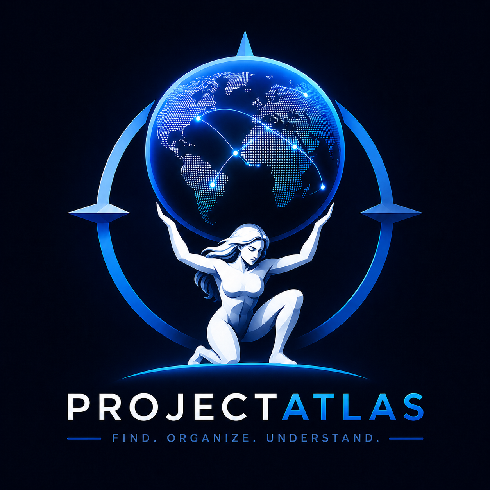

# ProjectAtlas

<p align="center">
  
</p>

<p align="center">
  <strong>A Rust-native atlas for coding agents.</strong><br>
  It tells Codex, Claude Code, OpenCode, and other MCP-capable agents where to look before they spend context reading the wrong files.
</p>

<p align="center">
  <a href="https://github.com/styler-ai/ProjectAtlas/actions/workflows/ci.yml"></a>
  <a href="https://github.com/styler-ai/ProjectAtlas/releases/tag/v0.3.5"></a>
  
  
</p>

ProjectAtlas is the missing orientation layer between "agent, fix this repo" and "agent, please do not open half the codebase first."

It keeps a fast local SQLite atlas of folders, files, one-line purposes, deterministic content summaries, symbols, relations, search text, health findings, and token telemetry. The agent starts with the map, narrows to the right folder and file, then escalates to outlines, symbols, or exact source slices only when correctness needs real code.

No required `.purpose` files. No source-header tax. No hosted index. The project lives beside your repo in `.projectatlas/`, returns compact TOON by default, and runs as a native Rust CLI plus MCP server.

## What It Saves

The current benchmark record is intentionally neutral: a representative large application audit, not a marketing toy.

| Signal | Result |
| --- | ---: |
| Files | 679 |
| Folders | 206 |
| Indexed text files | 554 |
| Indexed text bytes | 7,088,446 |
| Symbols | 5,145 |
| Relations | 12,122 |
| Token telemetry calls | 142 |
| Estimated without ProjectAtlas | 221,114,448 tokens |
| Estimated with ProjectAtlas | 425,622 tokens |
| Estimated saved | 220,688,826 tokens |
| Estimated savings rate | 99.8% |

Warm CLI reads from that audit stayed interactive:

| Command shape | Sample latency |
| --- | ---: |
| `summary <large-source-file> --limit 25` | ~165 ms |
| `files workflow --folder .github/workflows --limit 20` | ~164 ms |
| `token` | ~161 ms |
| `overview` | ~166 ms |

Token numbers are workflow estimates, not billing-grade provider counts. The default estimator is the offline `chars/bytes / 4` heuristic. That is deliberate: normal agent orientation stays local, fast, and credential-free.

## The Funnel

ProjectAtlas teaches agents this order:

```text
overview
  -> folders with folder_purpose
  -> files with file_purpose and content_summary
  -> summary or outline
  -> symbols and relations
  -> exact slice
```

That sounds small. It is the product.

Most agent waste happens before code is edited: broad search, wrong folder, wrong file, full-file reads too early. ProjectAtlas makes "where should I look?" cheap enough that agents ask it first.

## Core Ideas

- `folder_purpose`: why this folder exists.
- `file_purpose`: why this file exists.
- `content_summary`: what currently appears inside the file.
- `summary`: the detailed file-intelligence command: purpose, summary, parser status, symbols, imports, calls, counts, and line context.
- `slice`: exact source after the target is known.
- `watch`: continuous local refresh while files change.
- `token`: estimated context saved by the atlas-first workflow.

## Quickstart

```bash
codex plugin marketplace add styler-ai/ProjectAtlas --ref main
codex plugin add projectatlas --marketplace projectatlas
```

Then tell Codex: "Use ProjectAtlas for this repo."

That is the intended path. The plugin gives the agent the workflow skill, runtime installer, and MCP config templates. The agent maps the repo, chooses the right folder, chooses the right file, and only then reads exact source.

## Manual CLI

Only need the CLI yourself? Install it from the released tag:

```bash
cargo install --git https://github.com/styler-ai/ProjectAtlas --tag v0.3.5 --package projectatlas-cli --locked
```

From this checkout:

```bash
cargo install --path crates/projectatlas-cli --locked
```

Then initialize and inspect a repo:

```bash
projectatlas init --seed-purpose
projectatlas scan
projectatlas overview
```

## The Manual Funnel

Most users should let the agent run this. It is shown here so the product is understandable:

```bash
projectatlas overview
projectatlas folders "auth"
projectatlas files "login" --folder src
projectatlas summary src/main.rs --limit 25
projectatlas slice src/main.rs --start-line 1 --end-line 80
```

For active work:

```bash
projectatlas watch
```

For a human token dashboard:

```bash
projectatlas token --view tui
```

## Agent And MCP Setup

ProjectAtlas ships plugin metadata and installer scripts for Codex, Claude Code, and OpenCode.

Generate project-local MCP configs:

```bash
projectatlas --format json --db .projectatlas/projectatlas.db mcp-config > .projectatlas/projectatlas.mcp.json
projectatlas --format json --db .projectatlas/projectatlas.db mcp-config --harness claude-code > .projectatlas/projectatlas.claude.mcp.json
projectatlas --format json --db .projectatlas/projectatlas.db mcp-config --harness opencode > .projectatlas/projectatlas.opencode.json
```

Or run the installer from the target project root:

```powershell
plugins/projectatlas/scripts/install-runtime.ps1
```

```bash
bash plugins/projectatlas/scripts/install-runtime.sh
```

The generated configs pin the runtime version, project database, config path, and working directory where the host supports it.

## What The Agent Gets

ProjectAtlas exposes the same workflow through CLI and MCP:

| Need | CLI | MCP |
| --- | --- | --- |
| Refresh state | `projectatlas scan` / `projectatlas watch --once` | `atlas_scan` / `atlas_watch_once` |
| Understand shape | `projectatlas overview` | `atlas_overview` |
| Pick an area | `projectatlas folders <query>` | `atlas_folders` |
| Pick files | `projectatlas files <query> --folder <path>` | `atlas_files` |
| Inspect a file | `projectatlas summary <file>` | `atlas_file_summary` |
| See symbols | `projectatlas symbols list --file <file>` | `atlas_symbols` |
| Search narrowly | `projectatlas search <pattern> --file-pattern <glob>` | `atlas_search` |
| Read exact code | `projectatlas slice <file> --start-line <n> --end-line <m>` | `atlas_slice` |
| Find cleanup work | `projectatlas health-check` | `atlas_health` |
| Report savings | `projectatlas token` | `atlas_token_report` |

## Why Rust

Because this sits in the agent hot path.

ProjectAtlas scans with `.gitignore` awareness, hashes files with BLAKE3, stores state in SQLite, watches changes with `notify`, filters paths with `globset`, emits TOON for compact context, and parses symbols through Rust-native adapters. The point is not "Rust because Rust." The point is fast local repository intelligence that agents can call repeatedly without turning orientation into the expensive step.

## Release Quality

`v0.3.5` shipped through the full release matrix:

- Rust format, check, clippy, dependency policy, tests, doctests, and rustdoc.
- ProjectAtlas scan, parity, lint, and map drift checks.
- Linux x64, Windows x64, macOS x64, and macOS arm64 packages.
- Prepublish packaged-runtime installer smokes.
- Postpublish release-runtime installer smokes.
- Codex, Claude Code, and OpenCode MCP config generation checks.

## Repository Layout

```text
crates/
  projectatlas-cli/       CLI, MCP server, release-facing runtime logic
  projectatlas-core/      shared models, TOON rendering, telemetry
  projectatlas-db/        SQLite storage
  projectatlas-fs/        .gitignore-aware scanning
  projectatlas-service/   summaries, search, slices, health
  projectatlas-symbols/   symbol extraction
docs/                     architecture, workflow, configuration
plugins/projectatlas/     Codex, Claude Code, OpenCode plugin assets
skills/                   standalone agent skill snippets
```

## Docs

- `docs/agent-integration.md`
- `docs/configuration.md`
- `docs/workflow.md`
- `docs/structural-summaries.md`
- `docs/benchmarks/large-application-token-savings.md`
- `docs/projectatlas-3-architecture.md`

## License

MIT. See `LICENSE`.
