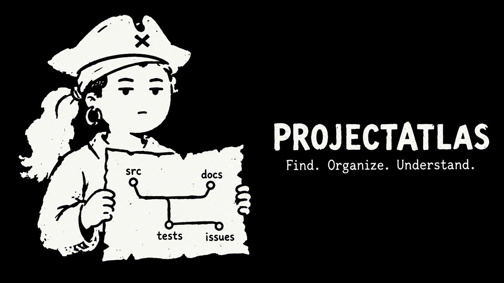
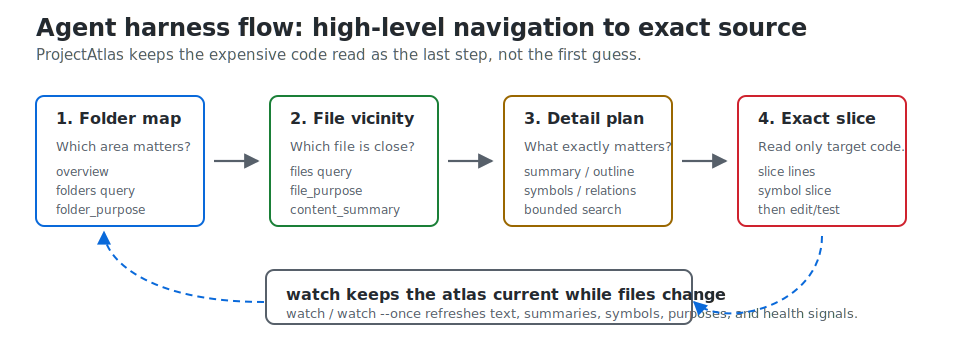
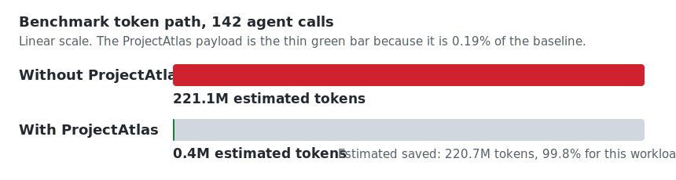

# ProjectAtlas

<p align="center">
  
</p>

<p align="center">
  <strong>A Rust-native atlas for coding agents.</strong><br>
  It tells Codex, Claude Code, OpenCode, and other MCP-capable agents where to look before they spend context reading the wrong files.
</p>

<p align="center">
  <a href="https://github.com/styler-ai/ProjectAtlas/actions/workflows/ci.yml"></a>
  <a href="https://github.com/styler-ai/ProjectAtlas/releases/tag/v0.3.11"></a>
  
  
</p>

ProjectAtlas is the missing orientation layer between "agent, fix this repo" and "agent, please do not open half the codebase first."

It keeps a fast local SQLite atlas of folders, files, one-line purposes, deterministic content summaries, symbols, relations, search text, health findings, and token telemetry. The agent starts with the map, narrows to the right folder and file, then escalates to outlines, symbols, or exact source slices only when correctness needs real code.

No required `.purpose` files. No source-header tax. No hosted index. The project lives beside your repo in `.projectatlas/`, returns compact TOON by default, and runs as a native Rust CLI plus MCP server.

## Quickstart

```bash
codex plugin marketplace add styler-ai/ProjectAtlas --ref v0.3.11
codex plugin add projectatlas --marketplace projectatlas
```

Then tell Codex: "Use ProjectAtlas for this repo."

That is the intended path. The plugin gives the agent the workflow skill, native runtime installer, and MCP config templates. The agent does the rest: install or verify the runtime, map the repo, keep the atlas fresh, choose the right folder, choose the right file, and read exact source only after the target is known.

## What Happens Next

ProjectAtlas is intentionally agent-first. In normal use you should not have to memorize command syntax.

The agent follows this loop:

1. Build or refresh the local atlas.
2. Read folder purposes before opening source.
3. Read file purposes and content summaries inside the likely folder.
4. Use the detailed summary, outline, symbols, or search when compressed context is enough.
5. Open exact slices only when real code is needed.

For active sessions, the agent can run the watcher so file edits continuously refresh the database. For cleanup sessions, it can ask ProjectAtlas for missing purposes, stale metadata, duplicate folder roles, and structure drift.

<p align="center">
  
</p>

## What It Saves

The current benchmark record is intentionally neutral: a representative large application audit, not a marketing toy. The savings rate is not a universal constant. It depends on repository size, how often the agent asks for orientation, and how much source code ProjectAtlas prevents the agent from opening.

The estimate is:

```text
without ProjectAtlas = avoided candidate files, directory walks, and full-file reads
with ProjectAtlas    = compact TOON payloads returned by overview, folders, files, summaries, search, symbols, and slices
saved                = without ProjectAtlas - with ProjectAtlas
savings rate         = saved / without ProjectAtlas
```

The default estimator is deliberately simple and local: `ceil(chars_or_bytes / 4)`. It is a workflow estimate, not provider billing telemetry.

| Signal | Result |
| --- | ---: |
| Files | 679 |
| Folders | 206 |
| Indexed text files | 554 |
| Indexed text bytes | 7,088,446 |
| Symbols | 5,145 |
| Relations | 12,122 |
| Token telemetry calls | 142 |
| Average baseline avoided per call | 1,557,144 tokens |
| Average ProjectAtlas payload per call | 2,997 tokens |
| Total estimated without ProjectAtlas | 221,114,448 tokens |
| Total estimated with ProjectAtlas | 425,622 tokens |
| Estimated saved | 220,688,826 tokens |
| Observed savings rate for this workload | 99.8% |

<p align="center">
  
</p>

That bar chart is intentionally lopsided. The point of ProjectAtlas is not that every repository magically saves 99.8%; the point is that repeated agent lookups in a large repo should read compact folder/file intelligence first, not broad source trees first.

Sizing intuition:

| Workload shape | What usually happens |
| --- | --- |
| Small repo, few lookups | Savings are real but modest because there is less wrong code to avoid. |
| Medium repo, repeated feature work | Savings grow when folder and file purpose prevent wrong-file reads. |
| Large repo, many exploratory lookups | Savings can become very high because each lookup avoids broad candidate sets and repeated full-file reads. |

## Expected Large-Repo Latency

The latency sample below is for warm indexed reads after ProjectAtlas has already scanned the repo. Initial scan/watch refresh is a different operation because it hashes files, updates SQLite, refreshes text, and parses symbol candidates.

Benchmark scale:

| Repo shape | Size |
| --- | ---: |
| Files | 679 |
| Folders | 206 |
| Indexed text files | 554 |
| Indexed text bytes | 7.1 MB |
| Symbols | 5,145 |
| Relations | 12,122 |

Warm CLI reads from that audit stayed around 160-166 ms:

| Command shape | Sample latency |
| --- | ---: |
| `summary <large-source-file> --limit 25` | ~165 ms |
| `files workflow --folder .github/workflows --limit 20` | ~164 ms |
| `token` | ~161 ms |
| `overview` | ~166 ms |

For a comparable large application, the practical expectation is that warm orientation commands stay comfortably sub-second and usually feel like ordinary CLI reads. The scan/build step can take longer, but the agent should not pay that full cost for every lookup; it should use `watch` or `watch --once` to keep the database fresh and then read from the indexed atlas.

Token reports expose bucket, baseline, and confidence metadata so observed full-file compression is not silently mixed with modeled navigation savings. That is deliberate: normal agent orientation stays local, fast, and credential-free.

## The Funnel

ProjectAtlas teaches agents this order:

```text
overview
  -> folders with folder_purpose
  -> files with file_purpose and content_summary
  -> summary or outline
  -> symbols and relations
  -> exact slice
```

That sounds small. It is the product.

Most agent waste happens before code is edited: broad search, wrong folder, wrong file, full-file reads too early. ProjectAtlas makes "where should I look?" cheap enough that agents ask it first.

## Core Ideas

- `folder_purpose`: why this folder exists.
- `file_purpose`: why this file exists.
- `content_summary`: what currently appears inside the file.
- `summary`: the detailed file-intelligence command: purpose, summary, parser status, symbols, imports, calls, counts, and line context.
- `slice`: exact source after the target is known.
- `watch`: continuous local refresh while files change.
- `token`: estimated context saved by the atlas-first workflow.

## CLI Reference

Most users can stop at the plugin install. The CLI is here for local debugging, automation, and release verification.

Only need the CLI yourself? Install it from the released tag:

```bash
cargo install --git https://github.com/styler-ai/ProjectAtlas --tag v0.3.11 projectatlas-cli --locked
```

From this checkout:

```bash
cargo install --path crates/projectatlas-cli --locked
```

Then initialize and inspect a repo:

```bash
projectatlas init
projectatlas scan
projectatlas overview
```

## Manual Funnel

This is the workflow the agent runs for you:

```bash
projectatlas overview
projectatlas folders "auth"
projectatlas files "login" --folder src
projectatlas summary src/main.rs --limit 25
projectatlas slice src/main.rs --start-line 1 --end-line 80
```

For active work:

```bash
projectatlas watch
```

For a human token dashboard:

```bash
projectatlas token --view tui
```

## Agent And MCP Setup

ProjectAtlas ships plugin metadata and installer scripts for Codex, Claude Code, and OpenCode.

Generate project-local MCP configs:

```bash
projectatlas --format json --db .projectatlas/projectatlas.db mcp-config > .projectatlas/projectatlas.mcp.json
projectatlas --format json --db .projectatlas/projectatlas.db mcp-config --harness claude-code > .projectatlas/projectatlas.claude.mcp.json
projectatlas --format json --db .projectatlas/projectatlas.db mcp-config --harness opencode > .projectatlas/projectatlas.opencode.json
```

Or run the installer from the target project root:

```powershell
plugins/projectatlas/scripts/install-runtime.ps1
```

```bash
bash plugins/projectatlas/scripts/install-runtime.sh
```

The generated configs pin the runtime version, project database, config path, and working directory where the host supports it.

## What The Agent Gets

ProjectAtlas exposes the same workflow through CLI and MCP:

| Need | CLI | MCP |
| --- | --- | --- |
| Refresh state | `projectatlas scan` / `projectatlas watch --once` | `atlas_scan` / `atlas_watch_once` |
| Understand shape | `projectatlas overview` | `atlas_overview` |
| Pick an area | `projectatlas folders <query>` | `atlas_folders` |
| Pick files | `projectatlas files <query> --folder <path>` | `atlas_files` |
| Inspect a file | `projectatlas summary <file>` | `atlas_file_summary` |
| See symbols | `projectatlas symbols list --file <file>` | `atlas_symbols` |
| Search narrowly | `projectatlas search <pattern> --file-pattern <glob>` | `atlas_search` |
| Read exact code | `projectatlas slice <file> --start-line <n> --end-line <m>` | `atlas_slice` |
| Find cleanup work | `projectatlas health-check --source-only --limit <n>` | `atlas_health` |
| Curate purposes | `projectatlas purpose queue --limit <n>` / `projectatlas purpose set <path> "<purpose>"` | `atlas_purpose_queue` / `atlas_purpose_set` |
| Report savings | `projectatlas token` | `atlas_token_report` |

## Why Rust

Because this sits in the agent hot path.

ProjectAtlas scans with `.gitignore` awareness, hashes files with BLAKE3, stores state in SQLite, watches changes with `notify`, filters paths with `globset`, emits TOON for compact context, and parses symbols through Rust-native adapters. The point is not "Rust because Rust." The point is fast local repository intelligence that agents can call repeatedly without turning orientation into the expensive step.

## Release Quality

`v0.3.11` ships through the full release matrix:

- Rust format, check, clippy, dependency policy, tests, doctests, and rustdoc.
- ProjectAtlas scan, parity, database-backed purpose lint, and health checks.
- Linux x64, Windows x64, macOS x64, and macOS arm64 packages.
- Prepublish packaged-runtime installer smokes.
- Postpublish release-runtime installer smokes.
- Codex, Claude Code, and OpenCode MCP config generation checks.

## Repository Layout

```text
crates/
  projectatlas-cli/       CLI, MCP server, release-facing runtime logic
  projectatlas-core/      shared models, TOON rendering, telemetry
  projectatlas-db/        SQLite storage
  projectatlas-fs/        .gitignore-aware scanning
  projectatlas-service/   summaries, search, slices, health
  projectatlas-symbols/   symbol extraction
docs/                     architecture, workflow, configuration
plugins/projectatlas/     Codex, Claude Code, OpenCode plugin assets
skills/                   standalone agent skill snippets
```

## Docs

- `docs/agent-integration.md`
- `docs/configuration.md`
- `docs/workflow.md`
- `docs/structural-summaries.md`
- `docs/benchmarks/large-application-token-savings.md`
- `docs/projectatlas-3-architecture.md`

## License

MIT. See `LICENSE`.
