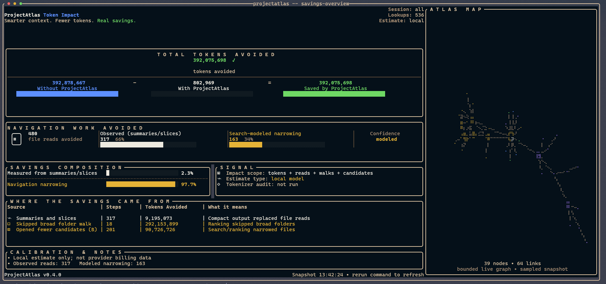

# ProjectAtlas

<p align="center">
  <a href="docs/design/ani-mascot-reference.png" title="Open Ani's versioned mascot reference">
    
  </a>
</p>

<p align="center">
  <strong>Rust-native, high-performance local repository intelligence for coding agents and large codebases.</strong><br>
  A persistent SQLite map guides Codex, Claude Code, OpenCode, and other MCP-capable agents to the right code before they spend context reading the wrong files.
</p>

<p align="center">
  <a href="https://github.com/styler-ai/ProjectAtlas/actions/workflows/ci.yml"></a>
  <a href="https://github.com/styler-ai/ProjectAtlas/releases/tag/v0.4.4"></a>
  
  
</p>

## About

Every file not opened. Every folder not explored. ProjectAtlas guides coding agents with purpose metadata and an intelligent code graph, reducing token costs by over 90%.

The "over 90%" figure is a workload-specific local estimate from the published audit, not a universal savings guarantee or provider-billing result; see [One Large-Application Audit](#one-large-application-audit).

ProjectAtlas is a native Rust CLI and MCP server that keeps a project-local map of folders, files, reviewed purposes, deterministic summaries, symbols, graph relationships, searchable text, health findings, and token telemetry. `.gitignore`-aware scanning, BLAKE3 hashing, SQLite storage, filesystem watching, and compact TOON output keep repeated repository orientation local and fast.

The map is deliberately agent-first: purposes identify the responsible area, graph relationships reveal connected code, compact summaries and outlines explain the selected files, and exact source slices provide the final evidence. Agents narrow before they read broadly.

No required `.purpose` files. No source-header tax. No hosted index or credentials. Project state lives beside the repository in `.projectatlas/`.

## Install

Point your agent to the ProjectAtlas GitHub repository and ask it to install the latest version of ProjectAtlas.

The Codex plugin is the recommended path:

```bash
codex plugin marketplace add styler-ai/ProjectAtlas --ref v0.4.4
codex plugin add projectatlas --marketplace projectatlas
```

Then tell Codex: **“Use ProjectAtlas for this repo.”**

| Route | When to use it |
| --- | --- |
| Codex plugin | Recommended agent setup; supplies the version-matched skill, native runtime installer, and MCP templates. |
| [Native release](https://github.com/styler-ai/ProjectAtlas/releases/tag/v0.4.4) | Install a verified prebuilt binary without Rust/Cargo. |
| Cargo | `cargo install --git https://github.com/styler-ai/ProjectAtlas --tag v0.4.4 projectatlas-cli --locked` |
| Claude Code / OpenCode | Run the native installer, then `projectatlas init`; it writes their version-matched project-local MCP configs. |

Initialize each repository once:

```bash
projectatlas init
```

That creates the project-local database, performs the initial index, and writes version-matched host configs. See [installation, upgrades, and runtime repair](docs/agent-integration.md#runtime-installation-and-repair) for stale plugin caches, PATH conflicts, generated Claude Code/OpenCode configs, and manual installer commands.

## See The Atlas

```bash
projectatlas token --view tui
```

[](docs/assets/token-impact-tui.png)

Compare the live dashboard with the [versioned TUI design reference](docs/design/token-impact-tui-reference.png).

The TUI is a local snapshot, not provider billing data. In a control checkout with registered worktrees, it combines native-control and active/retired worktree aggregates without changing the dashboard layout; an exact worktree report remains local. It also shows the reconciled token estimate, observed and modeled navigation work, source attribution, calibration status, and—at wide terminal sizes—a bounded live map from resolved repository relations. Rerun the command to refresh it; use `--theme light` for light terminals or `--theme terminal` to preserve the terminal background.

Read the [token methodology](docs/benchmarks/large-application-token-savings.md) or the [TUI and agent-integration guide](docs/agent-integration.md#token-reporting-and-human-tui) for the detailed accounting and theme controls.

## How Agents Use It

1. Bind the intended project and refresh only when the index may be stale.
2. Start with one `atlas_session_brief` using `compact: true`.
3. Follow its returned summary, search, relation, health, or exact-slice call.
4. Continue from returned selectors instead of repeating discovery.
5. Open the smallest exact source slice needed for the answer.

`atlas_overview` → `atlas_folders` → `atlas_files` remains the fallback when broader repository shape is itself the task. Continuous `watch` or bounded `watch --once` keeps active work fresh.

The complete [agent and MCP workflow](docs/agent-integration.md) owns tool routing, project isolation, generated host configuration, cancellation, and runtime repair. The [workflow guide](docs/workflow.md) covers human CLI use.

## Work Across Existing Git Worktrees

ProjectAtlas v0.4.5-rc1 lets an agent stay in one selected control checkout and address existing Git worktrees anywhere on the filesystem by short MCP alias:

```text
atlas_worktree_list(include_retired: false)
atlas_worktree_add(worktree: "<returned-stable-selector>", alias: "issue-430")
atlas_init(worktree: "issue-430")
atlas_session_brief(worktree: "issue-430", query: "target behavior", compact: true)
```

A missing target atlas can reuse validated control-atlas data, then reconcile the exact branch and dirty files into its own writable database. `main` names the selected control atlas, not a branch or folder. It owns labelled read-only federation and repository-wide token totals; unregister retains accepted totals without deleting Git, source, `.projectatlas`, or SQLite state.

Git remains the worktree lifecycle authority. See [Worktree atlas continuity](docs/worktree-lifecycle.md) for isolation, recovery, and diagrams; team-shared released atlases remain future [issue #456](https://github.com/styler-ai/ProjectAtlas/issues/456) work.

## What Agents Get

| Need | ProjectAtlas surface |
| --- | --- |
| Task-oriented startup | Project identity, index state, ranked candidates, blockers, and one ready next call |
| Responsibility | Reviewed folder/file purposes before broad source reads |
| Connections | Symbols and resolved graph relationships with bounded selectors |
| Exact evidence | Current summaries, outlines, searches, and source slices |
| Freshness | `.gitignore`-aware scan plus incremental watcher refresh |
| Worktree continuity | Short-alias routing, safe target hydration, labelled read-only federation, and exact isolated databases |
| Maintenance | Purpose queues, health findings, lint, and project-local configuration |
| Human overview | The existing token-impact TUI with repository-wide control totals and a bounded Atlas map |

See the [CLI/MCP capability guide](docs/agent-integration.md#mcp-tool-sequence), [configuration reference](docs/configuration.md), and generated [language](docs/language-support.md) and [relation](docs/relation-support.md) support inventories.

## One Large-Application Audit

The chart and table below describe one representative audit, not a universal savings constant. The default local estimator is `ceil(chars_or_bytes / 4)` and is separate from provider billing. ProjectAtlas reports measured source compression separately from modeled navigation narrowing. In v0.4.4, the primary `tokens_avoided`/`average_tokens_avoided` value admits 50% of the deduped aggregate folder-navigation baseline, charges the complete Atlas payload, and leaves every other category unchanged. `maximum_tokens_avoided` retains the all-files folder-scope calculation.

<p align="center">
  
</p>

| Audit signal | Result |
| --- | ---: |
| Repository shape | 679 files · 206 folders |
| Indexed intelligence | 5,145 symbols · 12,122 relations |
| ProjectAtlas lookups | 142 |
| Average baseline avoided per lookup | 1,557,144 estimated tokens |
| Average ProjectAtlas payload | 2,997 estimated tokens |
| Estimated without / with ProjectAtlas | 221,114,448 / 425,622 tokens |
| Legacy gross estimated saved | 220,688,826 tokens |
| Observed savings rate in this one audit | 99.8% |

Warm indexed CLI reads in the same audit stayed around 160–166 ms. Repository shape, hardware, database state, command bounds, and access pattern all matter; initial scan/build work is separate. The [audit report](docs/benchmarks/large-application-token-savings.md) owns the formulas, corpus details, command samples, caveats, and current telemetry-field meanings.

## Release Quality

`v0.4.4` ships through the full release matrix:

- Rust format, check, clippy, dependency policy, tests, doctests, and rustdoc.
- Linux x64, Windows x64, macOS x64, and macOS arm64 native packages.
- Prepublish and postpublish packaged-runtime installer smokes.
- Codex plugin plus Claude Code/OpenCode generated MCP-config checks.

Full benchmark campaigns are manual-only and run only when explicitly requested.

The [v0.4.5-rc2 candidate](https://github.com/styler-ai/ProjectAtlas/releases/tag/v0.4.5-rc2) and [release notes](docs/v0.4.5-rc2-release-notes.md) cover RC1 workflow stabilization across documentation navigation, purpose mutation, terminal rendering, symbol publication, Btrfs database placement, and recreated worktrees. RC2 is published as a prerelease and does not replace the preceding stable GitHub Latest release.

## Documentation

| Topic | Guide |
| --- | --- |
| Install, agent workflow, MCP, host configs, runtime repair | [Agent integration](docs/agent-integration.md) |
| Scan, ignore, purpose, and runtime settings | [Configuration](docs/configuration.md) |
| Human CLI workflow | [Workflow](docs/workflow.md) |
| Existing Git worktree registration, hydration, routing, federation, and token continuity | [Worktree atlas continuity](docs/worktree-lifecycle.md) |
| v0.4.5-rc2 stabilization, compatibility, boundaries, and proof policy | [RC2 release notes](docs/v0.4.5-rc2-release-notes.md) |
| Formats and compact agent output | [Format](docs/format.md) |
| Structural summaries | [Structural summaries](docs/structural-summaries.md) |
| Language and relation coverage | [Language support](https://styler-ai.github.io/ProjectAtlas/language-support/) · [Relation support](https://styler-ai.github.io/ProjectAtlas/relation-support/) |
| Token methodology and large-app audit | [Token-savings audit](docs/benchmarks/large-application-token-savings.md) |
| System, database, indexing, navigation, and packaging design | [Architecture](docs/projectatlas-3-architecture.md) |
| Published site and Rust API docs | [ProjectAtlas Pages](https://styler-ai.github.io/ProjectAtlas/) · [CLI/runtime crate](https://styler-ai.github.io/ProjectAtlas/projectatlas/) |

## License

MIT. See `LICENSE`.
