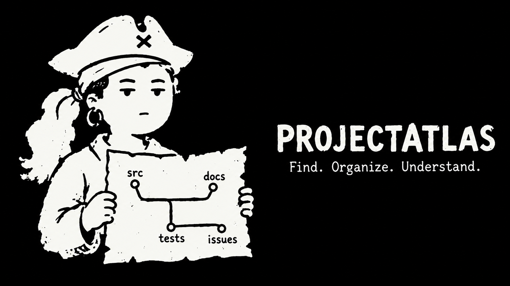
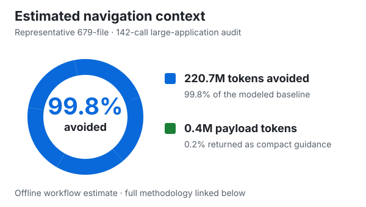
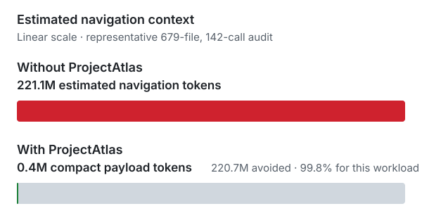
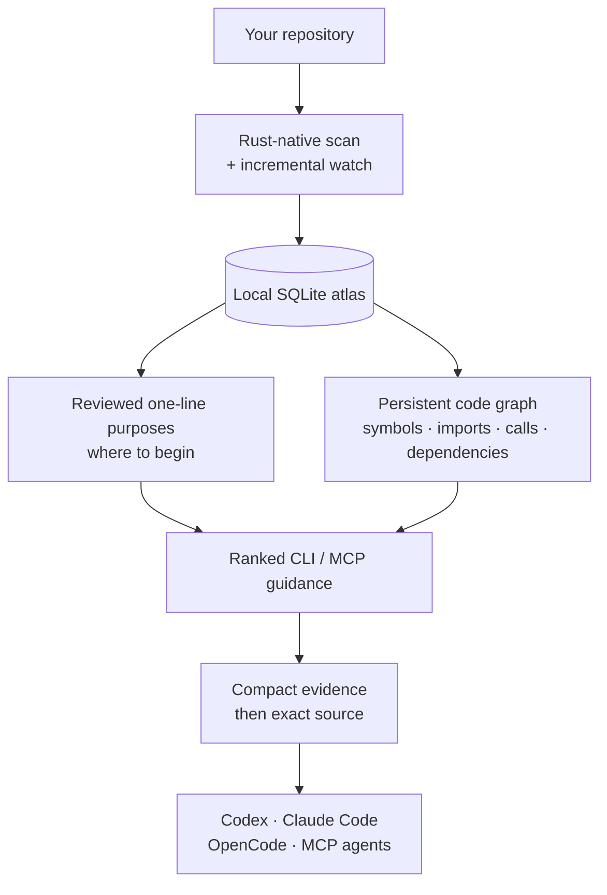

# ProjectAtlas

<p align="center">
  
  <br><em>Ani, your repository cartographer.</em>
</p>

<h3 align="center">Every file not opened. Every folder not explored. Tokens saved.</h3>

<p align="center">
  <strong>Index once. Keep it fresh incrementally. Reuse the intelligence across agents, sessions, and tasks.</strong>
</p>

<p align="center">
  ProjectAtlas is a Rust-native local code index and atlas for coding agents.<br>
  It turns your codebase into a complete SQLite-backed index and persistent atlas of purposes, summaries, symbols, relations, search text, and exact source slices.
</p>

<p align="center">
  <a href="https://github.com/styler-ai/ProjectAtlas/actions/workflows/ci.yml"></a>
  <a href="https://github.com/styler-ai/ProjectAtlas/releases/tag/v0.4.0"></a>
  
  
  
</p>

| **99.8% in one large-app audit** | **~160–166 ms** |
| :---: | :---: |
| modeled candidate context filtered before the prompt¹ | representative warm indexed reads¹ |
| **40 MCP tools** | **Local by design** |
| one native CLI + MCP runtime | no hosted code index required |

ProjectAtlas gives Codex, Claude Code, OpenCode, and other MCP-capable agents a durable understanding of where code lives and how it connects. Instead of repeatedly walking folders and opening broad files, the agent asks the atlas, follows graph-guided candidates, and reads the smallest exact source slice that can answer the task.

The result is a fast local SQLite index that survives across sessions and keeps source intelligence on the machine where the agent is already working.

The difference is the guidance layer. ProjectAtlas combines **intelligently curated one-line purposes** with a **persistent code graph**. Purposes tell the agent where to begin; the graph then reveals the relevant symbols, imports, calls, dependencies, and neighboring code. Compact summaries and exact slices are retrieved only after that narrowing, so the agent spends its context on the code that matters.

## Point your agent at ProjectAtlas

**Point your agent to [https://github.com/styler-ai/ProjectAtlas](https://github.com/styler-ai/ProjectAtlas) and ask it to install and set up ProjectAtlas through its plugin store, or through the supported installation method best suited to that agent harness.**

For Codex, Claude Code, OpenCode, or another capable harness, send:

> Go to https://github.com/styler-ai/ProjectAtlas. Install or upgrade ProjectAtlas through this harness's plugin store, or use the supported installation method best suited to this agent harness. Fully set it up for the project I am currently working in.

That is the recommended path. The agent can follow the repository’s versioned plugin, installer, and MCP guidance instead of making you translate host-specific configuration by hand.

When you start working in a new project, ask your agent:

> Initialize ProjectAtlas once for this repository by running `projectatlas init` from its project root.

Later sessions reuse that project-local atlas. Ordinary changed files refresh incrementally; typed continuity, root, policy, or dependency-closure conditions may require a complete scan for correctness. The agent does not initialize or rebuild the full index merely because a new session started.

For task-directed work in an existing indexed repository, the agent begins with `atlas_session_brief` using `compact: true`, follows its typed next call, and opens exact source only after narrowing.

The instructed agent should:

1. use the official ProjectAtlas plugin when the harness supports it, otherwise install the native runtime and local MCP configuration;
2. run `atlas_init` or `projectatlas init` from **each project root** on its first use or when that root's project-local state is absent—every project owns its own `.projectatlas/projectatlas.db` and generated host configs;
3. preserve the existing SQLite atlas and reviewed purposes during upgrades—never reset them as an upgrade shortcut;
4. read the shipped ProjectAtlas skill and add a short durable pointer for future agents to `AGENTS.md`, `CLAUDE.md`, or the harness equivalent without replacing existing project guidance;
5. split a large initial purpose queue into non-overlapping batches for one or more low-reasoning agents when the harness supports them—successful purpose writes become approved and agent-reviewed automatically; and
6. verify the runtime version, selected project root, initialized index, advertised 40-tool MCP inventory, and safe representative CLI/MCP calls.

The official plugin supplies the ProjectAtlas workflow skill, verifies or installs the native runtime, generates project-local MCP configuration, and keeps the plugin and MCP registration aligned with the selected release. Harnesses without a plugin marketplace use the same local runtime through the generated MCP configuration and can point their durable project instructions at the versioned skill in this repository. OpenCode uses the generated OpenCode MCP config template rather than a native plugin.

## Stop rediscovering the same repository

| Without a persistent atlas | With ProjectAtlas |
| --- | --- |
| Guess a folder from the task description | Start from ranked folder and file purposes |
| Search broadly and open several candidates | Follow summaries, symbols, and relation evidence |
| Re-read whole files in later sessions | Reuse the project-local SQLite intelligence |
| Spend context before the real edit is known | Escalate to the smallest exact source slice |
| Repeat full orientation after changes | Refresh ordinary changes incrementally and escalate only on typed full-scan guidance |

The larger the repository and the more often agents work in it, the more useful the persistent index becomes. The first scan builds reusable intelligence; later tasks query it directly. The watcher updates ordinary changed paths incrementally and requests a complete refresh only when continuity, root, policy, or dependency-closure correctness requires it.

## The context difference

<p align="center">
  
</p>

<p align="center">
  
</p>

¹ The published representative audit covered a 679-file application and 142 indexed ProjectAtlas calls. Its offline `chars/bytes ÷ 4` model counted 221,114,448 tokens across candidate files, directory walks, and full-file reads, while the returned compact ProjectAtlas payloads contained 425,622 estimated tokens—99.8% less context than that modeled candidate-read baseline. This is a navigation-model comparison, not a measured plain-agent arm or provider billing counter. Warm indexed CLI reads in the same audit were approximately 160–166 ms. Results vary by repository and usage; see the [full formula, measurements, and limitations](docs/benchmarks/large-application-token-savings.md) and the separately controlled, now historical [v0.4 navigation evaluation](docs/benchmarks/v0.4-agent-navigation-evaluation.md).

## How ProjectAtlas works

ProjectAtlas guides the agent through four understandable layers:

1. **Purpose map:** one-line folder and file purposes answer “where should I look?”
2. **Code graph:** relationships between files, symbols, imports, calls, and dependencies answer “what connects to this?”
3. **Compact evidence:** ranked summaries, outlines, and bounded search answer “what exactly is relevant?”
4. **Exact source:** the agent reads the smallest useful code slice, then edits and tests.


```mermaid
flowchart TB
    Repo["Your repository"] --> Scan["Rust-native scan<br/>+ incremental watch"]
    Scan --> DB[("Local SQLite atlas")]
    DB --> Purpose["Reviewed one-line purposes<br/>where to begin"]
    DB --> Graph["Persistent code graph<br/>symbols · imports · calls · dependencies"]
    Purpose --> Guide["Ranked CLI / MCP guidance"]
    Graph --> Guide
    Guide --> Context["Compact evidence<br/>then exact source"]
    Context --> Agent["Codex · Claude Code<br/>OpenCode · MCP agents"]
```

The database is durable product state, not a throwaway prompt. Agent-reviewed folder and file purposes explain why paths exist; deterministic summaries explain what is currently inside them; the graph connects symbols and code through imports, calls, dependencies, and other relations; health findings expose drift; token telemetry shows how the atlas-first workflow is behaving.

When files change, `projectatlas watch` refreshes affected derived index data and requests a complete scan when typed correctness conditions require it. Reviewed purposes persist unchanged across scan, watch, summary, symbol, and graph refreshes. Agents correct them explicitly only when the responsibility is known to be wrong or genuinely repurposed.

## Built for the agent hot path

| Advantage | What it means |
| --- | --- |
| **Rust-native performance** | One compiled CLI and MCP server for scanning, watching, querying, and exact reads. |
| **Persistent SQLite intelligence** | Repository structure, purposes, summaries, symbols, relations, search text, health, and telemetry survive across sessions. |
| **Graph-guided navigation** | Agents can move from task intent to related folders, files, symbols, calls, imports, and exact source without broad reads. |
| **Compact by default** | CLI and MCP return TOON-first bounded results designed for agent context. |
| **Local and credential-free** | Normal indexing and navigation require no hosted code index, API key, or remote embedding service. |
| **Repository-aware boundaries** | Project identity, database paths, `.gitignore`, ProjectAtlas ignores, and per-call project routing keep repositories isolated. |
| **Incremental freshness** | `watch` and `watch --once` update ordinary changed content while preserving durable reviewed intent; typed uncertainty escalates to a complete scan. |
| **Cross-platform releases** | Packaged and tested for Windows x64, Linux x64, macOS x64, and macOS arm64. |

## One atlas, every supported agent

`projectatlas init` creates the project-local database and generates absolute, version-pinned MCP configs for Codex/generic MCP hosts, Claude Code, and OpenCode:

```bash
projectatlas init
```

| Host | Generated configuration |
| --- | --- |
| Codex / generic MCP | `.projectatlas/projectatlas.mcp.json` |
| Claude Code | `.projectatlas/projectatlas.claude.mcp.json` |
| OpenCode | `.projectatlas/projectatlas.opencode.json` |

The generated configs bind the verified runtime, required version, selected project database, config path, and working directory where the host supports it. A shared MCP server can still address several repositories safely through per-call `project_path`.

### CLI installation

Install the released Rust CLI directly:

```bash
cargo install --git https://github.com/styler-ai/ProjectAtlas --tag v0.4.0 projectatlas-cli --locked
projectatlas init
```

### Runtime installers

Resolve the version-matched installer from a ProjectAtlas source checkout or installed plugin, then pass the repository being initialized as the separate project root:

```powershell
& "<ProjectAtlas checkout>\plugins\projectatlas\scripts\install-runtime.ps1" -ProjectRoot "<target project root>"
```

```bash
bash "<ProjectAtlas checkout>/plugins/projectatlas/scripts/install-runtime.sh" "<target project root>"
```

The installers verify runtime identity before writing configuration. When Codex is available, they also detect and repair a stale official ProjectAtlas marketplace/plugin cache and global `projectatlas` MCP entry. Claude Code and OpenCode configurations are parsed and verified without taking ownership of unrelated user-managed host settings.

## Upgrade ProjectAtlas

Refresh the dedicated marketplace snapshot, reinstall, and verify the selected release:

```bash
codex plugin marketplace upgrade projectatlas --json
codex plugin remove projectatlas --marketplace projectatlas
codex plugin add projectatlas --marketplace projectatlas
codex plugin list --marketplace projectatlas --available --json
```

If the marketplace was intentionally pinned to an older release tag, replace only the dedicated `styler-ai/ProjectAtlas` source:

```bash
codex plugin marketplace remove projectatlas
codex plugin marketplace add styler-ai/ProjectAtlas --ref v0.4.0
codex plugin add projectatlas --marketplace projectatlas
```

Then verify that the global MCP entry resolves to the selected runtime:

```bash
codex mcp get projectatlas
```

Use `PROJECTATLAS_SKIP_CODEX_MCP_REGISTRY_UPDATE=1` only when that global registry is intentionally managed outside the installer.

## The agent workflow

MCP-capable agents start with one compact task brief and follow its returned selectors:

```text
task
  → atlas_session_brief
  → ranked purpose, summary, search, or relation evidence
  → exact file or symbol slice
  → edit and test
```

For manual CLI use—or when the compact brief is unavailable—the explicit funnel is:

```bash
projectatlas overview
projectatlas folders "authentication"
projectatlas files "login" --folder src
projectatlas summary src/auth.rs --limit 25
projectatlas slice src/auth.rs --start-line 1 --end-line 80
```

Then keep the atlas current:

```bash
projectatlas watch
```

## What the agent can ask

| Need | CLI | MCP |
| --- | --- | --- |
| Start a task | manual funnel | `atlas_session_brief` |
| Understand repository shape | `projectatlas overview` | `atlas_overview` |
| Choose an area | `projectatlas folders <query>` | `atlas_folders` |
| Rank candidate files | `projectatlas files <query>` | `atlas_files` |
| Inspect file intelligence | `projectatlas summary <file>` | `atlas_file_summary` |
| Follow the code graph | `projectatlas symbols ...` | `atlas_symbols` / `atlas_symbol_relations` |
| Search a bounded scope | `projectatlas search ...` | `atlas_search` |
| Read exact code | `projectatlas slice ...` | `atlas_slice` |
| Curate durable purposes | `projectatlas purpose ...` | `atlas_purpose_queue` / `atlas_purpose_set` / `atlas_purpose_review` |
| Find structure drift | `projectatlas health-check` | `atlas_health` |
| Measure context savings | `projectatlas token` | `atlas_token_report` |

Use `projectatlas token --view tui` for the human token-impact dashboard. It reconciles tokens with and without ProjectAtlas, shows observed and modeled file reads avoided, keeps exact folder-walk and candidate-opening values in the source table, and adds a bounded live atlas map on wide terminals. The dark, light, and terminal-background themes preserve the same data and layout. Add `--tokenizer o200k_base` or `--tokenizer cl100k_base` for local tokenizer calibration.

## Local-first security

ProjectAtlas indexes source into the repository's own `.projectatlas/projectatlas.db`. Normal scans, searches, summaries, symbol traversal, and token reports are offline and require no ProjectAtlas cloud account.

- `.gitignore` rules are inherited dynamically; explicit ProjectAtlas ignores are a stricter second layer.
- Generated MCP configs use absolute runtime, database, and config paths with a release-version guard.
- Project selection is explicit, and per-call `project_path` is available for shared or concurrent hosts.
- Token telemetry stays local and uses an offline estimator by default.
- Release gates exercise packaged installers and generated Codex, Claude Code, and OpenCode configuration on supported platforms.

ProjectAtlas does not replace the security boundary of the coding agent that calls it. It makes repository intelligence local, inspectable, and independently usable.

## Release quality

`v0.4.0` ships through the full release matrix:

Every release runs:

- Rust formatting, compile checks, strict Clippy, dependency policy, tests, doctests, and rustdoc.
- Real CLI and MCP smoke/E2E coverage.
- ProjectAtlas scan, database-backed purpose lint, parity, and health checks.
- Linux x64, Windows x64, macOS x64, and macOS arm64 packaging.
- Clean prepublish installer smokes before a tag can go live.
- Postpublish installation and runtime verification against released assets.

## Documentation

- [Live ProjectAtlas documentation](https://styler-ai.github.io/ProjectAtlas/)
- [Agent integration](docs/agent-integration.md)
- [Configuration](docs/configuration.md)
- [Workflow and troubleshooting](docs/workflow.md)
- [Generated language and ecosystem support](https://styler-ai.github.io/ProjectAtlas/language-support/)
- [Relation support](docs/relation-support.md)
- [ProjectAtlas architecture](docs/projectatlas-3-architecture.md)
- [Token-savings methodology](docs/benchmarks/large-application-token-savings.md)
- [Complete v0.4 navigation evaluation](docs/benchmarks/v0.4-agent-navigation-evaluation.md)

Ani is the ProjectAtlas mascot. Versioned design references live in [`docs/design/`](docs/design/).

## License

MIT. See [LICENSE](LICENSE).
