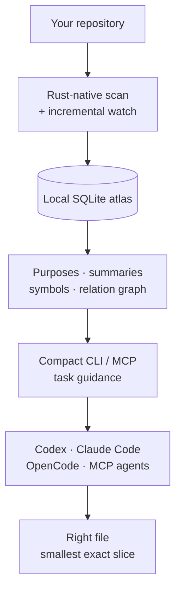

# ProjectAtlas

<p align="center">
  
</p>

<h3 align="center">Give your coding agent a map before it opens the repository.</h3>

<p align="center">
  <strong>Index once. Keep it fresh incrementally. Reuse the intelligence across agents, sessions, and tasks.</strong>
</p>

<p align="center">
  ProjectAtlas is a Rust-native, local repository-intelligence layer for coding agents.<br>
  It turns your codebase into a persistent SQLite atlas of purposes, summaries, symbols, relations, search text, and exact source slices.
</p>

<p align="center">
  <a href="https://github.com/styler-ai/ProjectAtlas/actions/workflows/ci.yml"></a>
  <a href="https://github.com/styler-ai/ProjectAtlas/releases/tag/v0.4.0"></a>
  
  
  
</p>

| **Up to 99.8%** | **~160–166 ms** |
| :---: | :---: |
| estimated navigation context avoided¹ | representative warm indexed reads¹ |
| **40 MCP tools** | **Local by design** |
| one native CLI + MCP runtime | no hosted code index required |

ProjectAtlas gives Codex, Claude Code, OpenCode, and other MCP-capable agents a durable understanding of where code lives and how it connects. Instead of repeatedly walking folders and opening broad files, the agent asks the atlas, follows graph-guided candidates, and reads the smallest exact source slice that can answer the task.

## Install for Codex

```bash
codex plugin marketplace add styler-ai/ProjectAtlas --ref v0.4.0
codex plugin add projectatlas --marketplace projectatlas
```

Then tell Codex:

> Use ProjectAtlas for this repo.

The plugin supplies the ProjectAtlas workflow skill, verifies or installs the native runtime, generates project-local MCP configuration, and keeps the official Codex plugin and MCP registration aligned with the selected release.

Already installed an older version? [Use the upgrade path](#upgrade-projectatlas).

## Stop rediscovering the same repository

| Without a persistent atlas | With ProjectAtlas |
| --- | --- |
| Guess a folder from the task description | Start from ranked folder and file purposes |
| Search broadly and open several candidates | Follow summaries, symbols, and relation evidence |
| Re-read whole files in later sessions | Reuse the project-local SQLite intelligence |
| Spend context before the real edit is known | Escalate to the smallest exact source slice |
| Repeat full orientation after changes | Refresh changed files incrementally with `watch` |

The larger the repository and the more often agents work in it, the more useful the persistent index becomes. The first scan builds reusable intelligence; later tasks query it directly, while the watcher updates changed paths instead of rebuilding the agent's understanding from scratch.

## The context difference

<p align="center">
  
</p>

<p align="center">
  
</p>

¹ The published representative audit covered a 679-file application and 142 ProjectAtlas calls after indexing: 221,114,448 estimated navigation tokens without ProjectAtlas versus 425,622 compact payload tokens with ProjectAtlas, a workload-specific 99.8% reduction. Warm indexed CLI reads in that audit were approximately 160–166 ms. These are offline `chars/bytes ÷ 4` workflow estimates—not provider billing counters—and results vary by repository and usage. See the [full corpus, formula, measurements, and limitations](docs/benchmarks/large-application-token-savings.md).

## How ProjectAtlas works


```mermaid
flowchart TB
    Repo["Your repository"] --> Scan["Rust-native scan<br/>+ incremental watch"]
    Scan --> DB[("Local SQLite atlas")]
    DB --> Intel["Purposes · summaries<br/>symbols · relation graph"]
    Intel --> Guide["Compact CLI / MCP<br/>task guidance"]
    Guide --> Agent["Codex · Claude Code<br/>OpenCode · MCP agents"]
    Agent --> Slice["Right file<br/>smallest exact slice"]
```

The database is durable product state, not a throwaway prompt. Folder and file purposes explain why paths exist; deterministic summaries explain what is currently inside them; symbols and relations connect the code; health findings expose drift; token telemetry shows how the atlas-first workflow is behaving.

When files change, `projectatlas watch` refreshes the affected index data. Agent-reviewed purposes persist across scans and become stale for review when their source changes instead of silently disappearing.

## Built for the agent hot path

| Advantage | What it means |
| --- | --- |
| **Rust-native performance** | One compiled CLI and MCP server for scanning, watching, querying, and exact reads. |
| **Persistent SQLite intelligence** | Repository structure, purposes, summaries, symbols, relations, search text, health, and telemetry survive across sessions. |
| **Graph-guided navigation** | Agents can move from task intent to related folders, files, symbols, calls, imports, and exact source without broad reads. |
| **Compact by default** | CLI and MCP return TOON-first bounded results designed for agent context. |
| **Local and credential-free** | Normal indexing and navigation require no hosted code index, API key, or remote embedding service. |
| **Repository-aware boundaries** | Project identity, database paths, `.gitignore`, ProjectAtlas ignores, and per-call project routing keep repositories isolated. |
| **Incremental freshness** | `watch` and `watch --once` update changed content while preserving durable reviewed intent. |
| **Cross-platform releases** | Packaged and tested for Windows x64, Linux x64, macOS x64, and macOS arm64. |

## One atlas, every supported agent

`projectatlas init` creates the project-local database and generates absolute, version-pinned MCP configs for Codex/generic MCP hosts, Claude Code, and OpenCode:

```bash
projectatlas init
```

| Host | Generated configuration |
| --- | --- |
| Codex / generic MCP | `.projectatlas/projectatlas.mcp.json` |
| Claude Code | `.projectatlas/projectatlas.claude.mcp.json` |
| OpenCode | `.projectatlas/projectatlas.opencode.json` |

The generated configs bind the verified runtime, required version, selected project database, config path, and working directory where the host supports it. A shared MCP server can still address several repositories safely through per-call `project_path`.

### CLI installation

Install the released Rust CLI directly:

```bash
cargo install --git https://github.com/styler-ai/ProjectAtlas --tag v0.4.0 projectatlas-cli --locked
projectatlas init
```

### Runtime installers

From a ProjectAtlas source checkout or installed plugin:

```powershell
plugins/projectatlas/scripts/install-runtime.ps1
```

```bash
bash plugins/projectatlas/scripts/install-runtime.sh
```

The installers verify runtime identity before writing configuration. When Codex is available, they also detect and repair a stale official ProjectAtlas marketplace/plugin cache and global `projectatlas` MCP entry. Claude Code and OpenCode configurations are parsed and verified without taking ownership of unrelated user-managed host settings.

## Upgrade ProjectAtlas

Refresh the dedicated marketplace snapshot, reinstall, and verify the selected release:

```bash
codex plugin marketplace upgrade projectatlas --json
codex plugin remove projectatlas --marketplace projectatlas
codex plugin add projectatlas --marketplace projectatlas
codex plugin list --marketplace projectatlas --available --json
```

If the marketplace was intentionally pinned to an older tag, replace only the dedicated ProjectAtlas source:

```bash
codex plugin marketplace remove projectatlas
codex plugin marketplace add styler-ai/ProjectAtlas --ref v0.4.0
codex plugin add projectatlas --marketplace projectatlas
```

## The agent workflow

MCP-capable agents start with one compact task brief and follow its returned selectors:

```text
task
  → atlas_session_brief
  → ranked purpose, summary, search, or relation evidence
  → exact file or symbol slice
  → edit and test
```

For manual CLI use—or when the compact brief is unavailable—the explicit funnel is:

```bash
projectatlas overview
projectatlas folders "authentication"
projectatlas files "login" --folder src
projectatlas summary src/auth.rs --limit 25
projectatlas slice src/auth.rs --start-line 1 --end-line 80
```

Then keep the atlas current:

```bash
projectatlas watch
```

## What the agent can ask

| Need | CLI | MCP |
| --- | --- | --- |
| Start a task | manual funnel | `atlas_session_brief` |
| Understand repository shape | `projectatlas overview` | `atlas_overview` |
| Choose an area | `projectatlas folders <query>` | `atlas_folders` |
| Rank candidate files | `projectatlas files <query>` | `atlas_files` |
| Inspect file intelligence | `projectatlas summary <file>` | `atlas_file_summary` |
| Follow the code graph | `projectatlas symbols ...` | `atlas_symbols` / `atlas_symbol_relations` |
| Search a bounded scope | `projectatlas search ...` | `atlas_search` |
| Read exact code | `projectatlas slice ...` | `atlas_slice` |
| Curate durable purposes | `projectatlas purpose ...` | `atlas_purpose_queue` / `atlas_purpose_set` / `atlas_purpose_review` |
| Find structure drift | `projectatlas health-check` | `atlas_health` |
| Measure context savings | `projectatlas token` | `atlas_token_report` |

Use `projectatlas token --view tui` for the human token-impact dashboard, including conservative tokens avoided, likely file reads avoided, observed summary/slice replacements, modeled narrowing, and optional local tokenizer calibration.

## Local-first security

ProjectAtlas indexes source into the repository's own `.projectatlas/projectatlas.db`. Normal scans, searches, summaries, symbol traversal, and token reports are offline and require no ProjectAtlas cloud account.

- `.gitignore` rules are inherited dynamically; explicit ProjectAtlas ignores are a stricter second layer.
- Generated MCP configs use absolute runtime, database, and config paths with a release-version guard.
- Project selection is explicit, and per-call `project_path` is available for shared or concurrent hosts.
- Token telemetry stays local and uses an offline estimator by default.
- Release gates exercise packaged installers and generated Codex, Claude Code, and OpenCode configuration on supported platforms.

ProjectAtlas does not replace the security boundary of the coding agent that calls it. It makes repository intelligence local, inspectable, and independently usable.

## Release quality

Every release runs:

- Rust formatting, compile checks, strict Clippy, dependency policy, tests, doctests, and rustdoc.
- Real CLI and MCP smoke/E2E coverage.
- ProjectAtlas scan, database-backed purpose lint, parity, and health checks.
- Linux x64, Windows x64, macOS x64, and macOS arm64 packaging.
- Clean prepublish installer smokes before a tag can go live.
- Postpublish installation and runtime verification against released assets.

## Documentation

- [Live ProjectAtlas documentation](https://styler-ai.github.io/ProjectAtlas/)
- [Agent integration](docs/agent-integration.md)
- [Configuration](docs/configuration.md)
- [Workflow and troubleshooting](docs/workflow.md)
- [Language and ecosystem support](docs/language-support.md)
- [Relation support](docs/relation-support.md)
- [ProjectAtlas architecture](docs/projectatlas-3-architecture.md)
- [Token-savings methodology](docs/benchmarks/large-application-token-savings.md)
- [Complete v0.4 navigation evaluation](docs/benchmarks/v0.4-agent-navigation-evaluation.md)

Ani is the ProjectAtlas mascot. Versioned design references live in [`docs/design/`](docs/design/).

## License

MIT. See [LICENSE](LICENSE).
