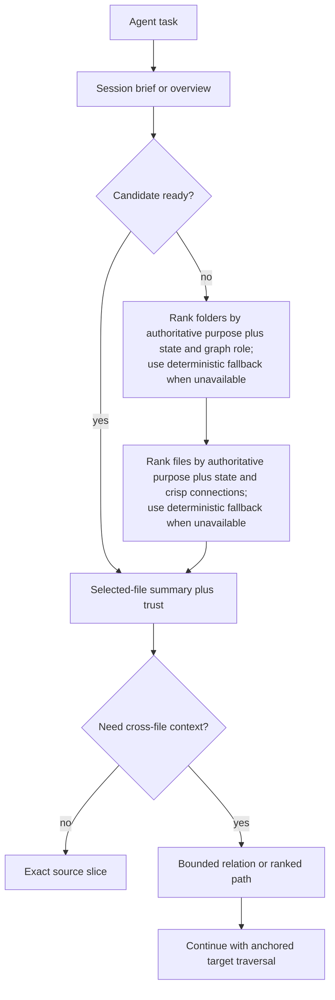
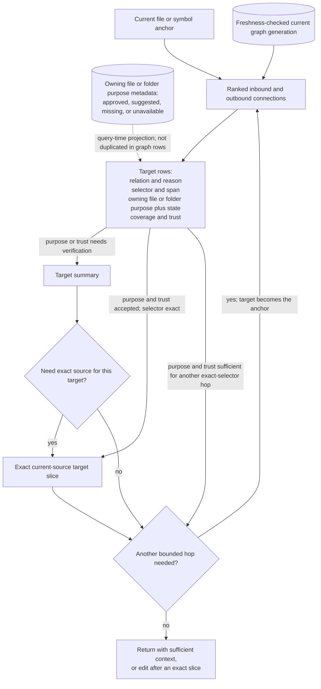
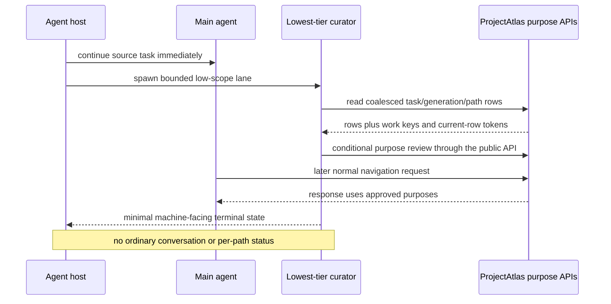

# Agent Navigation Contract

## Status

This document defines the required agent-navigation contract for ProjectAtlas 0.4.0. ProjectAtlas 0.3.26 provides the baseline workflow described below. Automatic read freshness and the initial normalized graph publication are current v0.4 implementation behavior; richer graph enrichment, direct relationship navigation, and final agent evaluation remain target behavior until issue #308 is complete. Version 0.4 preserves the complete compatible MCP inventory. Any later compact/default inventory or breaking rationalization belongs to post-v0.4 issue #310.

## Product Goal

ProjectAtlas is a local-source navigation tool for agents. Its primary truth is the selected source tree as it exists on disk now, including saved uncommitted edits, new or deleted files, dirty worktrees, and non-Git projects. Version-control state is optional context for revision-aware impact and change classification; it never replaces current local paths and bytes.

The desired result is not the largest graph or the largest MCP inventory. The desired result is an agent reaching correct exact source with fewer calls, fewer wrong selections, fewer full-file reads, less backtracking, and less total context.

## Strengths Preserved From 0.3.26

ProjectAtlas keeps these existing strengths as hard compatibility and quality constraints:

- purpose-led folder and file narrowing;
- current deterministic content summaries;
- exact line and symbol slices;
- explicit parser and fallback trust;
- deterministic ranking and search;
- TOON-first compact uniform records where TOON fits the data;
- conservative token and file-read avoidance accounting;
- project-local databases and independent worktree identity;
- a normal workflow that does not require an agent to learn a graph schema or query language.

Graph intelligence fails acceptance if it weakens any of these strengths.

## The Progressive Navigation Sieve

Purposes remain the first architectural filter. Graph context is introduced early enough to improve file selection, but it does not replace responsibility metadata.

```text
session brief / overview
→ folder purpose + crisp graph role
→ file purpose + crisp relevant connections
→ selected-file summary + parser/coverage trust
→ exact source slice
```

The stages answer different questions:

| Stage | Agent question | Expected response |
| --- | --- | --- |
| Folder purpose | Where does this responsibility belong? | One reviewed purpose line plus a bounded graph role/reason |
| File purpose | Which file owns the likely behavior? | One reviewed purpose line plus crisp relevant connections |
| Summary | What is currently in the selected file? | Current content, symbols, relationships, coverage, ambiguity, and exact-span hints |
| Trust | How much of this result is safe to rely on? | Parser kind, resolution state, coverage, limits, and truncation |
| Slice | What exact implementation must I inspect? | Verbatim current source for one bounded line or symbol range |

Folder purposes should be curated broadly because they drive the highest-value narrowing step. File purposes should remain selective and focus on public APIs, runtime behavior, build/configuration, tests, commands, adapters, migrations, and other high-impact files. ProjectAtlas preserves the 0.3.26 distinction: deterministic or heuristic text is generated/suggested and is not reviewed truth; an agent-approved purpose is durable authored responsibility state. Source, summary, symbol, graph, scan, and watcher changes never invalidate it automatically. A main agent, reviewer, explicitly assigned curator, or user can still correct an accepted purpose through the purpose APIs when it is wrong or the path was genuinely repurposed.

When an accepted purpose is missing, ProjectAtlas reports generated/suggested or missing state and falls back deterministically to path, current content, symbols, and graph context. It must not pretend a suggestion is authoritative. Deleted or excluded paths are absent from navigation while their path-owned accepted purpose remains dormant; a rename does not transfer approval automatically.

### Initial Task Discovery

The first navigation pass uses purpose as the responsibility sieve and graph
context as bounded supporting evidence:



The graph may improve a weak candidate choice, but graph popularity never
displaces an exact path/name or strong reviewed-purpose match.

### Anchored Connection Traversal

Once the agent already has a relevant file or symbol, it does not restart the
initial discovery funnel. It follows a bounded relationship set from that
anchor, with purpose projected onto every local target:



The relationship explains why the hop matters to the current task. The purpose
explains why the target exists. The summary confirms what is currently there,
trust fields state how much to rely on it, and the slice provides exact source.
An external or unresolved target reports purpose as not applicable or
unavailable instead of inheriting or fabricating local responsibility.

### Background Purpose Curator

Purpose maintenance can run as a bounded low-scope “speedboat” beside the
main task:



At startup and relevant task/source transitions, a supported agent host launches the packaged purpose-curator lane without blocking the main task. Init, explicit session brief, and purpose queue expose one bounded task/generation/path-scoped handoff; ordinary folder/file/summary responses carry no maintenance status. Deterministic work keys coalesce duplicate host work, and current-row state tokens make stale review writes no-ops. ProjectAtlas itself does not pretend an MCP server can spawn a host agent. If the host cannot enforce isolated subagents or reasoning selection, the main agent may process the same `low`-scope batch; `medium` and `strict` remain explicit.

Successful curation is silent in the main conversation: no per-file progress, approval, or completion messages. Later navigation simply benefits from the improved purposes. If a host requires a terminal result, it should be a minimal machine-facing state. Task-relevant conflicts that would make ranking unsafe and repeated degraded/failure state remain available through compact blockers or explicit health/settings diagnostics.

The default background scope is `low`: all folders plus task-relevant/high-impact files. `medium` means every source file must be reviewed. `strict` means every indexed file and folder must be reviewed. Medium and strict are explicit expensive choices and are never started implicitly.

The curator receives queue rows plus bounded file summary, graph role, outline, or exact source context. It never browses the whole repository without a bounded assignment, never edits source, and never edits SQLite directly. Purposes written through ProjectAtlas APIs are agent-approved and can be corrected later by any agent that finds them wrong, vague, generic, inconsistent, or genuinely repurposed; source changes alone never trigger a correction.

## What Repository-Wide Graph Intelligence Adds

Version 0.3.26 already exposes symbols, imports, calls, and relations, but agents mostly combine those facts from individual files. Version 0.4 turns the selected local source state into a persistent typed cross-file graph.

| Capability | 0.3.26 baseline | 0.4 requirement |
| --- | --- | --- |
| Cross-file identity | Symbols and relations are primarily inspected per file | Stable project-qualified entity identities connect files and languages |
| Inbound traversal | Callers/importers often require search and multiple inspections | Direct bounded callers, importers, references, tests, routes, and configuration |
| Outbound traversal | A summary exposes local calls/imports | Bounded dependency/call paths across files with exact targets |
| Impact discovery | The agent combines searches and local facts | Typed affected relationships and VCS-aware impact over current local source |
| Candidate ranking | Purposes, paths, summaries, symbols, and text rank candidates | Purpose remains dominant while current graph proximity adds crisp reasons |
| Topology/path retrieval | No strong project-wide topology/path view | Bounded aggregates, neighborhoods, and node-simple ranked paths |
| Graph reuse | Several file-level calls may be required | Persisted typed facts are reusable across normal navigation calls |
| Coverage visibility | Parser state is visible mainly during file inspection | Bounded graph/parser coverage is visible beside results and through health pages |
| Traversal bounds | Individual calls are bounded | Uniform totals, returned counts, truncation, cursors, and byte/row/depth limits |
| Refresh | Watch refreshes changed source | Every normal indexed read prevents silent stale results after edits or restart |

The graph must support practical questions such as:

- Which package exports this symbol?
- Which route or protocol reaches this handler?
- Which configuration controls this implementation?
- Which tests exercise this behavior?
- Who calls or imports this target?
- What will this local change likely affect?
- What is the shortest trustworthy path from an entry point to an implementation?
- Where is graph coverage incomplete, ambiguous, unresolved, stale, or parser-limited?

## Purpose Plus Connection Rows

Folder and file selection should expose only enough graph information to choose the next target. A representative file row is:

```text
path: crates/auth/src/session.rs
purpose: Own session validation and renewal.
why_relevant: exact-purpose, called-by-api, covered-by-tests
connections: callers 4, tests 2, config 1
returned_connections: 3
truncated: true
next:
  tool: atlas_file_summary
  file: crates/auth/src/session.rs
```

The normal folder/file response must not dump complete edge lists. Exact path/name and strong reviewed-purpose matches remain ahead of weaker graph popularity. Graph context can surface a small explained adjacent candidate outside the selected folder when it materially improves the task.

## Direct Relationship Jumps

A connection must contain an exact reusable selector, not only a display label:

```text
relation: tested_by
target:
  file: crates/auth/tests/session.rs
  symbol: rejects_expired_session
  kind: function
  line: 84
  owning_purpose: Verify session behavior across authentication boundaries.
  purpose_status: approved
resolution: resolved
confidence: exact
source:
  file: crates/auth/src/session.rs
  line: 117
next:
  tool: atlas_slice
  file: crates/auth/tests/session.rs
  symbol: rejects_expired_session
  kind: function
  line: 84
```

The target selector can be passed directly to file summary, relation, or exact-slice calls. Useful jumps include:

```text
route → handler
handler → service
service → repository/storage
implementation → callers
implementation → tests
implementation → configuration
manifest/package → owning source
protocol client → protocol handler
symbol → definition/reference/import
```

ProjectAtlas does not need a separate `atlas_jump` tool. Existing summary, relation, and slice calls provide the capability when relation results contain reusable selectors and accurate next-call hints.

## Graph Overview And Ranked Paths

A complete overview means complete structural understanding of the selected bounded scope, not an unbounded dump of every node and edge. A graph overview should report:

- selected project, local-source fingerprint, and graph generation;
- coverage, ambiguity, unresolved, stale, and parser-trust counts;
- packages/components and their responsibility roles;
- relationship-family totals;
- bounded important nodes and edges;
- total, returned, truncated, cursor, and hard-budget state;
- recommended paths or exact next calls.

A longer question can request a bounded ranked path such as:

```text
API route
→ session handler
→ token validator
→ key configuration
→ integration test
```

Every local step carries its relationship, exact file/symbol selector, authoritative accepted owning-purpose projection and approval/provenance state, source span, resolution, confidence, coverage, and generation. Paths are node-simple, deterministic, and constrained by row, node, edge, depth, time, memory, output, and cancellation budgets. A multi-page result whose membership, ranking, or hydration depends on purpose also binds the authored-purpose revision.

## Freshness Contract

The watcher is a latency optimization, not the freshness authority. A new long-lived MCP runtime activates bounded root and policy observation before its first exact post-start verification, reconciles any buffered events, and binds a process-local verified epoch to the selected project identity and complete SQLite generation. Later unchanged reads reuse that epoch after a constant freshness snapshot check without another whole-tree walk or full node-table decode. Relevant events, observer overflow/gap/disconnection, root or policy uncertainty, cancellation, and changes racing a query invalidate the epoch. A one-shot CLI process performs its own exact first verification because it cannot inherit process-local observation state.

The response must do one of two things:

1. reconcile a safe bounded delta before answering; or
2. return a compact typed `refresh_required` state.

It must never silently return known-stale facts.

The contract covers:

- immediate read after a saved edit;
- added, renamed, moved, and deleted files;
- ignore and ProjectAtlas configuration changes;
- parser, registry, and provider changes;
- process restart after offline edits or checkout changes;
- clean and dirty Git worktrees;
- non-Git directories;
- transient path, permission, encoding, or root uncertainty;
- re-resolution of inbound dependents after exported identities change;
- no repeated publication for unchanged dirty state;
- no repository-sized freshness work on later unchanged healthy-epoch calls;
- cancellation or observer uncertainty cannot leave an older epoch reusable.

## Compatible MCP Surface With Streamlined Behavior

ProjectAtlas 0.4 preserves the complete 0.3.26 MCP inventory, names, request schemas, defaults, and compatible payload behavior. Repository graph construction, freshness, purpose-plus-connection enrichment, direct relation navigation, and next-call guidance improve automatically behind those calls.

Issue #308 does not classify, hide, consolidate, or remove public tools. It records the packaged v0.4 inventory and discovery measurements as the baseline for issue #310, which separately owns any post-v0.4 compact/default selection or breaking rationalization.

No graph orchestration call is added to compensate for richer internals. The existing routes remain typed responsibility-owned operations; ProjectAtlas does not need a dynamic tool plugin system or one ambiguous administration mega-tool.

The normal already-indexed coding workflow should be three calls:

```text
atlas_session_brief(task)
→ atlas_file_summary(selected file)
→ atlas_slice(selected symbol/range)
```

Optional branches are:

- `atlas_search` when the identifier or text is uncertain;
- `atlas_symbol_relations` when callers, impact, architecture, or a path is material;
- `atlas_folders` then `atlas_files` only when the brief cannot confidently choose the work area;
- purpose queue/set/review for missing/suggested intent or an explicit correction of accepted intent.

`atlas_session_brief` must not recommend rerunning folder/file ranking it already performed. Its next call should be a ready-to-use summary, search, relation, or exact-slice request.

No new mandatory MCP tool is justified. Architecture, impact, and trace should first use a closed view on the existing bounded relation service. At most one optional analysis tool may be added later if real agent tasks prove that extending the relation request makes tool selection or schema size worse.

## Output Shapes

Output representation follows the task:

- uniform purpose, candidate, coverage, and relation rows use compact TOON by default;
- exact source slices remain verbatim source;
- graph overviews use typed bounded aggregates plus node/edge records;
- paths use typed ordered step records;
- supported JSON remains available for programmatic compatibility;
- clear prose is allowed for diagnostics where it improves recovery.

Every repeated result section uses uniform metadata:

```text
total
returned
truncated
next_cursor
output_bytes
```

TOON is not a substitute for selection. A broad unbounded graph remains a context problem even when encoded compactly.

## Frozen Navigation Scenarios

The preserved baseline is ProjectAtlas `v0.3.26` at commit `d3b3e157f954c7d360d821ed0385762e8b044385`. The paired harness pins source bytes, configuration, task wording, limits, and correctness owners. One coherent behavior harness may replay all rows; these are product scenarios, not per-task evidence tests.

| Scenario | Initial state and task intent | 0.3.26 baseline path | 0.4 candidate ceiling | Correctness oracle |
| --- | --- | --- | --- | --- |
| Startup root ownership | Indexed ProjectAtlas source; “Where does ProjectAtlas select and validate a project root for MCP calls?” | `session_brief`, then its redundant `folders` + `files` recommendation before summary | One brief to useful candidates; at most brief → summary → slice | Root selection/validation owners include CLI `mcp.rs`, `runtime.rs`, and entry composition without unrelated files displacing them |
| Dependency ownership | Indexed ProjectAtlas source; “Where are Cargo workspace dependencies and package versions owned?” | Brief ranks root manifests, then still recommends folders/files | One brief to root `Cargo.toml`/`Cargo.lock` and package manifests | Workspace dependency/version ownership is ranked ahead of unrelated Cargo consumers |
| Summary owner selection | Indexed ProjectAtlas source; “Where does ProjectAtlas generate compact file summaries and exact next-call hints for agents?” | Brief ranks CLI E2E before `projectatlas-service/src/lib.rs`, requiring correction/backtracking | One brief selects the service owner; summary is the next call | `projectatlas-service/src/lib.rs` summary/report ownership ranks ahead of E2E consumers |
| Known-file summary | Known large service file; understand its current summary surface | `file_summary` emits a large fixed collection of functions/types/calls | One summary call with bounded purpose, connections, trust, counts, and exact-span next call | Required owners/symbols remain present while emitted bytes and total workflow context do not regress |
| Uncertain identifier | Indexed polyglot fixture; locate a partly remembered identifier and implementation | `search` → candidate summary → slice | At most search → summary → slice | Exact implementation and language/parser trust are correct; no broad filesystem read |
| Relations and direct jump | Known file/symbol; find inbound caller, route, configuration, and exercising test | Relation/file-local facts plus searches and target inspections | One bounded relation/path call → direct target summary or slice | Every returned jump has the correct relation, reusable selector, source span, resolution, and coverage |
| Exact slice | Known file and unambiguous symbol/range | One slice call | One slice call | Returned bytes equal the current saved local source range |
| Dirty restart freshness | Index exists; process stopped; saved local edit/rename/delete occurs before restart | Explicit watch/scan is required before trusted indexed reads | First normal indexed read reconciles safely or returns `refresh_required` | No pre-edit path, symbol, relation, summary, or search fact is silently served as current |
| Non-Git freshness | Indexed directory without `.git`; saved edit/add/delete occurs | Explicit refresh is required | First normal indexed read reconciles safely or returns `refresh_required` | Filesystem fingerprints provide the same current-source guarantee as a Git worktree |

For every row, correctness is decided before performance. No row may increase mandatory calls, full-file reads, broad-read escapes, or total context. Aggregate discovery bytes, calls, wrong selections, backtracking, and context must improve.

## Acceptance Contract

The main agent must prefer the 0.4 candidate as its first local-source navigation tool. Representative clean, dirty-worktree, and non-Git tasks validate:

- correct folder, file, symbol, and span selection;
- freshness of local source, graph, search, summary, and relation results;
- usefulness of purpose-plus-connection rows before summary;
- exact reusable relationship targets and ranked paths;
- parser, coverage, ambiguity, and truncation honesty;
- calls to first useful context and exact source;
- total tool calls, wrong selections, and backtracking;
- full-file reads and broad filesystem escapes;
- MCP discovery bytes, response bytes, and conservative total context;
- deterministic next-call guidance;
- elapsed time and resource dimensions without collapsing trade-offs.

The candidate fails if graph enrichment is stale, noisy, unbounded, purpose-displacing, commit-centric, accessible only through extra mandatory calls, or larger without avoiding at least as much later work. Correctness must not regress on any task. Mandatory calls, full-file reads, and total context must not regress on any normal workflow; aggregate calls, reads, wrong selections, backtracking, and context must improve.

Feature count, graph size, parser count, compact encoding alone, or self-reported token savings cannot substitute for this agent workflow result.
