# ProjectAtlas 3 Architecture

ProjectAtlas 3 is a Rust-native repository intelligence engine. It combines
ProjectAtlas structural purpose tracking with repository file and symbol
indexing behind a transport-independent core plus CLI and MCP adapters for
Codex, OpenCode, Claude Code, and other coding harnesses.

The goal is token efficiency: coding agents should move from repository
overview, to folder, to file, to compressed details, and only then to exact
source content.

## Product Thesis

Current agent workflows waste tokens because they search broadly and read full
files too early. ProjectAtlas 3 acts as a context funnel:

1. choose the relevant folder
2. choose the relevant file
3. inspect compressed file details
4. request exact code slices only when required

This keeps the agent at the cheapest useful context level for as long as
possible.

ProjectAtlas 3 must also keep repository structure healthy. It should surface
duplicate folders, duplicated purposes, repeated temp/generated asset locations,
stale metadata, and duplicated classes/functions/methods when symbol indexing is
available.

ProjectAtlas 3 must end with the complete useful functionality expected from a
modern repository intelligence MCP plus ProjectAtlas structural purpose
intelligence. External indexing tools are used only as behavior references for
product completeness; the Rust implementation, crate names, domain model,
command names, and tests must stay ProjectAtlas-native. The preferred
experience must be better: fewer token-heavy reads, clearer folder/file
selection, stronger health checks, and native lint policy.

## Agent-First Repository Intelligence Goal

ProjectAtlas 3 is not a second index next to a structure map. It is one
seamless agent workflow:

1. open or switch the project
2. scan and incrementally refresh the atlas
3. inspect the project overview
4. choose the relevant folder by purpose, health, and source signals
5. choose the relevant file by purpose, language, symbols, and summary
6. inspect compressed outlines, summaries, relationships, and matches
7. request exact symbols, ranges, or source only when correctness requires it
8. record token savings caused by avoiding broad full-file reads

For a coding agent, the default path must feel like navigation rather than
search spam. The tool should first answer "where in this repository should I
look?", then "which file matters?", and only then "which exact code should I
read or edit?".

Large codebases are a primary target, not an edge case. ProjectAtlas 3 must use
Rust for fast walking, hashing, parsing, indexing, and compact response
generation. It must support pagination, stable ordering, incremental refreshes,
content-hash based staleness checks, TOON-first agent responses, and explicit
slice escalation so repository size does not force token-heavy workflows.

The implementation must merge these concerns into a single ProjectAtlas-native
state model:

- folder paths and folder purposes
- file paths and file purposes
- file metadata, hashes, languages, and sizes
- source summaries and outlines
- symbol definitions and relationships
- literal, regex, fuzzy, and filtered search results
- health findings and lint policy
- token-savings telemetry

The final behavior should let Codex, OpenCode, Claude Code, and other agents
start from the atlas, orient themselves quickly, and then land precisely on the
right source slice.

## Version 0.3.26 Inheritance

Version 0.4 is an improvement of the shipped 0.3.26 product, not a rewrite for
its own sake. The following strengths remain architectural constraints:

| 0.3.26 strength | v0.4 inheritance |
| --- | --- |
| Atlas-first context funnel | Keep overview and ranked folder/file choice before summaries, relations, search widening, or exact source. Graph signals enrich that funnel instead of replacing it. |
| Stable one-line purpose knowledge | Keep generated suggestions unapproved, preserve accepted purposes across ordinary source and graph changes, leave a path-owned purpose dormant while that path is absent, and allow changes only through explicit agent/user correction. |
| One project-local SQLite authority | Keep authored and derived state separated inside `.projectatlas/projectatlas.db`, preserve authored state during publication, and avoid a graph server or second product database. |
| Compact TOON plus CLI/MCP parity | Keep transport adapters thin, response shapes deterministic and bounded, and equivalent behavior available from both host surfaces. |
| Exact evidence escalation | Keep summaries, outlines, symbols, bounded search, and exact slices as progressively more expensive steps; never make a graph projection an excuse to dump source or the whole graph. |
| Honest parser and summary status | Keep native, manifest, structural, fallback, skipped, failed, and missing states explicit. New language counts cannot turn detection or fallback into a stronger claim. |
| Offline and no repository execution | Keep normal indexing local and network-free, never run builds, compilers, shells, or repository code, and isolate any optional native grammar runtime from the long-lived MCP process. |
| Seven responsibility-based Rust crates | Extend the current owners and internal modules; do not create phase-named crates, speculative storage traits, or a generic plugin framework. |

The v0.4 graph, dependency-aware refresh, broader language registry, bounded
multi-hop traversal, coverage, and richer navigation are additive capabilities.
Compatibility fixtures and section-closeout architecture/pre-mortem tasks prove
that the inherited strengths remain present after each dependent surface lands.

## Non-Goals

- Do not write required Purpose headers into source files.
- Do not require `.purpose` files in folders.
- Do not copy external indexer implementation code, names, class structure, or
  method structure.
- Do not expose another project's name through ProjectAtlas public APIs except
  in explicit compatibility documentation.
- Do not silently approve model-generated purpose summaries.
- Do not make destructive cleanup automatic.

## Source Of Truth

ProjectAtlas 3 stores index state in SQLite:

```text
.projectatlas/projectatlas.db
```

Headers and `.purpose` files become legacy import sources only. Current saved
local source bytes remain authoritative for what exists now; SQLite is the
durable source of truth for authored atlas state and the active complete derived
index generation. TOON should be the default agent-facing response/export format
because it is compact, structured, and usually cheaper in tokens than JSON.
JSON remains available for tests, scripts, and integrations that require strict
machine parsing.

## Storage And Toolchain Decision

SQLite is the selected ProjectAtlas 3 local index store because it fits the
actual workload rather than merely because it is already present:

- one embedded project-local database with no daemon, service account, network,
  or external lifecycle;
- offline and non-Git operation against the current dirty local source tree;
- many bounded read snapshots with one atomic publication writer per project;
- transactional authored-state preservation and all-or-nothing derived refresh;
- B-tree indexes that support the required folder/file, stable-key, inbound,
  outbound, occurrence, coverage, purpose, and affected-closure access paths;
- predictable Windows, macOS, and Linux packaging through the locked bundled
  SQLite selected by workspace-owned `rusqlite`;
- engine-native backup, integrity, query-plan, WAL, and optional FTS support;
- direct inspection from the CLI, MCP runtime, tests, and diagnostic tools.

`projectatlas-db` is the concrete storage owner. Rust domain and service layers
do not receive a speculative storage trait: a second implementation would add
indirection before there is a second owner or consumer. SQLite calls and schema
strings remain inside the storage crate while services depend on typed bounded
operations. This keeps replacement possible through a deliberate boundary
without paying for an imaginary backend now.

The supported operating profile is a local filesystem whose locking and shared
memory semantics SQLite supports. One resolved runtime/request source-state
binding opens exactly one authoritative database; ProjectAtlas never splits
that binding's purposes, Memory Atlas state, graph, or index across product
databases. Normal root, `project_path`, and nearest-project discovery select
`<root>/.projectatlas/projectatlas.db`. Explicit startup `--db` remains an
isolated compatibility binding for generated host configuration, tests,
migration/verification, or protected runtime lanes, but it is never
auto-discovered, attached, merged, substituted, used as fallback, or combined
with another database in one operation or result. Different selected source
trees, checkouts, or deliberate isolated runtime bindings may progress
concurrently without sharing authority. Writers to one selected database are serialized and
return bounded typed busy/unavailable state instead of spinning. WAL permits
last-complete-generation readers during publication. Connection pragmas, busy
timeout, foreign-key enforcement, statistics, checkpoints, and backup behavior
are validated as operating contracts, not copied as universal tuning folklore.

Initial toolchain choices:

- `rusqlite` with bundled SQLite for predictable cross-platform installs
- `ignore` for `.gitignore`-aware walking
- `blake3` for fast content hashing
- `serde` and `serde_json` for stable CLI/MCP payloads
- `clap` for CLI parsing
- `thiserror` for typed library errors
- the official `toon-format` Rust crate for default agent-facing output
- `tracing` later for structured diagnostics
- `notify` for event-backed watcher mode, with portable polling as fallback
- tree-sitter crates for specialized symbol parsing
- the official `toml` crate for line-aware Cargo manifest indexing inside
  the content-based symbol extractor

Alternatives considered:

- Plain JSON/TOON files: simple and reviewable, but weak for incremental
  updates, queries, health checks, and usage telemetry.
- RocksDB/LMDB/redb-style key-value stores: capable point access, but they would
  require custom integrity, joins, adjacency ordering, migration, and diagnostic
  machinery for a workload SQLite already serves transactionally.
- DuckDB: excellent local analytical scans, but ProjectAtlas is dominated by
  small indexed lookups and frequent incremental publication rather than
  columnar bulk analysis.
- Embedded or server graph databases: useful for arbitrary or distributed graph
  computation, but ProjectAtlas exposes closed bounded traversals and would pay
  extra packaging, query-language, migration, and operational cost.
- Tantivy only: useful as a measured lexical accelerator, but not a complete
  relational metadata, authored-state, and atomic-publication store.
- PostgreSQL or another external server: strong concurrent multi-writer service
  semantics, but incompatible with zero-service offline project-local operation.
- In-memory only: fastest, but loses durable purpose and token-savings state.
- `cargo_metadata` for manifest indexing: canonical for whole-workspace Cargo
  graphs, but it shells through Cargo against filesystem manifests and does not
  provide the content-mode, line-level dependency symbol rows ProjectAtlas needs
  while scanning arbitrary indexed files. ProjectAtlas should keep using
  canonical TOML parsing for file summaries and can add `cargo_metadata` later
  only for an explicit workspace graph command.

Decision: keep SQLite as the durable atlas and derived-index engine, keep its
concrete ownership in `projectatlas-db`, use TOON as the default compact
agent-facing output, keep JSON as an explicit `--format json` option, and reserve
specialized search/index backends for later measured need. MCP still uses
JSON-RPC as its required transport envelope, but `atlas_*` tool text responses
should be TOON by default.

Reopen the engine decision when a required product contract needs shared remote
multi-writer state, a live network filesystem unsupported by SQLite,
unbounded/distributed graph computation, or still misses the preregistered
huge-source query/publication/resource thresholds after the owning schema,
indexes, query, statistics, and transaction design has been corrected. The
shape of the data alone is not an invalidation condition.

## Workspace Layout

The current Rust workspace is split by stable runtime boundaries:

```text
crates/
  projectatlas-lints/       repository-owned Rust source policy checks
  projectatlas-core/        domain types, repo-path contracts, health models
  projectatlas-db/          SQLite schema, migrations, persistence
  projectatlas-fs/          walking, ignore handling, hashes, file metadata
  projectatlas-service/     shared query services for CLI and MCP adapters
  projectatlas-cli/         CLI binary, runtime orchestration, MCP stdio host
  projectatlas-symbols/     tree-sitter and fallback code intelligence
```

The CLI crate currently hosts the MCP stdio server so a plugin installation
only needs one native executable. Inside that crate, `runtime.rs` owns
application orchestration that is shared by CLI and MCP adapters: scan policy,
text-index refresh, symbol refresh, watcher refresh, settings diagnostics,
legacy cleanup, reset-index behavior, indexed-file access, and token telemetry.
`main.rs` remains the human/CI command adapter and `mcp.rs` remains the
agent/harness adapter. A later split into a dedicated MCP adapter crate is an
architecture-hardening option if the adapter grows, but shared behavior must
stay in `runtime.rs` or the reusable `projectatlas-service`,
`projectatlas-db`, `projectatlas-fs`, `projectatlas-symbols`, and
`projectatlas-core` crates.

## Architecture Views

These diagrams describe the current seven-crate ownership and the ProjectAtlas
0.4 request and publication contracts. Target behavior remains explicitly
subject to the issue #308 acceptance checks until the final documentation
reconciliation in task 7.5.

### System And Component Architecture

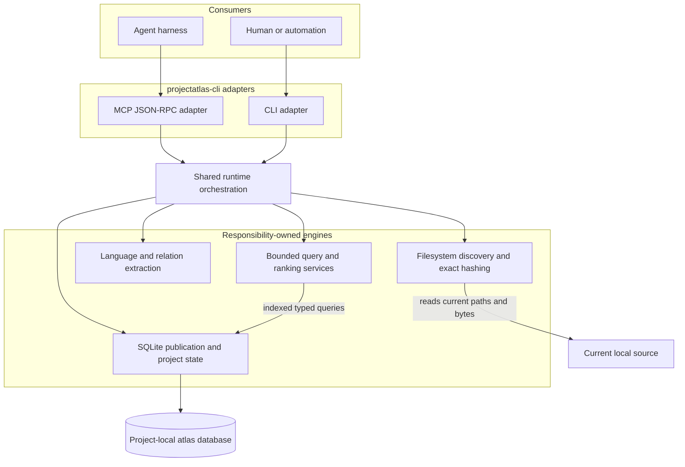
```mermaid
flowchart TB
    subgraph Hosts[Consumers]
        Agent[Agent harness]
        User[Human or automation]
    end
    subgraph Adapters[projectatlas-cli adapters]
        MCP[MCP JSON-RPC adapter]
        CLI[CLI adapter]
    end
    Runtime[Shared runtime orchestration]
    subgraph Engines[Responsibility-owned engines]
        FS[Filesystem discovery and exact hashing]
        Symbols[Language and relation extraction]
        Service[Bounded query and ranking services]
        DB[SQLite publication and project state]
    end
    Source[Current local source]
    Atlas[(Project-local atlas database)]

    Agent --> MCP
    User --> CLI
    MCP --> Runtime
    CLI --> Runtime
    Runtime --> FS
    Runtime --> Symbols
    Runtime --> Service
    Runtime --> DB
    FS -->|reads current paths and bytes| Source
    Service -->|indexed typed queries| DB
    DB --> Atlas
```

The current saved local source is authoritative. Runtime orchestration passes
bounded current content into the symbol engine; the symbol engine does not own
filesystem I/O. SQLite stores authored purposes and complete derived
generations; it does not make a hosted commit the source of truth.

### Crate Dependency And Ownership

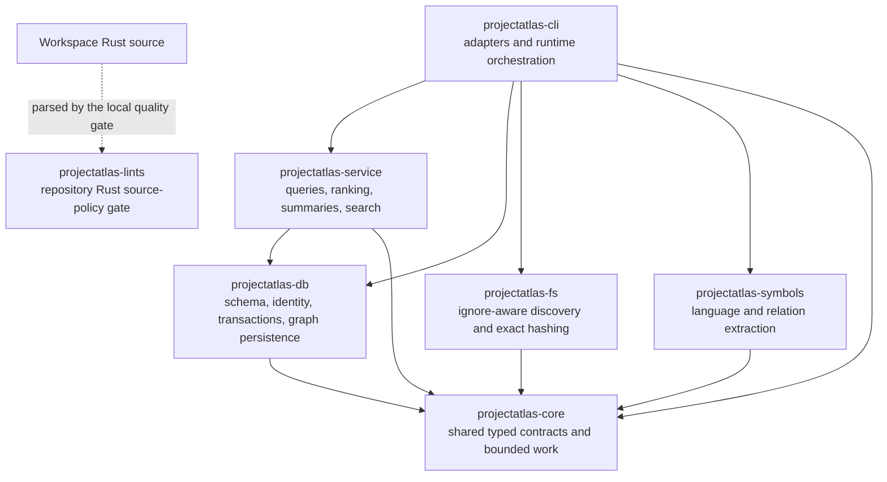
```mermaid
flowchart TB
    CLI[projectatlas-cli<br/>adapters and runtime orchestration]
    Service[projectatlas-service<br/>queries, ranking, summaries, search]
    DB[projectatlas-db<br/>schema, identity, transactions, graph persistence]
    FS[projectatlas-fs<br/>ignore-aware discovery and exact hashing]
    Symbols[projectatlas-symbols<br/>language and relation extraction]
    Core[projectatlas-core<br/>shared typed contracts and bounded work]
    Lints[projectatlas-lints<br/>repository Rust source-policy gate]
    Workspace[Workspace Rust source]

    CLI --> Service
    CLI --> DB
    CLI --> FS
    CLI --> Symbols
    CLI --> Core
    Service --> DB
    Service --> Core
    DB --> Core
    FS --> Core
    Symbols --> Core
    Workspace -. parsed by the local quality gate .-> Lints
```

Dependency direction remains acyclic. The lint crate is a workspace quality
tool, not a runtime dependency. No eighth crate is justified unless a durable
independently consumed ownership boundary appears.

### Database Authority And Responsibility


```mermaid
flowchart TB
    subgraph Inputs[External authorities and inputs]
        direction LR
        Source[Current saved local source<br/>authoritative for what exists now]
        Policy[Filesystem config, .gitignore,<br/>atlas ignore policy, optional VCS context]
        PurposeAPI[Purpose review API]
    end

    subgraph RuntimeFlow[Runtime and service flow]
        direction LR
        Runtime[Freshness and publication owner]
        Extract[Filesystem and symbol extraction]
        Publish[One SQLite publication transaction]
        Query[Bounded query and ranking service]
        Agent[Agent MCP or CLI response]
        Runtime --> Extract -->|validated typed batch| Publish
        Query --> Agent
    end

    subgraph ProjectDB[Exactly one authoritative projectatlas.db for this resolved source-state binding]
        direction LR
        subgraph Derived[Reconciled complete generation]
            direction TB
            DerivedBoundary[Generation publication and read boundary]
            Nodes[Node/path anchors, text,<br/>summaries, and parse state]
            Symbols[Symbols and legacy relations]
            Graph[Stable entities, logical relations,<br/>occurrences, and coverage]
            DerivedBoundary --- Nodes
            DerivedBoundary --- Symbols
            DerivedBoundary --- Graph
        end

        subgraph Authored[Durable authored atlas state]
            direction TB
            AuthoredBoundary[Authored-state boundary]
            Identity[Project identity and database metadata]
            Purposes[Reviewed purposes and lifecycle]
            Health[Health resolutions]
            Telemetry[Bounded usage telemetry and aggregates]
            Memory[Future bounded Memory Atlas<br/>independent context revision]
            AuthoredBoundary --- Identity
            AuthoredBoundary --- Purposes
            AuthoredBoundary --- Health
            AuthoredBoundary --- Telemetry
            AuthoredBoundary --- Memory
        end
    end

    Source -->|bounded current paths and bytes| Extract
    Policy -->|freshness and selection inputs| Runtime
    PurposeAPI --> Purposes
    Publish -->|replace affected derived closure| DerivedBoundary
    Publish -. preserves .-> AuthoredBoundary
    Query -->|one complete generation snapshot| DerivedBoundary
    Query -->|identity and current purpose projection| AuthoredBoundary
    classDef future stroke-dasharray: 5 5
    class Memory future
```

Source and database authority are intentionally different. SQLite does not
claim that a committed repository or an old indexed row is current source truth.
It preserves authored atlas decisions and one complete derived projection of the
saved local bytes. A purpose update therefore changes later graph-backed output
without rewriting entity or relation rows. Scan reconciliation updates stable
node/path anchors in place or marks them absent so their authored purpose rows
survive; derived publication never implements refresh by deleting authored
state.

Configuration and ignore rules stay authoritative in their filesystem-owned
formats. The database records only the fingerprints and derived consequences
needed for freshness and publication; it does not become a second mutable
configuration authority. There is one authoritative database for one resolved
source-state binding. A large extraction may use a bounded disposable spool as an
implementation detail, but even an SQLite-backed spool is not a ProjectAtlas
database: it has no project identity, authored state, active generation, or
query surface and is deleted after the owning operation.

A shared MCP process can route a call to another explicitly selected project;
that opens the other project's own single database rather than adding a database
to the active project. Explicit federation likewise takes bounded read-only
snapshots of participating projects' existing databases for one call and never
creates a federated or shared authority.

The future Memory Atlas belongs to the same project database because it shares
project identity, backup, migration, and local/offline constraints, but it does
not share structural generation ownership. #314 will define capped authored
records and an independent context revision. Graph publication cannot mutate
that revision; a memory update cannot bless or advance structural data.

### Normalized Graph Physical Model

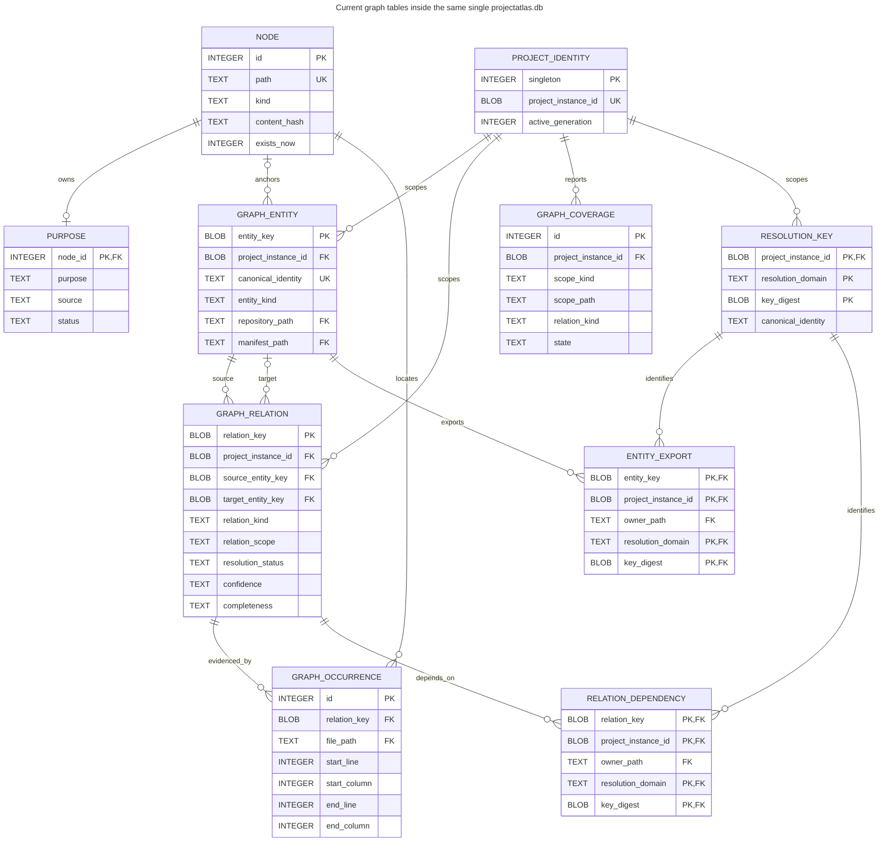
```mermaid
---
title: Current graph tables inside the same single projectatlas.db
---
erDiagram
    PROJECT_IDENTITY {
        INTEGER singleton PK
        BLOB project_instance_id UK
        INTEGER active_generation
    }
    NODE {
        INTEGER id PK
        TEXT path UK
        TEXT kind
        TEXT content_hash
        INTEGER exists_now
    }
    PURPOSE {
        INTEGER node_id PK,FK
        TEXT purpose
        TEXT source
        TEXT status
    }
    GRAPH_ENTITY {
        BLOB entity_key PK
        BLOB project_instance_id FK
        TEXT canonical_identity UK
        TEXT entity_kind
        TEXT repository_path FK
        TEXT manifest_path FK
    }
    GRAPH_RELATION {
        BLOB relation_key PK
        BLOB project_instance_id FK
        BLOB source_entity_key FK
        BLOB target_entity_key FK
        TEXT relation_kind
        TEXT relation_scope
        TEXT resolution_status
        TEXT confidence
        TEXT completeness
    }
    GRAPH_OCCURRENCE {
        INTEGER id PK
        BLOB relation_key FK
        TEXT file_path FK
        INTEGER start_line
        INTEGER start_column
        INTEGER end_line
        INTEGER end_column
    }
    GRAPH_COVERAGE {
        INTEGER id PK
        BLOB project_instance_id FK
        TEXT scope_kind
        TEXT scope_path
        TEXT relation_kind
        TEXT state
    }
    RESOLUTION_KEY {
        BLOB project_instance_id PK,FK
        TEXT resolution_domain PK
        BLOB key_digest PK
        TEXT canonical_identity
    }
    ENTITY_EXPORT {
        BLOB entity_key PK,FK
        BLOB project_instance_id PK,FK
        TEXT owner_path FK
        TEXT resolution_domain PK,FK
        BLOB key_digest PK,FK
    }
    RELATION_DEPENDENCY {
        BLOB relation_key PK,FK
        BLOB project_instance_id PK,FK
        TEXT owner_path FK
        TEXT resolution_domain PK,FK
        BLOB key_digest PK,FK
    }

    PROJECT_IDENTITY ||--o{ GRAPH_ENTITY : scopes
    PROJECT_IDENTITY ||--o{ GRAPH_RELATION : scopes
    PROJECT_IDENTITY ||--o{ GRAPH_COVERAGE : reports
    PROJECT_IDENTITY ||--o{ RESOLUTION_KEY : scopes
    NODE ||--o| PURPOSE : owns
    NODE o|--o{ GRAPH_ENTITY : anchors
    NODE ||--o{ GRAPH_OCCURRENCE : locates
    GRAPH_ENTITY ||--o{ GRAPH_RELATION : source
    GRAPH_ENTITY o|--o{ GRAPH_RELATION : target
    GRAPH_ENTITY ||--o{ ENTITY_EXPORT : exports
    RESOLUTION_KEY ||--o{ ENTITY_EXPORT : identifies
    GRAPH_RELATION ||--o{ GRAPH_OCCURRENCE : evidenced_by
    GRAPH_RELATION ||--o{ RELATION_DEPENDENCY : depends_on
    RESOLUTION_KEY ||--o{ RELATION_DEPENDENCY : identifies
```

The diagram shows the current schema-15 normalized hot relationship model, not
every compatibility or telemetry table. Task 3.2 added one
`graph_resolution_keys` authority plus `graph_entity_exports` and
`graph_relation_dependencies` owner bindings. The registry permits only one
canonical collision witness for a project/domain/digest identity, even when the
same key appears in both export and dependency bindings. Compact binding rows
reuse that registry instead of repeating long canonical identities. Indexed
owner paths select prior export keys and affected inbound source files without
display-name scans or one query per endpoint; insertion and lookup reconcile the
canonical witness so a digest collision fails closed instead of merging
identities. Stable fixed-width entity, relation, and resolution-key digests stay
independent of display labels and line movement. A logical relation is traversed
once while every exact supporting span remains available through occurrence
rows. Ambiguous and unresolved references retain typed dependency facts without
a fabricated target.

Index ownership follows accepted queries rather than columns in isolation:

- `graph_entities` indexes exact path, package/manifest, symbol, and external
  selector access;
- `graph_relations` has separate source-first and target-first adjacency indexes
  plus bounded family/resolution access;
- resolution-key bindings have owner-first and key-first indexes that load old
  exports, find current candidates, and map the union of old/new keys to the
  exact distinct inbound source files requiring re-resolution, including
  previously unresolved references;
- occurrences are ordered by file and span for exact-source retrieval and
  affected-path invalidation;
- coverage indexes serve path, family, and state filters;
- nodes and purposes keep path/parent/kind and lifecycle lookups outside the
  graph rows so current purpose can be projected without graph write
  amplification.

### Bounded Graph Read With Purpose Projection

#### Indexed snapshot read

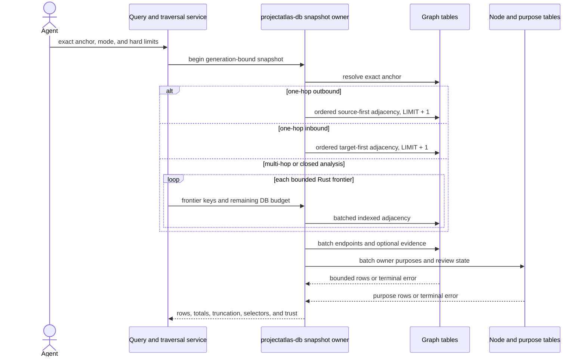
```mermaid
sequenceDiagram
    actor Agent
    participant Service as Query and traversal service
    participant DB as projectatlas-db snapshot owner
    participant Graph as Graph tables
    participant Purpose as Node and purpose tables

    Agent->>Service: exact anchor, mode, and hard limits
    Service->>DB: begin generation-bound snapshot
    DB->>Graph: resolve exact anchor
    alt one-hop outbound
        DB->>Graph: ordered source-first adjacency, LIMIT + 1
    else one-hop inbound
        DB->>Graph: ordered target-first adjacency, LIMIT + 1
    else multi-hop or closed analysis
        loop each bounded Rust frontier
            Service->>DB: frontier keys and remaining DB budget
            DB->>Graph: batched indexed adjacency
        end
    end
    DB->>Graph: batch endpoints and optional evidence
    DB->>Purpose: batch owner purposes and review state
    Graph-->>DB: bounded rows or terminal error
    Purpose-->>DB: purpose rows or terminal error
    DB-->>Service: rows, totals, truncation, selectors, and trust
```

#### Buffered composition and terminal cleanup

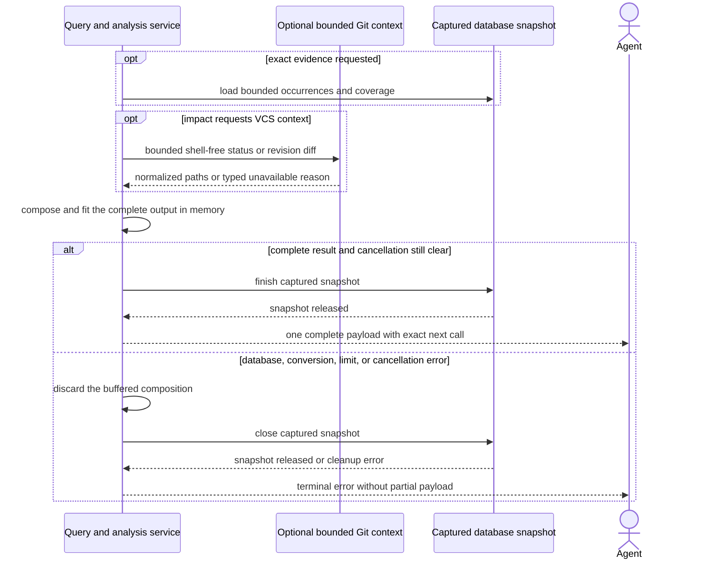
```mermaid
sequenceDiagram
    participant Service as Query and analysis service
    participant Git as Optional bounded Git context
    participant DB as Captured database snapshot
    actor Agent

    opt exact evidence requested
        Service->>DB: load bounded occurrences and coverage
    end
    opt impact requests VCS context
        Service->>Git: bounded shell-free status or revision diff
        Git-->>Service: normalized paths or typed unavailable reason
    end
    Service->>Service: compose and fit the complete output in memory
    alt complete result and cancellation still clear
        Service->>DB: finish captured snapshot
        DB-->>Service: snapshot released
        Service-->>Agent: one complete payload with exact next call
    else database, conversion, limit, or cancellation error
        Service->>Service: discard the buffered composition
        Service->>DB: close captured snapshot
        DB-->>Service: snapshot released or cleanup error
        Service-->>Agent: terminal error without partial payload
    end
```

Tasks 5.5, 5.6, and 5.7 implement this boundary through the accepted seven crates.
File and symbol anchors, direction-owned adjacency, relation and endpoint rows,
accepted owner purposes, coverage, and optional occurrences all use bounded
prepared database reads with one aggregate work ledger. Cursors bind the exact
project/root, complete generation, authored-purpose revision, query, ordering,
and result-defining budgets. The service meters decoded database work, compact
cursor state, retained working composition, the two-copy output-fitting peak,
deadline/cancellation, and exact final adapter bytes. No additional filtered
high-degree index was justified: the measured source-first, target-first,
relation-occurrence, coverage, entity, and purpose-owner plans use their existing
owned indexes. One request keeps one read snapshot across selector resolution,
every adjacency batch, endpoint/purpose hydration, and row reconstruction so a
path can never mix graph generations. Closed analysis reuses the same route:
SQLite owns indexed fact and symbol batches, while the service owns bounded
topology, SCC/community, purpose, structural, impact/dead-code, and node-simple
trace composition. Optional shell-free Git is impact context only and never
replaces the current local source generation.

This is the database form of the agent sieve. An initial task still starts with
purpose-led folder/file narrowing. Once anchored, indexed adjacency removes
irrelevant files; projected purpose confirms responsibility; summary and trust
verify current content; exact selectors lead directly to the source slice. The
agent never needs a graph query language or an unbounded in-memory graph.

One-hop inbound/outbound navigation uses the separate prepared SQLite adjacency
queries directly. Multi-hop control belongs in `projectatlas-service`: a bounded
node-simple Rust frontier tracks visited state, cycles, trust/relation filters,
ranking, cancellation, aggregate budgets, and truncation reasons while SQLite
expands each frontier through direction-specific batched adjacency. Rust retains
only the active frontier, visited state, and accepted candidates; it never loads
the complete graph or issues one query per node. Ranking is deterministic within
each completely inspected bounded adjacency batch. That batch-local contract
avoids an otherwise unnecessary full high-degree count or materialization; a
later canonical database batch does not retroactively reorder an emitted page.

Task 5.5 measures this Rust mechanism against one recursive SQLite CTE
whose inbound/outbound branches remain independently indexable. The CTE is a
performance guard, not a reason to force evolving traversal policy into SQL; it
replaces the expected Rust mechanism only if cyclic and high-degree measurements
show a concrete advantage without weakening topology, stable ordering, trust,
cancellation, selectors, or visited/edge/time/memory/output accounting. Neither
mechanism may use one broad `source OR target` predicate that defeats the owning
indexes or rely on depth alone to control cycles.

##### Recursive CTE comparison

The owning `projectatlas-db` regression compares the two mechanisms against the
same persisted calls graph: one source with 4,096 distinct outbound targets,
one return edge from every target, and the existing resolved call. The graph
therefore contains 4,098 reachable nodes, 8,193 inspected edges, a high-degree
frontier, and 4,096 cycles. Both mechanisms use
`idx_graph_relations_source_kind`, return the same stable key order, terminate
the cycles, and stop through a SQLite progress callback; the Rust mechanism
additionally proves typed `RepositoryTraversal` cancellation.

One optimized Windows x86-64 run recorded the following diagnostic sample. The
elapsed values are observations rather than regression thresholds; topology,
plan ownership, bounded state, cancellation, and deterministic order are the
portable assertions.

| Mechanism | SQLite VM steps | Elapsed | Explicit retained/output state |
| --- | ---: | ---: | --- |
| Indexed recursive CTE | 188,000 | 33.023 ms | SQLite owns the recursive distinct set and its temporary-state accounting |
| Batched Rust frontier | 20,007,000 | 1,705.933 ms | 4,097-key peak frontier; 262,240 estimated retained key bytes; 131,136 output key bytes |

The CTE wins raw transitive-closure latency on this deliberately simple graph.
It does not win the product mechanism: moving relation trust and resolution
filters, stable per-edge ranking and path choice, node-simple visited state,
continuations, aggregate row/node/edge/occurrence/memory/deadline/output
budgets, purpose and coverage hydration, and typed cancellation into recursive
SQL would hide or duplicate the service-owned policy. ProjectAtlas therefore
keeps the direction-indexed CTE as a performance guard and keeps bounded Rust
frontier control as the responsibility-coherent implementation. The measured
gap is tracked by the huge-source matrix; it is not disguised as a Rust speed
advantage.

Traversal cost follows the visited frontier and can grow roughly with branching
factor raised to depth even when every lookup is indexed. The huge-source matrix
therefore includes skewed high-degree nodes, diamonds, cycles, disconnected
targets, narrow and expanded closures, and repeated queries. Relation-family,
current-state, entity-type, temporal, evidence, and FTS indexes are added only
for accepted hot queries; the useful index inventory of another graph workload
is not copied wholesale. Every added index is charged against publication time,
WAL/checkpoint writes, cache pressure, migration time, and persistent bytes.

ProjectAtlas does not retain bi-temporal history for rebuildable source graph
rows: current local bytes plus one complete generation are the authority, and
optional snapshots are explicit artifacts. Deterministic lexical search remains
the default. A trigger-free FTS5 projection now narrows only safe ASCII token
queries to a bounded complete candidate set; service-owned exact verification
still reads authoritative `file_texts`, and unsafe or overflowing shapes fall
back to bounded path-ordered persisted text. Semantic embeddings, rank fusion,
or ANN remain separately gated, and neither an unbounded embedding scan nor a
trigger-maintained search copy may become hidden default-core cost.

### MCP Call To Database Access Contract

For this section, “the database” always means the one authoritative database
captured by the resolved runtime/request source-state binding. It contains
the authored atlas state and the active complete derived generation described
above. A different repository, clone, or worktree has a different database
because it represents different current local bytes and authored state; that is
project isolation, not product sharding. Several connections, the main/WAL/SHM
files of one SQLite database, or an owned disposable staging file are likewise
not additional ProjectAtlas databases. Explicit federation opens the independent
database of each supplied root read-only for one bounded call, creates no shared
authority, and retains no cross-project database or cache.

The matrices below inventory every current CLI route and every registered MCP
tool. Routes in the same row intentionally share one physical contract. “Current
bound” records what the implementation enforces now; “target owner” prevents a
future requirement from being mistaken for already-live behavior.

#### Normal navigation and inspection

| CLI route | MCP route | Physical database and source access | Freshness, generation, purpose, selector, and trust contract | Transaction, bounds, telemetry, and target owner |
| --- | --- | --- | --- | --- |
| `overview`; `folders`; `files`; `next` | `atlas_overview`; `atlas_folders`; `atlas_files`; `atlas_next`; `atlas_session_brief` | Read `nodes`, authoritative `purposes`, node summaries, bounded ranking candidates, and bounded graph connection batches. File ranking may inspect persisted file text for a bounded candidate set. | Normal calls use the freshness gate and one root-bound read snapshot of an active complete generation. Rows project the latest owning purpose plus approval state, deterministic reason codes, typed connection counts/samples/truncation, and a ready next call. `atlas_session_brief` ranks once and recommends summary, search, or detailed relations without rerunning folder/file ranking. | Candidate and per-family/global connection rows are bounded and no route materializes the whole graph. After a valid tracked result exists, the runtime may append telemetry through a separate 25 ms ancillary writer bound to the same project identity; telemetry failure never invalidates navigation and `atlas_session_brief` stays read-only. The verified observation epoch, purpose-plus-connection enrichment, and cursor/intermediate/output contracts are current; task 7.1 owns combined release verification. |
| `outline`; `summary` | `atlas_outline`; `atlas_file_summary` | Resolve one exact indexed file, read node/purpose/summary/parse/symbol/relation facts plus an exact-path `graph_coverage` digest, then read the current saved source bytes for the selected file. | The freshness gate and complete-generation snapshot validate the selection. Summary exposes bounded parse/fact-provider coverage state, counts, active generation, trust, and a typed health next call without project-wide discovery. Detailed related identities remain opt-in through the relation route instead of becoming a default edge dump. | Section row limits are caller supplied and the coverage digest is capped at 16 current rows. Successful tracked calls may append telemetry to the same database after the read snapshot. Deeper graph hydration and uniform detailed-relation budgets are current; task 7.1 owns combined release verification. |
| `symbols list`; `symbols relations`; `symbols slice`; `slice --symbol` | `atlas_symbols`; `atlas_symbol_relations`; symbol selection through `atlas_slice` | Preserve exact legacy node/path and relation reads. The additive detailed relation view resolves an exact file or symbol anchor, expands direction-owned adjacency in bounded batches, and batch-hydrates normalized relations, endpoints, accepted purposes, coverage, optional occurrences, and exact-path symbols. Closed `architecture`, `impact`, and `trace` analysis reuses this route; symbol slices read current saved source bytes. | Normal reads use the freshness gate and complete-generation snapshot. Legacy bytes and ordering remain compatible. Detailed and analysis cursors bind project/root, generation, authored-purpose revision, selector, mode, direction, family/trust filters, batch-local order, and result-defining budgets. Rows and candidate-labeled findings retain resolution/confidence, node-simple paths, source selectors, projected purpose state, coverage, and exact next calls. | SQLite owns bounded indexed batches. The service owns multi-hop topology, SCC/community, purpose alignment/drift, structural candidates, impact/dead-code, static trace, shared work control, and final composition; optional shell-free Git is impact context only. Detailed and analysis work enforces database, row/node/visited/edge/occurrence, decoded/intermediate, deadline/cancellation, cursor, and exact CLI JSON or MCP TOON byte ceilings with typed truncation and exact/at-least/unknown totals. Task 7.1 owns combined release verification. |
| `slice` with exact lines | `atlas_slice` | Validate one indexed file in SQLite, preflight its current filesystem size against the indexed row and the 16 MiB navigation-read ceiling, read through `limit + 1`, verify the current hash, then select the requested line range without materializing every line. Persisted `file_texts` never override newer saved bytes. | The freshness gate and complete-generation snapshot protect selection; size/hash drift returns typed refresh guidance, a legitimately oversized indexed source returns typed verification-incomplete state, and the repository-relative file path remains the reusable selector. Purpose, graph trust, and coverage are not duplicated into verbatim slice output. Internal CRLF separators and UTF-8 bytes are preserved. | Line and symbol slices share one exact final-adapter ceiling: 256 KiB by default and caller-selectable from 1 byte through the 16 MiB product maximum. CLI JSON/TOON and MCP TOON reject an oversized content range before its final allocation or an oversized encoded envelope before emission without changing the compatibility payload. Successful tracked calls may append telemetry to the same database. Current through task 5.7. |
| `search` | `atlas_search` | Read authoritative persisted UTF-8 `file_texts` and apply optional path narrowing. Safe ASCII-alphanumeric literals of at least three bytes may first read at most 4,096 metadata-only FTS5/BM25 candidates; a complete candidate page is path-sorted and exact-verified one file at a time. Regex, fuzzy, short, punctuation-sensitive, Unicode-unsafe, desynchronized, or candidate-overflow queries use path-indexed metadata-first persisted-text fallback and hydrate only admitted content by exact path. | Normal search uses the freshness gate and one complete-generation snapshot. Omitted retrieval mode is lexical. Explicit semantic or hybrid mode returns typed lifecycle state and recovery guidance until a compatible generation is ready. Search proves lexical occurrence, not graph relevance, purpose, trust, or coverage. | Patterns are capped at 64 KiB and path globs at 4 KiB before matcher construction. Selected work is capped at 50,000 files, 128 MiB, ten seconds, 20 context lines per side, 1,000 result rows, and approximately 2 MiB of retained pre-serialization payload. Reports expose candidate files, searched files/bytes, retained bytes, completeness, truncation, and its first stable reason. MCP cancellation reaches SQLite progress hooks, content hydration, and exact line matching. Successful tracked calls may append telemetry after acceptance. |
| `health-check`; `purpose queue`; database portion of `lint`; `parity`; `parity report` | `atlas_health`; `atlas_purpose_queue`; `atlas_lint`; `atlas_parity_report` | By default read nodes, purposes, summaries, parser/index state, structural findings, and authored health resolutions. Explicit `health-check --coverage` or `atlas_health { coverage: true }` instead reads current `graph_coverage` joined to authoritative source/fact parser provenance. Filesystem/config lint remains outside SQLite. | Health, queue, lint, parity, and opt-in coverage use the freshness gate and complete-generation snapshot. Coverage discovery supports indexed path, parser/provider, relation, state, and exact-reason filters and never starts a scan. Purpose findings distinguish generated suggestions from accepted authored intent. | Default health behavior remains unchanged. Coverage pages clamp to 200 rows, fetch `LIMIT + 1`, expose continuation, exact/at-least/unknown total state, active generation, trust, next calls, and format-specific output bytes. Filter-owned schema-15 indexes prevent accidental coverage-table scans; parser/provider joins project provenance from its single authority. Tracked health/queue calls may append telemetry to the same database; lint and parity do not. |

#### Bounded Lexical Search And FTS Publication

Transactional publication keeps the authoritative text, rebuildable search
projection, and their revision witness atomic:

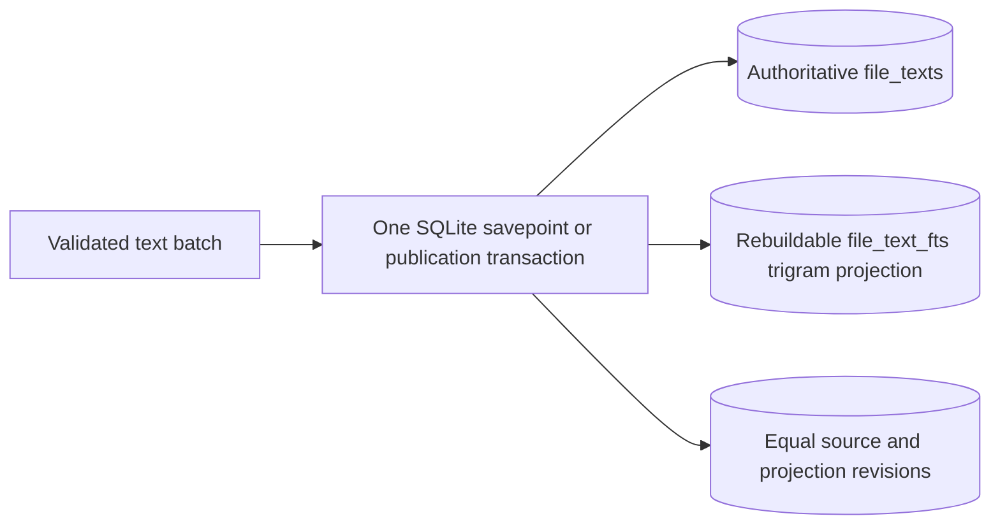
```mermaid
flowchart LR
    Batch[Validated text batch] --> Tx[One SQLite savepoint or publication transaction]
    Tx --> Texts[(Authoritative file_texts)]
    Tx --> FTS[(Rebuildable file_text_fts trigram projection)]
    Tx --> Revisions[(Equal source and projection revisions)]
```

Retrieval uses the projection only for bounded metadata narrowing and returns
results only after exact verification against authoritative persisted text:

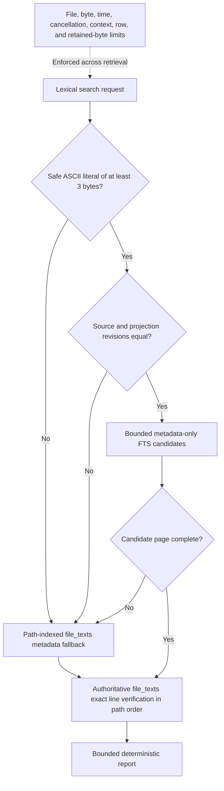
```mermaid
flowchart TB
    Query[Lexical search request] --> Shape{Safe ASCII literal of at least 3 bytes?}
    Shape -- No --> Fallback[Path-indexed file_texts metadata fallback]
    Shape -- Yes --> Ready{Source and projection revisions equal?}
    Ready -- No --> Fallback
    Ready -- Yes --> Candidates[Bounded metadata-only FTS candidates]
    Candidates --> Complete{Candidate page complete?}
    Complete -- No --> Fallback
    Complete -- Yes --> Exact[Authoritative file_texts exact line verification in path order]
    Fallback --> Exact
    Exact --> Report[Bounded deterministic report]
    Control[File, byte, time, cancellation, context, row, and retained-byte limits] -. Enforced across retrieval .-> Query
```

`file_texts` remains the only lexical authority. The transaction advances its
source revision before mutation and publishes the matching projection revision
only after every FTS delete/insert succeeds; rollback therefore exposes neither
half. Reads compare those revisions without scanning repository text. Unsafe,
overflowing, or unavailable acceleration routes to the same exact matcher over
admitted persisted text, while cancellation and deadline checks continue through
SQLite execution, exact hydration, and in-memory line verification.

#### Source-wide indexing and explicit maintenance

| CLI route | MCP route | Physical database and source access | Freshness and generation contract | Transaction, bounds, telemetry, and target owner |
| --- | --- | --- | --- | --- |
| `init` | `atlas_init` | Create/validate project-local config and the one project database; unless `no_scan`, scan current local source, import controlled purpose inputs, and derive text, summaries, symbols, and graph projections. | The selected source tree and effective ignore/config policy are authoritative. Initialization binds project identity and publishes one active complete generation when scanning runs. | Discovery/extraction is admitted under existing entry, byte, parser-output, worker, deadline, and cancellation limits; prepared mutations publish in one short parent-owned transaction. It writes no separate product database. Introduced in schema 11 and preserved by schema 15, bounded telemetry, passive checkpoint state, reusable-page state, and the explicit no-spill lifecycle remain part of the current contract. |
| `scan` | `atlas_scan` | Read/hash/parse current included source off-writer, stage bounded typed batches, and replace the complete derived projection in the same database. | Revalidate source, configuration, purpose inputs, and base generation before publication. Readers keep the last complete generation until commit. | One short `BEGIN IMMEDIATE` publication owns all prepared mutations and one generation advance; failure/cancellation rolls back. Background MCP execution changes task delivery, not database ownership. No navigation telemetry is appended. |
| `symbols build` | `atlas_symbols_build` | Read selected indexed source off-writer and rebuild compatible symbol plus normalized graph projections in the same database. | Revalidate the source and publication contract; preserve the last complete generation on failure. | Bounded parser workers, source bytes, retained parser output, deadline, and cancellation feed one publication transaction. No navigation telemetry is appended. |
| `watch` and `watch --once` | `atlas_watch_once` | Observe or poll current local source, derive one changed-path batch off-writer, and publish affected text/symbol/graph rows in the same database; a correctness-required event may request a full scan. | Each successful batch revalidates source/policy/base generation and advances exactly once. Failed batches remain eligible for retry and expose no partial generation. | Each batch has bounded path/source/parser/worker/deadline/cancellation controls and one short publication transaction. Task 3.5 owns the long-lived verified observation epoch. Database maintenance is bounded, content-free, and never introduces an abandoned spill authority. |
| `map` | `atlas_map` | Explicitly walk the selected source tree and read all approved purposes from the project database to write a compatibility TOON/optional JSON export. | This is not a normal index-backed navigation response and does not claim a generation-bound compact page. Current local source drives the export while reviewed purposes remain SQLite-authored. | Deliberately source-wide maintenance; current purpose loading/export can materialize the admitted project set and writes no telemetry. It must not be cited as proof that normal navigation is bounded. |
| `strip-legacy-purpose` | `atlas_strip_legacy_purpose` | Scan filesystem paths and optionally delete legacy `.purpose` files; the command does not create another database or make legacy files a second purpose authority. | This is an explicit migration/file-maintenance operation, not a normal fresh database read. Durable reviewed purpose remains owned by the project database. | Dry-run by default; apply mutates source-side files, not SQLite. Its source walk is explicit and source-wide. |

#### Authored mutations and database/file lifecycle

| CLI route | MCP route | Physical access and authority | Transaction and generation contract | Bounds, telemetry, and target owner |
| --- | --- | --- | --- | --- |
| `purpose set` | `atlas_purpose_set` | Validate the current schema/root through bounded metadata and schema-contract reads, validate one indexed path, and write its reviewed purpose into `purposes` in the same project database. Ordinary current-schema opens do not run a whole-database integrity scan; migration and explicit verification retain that work. | The authored write is atomic for that item and does not rewrite graph rows or advance the derived generation; later reads project the new authoritative purpose. | One item and no telemetry. Purpose projection into enriched folder/file/relation results is owned by tasks 5.2 and 5.5. |
| `purpose review` preview/apply | `atlas_purpose_review` | Admit at most 200 rows, 4 KiB per path, 64 KiB per other string field, and 512 KiB of aggregate request strings before project/database selection; CLI file input is metadata-preflighted and `limit + 1` read under a 2 MiB ceiling. Then read each requested indexed node and preview or apply agent-reviewed purpose rows in the same database. | Preview uses a fresh read snapshot. Conditional apply keeps one SQLite transaction. Explicit correction remains item-oriented for semantic row outcomes, but every admitted row plus the exact supported JSON-with-newline and TOON report is preflighted before the first write, so a later oversized stored value or output cannot partially apply an earlier item. Purpose writes do not advance graph generation. | Retained report strings and each exact supported encoding are capped at 4 MiB. CLI and MCP propagate count, field, and aggregate admission failures without mutation; small JSON, TOON, UTF-8, preview, explicit-apply, and conditional-apply compatibility remains current. No telemetry. Current through task 5.7. |
| `health resolve` | `atlas_health_resolve` | Validate one currently active deterministic finding and write one authored `health_resolutions` row in the same database. | The resolution write is item-atomic and does not mutate derived graph rows or advance generation. | One item, no telemetry. Resolution lookup and later health pages remain subject to the bounded-read contract above. |
| `root set` with bind/move/detach | `atlas_root_set` | Validate destination identity, mutate project/root identity in the same database, and regenerate project-local MCP config files. Detach assigns an independent identity to a copied destination database without merging authorities. | One explicit root-transition transaction owns identity changes and rollback. A copied worktree database becomes the authority only for that different selected source tree. | Bounded metadata operation, no telemetry, no cross-project graph write. |
| `reset-index` | `atlas_reset_index` | Preview or explicitly delete the selected database and owned WAL/SHM/journal sidecars, plus optional generated MCP config. | File lifecycle, not a SQLite transaction. It removes the one selected project index; it never creates a replacement or second authority implicitly. | Explicit apply only, fixed owned target inventory, no telemetry. |

#### Diagnostics, administration, and non-database routes

| Classification | CLI route | MCP route | Exact contract and later owner |
| --- | --- | --- | --- |
| Database diagnostics | `settings`; `root`, `root show`, `root verify` | `atlas_settings`; `atlas_root` | Settings/show open the existing database read-only and report bounded schema/root/index statistics without source refresh, migration, maintenance, or telemetry. Explicit CLI `root verify` and MCP `atlas_root { verify: true }` additionally run full read-only `quick_check(1)` and foreign-key integrity verification; ordinary navigation and one-item authored writes do not pay that whole-database cost. CLI and MCP settings share one compact projection of schema/migration compatibility, complete publication generation with validated content-free contract identity, linked SQLite/compile identity, validated filesystem and operating profile, bounded actionable non-complete coverage, typed search readiness, optional-parser lifecycle, and language/provider/current-semantic-relation digests. Lexical readiness and legacy index counts are composed only when their stable read snapshot matches that publication identity; invalid raw fingerprint metadata is typed and omitted. The complete language matrix remains a generated artifact rather than routine agent context. |
| Telemetry diagnostics | `token` | `atlas_token_report` | A shared service use case reads current exact global/instance/day aggregates plus only retained raw detail from one read-only snapshot, without source freshness or another telemetry write. Reports expose `retained`, `partial`, `expired`, or `unavailable` detail truth. Raw events, labels, dimensions, instances, baselines, trends, and tombstones are independently bounded; all-time supported totals remain exact after compaction. |
| MCP configuration | `mcp-config` | `atlas_mcp_config` | Generate host configuration from explicit paths/config and may read project identity only to resolve the selected root/config. It does not scan, publish, write telemetry, or create another database. |
| Server/process administration | `mcp`; `runtime-info`; `watch-status` | `atlas_runtime_info`; `atlas_watch_status`; `atlas_set_project_path`; `atlas_task_status`; `atlas_task_cancel` | MCP startup owns transport only. Runtime and watcher reports are process/filesystem diagnostics. Active-project selection stores one process-local path choice but does not open, scan, or mutate the selected database. Task status/cancel use the bounded in-memory session registry, not SQLite. Content-free SQLite capability identity belongs to `settings`; it does not turn `runtime-info` into a source-data query. |
| Config and ignore files | `config --print`; `ignore list`; `ignore init-gitignore`; `ignore add`; `ignore remove` | `atlas_config`; `atlas_ignore_list`; `atlas_ignore_init_gitignore`; `atlas_ignore_add`; `atlas_ignore_remove` | Read or explicitly edit project config/`.gitignore` files. Root discovery may consult existing database identity, but these calls do not query or mutate indexed rows and do not create a second settings authority inside SQLite. |

#### Implemented additive behavior and remaining targets

| Existing surface extended in place | Physical contract | State and owner |
| --- | --- | --- |
| `folders`, `files`, `next`, `atlas_session_brief` | Batch graph roles and only the crisp relevant connections for returned candidates, while projecting current accepted purpose plus approval/provenance state from `purposes`; never rank graph popularity above exact path/name and strong purpose evidence. | Current through 3.5, 5.2, and 5.7; combined release verification remains in 7.1-7.4. |
| `summary`, `outline`, `symbols` | Hydrate a bounded selected-file coverage digest and route deeper related-identity inspection through the detailed relation surface without per-symbol or whole-graph query loops. | Current through 5.2, 5.3, 5.5, and 5.7; combined release verification remains in 7.1-7.4. |
| `symbol relations` extended with direction/depth and closed architecture/impact/trace modes | Resolve stable selectors, use separately indexed source/target adjacency and dependency keys, page retained occurrences, batch endpoint plus nearest owning-purpose and exact-path symbol projection, and return generation, trust, resolution, coverage, exact spans, candidate-labeled findings, reusable next calls, cursors, work, and explicit truncation. No generic graph query language or separate jump tool is introduced. | Current through 5.5-5.7; combined release verification remains in 7.1-7.4. |
| Explicit federated relation/analysis request | Validate the complete ordered root list, open each root's independent existing project database read-only/query-only under aggregate root/connection/database/row/edge/intermediate/time/output/cancellation budgets, bind results to every captured generation, close every handle, and retain nothing. | 6.2. Federation is call-only composition, never product sharding or a shared database. |

Task 2.7 verifies the implemented portions of these mappings through production
query, service, and adapter paths. In-memory SQLite is sufficient only for
behavior independent of file locking, WAL, migration, reopen, backup, busy
contention, and platform paths. Those contracts use test-only temporary on-disk
project databases plus real CLI/MCP smoke. A mocked repository or hand-built
row can test pure classification or formatting, but cannot close a
database-backed persistence, query-plan, rollback, or agent-visible behavior
claim.

### MCP Read Communication Sequence

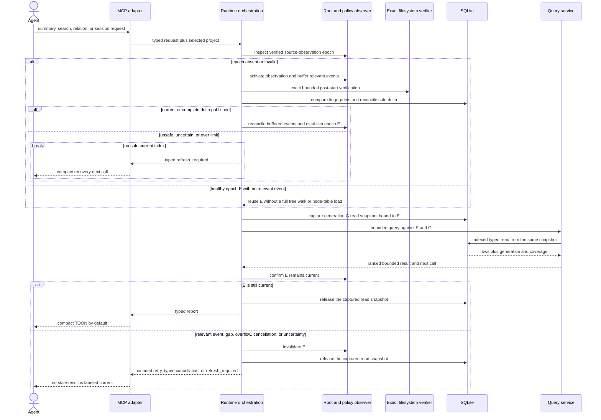
```mermaid
sequenceDiagram
    actor Agent
    participant MCP as MCP adapter
    participant Runtime as Runtime orchestration
    participant Observer as Root and policy observer
    participant FS as Exact filesystem verifier
    participant DB as SQLite
    participant Service as Query service

    Agent->>MCP: summary, search, relation, or session request
    MCP->>Runtime: typed request plus selected project
    Runtime->>Observer: inspect verified source-observation epoch
    alt epoch absent or invalid
        Runtime->>Observer: activate observation and buffer relevant events
        Runtime->>FS: exact bounded post-start verification
        Runtime->>DB: compare fingerprints and reconcile safe delta
        alt current or complete delta published
            Runtime->>Observer: reconcile buffered events and establish epoch E
        else unsafe, uncertain, or over limit
            break no safe current index
                Runtime-->>MCP: typed refresh_required
                MCP-->>Agent: compact recovery next call
            end
        end
    else healthy epoch E with no relevant event
        Observer-->>Runtime: reuse E without a full tree walk or node-table load
    end
    Runtime->>DB: capture generation G read snapshot bound to E
    Runtime->>Service: bounded query against E and G
    Service->>DB: indexed typed read from the same snapshot
    DB-->>Service: rows plus generation and coverage
    Service-->>Runtime: ranked bounded result and next call
    Runtime->>Observer: confirm E remains current
    alt E is still current
        Runtime->>DB: release the captured read snapshot
        Runtime-->>MCP: typed report
        MCP-->>Agent: compact TOON by default
    else relevant event, gap, overflow, cancellation, or uncertainty
        Runtime->>Observer: invalidate E
        Runtime->>DB: release the captured read snapshot
        Runtime-->>MCP: bounded retry, typed cancellation, or refresh_required
        MCP-->>Agent: no stale result is labeled current
    end
```

This is the current v0.4 task 3.5 behavior. A new long-lived runtime activates
bounded observation before its first exact post-start verification, then makes
later unchanged calls proportional to their bounded query while observation
remains healthy. The epoch binds the process, selected project identity, source
policy, and complete SQLite generation. A short-lived one-shot CLI process
performs its own first verification. Silence from a broken observer is never
accepted as freshness. A relevant event racing a query discards its provisional
result, and cancellation or preparation uncertainty invalidates the prior epoch
before another call may reuse it.

### Index And Transactional Publication Flow

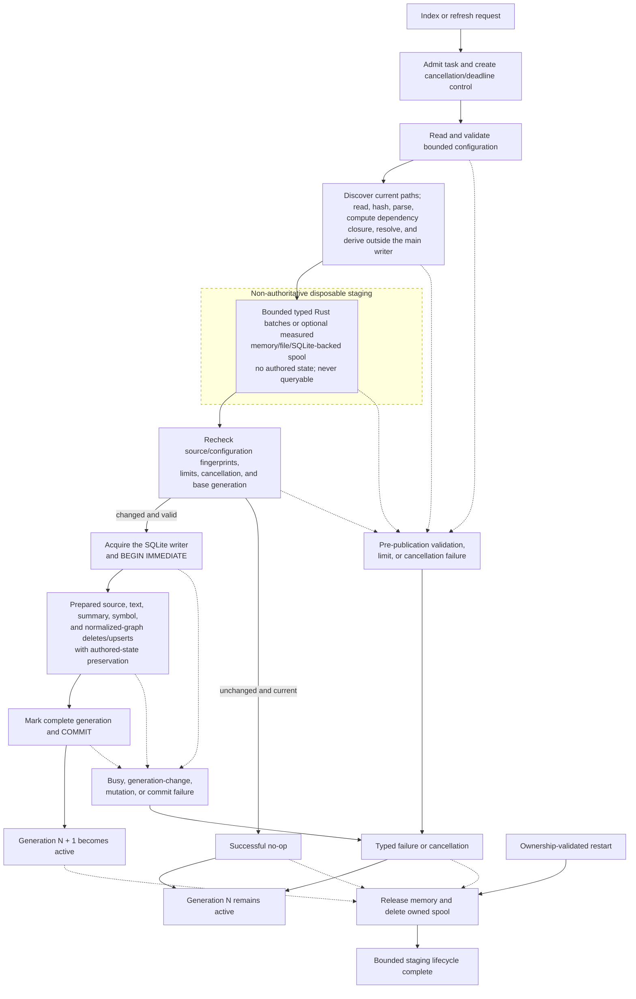
```mermaid
flowchart TB
    Request[Index or refresh request]
    Admit[Admit task and create cancellation/deadline control]
    Inputs[Read and validate bounded configuration]
    Build[Discover current paths; read, hash, parse,<br/>compute dependency closure, resolve, and derive outside the main writer]
    subgraph Transient[Non-authoritative disposable staging]
        Stage[Bounded typed Rust batches or optional measured<br/>memory/file/SQLite-backed spool<br/>no authored state; never queryable]
    end
    Recheck[Recheck source/configuration fingerprints,<br/>limits, cancellation, and base generation]
    Begin[Acquire the SQLite writer<br/>and BEGIN IMMEDIATE]
    Apply[Prepared source, text, summary, symbol,<br/>and normalized-graph deletes/upserts<br/>with authored-state preservation]
    Commit[Mark complete generation and COMMIT]
    NoChange[Successful no-op]
    Next[Generation N + 1 becomes active]
    Prior[Generation N remains active]
    Fail[Typed failure or cancellation]
    PrewriteFailure[Pre-publication validation,<br/>limit, or cancellation failure]
    WriteFailure[Busy, generation-change,<br/>mutation, or commit failure]
    Restart[Ownership-validated restart]
    Cleanup[Release memory and delete owned spool]
    Lifecycle[Bounded staging lifecycle complete]

    Request --> Admit --> Inputs --> Build --> Stage --> Recheck
    Recheck -->|changed and valid| Begin --> Apply --> Commit --> Next
    Recheck -->|unchanged and current| NoChange --> Prior
    Inputs -.-> PrewriteFailure
    Build -.-> PrewriteFailure
    Stage -.-> PrewriteFailure
    Recheck -.-> PrewriteFailure
    PrewriteFailure --> Fail
    Begin -.-> WriteFailure
    Apply -.-> WriteFailure
    Commit -.-> WriteFailure
    WriteFailure --> Fail
    Fail --> Prior
    Next -.-> Cleanup
    NoChange -.-> Cleanup
    Fail -.-> Cleanup
    Restart --> Cleanup --> Lifecycle
    style Transient stroke-dasharray: 5 5
```

For background MCP work, admission owns the deadline and cancellation token
before configuration content is read. Failed work never exposes partial rows
or advances the active generation, and successful no-change work leaves the
current generation unchanged. Expensive filesystem reads and parser work do not
hold the main database writer. Small incremental closures may remain in admitted
typed Rust batches. Large full/expanded closures spill only after measured
cardinality, memory, recovery, and write-amplification behavior selects a
bounded disposable spool, implemented as a plain temporary file or SQLite-backed
working file. Even when SQLite-backed, it is not another ProjectAtlas database:
it has no project identity, authored rows, active generation, or query surface.
After one final source/configuration and base-generation recheck, only prepared
mutation of the one project database occurs inside the short publication
transaction. The spool is never a copied live atlas and is deleted after the
owning operation publishes, fails, or is canceled.

Tasks 2.3 and 3.2 implement this flow. Full scan, full watcher refresh,
incremental watcher refresh, and symbol projection refresh capture their base
generation and prepare admitted filesystem, text, summary, symbol, relationship,
affected dependency-closure, and normalized graph state before acquiring the
writer. SQLite indexes locate bounded dependency candidates; Rust combines old
and new resolution keys, deduplicates source owners, applies resolver semantics,
and either stages the admitted closure or escalates to a complete refresh.
Immediately before publication the runtime reloads current configuration,
exactly revalidates source and consumed purpose inputs, then enters
`BEGIN IMMEDIATE`, compares the staged base generation, applies only prepared
mutations, advances the complete source/symbol/graph generation once, and
commits. Competing publication, source/configuration drift, cancellation, an
over-limit closure, or a late mutation error leaves the last complete generation
visible. Representative task 7.4 scale measurement still owns final
transaction-duration, WAL-write, contention, CPU, RSS, and spill-threshold
decisions; it must optimize measured costs without weakening this order or
introducing another authoritative database.

### SQLite WAL, Durability, And Checkpoint Flow

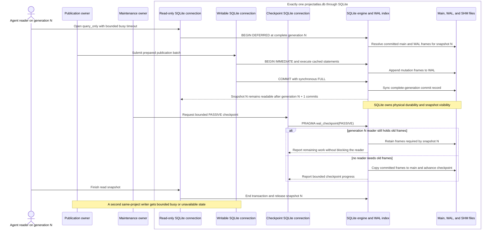
```mermaid
sequenceDiagram
    actor Reader as Agent reader on generation N
    participant Publisher as Publication owner
    participant Maintenance as Maintenance owner
    box Exactly one projectatlas.db through SQLite
        participant Read as Read-only SQLite connection
        participant Write as Writable SQLite connection
        participant Check as Checkpoint SQLite connection
        participant Engine as SQLite engine and WAL index
        participant Files as Main, WAL, and SHM files
    end

    Reader->>Read: Open query_only with bounded busy timeout
    Read->>Engine: BEGIN DEFERRED at complete generation N
    Engine->>Files: Resolve committed main and WAL frames for snapshot N
    Publisher->>Write: Submit prepared publication batch
    Write->>Engine: BEGIN IMMEDIATE and execute cached statements
    Engine->>Files: Append mutation frames to WAL
    Write->>Engine: COMMIT with synchronous FULL
    Engine->>Files: Sync complete-generation commit record
    Engine-->>Read: Snapshot N remains readable after generation N + 1 commits
    Note over Engine,Files: SQLite owns physical durability and snapshot visibility
    Maintenance->>Check: Request bounded PASSIVE checkpoint
    Check->>Engine: PRAGMA wal_checkpoint(PASSIVE)
    alt generation N reader still holds old frames
        Engine->>Files: Retain frames required by snapshot N
        Engine-->>Check: Report remaining work without blocking the reader
    else no reader needs old frames
        Engine->>Files: Copy committed frames to main and advance checkpoint
        Engine-->>Check: Report bounded checkpoint progress
    end
    Reader->>Read: Finish read snapshot
    Read->>Engine: End transaction and release snapshot N
    Note over Publisher,Write: A second same-project writer gets bounded busy or unavailable state
```

The current normal production profile is bundled SQLite on a supported local
filesystem, `foreign_keys=ON`, WAL, `synchronous=FULL`, and a bounded busy
timeout. `FULL` is selected because the same database owns reviewed purposes,
project identity, health resolutions, and future Memory Atlas records as well as
rebuildable projections. One batched commit per publication keeps the extra sync
cost small enough to measure rather than weakening authored durability by
default. If task 7.4 disproves that choice, a split durability class requires an
explicit authored-versus-disposable transaction owner and power-loss contract;
it cannot be a silent pragma change.

The filesystem gate accepts known local Windows, macOS, and Linux filesystems
whose ordinary locking and shared-memory behavior supports WAL. Linux
`overlay` is accepted for container-local SQLite operation; the host or
container owner must still place the writable layer on persistent storage when
authored atlas state must survive container replacement. `ramfs` and `tmpfs`
are not accepted for the mixed authored/derived project database because they
cannot meet the declared restart and power-loss durability boundary. Unknown
or empty filesystem identities remain typed `uncertain`, and known network or
distributed filesystems remain typed `unsupported`; ProjectAtlas never falls
back to a weaker journal or synchronous mode.

SQLite auto-checkpoint remains the engine baseline for structural publication.
Introduced in schema 11 and preserved by schema 15, the telemetry lifecycle
additionally counts committed telemetry writes and, after 1,024
writes by default, attempts one `PASSIVE` checkpoint only after the event
transaction has committed. Busy or failed checkpoint state is recorded for
later maintenance without converting an already committed usage event into a
caller-visible failure. Content-free settings expose the effective policy,
checkpoint outcome, page/freelist state, and whether explicit bounded
maintenance remains pending. Task 7.4 still owns representative WAL,
long-reader, plan, startup, and write-amplification measurements. Request paths
never force a blocking truncate checkpoint or blind `VACUUM`. Live
snapshot/export uses the SQLite backup API; copying only the main file while
WAL is active is not a valid general backup procedure.

### Bounded Database Lifecycle

#### Telemetry Physical Model

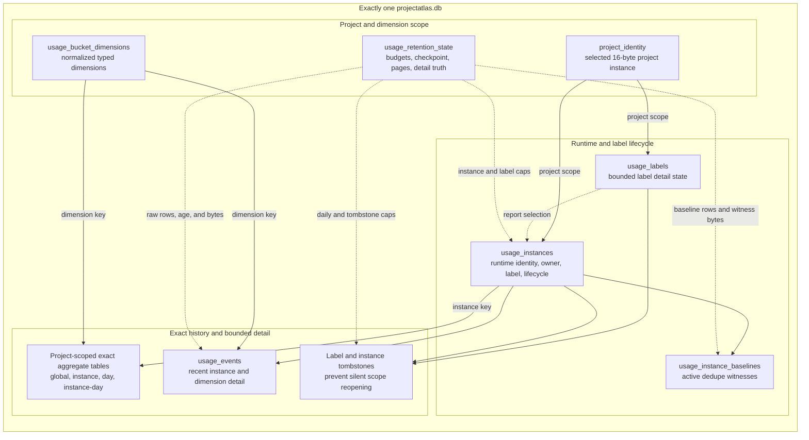
```mermaid
flowchart TB
    subgraph Database[Exactly one projectatlas.db]
        direction TB
        subgraph Scope[Project and dimension scope]
            direction LR
            Project[project_identity<br/>selected 16-byte project instance]
            Dimensions[usage_bucket_dimensions<br/>normalized typed dimensions]
            Retention[usage_retention_state<br/>budgets, checkpoint, pages, detail truth]
        end
        subgraph Lifecycle[Runtime and label lifecycle]
            direction LR
            Labels[usage_labels<br/>bounded label detail state]
            Instances[usage_instances<br/>runtime identity, owner, label, lifecycle]
            Baselines[usage_instance_baselines<br/>active dedupe witnesses]
        end
        subgraph Measurement[Exact history and bounded detail]
            direction LR
            Exact[Project-scoped exact aggregate tables<br/>global, instance, day, instance-day]
            Events[usage_events<br/>recent instance and dimension detail]
            Tombstones[Label and instance tombstones<br/>prevent silent scope reopening]
        end

        Project -->|project scope| Instances
        Project -->|project scope| Labels
        Dimensions -->|dimension key| Exact
        Instances -->|instance key| Exact
        Instances --> Baselines
        Instances --> Events
        Dimensions -->|dimension key| Events
        Labels -. report selection .-> Instances
        Labels --> Tombstones
        Instances --> Tombstones
        Retention -. instance and label caps .-> Instances
        Retention -. baseline rows and witness bytes .-> Baselines
        Retention -. raw rows, age, and bytes .-> Events
        Retention -. daily and tombstone caps .-> Tombstones
    end
```

Exact aggregates and retained raw detail are deliberately separate. Pruning an
event cannot subtract history from the all-time aggregate authority, while
active baseline witnesses remain bounded state that can disappear only through
the explicit seal/expiry contract.

#### Telemetry Retention

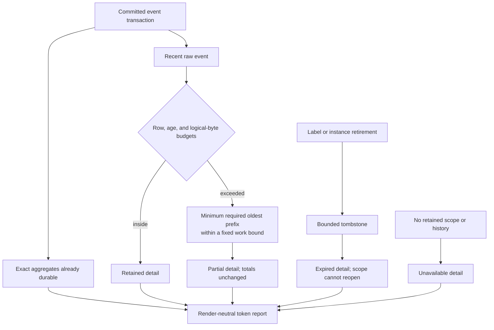
```mermaid
flowchart TB
    EventTx[Committed event transaction] --> Exact[Exact aggregates already durable]
    EventTx --> Raw[Recent raw event]
    Raw --> Bound{Row, age, and logical-byte budgets}
    Bound -->|inside| Retained[Retained detail]
    Bound -->|exceeded| Compact[Minimum required oldest prefix<br/>within a fixed work bound]
    Compact --> Partial[Partial detail; totals unchanged]
    Retire[Label or instance retirement] --> Tombstone[Bounded tombstone]
    Tombstone --> Expired[Expired detail; scope cannot reopen]
    Missing[No retained scope or history] --> Unavailable[Unavailable detail]
    Exact --> Report[Render-neutral token report]
    Retained --> Report
    Partial --> Report
    Expired --> Report
    Unavailable --> Report
```

The internal identity, not the optional label, owns deduplication. A CLI
invocation seals atomically with its final event. One MCP process retains one
current identity per bounded exact project binding, so capacity or contention
in one local source database cannot rotate or serialize telemetry in another.
Reusing a public label after retirement creates a new identity and cannot
silently reopen discarded baseline witnesses.

#### Runtime Instance Lifecycle

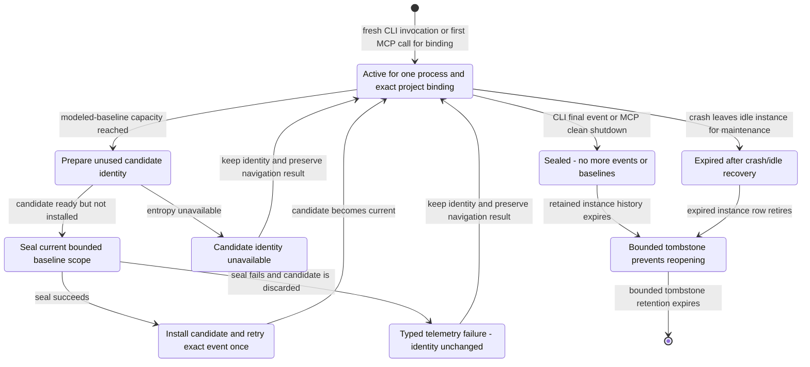
```mermaid
stateDiagram-v2
    state "Active for one process and exact project binding" as Active
    state "Prepare unused candidate identity" as Prepare
    state "Seal current bounded baseline scope" as Rotate
    state "Install candidate and retry exact event once" as Replace
    state "Candidate identity unavailable" as CandidateFailed
    state "Typed telemetry failure - identity unchanged" as SealFailed
    state "Sealed - no more events or baselines" as Sealed
    state "Expired after crash/idle recovery" as Expired
    state "Bounded tombstone prevents reopening" as Tombstone
    [*] --> Active: fresh CLI invocation or first MCP call for binding
    Active --> Prepare: modeled-baseline capacity reached
    Prepare --> CandidateFailed: entropy unavailable
    CandidateFailed --> Active: keep identity and preserve navigation result
    Prepare --> Rotate: candidate ready but not installed
    Rotate --> Replace: seal succeeds
    Replace --> Active: candidate becomes current
    Rotate --> SealFailed: seal fails and candidate is discarded
    SealFailed --> Active: keep identity and preserve navigation result
    Active --> Sealed: CLI final event or MCP clean shutdown
    Active --> Expired: crash leaves idle instance for maintenance
    Sealed --> Tombstone: retained instance history expires
    Expired --> Tombstone: expired instance row retires
    Tombstone --> [*]: bounded tombstone retention expires
```

Every new CLI invocation receives a fresh identity, while an MCP process
creates one fresh identity when it first records telemetry for an exact project
binding. Baseline capacity seals and replaces only that binding's current
identity. It prepares an unused candidate first so entropy failure cannot seal
the current scope, then installs that candidate only after the current identity
seals successfully. The bounded registry lock is not held during SQLite work,
and a per-binding lock keeps concurrent projects independent. Clean MCP shutdown
seals each current bounded entry; a crash relies on idle expiry instead. A later
process never revives a sealed, expired, or tombstoned identity.

#### Telemetry Event Transaction

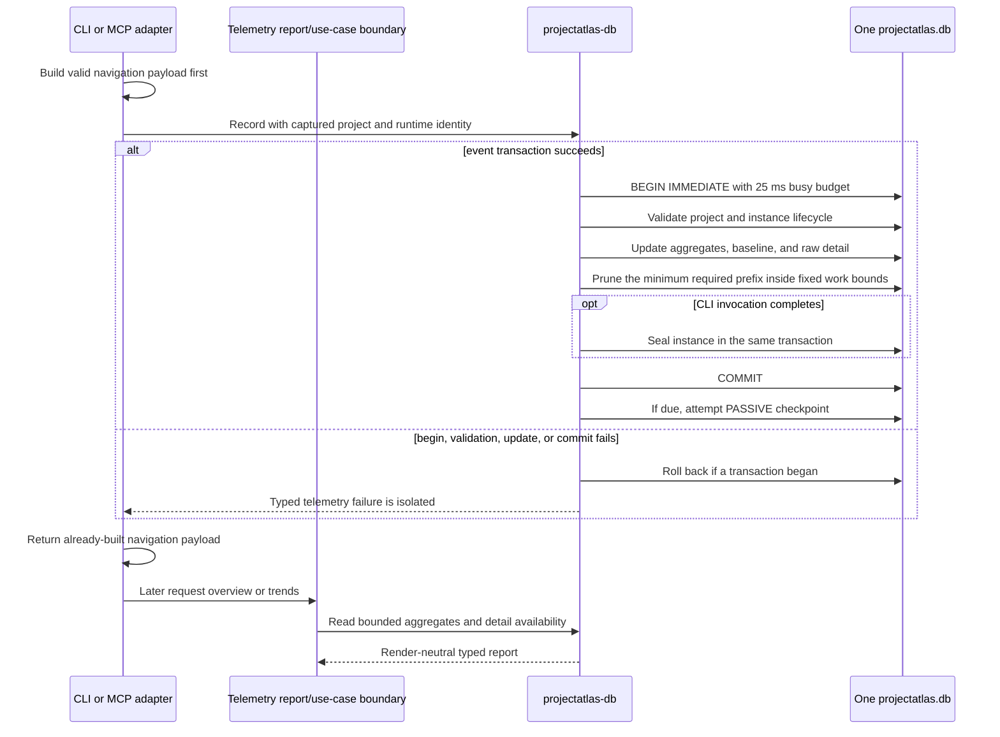
```mermaid
sequenceDiagram
    participant Adapter as CLI or MCP adapter
    participant Service as Telemetry report/use-case boundary
    participant Store as projectatlas-db
    participant SQLite as One projectatlas.db
    Adapter->>Adapter: Build valid navigation payload first
    Adapter->>Store: Record with captured project and runtime identity
    alt event transaction succeeds
        Store->>SQLite: BEGIN IMMEDIATE with 25 ms busy budget
        Store->>SQLite: Validate project and instance lifecycle
        Store->>SQLite: Update aggregates, baseline, and raw detail
        Store->>SQLite: Prune the minimum required prefix inside fixed work bounds
        opt CLI invocation completes
            Store->>SQLite: Seal instance in the same transaction
        end
        Store->>SQLite: COMMIT
        Store->>SQLite: If due, attempt PASSIVE checkpoint
    else begin, validation, update, or commit fails
        Store->>SQLite: Roll back if a transaction began
        Store-->>Adapter: Typed telemetry failure is isolated
    end
    Adapter->>Adapter: Return already-built navigation payload
    Adapter->>Service: Later request overview or trends
    Service->>Store: Read bounded aggregates and detail availability
    Store-->>Service: Render-neutral typed report
```

#### Pages, WAL, And Planner Maintenance

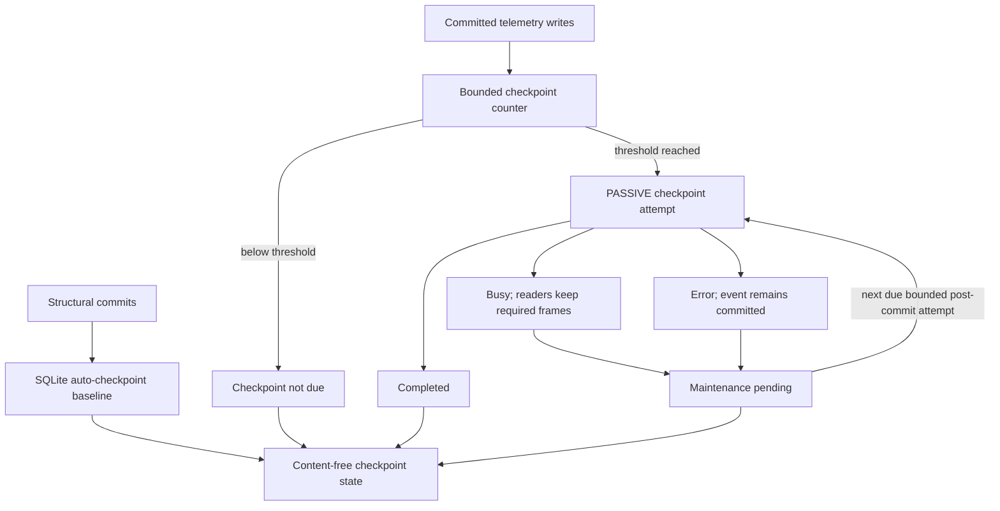
```mermaid
flowchart TB
    Structural[Structural commits] --> Auto[SQLite auto-checkpoint baseline]
    Auto --> State[Content-free checkpoint state]
    Commit[Committed telemetry writes] --> Counter[Bounded checkpoint counter]
    Counter -->|below threshold| NotDue[Checkpoint not due]
    NotDue --> State
    Counter -->|threshold reached| Passive[PASSIVE checkpoint attempt]
    Passive --> Completed[Completed]
    Passive --> Busy[Busy; readers keep required frames]
    Passive --> Error[Error; event remains committed]
    Busy --> Pending[Maintenance pending]
    Error --> Pending
    Pending -->|next due bounded post-commit attempt| Passive
    Completed --> State
    Pending --> State
```

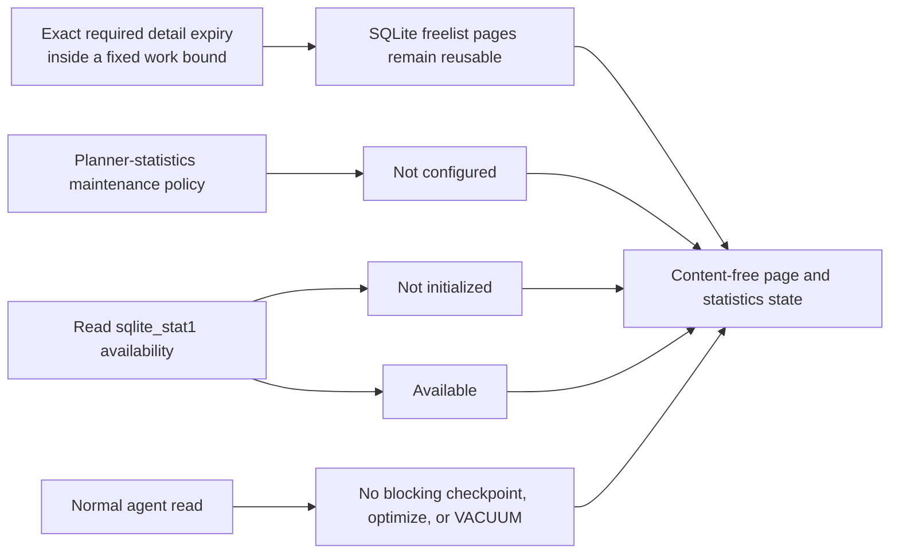
```mermaid
flowchart LR
    Delete[Exact required detail expiry<br/>inside a fixed work bound] --> Reuse[SQLite freelist pages remain reusable]
    Reuse --> State[Content-free page and statistics state]
    Policy[Planner-statistics maintenance policy] --> NotConfigured[Not configured]
    NotConfigured --> State
    Stats[Read sqlite_stat1 availability] --> NotInitialized[Not initialized]
    Stats --> Available[Available]
    NotInitialized --> State
    Available --> State
    Normal[Normal agent read] --> NoReclaim[No blocking checkpoint, optimize, or VACUUM]
    NoReclaim --> State
```

#### Derived Rows And Disposable Staging

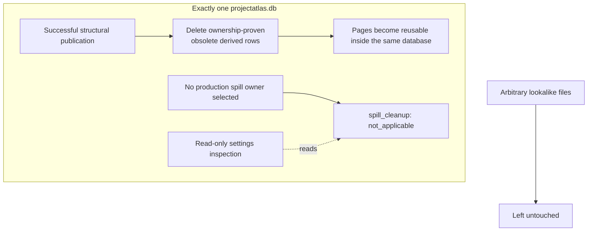
```mermaid
flowchart TB
    subgraph Database[Exactly one projectatlas.db]
        Publish[Successful structural publication] --> Obsolete[Delete ownership-proven<br/>obsolete derived rows]
        Obsolete --> Reuse[Pages become reusable inside the same database]
        NoSpill[No production spill owner selected] --> State[spill_cleanup: not_applicable]
        Settings[Read-only settings inspection] -. reads .-> State
    end
    Lookalike[Arbitrary lookalike files] --> Untouched[Left untouched]
```

The current schema 15 implements this bounded lifecycle in the one authoritative database.
The normal read path never performs an unbounded purge, blocking truncate
checkpoint, blind `VACUUM`, or destructive rebuild. Telemetry compaction
preserves supported all-time totals and declared trend windows; retained,
partial, expired, and unavailable detail are reported rather than fabricated.
No production spill owner currently exists, so restart maintenance reports
`not_applicable` and never deletes arbitrary lookalike files. Derived cleanup
never deletes project identity, reviewed purposes, health resolutions, or
future separately capped Memory Atlas records.

### Index Publication Cancellation, Failure, And Watch Retry

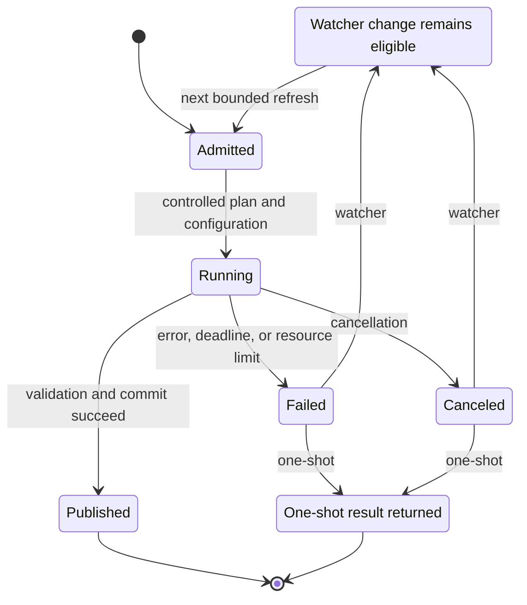
```mermaid
stateDiagram-v2
    state "Watcher change remains eligible" as Unacknowledged
    state "One-shot result returned" as Reported
    [*] --> Admitted
    Admitted --> Running: controlled plan and configuration
    Running --> Published: validation and commit succeed
    Running --> Failed: error, deadline, or resource limit
    Running --> Canceled: cancellation
    Failed --> Unacknowledged: watcher
    Canceled --> Unacknowledged: watcher
    Unacknowledged --> Admitted: next bounded refresh
    Published --> [*]
    Failed --> Reported: one-shot
    Canceled --> Reported: one-shot
    Reported --> [*]
```

Readers continue using the last complete generation while work runs or fails.
Watcher failure does not create a hidden in-process retry loop; the unchanged
local mismatch stays eligible for a later read, watch, or explicit bounded
retry. Independent project databases progress independently; ProjectAtlas does
not serialize them behind one process-global indexing lock.

## Interface Strategy: Core First, CLI And MCP As Adapters

ProjectAtlas 3 must not put product logic inside MCP handlers or CLI argument
parsing. The core engine owns scanning, indexing, querying, health checks, lint,
and usage telemetry. Interfaces call the same core APIs.

Recommended layers:

```text
projectatlas-core
  owns domain models and service traits

projectatlas-db/projectatlas-fs/projectatlas-service/projectatlas-symbols
  implement storage, scanning, shared query services, and parsing

projectatlas-cli
  human and CI command adapter plus shared runtime orchestration module

projectatlas-cli::mcp
  current agent/harness adapter over the same runtime module

future adapters
  language server, daemon, or editor extensions only when separately justified
```

CLI is the best first implementation target because it is deterministic, easy
to test in CI, and useful for humans. MCP is the right agent integration surface
because Codex, Claude Code, OpenCode, and other tools can call it without
screen-scraping CLI output. A later daemon/watch mode may improve latency for
large repos, but it should still call the same core services.

Decision:

- build the core engine first
- expose CLI first for verification and CI
- expose MCP next for coding harnesses
- optionally add a long-running daemon later for watcher/performance
- keep command names and MCP tools semantically aligned

This avoids a false choice between MCP and CLI. ProjectAtlas needs both, but
neither should be the architecture.

## Naming Convention

ProjectAtlas 3 names must read as ProjectAtlas, not as a port of another
indexing tool. Public and semi-public surfaces use atlas/funnel vocabulary:

- CLI nouns: `scan`, `overview`, `folders`, `files`, `summary`, `outline`,
  `slice`, `symbols`, `health-check`, `lint`, `token`.
- MCP tools: `atlas_set_project_path`, `atlas_scan`, `atlas_overview`,
  `atlas_folders`, `atlas_files`, `atlas_outline`, `atlas_file_summary`,
  `atlas_search`, `atlas_slice`,
  `atlas_symbols_build`, `atlas_symbols`, `atlas_symbol_relations`,
  `atlas_health`, `atlas_health_resolve`, `atlas_token_report`,
  `atlas_settings`, `atlas_watch_status`, `atlas_watch_once`,
  `atlas_strip_legacy_purpose`, `atlas_reset_index`, `atlas_purpose_queue`,
  `atlas_purpose_set`, and `atlas_purpose_review`.
- Crates/modules: `projectatlas-cli` (CLI, MCP adapters, and runtime
  orchestration), `projectatlas-core`, `projectatlas-db`, `projectatlas-fs`,
  `projectatlas-lints`, `projectatlas-service`, and `projectatlas-symbols`.
- Avoid names copied from external tools for classes, methods, structs,
  modules, commands, or MCP tools.

Compatibility can be documented as behavior coverage, but implementation and
API names remain ProjectAtlas-native.

## Database Model

The schema is owned in one append-only migration sequence by
`projectatlas-db`. The architecture views above describe authority and the
normalized graph model; the schema source remains authoritative for exact DDL.
The durable responsibilities and access paths are:

| Responsibility | Principal physical state | Authority and primary access | Current/target state |
| --- | --- | --- | --- |
| Compatibility and publication | `metadata`, `project_identity` | Durable schema/root/contract identity; read-only preflight, migration, root transition, and active-generation lookup. | Schema 15 is current and retains one append-only migration owner. |
| Local structure | `nodes`, `summaries`, `file_texts`, `file_text_fts`, `source_parse_metadata` | Rebuildable exact path/parent/kind, authoritative persisted text, a trigger-free rebuildable FTS5 trigram candidate projection keyed by `file_texts.rowid`, summary, hash, source-parse provenance, and independently persisted fact-graph parser provenance. | Parser-provenance separation introduced in schema 13 remains authoritative in schema 15; parser/provider discovery uses `(source_parser, path)` and `(fact_parser, path)` indexes without duplicating provenance into coverage rows. FTS mutation, revision publication, and backfill share the authoritative text transaction; revision drift disables acceleration and never replaces exact fallback semantics. |
| Purpose | `purposes` joined to `nodes` plus an authored-purpose revision | Generated/suggested versus agent/approved lifecycle; accepted path-owned responsibility remains authored across derived changes and is projected by exact owning path or nearest applicable folder. | Schema 15 preserves accepted purposes without hash-driven invalidation and normalizes legacy stale rows; tasks 5.5 and 5.7 add further bounded projection and cursor revision binding. |
| Compatible code facts | `symbols`, `symbol_relations` | Rebuildable file-level symbol and relation calls. | Current; co-published from the same typed extraction result as normalized graph facts. |
| Normalized graph | `graph_entities`, `graph_relations`, `graph_relation_occurrences`, `graph_coverage`, `graph_resolution_keys`, `graph_entity_exports`, `graph_relation_dependencies` | Rebuildable stable identity, source/target adjacency, occurrences, coverage, and dependency-key closure. | Schema 14 adds state/reason coverage-discovery indexes to the existing scope/path/relation indexes; one-hop persistence, dependency-aware invalidation, conservative fact provenance, clean-scan convergence, and bounded coverage discovery are current. Tasks 5.5 and 5.7 add richer hydration, traversal, cursors, and aggregate budgets. |
| Health resolution | `health_resolutions` | Authored exact finding disposition. | Current and preserved across derived publication. |
| Usage measurement | `usage_instances`, `usage_bucket_dimensions`, `usage_instance_baselines`, `usage_labels`, exact global/instance/day aggregate tables, bounded `usage_events`, retention state, and label/instance tombstones | Internal runtime lifecycle, active modeled-baseline witnesses, exact durable totals/trends, recent optional detail, and content-free maintenance truth. Source rows are project-scoped; indexes own label/state/age and raw instance/time access. | Introduced by schema 11 and preserved by schema 15; every detail dimension is bounded independently, supported totals remain exact after pruning, and retained/partial/expired/unavailable detail is reported without a second database. |
| Future Memory Atlas | #314-owned tables | Separately capped authored context and independent context revision. | Conceptual boundary only; #308 does not prebuild its schema. |

Legacy symbol rows and normalized graph rows are compatible co-published
projections from one typed extraction result. Neither projection is the source
of truth for the other, and neither owns reviewed purpose text.

The validated SQLite operating profile is explicit:

| Concern | Current live state | Accepted target and owner |
| --- | --- | --- |
| Schema | Version 15 with append-only 8 to 9 to 10 to 11 to 12 to 13 to 14 to 15 migration ownership; 10 to 11 streams telemetry into normalized instances, dimensions, aggregates, raw detail, and retention state, 11 to 12 adds dependency-resolution keys and normalizes the accepted-purpose lifecycle, 12 to 13 records parser provenance and parser-failure state in one migration transaction, 13 to 14 adds the four bounded coverage-discovery indexes, and 14 to 15 adds and transactionally rebuilds the trigger-free FTS5 candidate projection plus its source/projection revision metadata. | Keep one append-only owner; migration rollback preserves the complete predecessor for deterministic retry, and incompatible future state is refused without mutation. |
| Rust/SQLite build | Workspace `rusqlite` 0.32.1, `libsqlite3-sys` 0.30.1, bundled SQLite 3.46.0. | Settings reports the actual linked runtime version and a bounded compile-option identity; source package versions alone are not runtime proof. |
| Filesystem | One project-local database on a filesystem with supported SQLite locking/shared-memory behavior; writable preflight returns typed supported, unsupported, or uncertain state before mutation. | Keep rejecting unsupported or uncertain live network filesystems without a silent durability downgrade. |
| Writable connections | `foreign_keys=ON`, WAL, `synchronous=FULL`, one-second busy timeout with bounded WAL-establishment retry for concurrent validated openers. | The accepted mixed authored/derived durability profile is enforced and verified on production writable paths. |
| Read connections | Read-only open, verified `query_only=ON`, verified one-second busy timeout, validated WAL, deferred read snapshot. | Complete-generation snapshots and bounded busy/corruption propagation are enforced through production read paths. |
| Checkpoints/statistics | SQLite auto-checkpoint for structural work plus a bounded post-commit `PASSIVE` checkpoint attempt after the configured telemetry-write interval; content-free state reports the live auto-checkpoint threshold, outcome, pending work, page/freelist counts, and that no explicit planner-statistics maintenance policy is currently configured. | Task 7.4 measures representative WAL growth, long readers, plans, page reuse/reclaim, and whether an explicit bounded statistics lifecycle is justified; normal reads never run blocking reclaim or optimization. |
| Backup/recovery | Preflight and transaction rollback exist; live-file copying is not accepted as backup. | Task 6.4 uses the SQLite backup API plus bounded isolated import validation without replacing destination identity. |

Before any parent directory or database file is created, ProjectAtlas inspects
the exact existing database or nearest existing parent, resolves its canonical
mount/device/filesystem profile, and rejects unsupported or uncertain state.
It fingerprints that content-free location state and re-resolves it immediately
before `SQLite` opens the connection. A privileged or adversarial local process
that replaces a path or mount in the remaining OS-level interval between that
revalidation and `SQLite`'s own open is outside the supported cooperative local
user/process contract. ProjectAtlas does not add unsafe handle manipulation, a
custom VFS, or another database to close that narrow race. If hostile local
path/mount replacement becomes an accepted trust boundary, the engine/VFS
decision must be reopened with platform-specific safe-handle evidence.

Hot predicates, joins, ordering, and constraints use typed columns. JSON/TOON is
an adapter format, not a graph persistence shortcut. Inserts reuse cached
prepared statements and related rows are batched inside the caller-owned parent
transaction. Bounded reads request `limit + 1` where necessary to report
truncation without counting or loading the entire result set. Row-conversion,
I/O, schema, identity, or corruption failures fail the whole page.

Paged graph output always reports `returned`, `truncated`, continuation state,
and a typed `total_state` of `exact`, `at_least`, or `unknown`. `total` is
present only when it is already known, the bounded page proves the complete
cardinality, or it can be computed within the same declared statement, row,
time, and cancellation budget. A high-degree adjacency page therefore reports
at least `limit + 1` after the sentinel row instead of running an unbounded
count solely for display metadata. Existing compatible surfaces may retain an
established exact file-local total where that count remains within their owning
query bound.

The database test boundary is real SQLite, not a mocked repository. Owning tests
create a test-only temporary project database, migrate/open it through the
production API, write
through publication/purpose operations, read or reopen through production query
APIs, and inspect stable plan properties where a scan would be a regression.
Risk-specific cases add rollback, read snapshots, busy/concurrent access,
corruption, WAL/reopen, backup/import, and huge-cardinality checks.

Purpose status values:

- `missing`: path exists but no purpose is known
- `suggested`: deterministic or heuristic purpose text exists but is not accepted
- `approved`: an explicit agent workflow approved the purpose after inspection
- `stale`: legacy readable compatibility value; v0.4 does not create it from source changes

Scan reconciliation preserves accepted purpose text and approval across source,
hash, symbol, summary, graph, generation, watch, and publication changes.
Automation may refresh an unapproved generated suggestion but never demotes,
invalidates, overwrites, or silently revises an accepted purpose. A main agent,
reviewer, explicitly assigned curator, or user can correct accepted intent
through the existing purpose APIs when it is wrong or genuinely repurposed.
Deleted or excluded paths are inactive while their path-owned accepted purpose
remains dormant; exact-path recreation may reactivate it, while rename may seed
only a new suggestion and never transfers approval automatically. The next
append-only migration normalizes legacy hash-invalidated `stale` rows back to
`approved` without changing text or provenance.

## Indexing Behavior Parity Map

Modern repository intelligence tools provide useful behavior that ProjectAtlas
3 should cover with a Rust-native implementation. The external behavior surface
tracked for parity includes:

- workspace selection
- shallow index refresh
- deep symbol graph indexing with worker and timeout controls
- file discovery with pattern filters
- code search with literal, fuzzy, regex, pagination, context-line, and file
  filters
- file outline and summary retrieval
- symbol or range slice retrieval
- settings and cache introspection
- temporary workspace/cache management
- search-tool refresh
- watcher status and watcher configuration
- file content resource access
- all-language file type recognition across the full parity extension set

ProjectAtlas 3 must provide equivalent or better native functionality for this
surface before a 3.0 stable release. This is behavior parity, not source or
identifier parity. During development, each item is tracked as
one of:

- `planned`
- `implemented`
- `tested`
- `better-than-source`

ProjectAtlas-specific funnel tools are the preferred path:

```text
external concept         ProjectAtlas 3 concept
project selection        atlas_workspace_open
refresh index            atlas_workspace_scan
deep symbol index        atlas_symbols_build
file discovery           atlas_files
code search              atlas_search
structured file summary  atlas_file_summary
compressed outline       atlas_outline
symbol body              atlas_slice
file watcher             atlas_watch
```

Required parity outcomes:

- shallow file discovery works without deep symbol indexing
- all parity-set languages/file families are recognized during shallow indexing
- deep symbol indexing supports the specialized language set
- fallback indexing covers broad file types
- search supports literal matching, fuzzy matching, regex where safe,
  repository glob filters, pagination, context lines, early-stop behavior, and
  returned/scanned/truncated telemetry
- folder/file navigation uses bounded SQL ranking and exact repository glob
  filtering rather than loading the complete node table for every agent query
- summaries include language, line count, imports, exports, symbols, docstrings,
  and complexity signals where available
- symbol body/slice retrieval avoids full-file reads and rejects ambiguous
  duplicate names until the agent supplies parent, kind, or line disambiguation
- watcher/index refresh behavior is deterministic
- settings and cache locations are explicit and inspectable
- local runtime index/cache cleanup is explicit through dry-run/apply reset
  commands instead of ad hoc file deletion
- project context can be switched safely between repositories
- folder purpose, file purpose, source summary, symbols, search, and slices are
  all served from ProjectAtlas-native data and command names

## Language Support Strategy

Version 0.4 treats the complete 0.3.26 language surface as a compatibility
floor, not as scaffolding to replace. Its deterministic extension and special
filename detection, closed built-in Tree-sitter choices, manifest extraction,
structural summaries, conservative fallback visibility, persisted parser truth,
empty-native-parse behavior, offline operation, and no-repository-execution
boundary remain required behavior.

One versioned, typed Rust registry is the authority for canonical language IDs,
aliases, exact filenames, compound extensions, ordinary extensions, bounded
content/dialect rules, parser and structural-adapter ownership, optional-pack
ownership, fixtures, provenance/licenses, platform applicability, and accepted
minimums. A local declarative manifest generates static projections for detector
dispatch, settings, tests, documentation, and the publication-contract digest.
The database stores canonical detected IDs and actual parse metadata, but it does
not become a second registry authority.

The checked-in [language support matrix](language-support.md) is generated from
that same registry and is byte-for-byte verified in tests. It is the public source
for capability totals, tier distinctions, detector rules, parser ownership, and
catalog provenance; architecture prose does not maintain a second set of counts.
Ordinary CLI/MCP settings return only the content-free registry and accepted-set
versions and digests, derived per-axis counts, and pinned optional-catalog identity.
They deliberately do not inline the complete per-language matrix into routine agent
context; the generated document remains the complete bounded-by-artifact view.

The `projectatlas-core` support catalog module owns one versioned complete-support
schema with fixed ProjectAtlas navigation
contracts for `language`, `dialect`, `domain_format`, and
`framework_projection` rows. Presentation categories and tags remain separate.
`Complete` means that the row satisfies the applicable ProjectAtlas navigation
contract; it does not claim compiler, build-system, runtime, or whole-language
completeness. The schema—not each row—requires machine-checkable detection and
dialect evidence, grammar and malformed behavior, facts, non-empty applicable
relation families, exact occurrences, typed resolution outcomes, owning unit and
integration fixtures, SQLite publication/reopen/incremental convergence,
representative repository measurements, and bounded agent-navigation evidence.
A slot is `not_applicable` only through a typed schema-admitted reason that an
independent reviewer accepts.

Framework projections bind their exact host language or dialect and never
increase language or parser totals. A common extension does not prove a dialect
without explicit bounded evidence. Planned and unavailable families live only in
a documentation catalog projection from the same declarative source; they never
become runtime registry or accepted-capability ghost rows and contribute to no
capability total. Candidate profiles remain at their achieved runtime tiers until
the final MCP relation/navigation surface and representative agent workflow pass.

The generated public language-and-ecosystem sections extend the existing
`language-support.md` authority and groups its rows into stable
user-facing sections such as backend, frontend/web, systems, mobile,
data/scientific, enterprise/legacy modernization, database/query, infrastructure/cloud,
build/config/template, and testing frameworks. It keeps language, dialect,
domain-format, and framework-aware counts distinct, explains the
detection-to-navigation pipeline and ProjectAtlas's architectural advantages.
The Pages workflow builds an HTML projection derived from the same catalog identity
and the core tests verify its landing-page link. Canonical Mermaid source remains in
GitHub-rendered Markdown; Pages embeds a reviewed SVG or links directly to that
source and the full system/component, crate-ownership, database-authority,
graph-physical-model, bounded-read, MCP-read, and publication views. No
handwritten page or README table becomes a competing capability authority.

A modernization tag highlights source families where exact dependency and
source-evidence navigation is especially valuable for high-risk transformation
work. It does not claim automatic translation, infer a target language, or
promote a partially supported source family to complete support.

Capability is reported on independent axes:

1. detected
2. parsed
3. symbols
4. semantic resolution
5. benchmarked

Aliases, extensions, dialect names, and reused grammars never count as additional
parser or semantic capability. Detection-only and conservative-fallback rows
remain valuable because they keep files discoverable, purpose-addressable,
searchable, and summary-addressable, but they are not described as grammar-backed
symbol support. Grammar-backed parsing does not imply cross-file semantic
resolution, and a correctness fixture does not imply representative benchmark
coverage.

Built-in grammars remain closed compile-time Rust choices in
`projectatlas-symbols`. The registry owns their closed parser-owner enum; the
symbols crate owns one exhaustive binding from that enum to concrete grammar
dependencies. Structural summary implementations remain in the CLI/runtime
boundary behind the same registry-owned selection. This preserves the public
symbol-extraction API and the language-specific Kotlin, Objective-C, Zig, and
C-family augmentation modules without duplicating capability policy.

Language expansion is reuse-first. ProjectAtlas pins a maintained,
license-compatible Tree-sitter grammar and reuses its generated parser,
`node-types.json`, and trustworthy standard query assets such as `tags.scm` and
`locals.scm` before adding local machinery. ProjectAtlas-owned bounded queries
fill missing fact extraction, while concrete Rust providers retain ownership of
language-specific scope, dialect, package/module, and cross-file resolution. A
new or forked grammar is a documented last resort with explicit provenance,
maintenance, compatibility, and fixture obligations. Grammar availability alone
never promotes symbol, relation, semantic, benchmark, or complete support.

Semantic resolution uses the same closed registry boundary. Rust, ECMAScript,
Python, and Cargo are concrete provider modules, not dynamic plugins or trait
objects. Provider ownership and resolution-family identity are separate: the
`ecma-script` owner, for example, resolves JavaScript, TypeScript, and TSX in one
`ecmascript` family. Imports target modules, calls target declarations, and Cargo
dependencies target packages. Provider code computes exact caller-relative scopes
and abstains on unsupported bare-package, nested, malformed, or ambiguous compact
syntax instead of falling back to basenames or display labels.

The normalized resolution flow remains hybrid:

```text
registry-selected Rust provider normalization
→ canonical entity exports and relation dependency keys
→ SQLite indexed candidate discovery
→ bounded Rust candidate merge and closed resolution decision
→ one atomic SQLite publication generation
```

The temporary Rust registry owns each candidate entity once by stable digest and
keeps only sorted digest sets under canonical keys. Rust observes cancellation and
retained-byte limits while combining those sets, resolves exact same-file calls
before project-wide candidates, and classifies an external target only from an
explicit provider-owned namespace such as `node:`, `std`/`core`/`alloc`, or an
absent Cargo package. SQLite remains the durable owner of exports, dependency keys,
resolution states, reverse affected-source lookups, and generations.

Embedded HTML-like, component, and template hosts use at most two same-length
ECMAScript projection buffers and a fixed script-region cap, so admitted byte and
line positions remain host-relative. Safe earlier regions survive a malformed or
over-limit later region. HTML retains outbound embedded facts but is never promoted
to an ordinary JavaScript module; Vue and Svelte expose module identity only after
an admitted exported embedded declaration. Their structural/fallback host
provenance keeps relationship coverage conservatively partial or failed. A semantic
key-contract change advances the derivation fingerprint and forces a complete
derived-state refresh rather than mixing old and new keys.

### Optional Parser Pack

Broader native grammar coverage belongs to one explicit optional-pack lifecycle.
One ProjectAtlas-owned, separately packaged parser-worker executable remains inside
the existing seven-crate workspace. The `projectatlas-cli` runtime supervises one
global broker-owned grammar-affined worker session for v0.4.0: Linux launches the
worker directly, while Windows launches one artifact-bound responsibility-specific
containment broker that owns exactly one worker grandchild and its Job Object. The
session loads one manifest-approved grammar at a time, groups work by grammar and
path, and restarts the worker when its grammar changes or its state becomes
unhealthy. The worker accepts only bounded raw source
bytes for that language; repository paths, commands, compilers, builds, environment
blocks, URLs, and network requests are outside the protocol. Bounded Rust owns
strict framing, existing task admission, deadlines, session-bound monotonically
sequenced progress, no-progress and aggregate resource limits, cancellation,
exactly-once termination, pipe draining, reaping, thread joining, and typed failure
before SQLite writer acquisition. Progress can reset only the no-progress timer,
never the absolute deadline. The first supervisor control is one strict `SessionOpen`
containing only protocol version plus fresh process-session entropy. READY must bind
that exact session to the independently observed artifact and installed containment
kind; every later request and response remains session-bound and rejects replay.

This is one concrete `projectatlas-cli` supervisor, not separate runtime and release
implementations. Normal staging and a CLI-owned fresh-artifact verifier reuse its
same bounded writer, frame reader, admission/stderr reader, platform launch, deadline,
cancellation, and cleanup path. `projectatlas-core` continues to own only the closed
artifact/protocol facts and validation. Keeping the verifier at the process-owning
CLI boundary prevents a weaker direct-worker release path without adding a crate,
trait hierarchy, or second executor.

Artifact verification, install, update, and enable all run that shared supervisor
against the exact packaged worker before publishing a slot or selected-pack state.
Admission executes every accepted grammar's positive and negative fixture pair,
with a per-grammar deadline and one aggregate admission deadline. Any artifact,
fixture, protocol, deadline, containment, or cleanup failure leaves the prior
lifecycle selection byte-for-byte unchanged.

On Windows, a temporary admission explicitly owns the artifact-global AppContainer
profile and its pack-root grant. Verify-only and every pre-publication failure make
one bounded explicit cleanup attempt while the extraction and exact broker still
exist; a failed attempt fails the operation and receives one best-effort retry during
unwind. A successful atomic slot rename transfers cleanup ownership immediately to
the installed lifecycle. The exclusive pack lease prevents temporary verification
from deleting the same profile while an installed worker is active. The fresh release
verifier uses the same owner on its isolated host and writes no proof before cleanup
succeeds. `Drop` never turns cleanup failure into success; normal control flow reports
it and retains both typed causes when the operation also failed.

The OS adapter establishes the boundary before grammar loading. It clears and
allowlists environment plus inherited handles, allows read-only access only to
immutable pack artifacts and exact unavoidable loader/runtime state, denies repository
filesystem reach, child creation/further exec, and network access, installs the
platform memory/process controls, and owns process-group kill/orphan prevention.
Job Objects and cgroups contribute resource control but are not treated as complete
capability sandboxes.

The launch mechanism is proven before runtime integration. The accepted optional-
pack targets are Linux x86-64 and Windows x86-64. On Windows, Rust owns one
artifact-bound containment broker as its direct child. The broker creates exactly
one LPAC worker suspended with zero capabilities and only the supervisor-created
stdin/stdout/stderr endpoints; attaches a no-breakaway Job Object with active-process
limit one, per-process/job committed-memory ceilings, and kill-on-close; associates
that Job with a completion port before resume; verifies LPAC admission through the
token's effective access rather than undocumented group layout; resumes; and emits
one fixed bounded adapter-local record. The Job's active-process limit is the
child-creation boundary and is self-tested by making the admitted worker the
OS-level parent of a second creation attempt and requiring
`ERROR_NOT_ENOUGH_QUOTA`. Rust validates the admission record before delivering
`SessionOpen`, owns all parser protocol bytes and its direct broker child, and
relies on the broker only for exact worker/job wait and cleanup. A Windows
memory-boundary result is accepted only when the completion port reports the
expected worker's process-memory or Job-memory limit event; an ordinary worker
exit, including the reserved broker status, cannot impersonate that proof.
The empty artifact-scoped AppContainer profile is
bounded unavoidable Windows sandbox state, exposes no repository/user data, and is
removed through the optional-pack lifecycle. Linux artifact construction eagerly
maps and audits the exact allowed system runtime DSOs before `main`. Linux then
starts only the trusted ProjectAtlas worker with exact protocol pipes, one thread,
and no grammar or source payload. That worker installs hard resource/address-space
limits and `no_new_privs`, hard-requires fully enforced Landlock ABI v3 with
read-only access only beneath the immutable pack root, and installs seccomp
process/exec/socket denial before reading `SessionOpen`. A validated READY
is the first acknowledgement that binds the fresh session, artifact, and containment;
the supervisor sends no grammar identity or source bytes before it. Delegated cgroup
v2 improves accounting when available but is not a hidden ordinary-user prerequisite.
Missing primitives fail closed.

The Windows PowerShell surface is release-harness code, not a normal runtime
dependency. Separate scripts remain only where authority changes: pinned input
acquisition, disposable-account construction, runner-Job brokering, runtime LPAC
broker compilation, post-cleanup artifact verification, recovery injection, and
default-runtime measurement. Their diagnostic and verifier scripts are not shipped
in the optional pack. Repeated bounded-process or cleanup plumbing inside the same
authority is maintenance debt, but merging across these boundaries is valid only
when the replacement preserves the existing fault, survivor, and cleanup proofs.

Each platform receipt also runs the exact packaged worker under a deliberately
reduced, schema-validated memory ceiling through the same supervisor and OS adapter.
Linux records either hard cgroup-v2 enforcement or bounded `/proc` sampling with the
interval, observed peak, and overshoot; Windows requires the exact Job completion
event above. Both variants require verified process-tree cleanup. The aggregate
rejects missing, cross-platform, non-exact, internally inconsistent, or unverified
memory evidence rather than accepting a generic child failure as resource control.

The Windows broker is itself one immutable, digest-bound x86-64 PE32+ artifact
payload. Its external runtime contract is the Windows .NET Framework CLR v4 rather
than a hidden bundled runtime. Its native entry point is zero, it carries a validated
72-byte CLR Runtime Header, and its ordinary plus delay-loaded PE import tables are
empty. Construction audits those managed-image facts separately from the compiled P/Invoke surface
(`advapi32.dll`, `kernel32.dll`, and `userenv.dll`). The exact broker is executed
under a cleared environment and hard deadline to report a versioned reflected
module set, method count, and normalized method-identity digest; construction then
re-reads its bytes before recording that evidence. The release verifier requires
the same closed runtime, target, payload digest, CLR header, empty PE import surface,
managed modules, and
bounded evidence. This keeps the native audit honest without moving CLR metadata
parsing into product Rust or creating another crate.

macOS remains a supported ProjectAtlas and default-core parser target. Its supported
App Sandbox model cannot prove the accepted no-child/no-further-exec and immutable-
pack-only filesystem contract, so v0.4.0 ships no macOS optional-pack artifact and
returns typed `unsupported_containment` before worker launch or source transfer.
This narrows only optional native grammar breadth; it does not remove or weaken any
0.3.26 built-in behavior. Failed or unsupported optional parsing never replaces the
last complete SQLite generation or harms the long-lived MCP process.

A successful optional grammar parse strengthens source parse metadata only. Until a
language-specific extractor earns separate evidence, conservative fallback symbols
and relationships keep their fallback fact provenance. Grammar breadth therefore
cannot silently inflate symbol, relation, semantic, or benchmarked claims.

The pack binds the published Cargo archive separately from the release tag and
native assets, then binds exact capability rows, per-grammar provenance, individual
digests, exact grammar-subtree license text, ABI/export identity, forbidden-import
evidence, and accepted optional-pack targets. Version 0.4 deterministically
repackages the exact pinned Linux x86-64 and Windows x86-64 native bundles and builds
a worker with zero embedded grammars. This keeps exact upstream library bytes while
avoiding repeated source builds that add no capability evidence.

One logical pack has two platform artifacts with byte-identical accepted-manifest
and fixture-corpus inputs and exactly the same 150 selected libraries. Each immutable
artifact carries a payload/construction manifest; a separate fresh-runner receipt
binds the completed archive and proves extraction bounds, individual digests, native
loading, ABI, and both fixtures. Aggregation accepts only the exact Linux/Windows
artifact set with one logical digest and the same 150 successes. The construction
contract places each artifact under the declared package and expanded-size bounds;
the exact-candidate hosted measurement receipts decide whether one artifact per
target remains justified or a measured ceiling requires the split decision to be
reopened.

Construction after dependency and asset acquisition is physically network-denied in
addition to Cargo and dependency offline flags. Linux construction runs in a network
namespace. Windows construction runs as a disposable non-administrator principal
under an exact SID-scoped outbound Windows Firewall block. A hosted Windows runner
can place the workflow process in an immutable ambient Job, so the workflow first
uses WMI to start one trusted Job-free broker, authenticates its exact PID, image,
SID, creation identity, and named-pipe peer, and admits it to an ephemeral
runner-SID-owned Job with `KILL_ON_JOB_CLOSE | BREAKAWAY_OK`. Recovery and production
construction both use that same broker implementation. Only after proving membership
in that exact Job may the construction adapter authenticate the disposable principal
and create its process directly from the resulting primary token. The suspended child
intentionally inherits the authenticated broker Job; a direct non-hosted launch instead
requires both parent and child to be Job-free. The adapter validates the exact child
token and parent-Job membership, assigns the child before resume to the stricter
no-breakaway kill-on-close construction Job nested beneath the broker Job, and cleans
it by exact SID. The broker also owns one unique, non-inheritable, one-token Cargo
jobserver semaphore in the shared `Local\` session namespace. Its protected DACL
grants only the disposable token's exact enabled logon SID the synchronize and modify
rights that Cargo and `rustc` require, and its mandatory label prevents lower-integrity
writes. Ambient jobserver state is rejected. The broker retains the only owner handle
until the assigned process tree is reaped and then closes it, so the semaphore cannot
outlive construction. This preserves the one-worker budget without adding broader
named-object or global-namespace permission to the disposable principal. The
hosted-runner broker is trusted CI orchestration and is never
packaged with, or substituted for, the artifact-bound AppContainer broker. This is
the construction egress and lifecycle boundary. Fresh
verification and normal untrusted grammar execution retain the stronger artifact-
bound AppContainer/LPAC boundary described above. When no pack is installed, default
core does not download, compile, link, initialize, or pay binary/startup/resident-
memory cost for optional grammars, and all accepted 0.3.26 behavior remains
available. Version 0.4 does not add a generic multi-pack framework; a split is
reconsidered only if a measured package, installation, or platform ceiling fails.

#### CI Dependency-Layer Reuse And Clean Release Proof

The optional-pack workflow may reuse only sanitized Cargo dependency build state.
An exact key binds the target, Rust and native toolchains, Cargo lockfile and
manifests, and an explicit cache-policy ABI that changes only when reusable artifact
compatibility changes. Whole workflow and diagnostic-script hashes are deliberately
excluded, so unrelated proof improvements do not rebuild unchanged dependencies.
ProjectAtlas source revision is not part of that key because every owned crate is
removed from the restored target before the exact candidate is freshly compiled.
The pinned grammar bundles, constructed archives, candidate binaries, receipts,
ProjectAtlas databases, and workspace state never enter this cache.

Restored trees are untrusted input. Contained construction bounds and validates the
tree, quarantines invalid state without recursive traversal, and falls back to an
empty target. Pull requests can restore but cannot save. A successful trusted
dispatch can save only after every existing construction and verification gate
passes and candidate outputs are removed again. Explicit clean construction bypasses
both actions and remains the final release-acceptance path.

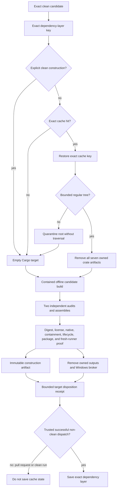
```mermaid
flowchart TB
    Candidate[Exact clean candidate] --> Key[Exact dependency-layer key]
    Dispatch{Explicit clean construction?}
    Key --> Dispatch
    Dispatch -->|yes| Empty[Empty Cargo target]
    Dispatch -->|no| Lookup{Exact cache hit?}
    Lookup -->|yes| Restore[Restore exact cache key]
    Lookup -->|no| Empty
    Restore --> Validate{Bounded regular tree?}
    Validate -->|no| Quarantine[Quarantine root without traversal]
    Quarantine --> Empty
    Validate -->|yes| CleanBefore[Remove all seven owned crate artifacts]
    Empty --> Build
    CleanBefore --> Build[Contained offline candidate build]
    Build --> Assemble[Two independent audits and assemblies]
    Assemble --> Verify[Digest, license, native, containment, lifecycle, package, and fresh-runner proof]
    Verify --> Publish[Immutable construction artifact]
    Verify --> CleanAfter[Remove owned outputs and Windows broker]
    Publish --> Receipt[Bounded target disposition receipt]
    CleanAfter --> Receipt
    Receipt --> Trust{Trusted successful non-clean dispatch?}
    Trust -->|no: pull request or clean run| NoSave[Do not save cache state]
    Trust -->|yes| Save[Save exact dependency layer]
```

```mermaid
sequenceDiagram
    participant R as Hosted runner
    participant J as Owned runner broker Job
    participant W as WMI broker child
    participant T as Fixed recovery or construction target
    participant F as Direct fallback cleanup
    R->>J: Create runner-SID and SYSTEM Job plus protected pipe
    R->>W: Win32_Process.Create with BREAKAWAY_FROM_JOB
    W->>W: Prove initially Job-free and authenticate pipe server
    Note over J,W: Parent death closes the sole long-lived Job handle
    alt Bootstrap fails before Job admission
        W-->>R: Bounded bootstrap failure when possible
        R->>W: Terminate exact retained process handle and reap
    else Exact broker admission succeeds
        W->>J: Verify flags, join exact Job, close child Job handle
        W-->>R: READY with exact PID and target kind
        R->>R: Verify PID, image, SID, start, session, pipe peer, and membership
        R->>W: ADMIT fixed target, bounded parameters, environment, and deadline
        W->>T: Invoke trusted sibling script in-process
        alt Target succeeds
            T-->>W: Bounded output
            W-->>R: Matching result and process exit
            R->>J: Require zero active processes
        else Target, deadline, protocol, or parent-side validation fails
            R->>W: Terminate exact retained process handle
            R->>J: Terminate admitted tree and close kill-on-close Job
        end
    end
    R->>F: Always run exact-state cleanup outside the broker
```

The optional-pack workflow records one bounded, content-free measurement receipt per
accepted target. Each receipt binds the candidate revision, platform target, pinned
toolchain and runtime identity, sample count, and units to the default-core runtime
binary bytes, completed optional-pack archive bytes, median fresh-process `runtime-info`
startup, fresh-process MCP launch through a valid `initialize` response, and idle
initialized MCP process-tree resident memory. It compares the normal default feature
surface with a separately built `--no-default-features` control from the same
candidate, toolchain, target, and host; MCP-ready sample order alternates between the
two profiles. The default-core measurement runs without an installed selection,
keeps MCP stdin open for the observation interval, and fails structurally if a parser
worker or containment broker exists, optional-pack storage is touched, the default
dependency/build surface includes the separately packaged grammar or worker-only
containment dependencies, or a default parser-worker binary is present. The
lifecycle/supervisor control plane remains part of the normal runtime so an
explicitly selected pack can work; it does not embed or link a grammar. Package and
absence assertions are release gates; both startup boundaries and RSS are same-host
distributions with preregistered tolerances, not universal cross-platform constants.

```mermaid
flowchart TB
    Pins[Pinned Cargo and native release identities] --> Accepted[Accepted logical manifest and corpus]
    Bundle[Exact target native bundle] --> Construct[Offline Rust assembler and native audit]
    Worker[Target worker with zero embedded grammars] --> Construct
    LinuxRuntime[Exact eager Linux runtime DSO set] --> Construct
    WinBroker[Artifact-bound Windows containment broker] --> Construct
    Accepted --> Boundary{Construction egress boundary}
    Boundary --> LinuxBoundary[Linux network namespace]
    Boundary --> WindowsRunner[WMI Job-free bootstrap plus authenticated runner broker Job]
    WindowsRunner --> WindowsBoundary[Disposable principal firewall plus no-breakaway construction Job]
    LinuxBoundary --> Construct
    WindowsBoundary --> Construct
    Construct --> Artifact[Immutable target artifact plus payload manifest]
    Artifact --> Fresh[Fresh verifier: archive digest, bounded extraction, native audit]
    Fresh --> Admission[Shared supervisor admits all 150 positive and negative fixture pairs]
    Admission --> Memory[Exact reduced-limit memory and process-tree cleanup probe]
    Memory --> Receipt[Archive-bound platform receipt]
    Receipt --> Aggregate[Require Linux and Windows plus identical 150-row truth]
    Aggregate --> Lifecycle[Eligible for explicit install and enable lifecycle]
    Mac[macOS optional-pack request] --> Unsupported[Typed unsupported_containment; built-ins stay available]
```

Catalog recognition and default scan admission remain separate. The default-core
configuration retains the accepted 0.3.26 source-extension surface; merely knowing
an optional grammar identity does not silently admit data-like or secret-bearing
catalog extensions. While a verified pack is enabled, its accepted manifest adds
only the pack rows that passed provenance, license, fixture, platform, and resource
gates to the effective scan policy.

```mermaid
flowchart TB
    Source[Bounded source bytes] --> Registry[Typed language registry]
    Registry --> BuiltIn[Built-in parser owner]
    Registry --> Fallback[Conservative default-core fallback]
    Registry -. verified and enabled .-> Supervisor[Bounded Rust supervisor]
    Supervisor --> Platform{Accepted optional-pack target}
    Platform -->|Linux| LinuxBoot[Trusted worker; exact pipes; one thread; eager runtime DSOs]
    LinuxBoot --> LinuxContain[Hard limits plus no_new_privs plus Landlock v3 plus seccomp]
    Platform -->|Windows| Broker[Artifact-bound containment broker]
    Broker --> WindowsContain[Suspended LPAC worker; exact handles plus no-breakaway Job and completion port]
    WindowsContain --> Admission[Resume then fixed admission record]
    Admission --> AdmissionGate[Rust validates adapter admission]
    LinuxContain --> Open[Contained worker reads SessionOpen: protocol plus fresh session only]
    AdmissionGate --> Open
    Open --> Ready[Worker emits READY: session plus artifact plus containment]
    Ready --> Gate[Supervisor validates the exact launch]
    Gate --> Request[Grammar identity and bounded raw source now allowed]
    Request --> Validate[Contained worker parses; supervisor validates session-bound result]
    Validate --> ParseMeta[Grammar-backed source parse metadata]
    BuiltIn --> Facts[Symbols and relations with fact provenance]
    Fallback --> Facts
    ParseMeta --> Prepared[Typed publication candidate]
    Facts --> Prepared
    Prepared --> Publish[Atomic SQLite generation publication]
    LinuxContain -. admission failure .-> Preserve[Terminate, reap, join, preserve MCP and previous generation]
    WindowsContain -. admission failure .-> Preserve
    AdmissionGate -. malformed, truncated, or failed .-> Preserve
    Validate -. failure, limit, or cancellation .-> Preserve
```

The affected-platform E2E also suspends the real contained worker during a background
scan. Task status and an ordinary indexed MCP read must remain responsive; task
cancellation must terminate and reap the exact worker/broker subtree; and SQLite must
still expose the previous complete generation with none of the pending source facts.
This proves the optional worker is subordinate to the existing task/runtime owners
rather than becoming a second MCP server, task registry, or publication authority.

Language selection has one testable precedence contract: explicit override,
exact filename, compound extension, ordinary extension, then bounded
content/dialect classification. Existing exact-filename case behavior,
case-insensitive extension behavior, `.d.ts` handling, parser results, and
language baselines remain frozen unless a later explicit compatibility decision
changes them. New breadth is advertised only at the strongest axis supported by
natural positive and negative fixtures; semantic promotion additionally requires
resolved, ambiguous, unresolved, external, malformed, duplicate-name, and
incremental-change evidence.

## CLI Contract

Current CLI:

```bash
projectatlas scan <path>
projectatlas --format json overview
projectatlas folders <query>
projectatlas files [<query>] [--folder <path>] [--file-pattern <glob>]
projectatlas summary <file> --limit 25
projectatlas outline <file>
projectatlas search <pattern> --file-pattern <glob> --context-lines <n>
projectatlas search <pattern> --fuzzy --file-pattern <glob>
projectatlas slice <file> --start-line <n> --end-line <m>
projectatlas symbols list --file <file>
projectatlas symbols relations --file <file>
projectatlas health-check
projectatlas lint --report-untracked --purpose-level low
projectatlas token
```

Additional runtime and migration commands:

```bash
projectatlas mcp
projectatlas watch --once
projectatlas watch
projectatlas settings
projectatlas watch-status
projectatlas mcp-config
projectatlas symbols build --max-workers <n> --timeout-seconds <s>
projectatlas symbols slice <file> <symbol> --symbol-parent <parent>
projectatlas purpose set <path> <purpose>
projectatlas strip-legacy-purpose --dry-run
projectatlas strip-legacy-purpose --apply
```

Structured file summaries are part of the hot path for agents and large
repositories, so they must stay bounded by design:

- repeated sections load at most the requested `--limit`
- totals come from exact SQLite count queries, not full in-memory
  materialization
- caller lookup uses batched exact target matching, never suffix scans on the
  hot path
- `called_by` is conservative and may be empty when a name is ambiguous; v0.3.2
  also resolves deterministic Rust, TypeScript/JavaScript, and Python import
  aliases from persisted import/call relations without reparsing live source
  during summary requests
- indexed search lives in the shared service layer, uses `globset` path
  matching, supports literal/regex/fuzzy line matching, stops once the requested
  page is satisfied, and reports searched file/byte counts plus truncation state
- symbol slices live in the shared service layer and reject ambiguous duplicate
  symbol names until the caller supplies parent, kind, or line selectors
- scan, MCP scan, watcher refresh, map/lint, search-backed reads, and legacy
  purpose cleanup honor configured `[scan].exclude_dir_names` and
  `[scan].exclude_path_prefixes`; stale legacy map purposes for deleted or
  excluded paths are skipped during scan migration and reported as skipped
  imports instead of surfacing raw SQLite no-row errors
- deep symbol builds support worker and timeout controls while keeping SQLite
  persistence sequential and deterministic
- source-derived fields report whether they came from live source or indexed
  metadata through `source_status` and `source_error`
- token telemetry baselines are derived from the shared service payload, not a
  duplicate adapter-side model

Native path display is a core contract. `projectatlas-core` owns the canonical
helper that converts native paths to slash-normalized metadata/diagnostic text
and strips Windows extended path prefixes. DB metadata, CLI settings, and MCP
configuration diagnostics should call that helper instead of carrying their own
`\\?\` or UNC normalization logic.

## MCP Contract

Preferred MCP tools use an `atlas_*` namespace so the public API is
ProjectAtlas-native:

- `atlas_set_project_path`
- `atlas_scan`
- `atlas_overview`
- `atlas_folders`
- `atlas_files`
- `atlas_outline`
- `atlas_file_summary`
- `atlas_search`
- `atlas_slice`
- `atlas_symbols_build`
- `atlas_symbols`
- `atlas_symbol_relations`
- `atlas_health`
- `atlas_health_resolve`
- `atlas_token_report`
- `atlas_settings`
- `atlas_watch_status`
- `atlas_watch_once`
- `atlas_strip_legacy_purpose`
- `atlas_reset_index`
- `atlas_purpose_queue`
- `atlas_purpose_set`
- `atlas_purpose_review`

The tool descriptions must bias agents toward the funnel:

1. startup context
2. folders
3. files
4. outline/compressed content
5. exact code

## Plugin Packaging

The ProjectAtlas plugin must install or invoke everything required for
ProjectAtlas 3 usage. It should not be only an instruction bundle.

Required plugin contents for 3.0:

- ProjectAtlas skill/instructions for Codex, Claude Code, OpenCode MCP config
  users, and generic MCP-aware harnesses
- installer-generated project-local MCP configs that start the native ProjectAtlas
  MCP server through absolute runtime paths on Windows, Linux, and macOS
- Claude Code plugin metadata under `.claude-plugin/plugin.json`
- disabled OpenCode `opencode.json` MCP config template with absolute-path
  placeholders, not a native OpenCode JavaScript/TypeScript plugin
- `projectatlas mcp-config` support for generated per-project MCP configs with
  absolute executable and DB/config paths. Codex/OpenCode outputs include a
  `cwd` project-root hint where supported; Claude Code output avoids relying on
  `cwd` and binds the project through absolute DB/config arguments.
- packaged or installable `projectatlas` Rust binary
- TOON output support as the default agent-facing format
- SQLite index support with bundled SQLite through the Rust binary
- health-check and lint tools
- token telemetry tools including `projectatlas token` / `atlas_token_report`
- migration guidance from legacy Purpose headers and `.purpose` files

Preferred install behavior:

1. install the supported plugin or config package for the target harness
2. make the native `projectatlas` runtime available
3. register the MCP server for the harness
4. expose skills/prompts that enforce the context funnel
5. verify the runtime with `projectatlas --format json runtime-info`, a
   read-only compatibility contract that confirms ProjectAtlas 3, MCP support,
   and TOON output without creating `.projectatlas`
6. verify generated Codex-compatible, Claude Code, and OpenCode MCP config files
   against the newest release/runtime path

If a harness cannot install native binaries directly, the plugin should provide
clear fallback instructions for `cargo install`, GitHub release binaries, or a
local executable path. The product goal remains one plugin that brings the full
ProjectAtlas 3 workflow with it.

MCP hosts are allowed to ignore `cwd`, so `projectatlas mcp` cannot rely on
process current directory for path-less tools. Root-sensitive MCP tools resolve
their default project root from the explicit config path, indexed DB metadata,
or the default `.projectatlas/projectatlas.db` parent before falling back to
process cwd.
MCP tools also accept per-call `project_path` for request-level multi-project
routing, and `atlas_set_project_path` changes the active default project for
later calls that omit `project_path`.

## Token Savings Telemetry

ProjectAtlas 3 should estimate and persist token savings for every agent-facing
funnel usage. The goal is not perfect accounting; the goal is a useful,
consistent local metric that shows whether ProjectAtlas is reducing context
load.

Token accounting model:

- Estimate baseline tokens as the content and exploration the agent avoided:
  wrong-folder exploration, wrong-file opens, and unnecessary full-code reads.
- Estimate ProjectAtlas tokens as the actual returned payload size. CLI
  telemetry must measure TOON output for TOON commands and JSON output for
  `--format json`; MCP telemetry measures TOON tool text inside the JSON-RPC
  envelope.
- Normalize bucket, provider, model, tokenizer, accuracy, baseline, confidence,
  accounting, estimate, denominator, and dedupe dimensions once. Update exact
  project/runtime/day aggregates in the same transaction as each recent raw
  event. Retain raw command/path/query/calculation detail only inside the
  declared row, age, and logical-byte budgets.
- Compute aggregate `saved = estimated_tokens_without_projectatlas -
  estimated_tokens_with_projectatlas` from the stored raw estimates instead of
  trusting historical per-row saved values. Keep this as the legacy gross
  compatibility number.
- Compute headline `tokens_avoided` as `measured_tokens_saved +
  deduped_modeled_tokens_avoided`. `measured_tokens_saved` is observed
  before/after source-compression evidence. `gross_modeled_tokens_avoided` is
  counterfactual navigation avoidance before dedupe. `deduped_modeled_tokens_avoided`
  counts repeated modeled baselines once per internal runtime/invocation
  instance plus baseline identity/fingerprint and subtracts every ProjectAtlas
  payload emitted for that baseline while the instance is active. The optional
  caller label is only a report selector; it never owns or reopens baseline
  state. Modeled rows with `dedupe_scope = "event"` remain individual events.
  `repeated_baselines_deduped` counts duplicate instance-scoped modeled events
  collapsed, not unique baseline groups.
- Compute `savings_rate = saved / estimated_tokens_without_projectatlas` only
  when the baseline is greater than zero. A zero baseline yields an unknown rate
  instead of a fake percentage.
- Use checked wide Rust accounting internally and saturate only at the final
  public compatibility boundary so very large long-lived projects cannot wrap
  or corrupt exact stored totals.
- Report all-time totals from exact aggregates. A caller-label report combines
  retained instances honestly and exposes `retained`, `partial`, `expired`, or
  `unavailable` detail state after raw or instance history ages out.
- Prefer TOON output for usage reports shown to agents. A human terminal
  Ratatui dashboard is allowed only as an explicit `--view tui` view.
- The default estimator is an offline text-size heuristic: emitted text uses
  `ceil(chars / 4)` and file-size baselines use `ceil(bytes / 4)`. It is
  workflow telemetry for avoided wrong-folder exploration, wrong-file opens,
  and unnecessary full-code reads; it is not provider billing telemetry. Future
  model-aware calibration should be opt-in, label the provider/model/tokenizer,
  cache the calibration source, and never require network access for ordinary
  `projectatlas token` reports. Local tokenizer calibration currently supports
  `projectatlas token --tokenizer o200k_base` and
  `projectatlas token --tokenizer cl100k_base`; it attaches a calibration
  section for indexed UTF-8 files without rewriting historical usage rows.
- Report buckets separately:
  - `full_file_compression`: observed comparison between selected full-file
    text and emitted summary/outline/slice/search context.
  - `navigation_avoidance`: inferred or policy-modeled comparison between
    candidate source content and emitted overview/folder/file/symbol/search
    context.
  - `wrong_path_prevention` and `cache_reuse`: reserved until the runtime has a
    concrete rejected path or reused-read event to count.
- Report confidence separately from accuracy. `observed` means both sides of the
  comparison are concrete local text/payloads; `inferred` means a selected
  candidate set was used; `policy_estimate` means a broad directory-walk
  baseline was modeled.

Provider calibration design:

- Normal `projectatlas token` and `atlas_token_report` never call provider APIs.
- A future explicit calibration command may sample representative ProjectAtlas
  payloads against provider count-token endpoints, for example OpenAI's
  Responses input-token count API for OpenAI models or Anthropic's count-token
  API for Claude models.
- Any provider-backed result must label `provider`, `model`,
  `tokenizer_backend`, and `accuracy` as `exact_provider` or
  `calibrated_estimate`; local tokenizer adapters must use
  `local_model_tokenizer` unless calibrated against provider output.

Canonical commands:

```bash
projectatlas token
projectatlas token --session <session-id>
projectatlas token --view tui
projectatlas token --tokenizer o200k_base
```

Canonical MCP tools:

- `atlas_token_report`

Possible harness aliases:

```text
/projectAtlas:token
/projectatlas token
```

Slash commands are harness-specific UX, not the source of truth.
`/projectAtlas:token` is one acceptable user-facing alias. It should return the
current session and all-time estimated token savings caused by ProjectAtlas
funnel usage. In CLI form this maps to `projectatlas token`. In MCP form this
maps to `atlas_token_report`.

Example output:

```toon
token_savings:
  estimate_kind: heuristic
  estimator: chars_or_bytes_div_ceil_4
  estimate_scope: workflow_payload_estimate_not_model_billing_tokens
  detail_availability: retained
  calls: 14
  estimated_without_projectatlas: 118000
  estimated_with_projectatlas: 9200
  estimated_saved: 108800
  legacy_gross_estimated_saved: 108800
  measured_tokens_saved: 42000
  gross_modeled_tokens_avoided: 66800
  deduped_modeled_tokens_avoided: 50000
  tokens_avoided: 92000
  repeated_baselines_deduped: 1
  savings_rate: 92.2%
  buckets[2]{token_savings_bucket,accounting_layer,accuracy,baseline_kind,confidence,saved_tokens}:
    full_file_compression,observed_delta,heuristic_estimate,full_file,observed,42000
    navigation_avoidance,modeled_avoidance,heuristic_estimate,directory_walk,policy_estimate,66800
```

Every funnel command should record telemetry when it can estimate a baseline.
One CLI invocation owns one opaque instance and seals it with its final event;
one MCP server process retains one opaque instance per exact captured project
binding across that binding's calls. Entropy,
contention, retention, or checkpoint failure can disable or skip telemetry but
cannot invalidate an already constructed navigation result. Commands that
cannot estimate honestly should record `unknown` rather than fake precision.
Read-only review flows can set `PROJECTATLAS_NO_TELEMETRY=1` to prevent usage
row writes while preserving normal orientation output.

## Health Check

`health-check` should produce actionable findings with severity and cleanup
recommendations.

Initial rules:

- duplicate folder purposes
- duplicate file purposes
- repeated temp/cache/generated/output folders
- duplicated asset roots such as repeated image/temp folders
- same file name repeated across similar folder paths
- missing purposes
- unapproved generated suggestions

Later rules after symbol indexing:

- repeated class names with similar signatures
- repeated function names with similar signatures
- duplicated method clusters
- files with very similar symbol sets
- modules that violate DRY by reimplementing the same domain operation

Destructive cleanup should never run from `health-check`. Cleanup commands must
be explicit and dry-run first.

## Lint Integration

ProjectAtlas 3 lint is policy over the SQLite index:

- fail when required purpose entries are missing
- report unapproved generated suggestions according to the configured purpose level
- fail when index is stale relative to filesystem state
- optionally fail on high-severity health findings
- support allowlists for generated/vendor paths
- support CI with no source file modifications

This preserves the current quality-gate value while removing source and folder
pollution.

## Migration

Migration from ProjectAtlas 1/2:

1. read existing `.purpose` files
2. read existing Purpose headers and module docstrings
3. import them into SQLite as `approved` or `imported`
4. generate a migration report
5. optionally export TOON for compatibility
6. optionally strip legacy metadata only with an explicit dry-run/apply command

Cleanup command shape:

```bash
projectatlas strip-legacy-purpose --dry-run
projectatlas strip-legacy-purpose --apply
```

## Implementation Loops

Every loop must end with an optimization reflection:

- what token waste did this reduce?
- what repeated work did this remove?
- what remains too expensive for the hot path?
- what health signal was noisy?
- what should be postponed to avoid overengineering?

Loop 1: architecture doc and indexing behavior parity map.

Loop 2: Rust workspace skeleton with strict workspace gates.

Loop 3: SQLite schema plus repository scanner.

Loop 4: progressive query funnel: overview, folders, files, summary, outline.

Loop 5: health-check and lint integration.

Loop 6: unit and E2E tests.

Loop 7: plugin/docs integration.

Loop 8: token-savings telemetry and usage overview.

Loop 9: review, hardening, and full parity roadmap.

Loop 10: complete all-language repository-intelligence parity in Rust:
workspace switching, refresh, discovery, search, structured source summaries,
symbol graph, exact slices, watcher status/configuration, settings/cache
inspection, and file content access.

Loop 10 progress: the Rust CLI and MCP now implement scan, overview, folders,
files, structured file summary, outline, search, line/symbol slices, symbol
graph listing, symbol relations, settings inspection, watcher-status reporting,
portable watcher refresh, SQLite purpose import, and token telemetry. The
v0.3.1 hardening pass adds Kotlin/Zig/C/C++/Objective-C edge-summary
regressions, service-owned glob-aware file ranking, manifest-derived installer
release tags, post-publish release-asset installer smoke jobs for Linux,
Windows, and macOS, release-binary-only installer validation, escaped SQLite
LIKE path filters, removal of the stale in-memory query ranker, and an E2E
large-repository funnel test. Remaining
architecture-hardening work after 3.0 stable is deeper parser-specific
cross-file import/call resolution and additional measured optimization only
where large-repo evidence shows a bottleneck.

Loop 11: large-codebase hardening: incremental refresh, parallel indexing,
bounded memory behavior, pagination, stable ordering, and token-budgeted
responses for very large repositories.

Loop 12: v0.3.2 architecture hardening. This loop closes post-release quality
follow-ups without changing the agent workflow: centralize native display path
normalization in `projectatlas-core`, split the `projectatlas-symbols` language
augmentation layer into private modules, replace Objective-C duplicate
normalization with keyed lookups, and use persisted import/call relations for
deterministic import-alias `called_by` summaries while preserving ambiguity
rejection.

## Quality Gates

Rust gates:

```bash
cargo fmt --check
cargo check --workspace --all-targets --all-features --locked
cargo clippy --workspace --all-targets --all-features --locked -- -D warnings
cargo test --workspace --all-features --locked
cargo test --doc --all-features --locked
RUSTDOCFLAGS="-D warnings" cargo doc --workspace --no-deps --all-features --locked
```

Rust documentation policy:

- Use idiomatic Rust docs, not JavaDoc syntax.
- Every public module, type, enum variant, field, and function must be
  documented.
- Fallible public functions must include a `# Errors` section.
- Functions that can panic must include a `# Panics` section. Production paths
  should avoid panics.
- Crate and module front pages use `//!` and should start with a concise
  one-line summary.
- Item docs use `///` and should start with a one-line summary that works in
  rustdoc search/module listings.
- Public APIs should use examples only where they clarify behavior without
  adding maintenance noise.
- The workspace denies missing docs and rustdoc broken links/bare URLs, so
  undocumented public APIs fail the build.
- This follows the official Rust rustdoc guidance in the Rustdoc Book.

ProjectAtlas repository gates:

```bash
cargo fmt --check
cargo check --workspace --all-targets --all-features --locked
cargo clippy --workspace --all-targets --all-features --locked -- -D warnings
cargo test --workspace --all-features --locked
cargo test --doc --all-features --locked
RUSTDOCFLAGS="-D warnings" cargo doc --workspace --no-deps --all-features --locked
cargo run --locked -p projectatlas-cli -- lint --report-untracked
```

Parity gate for 3.0 stable:

```bash
projectatlas parity report --profile repository-intelligence
```

The parity report must show all external indexing behavior-map items as
implemented and tested, plus ProjectAtlas-native purpose, health-check, lint,
and token savings features.

## Optimization Reflection: Loop 1

The highest-leverage optimization is making "exact source content" the last
tool call, not the first. The design must enforce that in tool names,
descriptions, and skill instructions. The DB can store rich details, but MCP
responses should default to compact ranked summaries. Full content access
should remain available for correctness, but it must be an explicit escalation.
