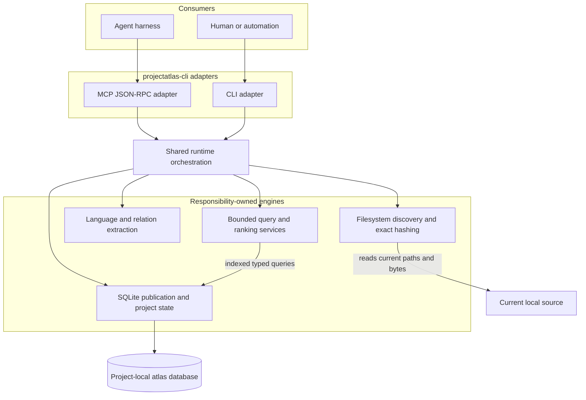
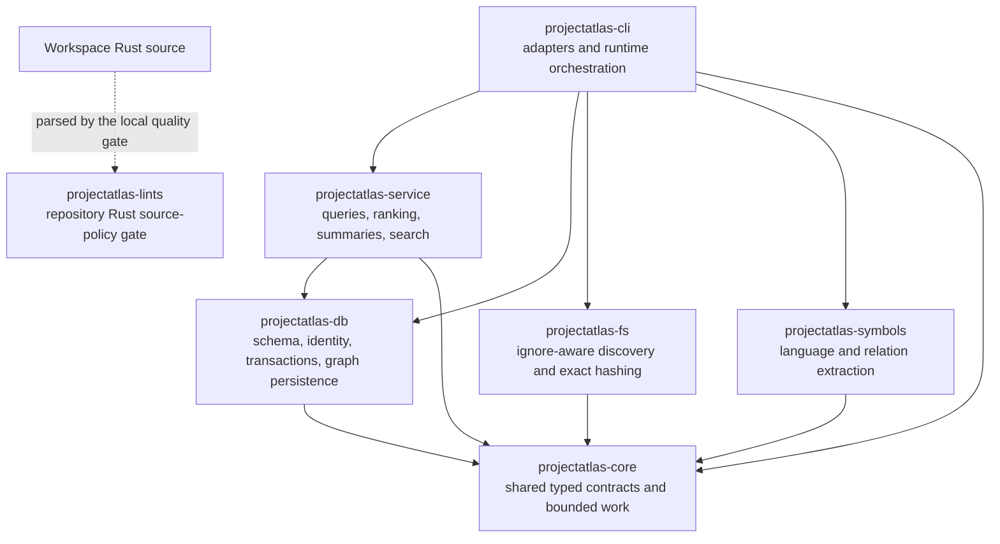
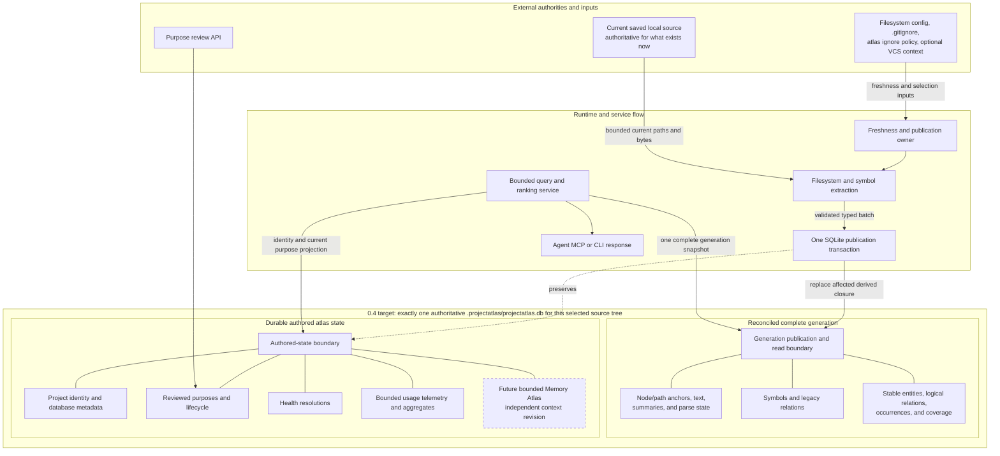
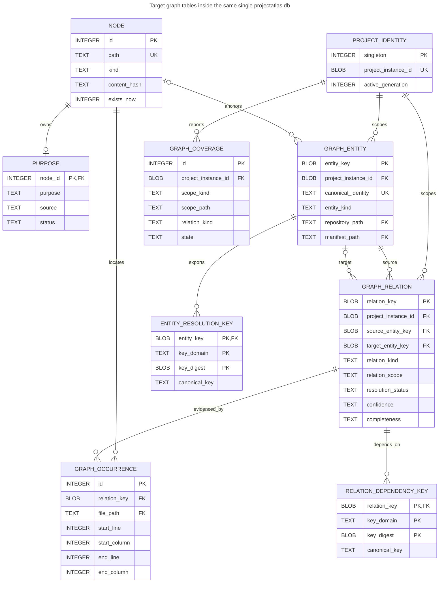
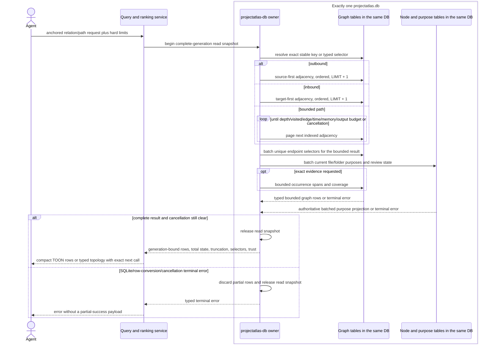
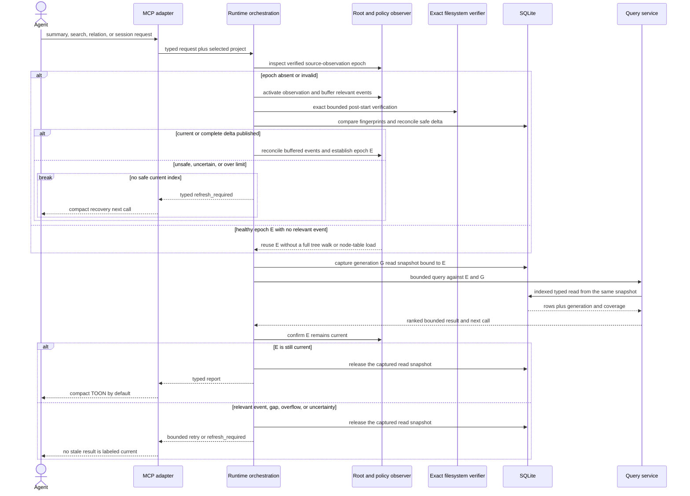
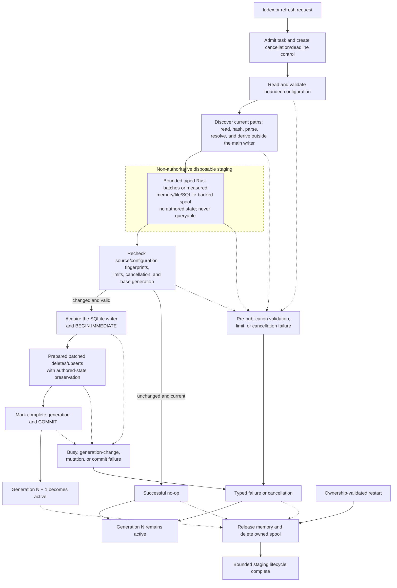
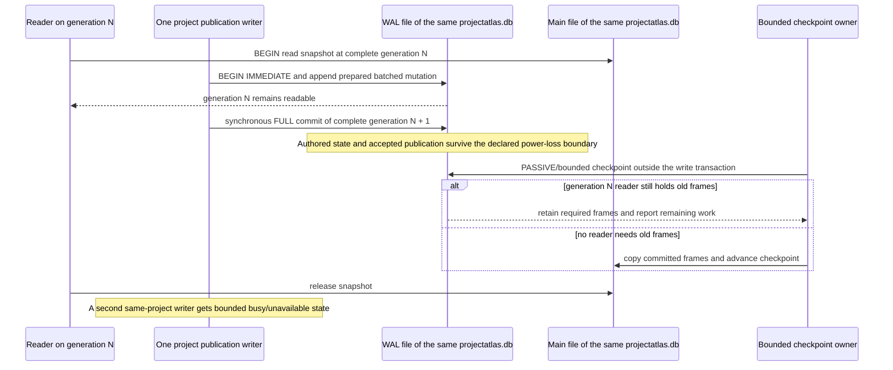
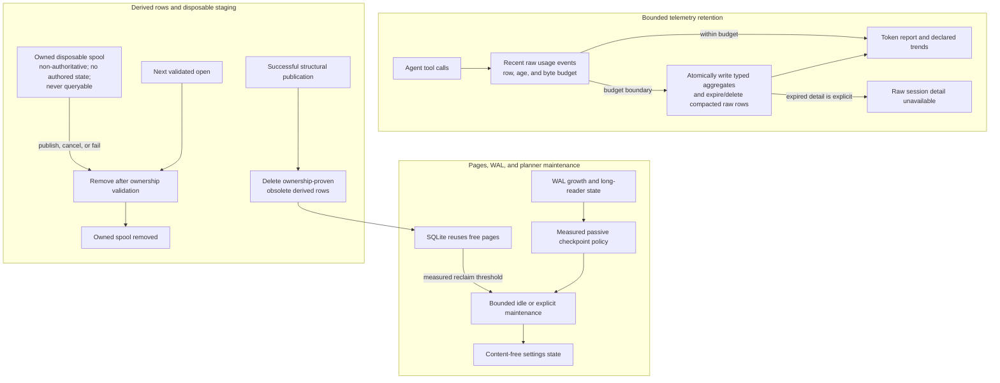
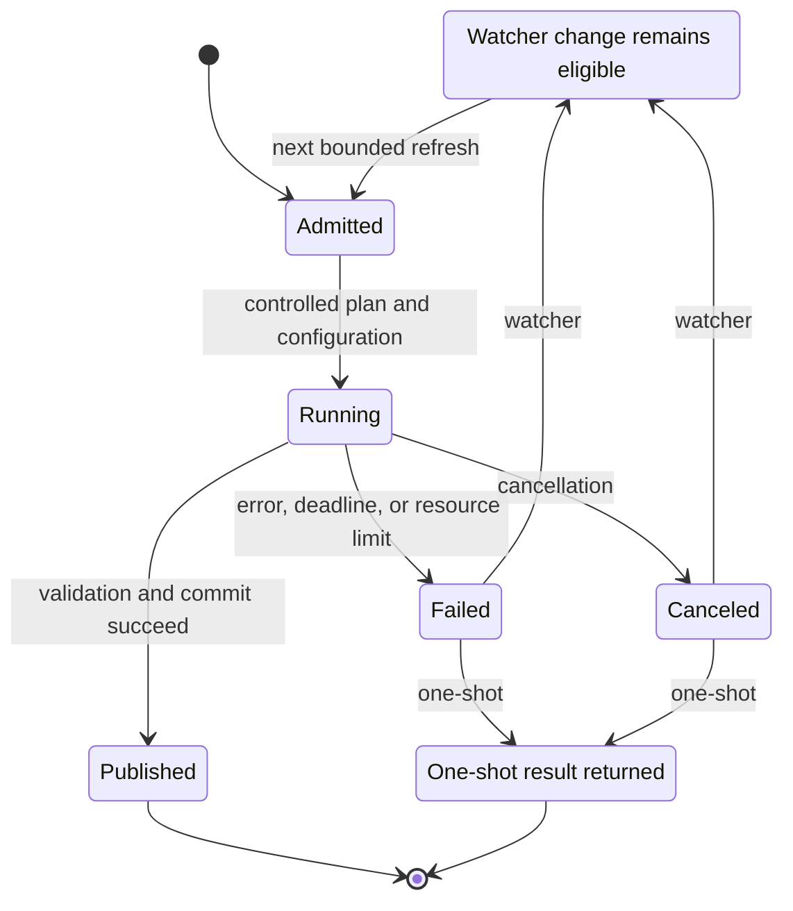

# ProjectAtlas 3 Architecture

ProjectAtlas 3 is a Rust-native repository intelligence engine. It combines
ProjectAtlas structural purpose tracking with repository file and symbol
indexing behind a transport-independent core plus CLI and MCP adapters for
Codex, OpenCode, Claude Code, and other coding harnesses.

The goal is token efficiency: coding agents should move from repository
overview, to folder, to file, to compressed details, and only then to exact
source content.

## Product Thesis

Current agent workflows waste tokens because they search broadly and read full
files too early. ProjectAtlas 3 acts as a context funnel:

1. choose the relevant folder
2. choose the relevant file
3. inspect compressed file details
4. request exact code slices only when required

This keeps the agent at the cheapest useful context level for as long as
possible.

ProjectAtlas 3 must also keep repository structure healthy. It should surface
duplicate folders, duplicated purposes, repeated temp/generated asset locations,
stale metadata, and duplicated classes/functions/methods when symbol indexing is
available.

ProjectAtlas 3 must end with the complete useful functionality expected from a
modern repository intelligence MCP plus ProjectAtlas structural purpose
intelligence. External indexing tools are used only as behavior references for
product completeness; the Rust implementation, crate names, domain model,
command names, and tests must stay ProjectAtlas-native. The preferred
experience must be better: fewer token-heavy reads, clearer folder/file
selection, stronger health checks, and native lint policy.

## Agent-First Repository Intelligence Goal

ProjectAtlas 3 is not a second index next to a structure map. It is one
seamless agent workflow:

1. open or switch the project
2. scan and incrementally refresh the atlas
3. inspect the project overview
4. choose the relevant folder by purpose, health, and source signals
5. choose the relevant file by purpose, language, symbols, and summary
6. inspect compressed outlines, summaries, relationships, and matches
7. request exact symbols, ranges, or source only when correctness requires it
8. record token savings caused by avoiding broad full-file reads

For a coding agent, the default path must feel like navigation rather than
search spam. The tool should first answer "where in this repository should I
look?", then "which file matters?", and only then "which exact code should I
read or edit?".

Large codebases are a primary target, not an edge case. ProjectAtlas 3 must use
Rust for fast walking, hashing, parsing, indexing, and compact response
generation. It must support pagination, stable ordering, incremental refreshes,
content-hash based staleness checks, TOON-first agent responses, and explicit
slice escalation so repository size does not force token-heavy workflows.

The implementation must merge these concerns into a single ProjectAtlas-native
state model:

- folder paths and folder purposes
- file paths and file purposes
- file metadata, hashes, languages, and sizes
- source summaries and outlines
- symbol definitions and relationships
- literal, regex, fuzzy, and filtered search results
- health findings and lint policy
- token-savings telemetry

The final behavior should let Codex, OpenCode, Claude Code, and other agents
start from the atlas, orient themselves quickly, and then land precisely on the
right source slice.

## Non-Goals

- Do not write required Purpose headers into source files.
- Do not require `.purpose` files in folders.
- Do not copy external indexer implementation code, names, class structure, or
  method structure.
- Do not expose another project's name through ProjectAtlas public APIs except
  in explicit compatibility documentation.
- Do not silently approve model-generated purpose summaries.
- Do not make destructive cleanup automatic.

## Source Of Truth

ProjectAtlas 3 stores index state in SQLite:

```text
.projectatlas/projectatlas.db
```

Headers and `.purpose` files become legacy import sources only. Current saved
local source bytes remain authoritative for what exists now; SQLite is the
durable source of truth for authored atlas state and the active complete derived
index generation. TOON should be the default agent-facing response/export format
because it is compact, structured, and usually cheaper in tokens than JSON.
JSON remains available for tests, scripts, and integrations that require strict
machine parsing.

## Storage And Toolchain Decision

SQLite is the selected ProjectAtlas 3 local index store because it fits the
actual workload rather than merely because it is already present:

- one embedded project-local database with no daemon, service account, network,
  or external lifecycle;
- offline and non-Git operation against the current dirty local source tree;
- many bounded read snapshots with one atomic publication writer per project;
- transactional authored-state preservation and all-or-nothing derived refresh;
- B-tree indexes that support the required folder/file, stable-key, inbound,
  outbound, occurrence, coverage, purpose, and affected-closure access paths;
- predictable Windows, macOS, and Linux packaging through the locked bundled
  SQLite selected by workspace-owned `rusqlite`;
- engine-native backup, integrity, query-plan, WAL, and optional FTS support;
- direct inspection from the CLI, MCP runtime, tests, and diagnostic tools.

`projectatlas-db` is the concrete storage owner. Rust domain and service layers
do not receive a speculative storage trait: a second implementation would add
indirection before there is a second owner or consumer. SQLite calls and schema
strings remain inside the storage crate while services depend on typed bounded
operations. This keeps replacement possible through a deliberate boundary
without paying for an imaginary backend now.

The supported operating profile is a local filesystem whose locking and shared
memory semantics SQLite supports. One selected source tree opens exactly one
authoritative `.projectatlas/projectatlas.db`; ProjectAtlas never splits that
tree's purposes, Memory Atlas state, graph, or index across product databases.
Different selected source trees or checkouts each own one separate project-local
database and may progress concurrently; one project identity never has two
authoritative databases. Writers to one project's database are serialized and
return bounded typed busy/unavailable state instead of spinning. WAL permits
last-complete-generation readers during publication. Connection pragmas, busy
timeout, foreign-key enforcement, statistics, checkpoints, and backup behavior
are validated as operating contracts, not copied as universal tuning folklore.

Initial toolchain choices:

- `rusqlite` with bundled SQLite for predictable cross-platform installs
- `ignore` for `.gitignore`-aware walking
- `blake3` for fast content hashing
- `serde` and `serde_json` for stable CLI/MCP payloads
- `clap` for CLI parsing
- `thiserror` for typed library errors
- the official `toon-format` Rust crate for default agent-facing output
- `tracing` later for structured diagnostics
- `notify` for event-backed watcher mode, with portable polling as fallback
- tree-sitter crates for specialized symbol parsing
- the official `toml` crate for line-aware Cargo manifest indexing inside
  the content-based symbol extractor

Alternatives considered:

- Plain JSON/TOON files: simple and reviewable, but weak for incremental
  updates, queries, health checks, and usage telemetry.
- RocksDB/LMDB/redb-style key-value stores: capable point access, but they would
  require custom integrity, joins, adjacency ordering, migration, and diagnostic
  machinery for a workload SQLite already serves transactionally.
- DuckDB: excellent local analytical scans, but ProjectAtlas is dominated by
  small indexed lookups and frequent incremental publication rather than
  columnar bulk analysis.
- Embedded or server graph databases: useful for arbitrary or distributed graph
  computation, but ProjectAtlas exposes closed bounded traversals and would pay
  extra packaging, query-language, migration, and operational cost.
- Tantivy only: useful as a measured lexical accelerator, but not a complete
  relational metadata, authored-state, and atomic-publication store.
- PostgreSQL or another external server: strong concurrent multi-writer service
  semantics, but incompatible with zero-service offline project-local operation.
- In-memory only: fastest, but loses durable purpose and token-savings state.
- `cargo_metadata` for manifest indexing: canonical for whole-workspace Cargo
  graphs, but it shells through Cargo against filesystem manifests and does not
  provide the content-mode, line-level dependency symbol rows ProjectAtlas needs
  while scanning arbitrary indexed files. ProjectAtlas should keep using
  canonical TOML parsing for file summaries and can add `cargo_metadata` later
  only for an explicit workspace graph command.

Decision: keep SQLite as the durable atlas and derived-index engine, keep its
concrete ownership in `projectatlas-db`, use TOON as the default compact
agent-facing output, keep JSON as an explicit `--format json` option, and reserve
specialized search/index backends for later measured need. MCP still uses
JSON-RPC as its required transport envelope, but `atlas_*` tool text responses
should be TOON by default.

Reopen the engine decision when a required product contract needs shared remote
multi-writer state, a live network filesystem unsupported by SQLite,
unbounded/distributed graph computation, or still misses the preregistered
huge-source query/publication/resource thresholds after the owning schema,
indexes, query, statistics, and transaction design has been corrected. The
shape of the data alone is not an invalidation condition.

## Workspace Layout

The current Rust workspace is split by stable runtime boundaries:

```text
crates/
  projectatlas-lints/       repository-owned Rust source policy checks
  projectatlas-core/        domain types, repo-path contracts, health models
  projectatlas-db/          SQLite schema, migrations, persistence
  projectatlas-fs/          walking, ignore handling, hashes, file metadata
  projectatlas-service/     shared query services for CLI and MCP adapters
  projectatlas-cli/         CLI binary, runtime orchestration, MCP stdio host
  projectatlas-symbols/     tree-sitter and fallback code intelligence
```

The CLI crate currently hosts the MCP stdio server so a plugin installation
only needs one native executable. Inside that crate, `runtime.rs` owns
application orchestration that is shared by CLI and MCP adapters: scan policy,
text-index refresh, symbol refresh, watcher refresh, settings diagnostics,
legacy cleanup, reset-index behavior, indexed-file access, and token telemetry.
`main.rs` remains the human/CI command adapter and `mcp.rs` remains the
agent/harness adapter. A later split into a dedicated MCP adapter crate is an
architecture-hardening option if the adapter grows, but shared behavior must
stay in `runtime.rs` or the reusable `projectatlas-service`,
`projectatlas-db`, `projectatlas-fs`, `projectatlas-symbols`, and
`projectatlas-core` crates.

## Architecture Views

These diagrams describe the current seven-crate ownership and the ProjectAtlas
0.4 request and publication contracts. Target behavior remains explicitly
subject to the issue #308 acceptance checks until the final documentation
reconciliation in task 7.5.

### System And Component Architecture



The current saved local source is authoritative. Runtime orchestration passes
bounded current content into the symbol engine; the symbol engine does not own
filesystem I/O. SQLite stores authored purposes and complete derived
generations; it does not make a hosted commit the source of truth.

### Crate Dependency And Ownership



Dependency direction remains acyclic. The lint crate is a workspace quality
tool, not a runtime dependency. No eighth crate is justified unless a durable
independently consumed ownership boundary appears.

### Database Authority And Responsibility



Source and database authority are intentionally different. SQLite does not
claim that a committed repository or an old indexed row is current source truth.
It preserves authored atlas decisions and one complete derived projection of the
saved local bytes. A purpose update therefore changes later graph-backed output
without rewriting entity or relation rows. Scan reconciliation updates stable
node/path anchors in place or marks them absent so their authored purpose rows
survive; derived publication never implements refresh by deleting authored
state.

Configuration and ignore rules stay authoritative in their filesystem-owned
formats. The database records only the fingerprints and derived consequences
needed for freshness and publication; it does not become a second mutable
configuration authority. There is one authoritative database for one selected
source tree. A large extraction may use a bounded disposable spool as an
implementation detail, but even an SQLite-backed spool is not a ProjectAtlas
database: it has no project identity, authored state, active generation, or
query surface and is deleted after the owning operation.

A shared MCP process can route a call to another explicitly selected project;
that opens the other project's own single database rather than adding a database
to the active project. Explicit federation likewise takes bounded read-only
snapshots of participating projects' existing databases for one call and never
creates a federated or shared authority.

The future Memory Atlas belongs to the same project database because it shares
project identity, backup, migration, and local/offline constraints, but it does
not share structural generation ownership. #314 will define capped authored
records and an independent context revision. Graph publication cannot mutate
that revision; a memory update cannot bless or advance structural data.

### Normalized Graph Physical Model



The diagram shows the target normalized hot relationship model, not every
compatibility or telemetry table. `ENTITY_RESOLUTION_KEY` and
`RELATION_DEPENDENCY_KEY` are the task 3.2 additions needed to find both existing
inbound edges and unresolved references that may become resolvable when exports
change. Their compact owner/domain/digest composite primary keys prevent
duplicate mappings without placing long canonical strings in each hot key.
Reverse lookup indexes begin with domain and digest, and insertion plus lookup
verify the stored canonical witness so a digest collision fails closed instead
of merging identities. They use typed resolver domains rather than display-name
scans. Stable fixed-width
entity/relation keys remain independent of display labels and line movement. A
logical relation is traversed once while every exact supporting span remains
available through its occurrence rows. Ambiguous and unresolved references keep
typed reference facts without a fabricated target.

Index ownership follows accepted queries rather than columns in isolation:

- `graph_entities` indexes exact path, package/manifest, symbol, and external
  selector access;
- `graph_relations` has separate source-first and target-first adjacency indexes
  plus bounded family/resolution access;
- resolution/dependency keys have export-key and dependency-key indexes that map
  old/new identities to the exact inbound source relations requiring
  re-resolution, including previously unresolved references;
- occurrences are ordered by file and span for exact-source retrieval and
  affected-path invalidation;
- coverage indexes serve path, family, and state filters;
- nodes and purposes keep path/parent/kind and lifecycle lookups outside the
  graph rows so current purpose can be projected without graph write
  amplification.

### Bounded Graph Read With Purpose Projection



This is target behavior owned by tasks 5.5 and 5.7. The current schema already
supports bounded one-hop source/target adjacency and coverage reads; batched
endpoint/purpose hydration, decoded-byte budgets, multi-hop traversal, and any
measured filtered high-degree indexes remain intentionally open.

This is the database form of the agent sieve. An initial task still starts with
purpose-led folder/file narrowing. Once anchored, indexed adjacency removes
irrelevant files; projected purpose confirms responsibility; summary and trust
verify current content; exact selectors lead directly to the source slice. The
agent never needs a graph query language or an unbounded in-memory graph.

One-hop inbound/outbound navigation uses the separate prepared adjacency
queries directly. Task 5.5 must measure two closed multi-hop implementations
against cyclic and high-degree corpora: a recursive SQLite CTE with separately
indexable inbound/outbound branches, and a bounded node-simple Rust frontier
over paged prepared adjacency. A CTE can reduce repeated query setup; the Rust
frontier can make per-step coverage, cancellation, topology, selectors, and
visited/edge/time/memory/output budgets clearer. The chosen path must preserve
direction, stable ordering, trust filters, explicit truncation, and cancellation;
neither mechanism may use one broad `source OR target` predicate that defeats
the owning indexes or rely on depth alone to control cycles.

Traversal cost follows the visited frontier and can grow roughly with branching
factor raised to depth even when every lookup is indexed. The huge-source matrix
therefore includes skewed high-degree nodes, diamonds, cycles, disconnected
targets, narrow and expanded closures, and repeated queries. Relation-family,
current-state, entity-type, temporal, evidence, and FTS indexes are added only
for accepted hot queries; the useful index inventory of another graph workload
is not copied wholesale. Every added index is charged against publication time,
WAL/checkpoint writes, cache pressure, migration time, and persistent bytes.

ProjectAtlas does not retain bi-temporal history for rebuildable source graph
rows: current local bytes plus one complete generation are the authority, and
optional snapshots are explicit artifacts. Deterministic lexical search remains
the default. FTS, semantic embeddings, rank fusion, or ANN may be separately
gated accelerators, but an unbounded embedding scan or trigger-maintained search
copy is not allowed to become hidden default-core cost.

### MCP Call To Database Access Contract

| Agent operation | Principal SQLite access | Physical and authority rule |
| --- | --- | --- |
| `overview`, `folders`, `files`, `session_brief` | Nodes, purposes, summaries, parse/coverage aggregates, and bounded graph-role/connection batches | Exact path/name and reviewed purpose remain stronger than graph popularity. Folder/file pages batch graph/purpose facts for only returned candidates. |
| `summary`, `outline`, `symbols` | Exact node/path, text/summary, parse metadata, symbols, coverage, and bounded related-identity digest | One complete generation and current purpose review state; no default edge dump or per-symbol query loop. |
| `relations` and bounded path/impact views | Stable selector lookup, source/target adjacency, dependency-key closure, occurrences, coverage, and batch purpose projection | Separate indexes by direction/key; generation-bound cursor; decoded/result byte budgets; exact reusable selectors and spans. |
| `search` | Current deterministic persisted-text scan with path narrowing; optional FTS candidate acceleration followed by exact verification | Current lexical behavior remains complete. Short, punctuation-sensitive, regex, fuzzy, or unsafe tokenizer/Unicode shapes retain the authoritative fallback. Semantic/ANN state is optional and cannot bless stale structural rows. |
| `slice` | Database selector/span/freshness validation followed by exact current filesystem read | SQLite helps select and validate the source; it does not override newer saved bytes with stored text. |
| `health`, `purpose_queue`, `purpose_set`, `purpose_review`, `lint` | Nodes, authored purpose lifecycle, health resolutions, and bounded structural findings | Purpose writes use an authored transaction and do not rewrite graph rows or require hosted CI. |
| `settings`, `runtime_info`, watcher/task status | Metadata, project/publication identity, schema/capability/coverage and content-free SQLite operating profile | No secrets or arbitrary machine paths; report readiness honestly without running maintenance implicitly. |
| `scan`, `watch_once`, automatic refresh | Off-writer discovery/extraction/staging followed by one short validated publication transaction | Current local bytes and ignore/config policy are authoritative; uncertainty preserves the last complete generation. |

Task 2.7 verifies these mappings through production query/service/adapter paths.
In-memory SQLite is sufficient only for behavior independent of file locking,
WAL, migration, reopen, backup, busy contention, and platform paths. Those
contracts use test-only temporary on-disk project databases plus real CLI/MCP
smoke. A mocked
repository or hand-built row can test service formatting, but cannot close a
database-backed behavior claim.

### MCP Read Communication Sequence



This is task 3.5 target behavior. A new long-lived runtime pays for one exact
post-start verification, then makes later unchanged calls proportional to their
bounded query while observation remains healthy. A short-lived one-shot CLI
process performs its own first verification. Silence from a broken observer is
never accepted as freshness, and a source event racing a query invalidates the
captured epoch before the response is labeled current.

### Index And Transactional Publication Flow



For background MCP work, admission owns the deadline and cancellation token
before configuration content is read. Failed work never exposes partial rows
or advances the active generation, and successful no-change work leaves the
current generation unchanged. Expensive filesystem reads and parser work do not
hold the main database writer. Small incremental closures may remain in admitted
typed Rust batches. Large full/expanded closures spill only after measured
cardinality, memory, recovery, and write-amplification behavior selects a
bounded disposable spool, implemented as a plain temporary file or SQLite-backed
working file. Even when SQLite-backed, it is not another ProjectAtlas database:
it has no project identity, authored rows, active generation, or query surface.
After one final source/configuration and base-generation recheck, only prepared
mutation of the one project database occurs inside the short publication
transaction. The spool is never a copied live atlas and is deleted after the
owning operation publishes, fails, or is canceled.

Task 2.3 implements this flow. Full scan, full watcher refresh, incremental
watcher refresh, and symbol-only projection refresh now capture their base
generation and prepare admitted filesystem, text, symbol, relationship, and
summary state before acquiring the writer. Immediately before publication they
reload current configuration, exactly revalidate source and consumed purpose
inputs, then enter `BEGIN IMMEDIATE`, compare the staged base generation, apply
only prepared mutations, advance the generation once, and commit. Competing
publication, source/configuration drift, cancellation, or a late mutation error
leaves the last complete generation visible. Representative task 7.4 scale
measurement still owns final transaction-duration, WAL-write, contention, CPU,
RSS, and spill-threshold decisions; it must optimize measured costs without
weakening this order or introducing another authoritative database.

### SQLite WAL, Durability, And Checkpoint Flow



The target normal production profile is bundled SQLite on a supported local
filesystem, `foreign_keys=ON`, WAL, `synchronous=FULL`, and a bounded busy
timeout. `FULL` is selected because the same database owns reviewed purposes,
project identity, health resolutions, and future Memory Atlas records as well as
rebuildable projections. One batched commit per publication keeps the extra sync
cost small enough to measure rather than weakening authored durability by
default. If task 7.4 disproves that choice, a split durability class requires an
explicit authored-versus-disposable transaction owner and power-loss contract;
it cannot be a silent pragma change.

The current default SQLite auto-checkpoint remains only the initial measured
baseline. Task 2.3/2.7 must add content-free operating-profile inspection and
real WAL tests; task 7.4 determines whether a bounded passive post-publication
checkpoint trigger or statistics/`PRAGMA optimize` lifecycle is needed from WAL
growth, long-reader, plan, startup, and write-amplification measurements. Request
paths never force a blocking truncate checkpoint. Live snapshot/export uses the
SQLite backup API; copying only the main file while WAL is active is not a valid
general backup procedure.

### Bounded Database Lifecycle



Task 2.8 owns this lifecycle. The normal read path never performs an unbounded
purge, blocking truncate checkpoint, blind `VACUUM`, or destructive rebuild.
Telemetry compaction preserves supported all-time totals and declared trend
windows; expired session-level detail is reported rather than fabricated.
Derived cleanup never deletes project identity, reviewed purposes, health
resolutions, or future separately capped Memory Atlas records.

### Cancellation, Failure, And Watch Retry



Readers continue using the last complete generation while work runs or fails.
Watcher failure does not create a hidden in-process retry loop; the unchanged
local mismatch stays eligible for a later read, watch, or explicit bounded
retry. Independent project databases progress independently; ProjectAtlas does
not serialize them behind one process-global indexing lock.

## Interface Strategy: Core First, CLI And MCP As Adapters

ProjectAtlas 3 must not put product logic inside MCP handlers or CLI argument
parsing. The core engine owns scanning, indexing, querying, health checks, lint,
and usage telemetry. Interfaces call the same core APIs.

Recommended layers:

```text
projectatlas-core
  owns domain models and service traits

projectatlas-db/projectatlas-fs/projectatlas-service/projectatlas-symbols
  implement storage, scanning, shared query services, and parsing

projectatlas-cli
  human and CI command adapter plus shared runtime orchestration module

projectatlas-cli::mcp
  current agent/harness adapter over the same runtime module

future adapters
  language server, daemon, editor extensions, HTTP bridge
```

CLI is the best first implementation target because it is deterministic, easy
to test in CI, and useful for humans. MCP is the right agent integration surface
because Codex, Claude Code, OpenCode, and other tools can call it without
screen-scraping CLI output. A later daemon/watch mode may improve latency for
large repos, but it should still call the same core services.

Decision:

- build the core engine first
- expose CLI first for verification and CI
- expose MCP next for coding harnesses
- optionally add a long-running daemon later for watcher/performance
- keep command names and MCP tools semantically aligned

This avoids a false choice between MCP and CLI. ProjectAtlas needs both, but
neither should be the architecture.

## Naming Convention

ProjectAtlas 3 names must read as ProjectAtlas, not as a port of another
indexing tool. Public and semi-public surfaces use atlas/funnel vocabulary:

- CLI nouns: `scan`, `overview`, `folders`, `files`, `summary`, `outline`,
  `slice`, `symbols`, `health-check`, `lint`, `token`.
- MCP tools: `atlas_set_project_path`, `atlas_scan`, `atlas_overview`,
  `atlas_folders`, `atlas_files`, `atlas_outline`, `atlas_file_summary`,
  `atlas_search`, `atlas_slice`,
  `atlas_symbols_build`, `atlas_symbols`, `atlas_symbol_relations`,
  `atlas_health`, `atlas_health_resolve`, `atlas_token_report`,
  `atlas_settings`, `atlas_watch_status`, `atlas_watch_once`,
  `atlas_strip_legacy_purpose`, `atlas_reset_index`, `atlas_purpose_queue`,
  `atlas_purpose_set`, and `atlas_purpose_review`.
- Crates/modules: `projectatlas-cli` (CLI, MCP adapters, and runtime
  orchestration), `projectatlas-core`, `projectatlas-db`, `projectatlas-fs`,
  `projectatlas-lints`, `projectatlas-service`, and `projectatlas-symbols`.
- Avoid names copied from external tools for classes, methods, structs,
  modules, commands, or MCP tools.

Compatibility can be documented as behavior coverage, but implementation and
API names remain ProjectAtlas-native.

## Database Model

The schema is owned in one append-only migration sequence by
`projectatlas-db`. The architecture views above describe authority and the
normalized graph model; the schema source remains authoritative for exact DDL.
The durable responsibilities and access paths are:

| Responsibility | Principal physical state | Authority and primary access | Current/target state |
| --- | --- | --- | --- |
| Compatibility and publication | `metadata`, `project_identity` | Durable schema/root/contract identity; read-only preflight, migration, root transition, and active-generation lookup. | Schema 10 is current; later task-owned tables use the same append-only migration owner. |
| Local structure | `nodes`, `summaries`, `file_texts`, `source_parse_metadata` | Rebuildable exact path/parent/kind, persisted text, summary, hash, and parse-state projection. | Current; task 5.4 may add exact-verified FTS acceleration without replacing fallback semantics. |
| Purpose | `purposes` joined to `nodes` | Authored/reviewed purpose and stale/review lifecycle; projected by exact owning path or nearest applicable folder. | Current authoring; tasks 5.2 and 5.5 add bounded batch projection into graph-aware navigation. |
| Compatible code facts | `symbols`, `symbol_relations` | Rebuildable file-level symbol and relation calls. | Current; co-published from the same typed extraction result as normalized graph facts. |
| Normalized graph | `graph_entities`, `graph_relations`, `graph_relation_occurrences`, `graph_coverage`; task 3.2 resolution/dependency keys | Rebuildable stable identity, source/target adjacency, occurrences, coverage, and dependency-key closure. | Base one-hop persistence is current; tasks 3.2, 5.5, and 5.7 complete invalidation and bounded hydration/traversal. |
| Health resolution | `health_resolutions` | Authored exact finding disposition. | Current and preserved across derived publication. |
| Usage measurement | `usage_events`; task 2.8 aggregate state | Recent raw events, session/time aggregation, all-time totals, declared trends, and explicit retention state. | Raw events are currently unbounded; task 2.8 adds bounded retention/rollup/maintenance. |
| Future Memory Atlas | #314-owned tables | Separately capped authored context and independent context revision. | Conceptual boundary only; #308 does not prebuild its schema. |

Legacy symbol rows and normalized graph rows are compatible co-published
projections from one typed extraction result. Neither projection is the source
of truth for the other, and neither owns reviewed purpose text.

The validated SQLite operating profile is explicit:

| Concern | Current live state | Accepted target and owner |
| --- | --- | --- |
| Schema | Version 10 with append-only 8 to 9 to 10 migration ownership. | Keep one append-only owner; task-specific migrations preserve authored state and refuse incompatible state. |
| Rust/SQLite build | Workspace `rusqlite` 0.32.1, `libsqlite3-sys` 0.30.1, bundled SQLite 3.46.0. | Task 4.5 reports the actual linked runtime version and compile options; source package versions alone are not runtime proof. |
| Filesystem | One project-local database on a filesystem with supported SQLite locking/shared-memory behavior. | Reject unsupported live network filesystems with typed guidance; do not weaken locking assumptions silently. |
| Writable connections | `foreign_keys=ON`, WAL, `synchronous=NORMAL`, one-second busy timeout. | Tasks 2.3 and 2.7 reconcile to measured bounded busy handling and accepted `synchronous=FULL` durability for mixed authored/derived state. |
| Read connections | Read-only open, `query_only=ON`, deferred read snapshot. | Preserve complete-generation snapshots and bounded busy/corruption propagation through task 2.7. |
| Checkpoints/statistics | SQLite default auto-checkpoint; no owned statistics lifecycle. | Tasks 2.8 and 7.4 measure WAL growth, long readers, passive checkpoints, `ANALYZE`/`PRAGMA optimize`, free-page reuse/reclaim, and request-path exclusion. |
| Backup/recovery | Preflight and transaction rollback exist; live-file copying is not accepted as backup. | Task 6.4 uses the SQLite backup API plus bounded isolated import validation without replacing destination identity. |

Hot predicates, joins, ordering, and constraints use typed columns. JSON/TOON is
an adapter format, not a graph persistence shortcut. Inserts reuse cached
prepared statements and related rows are batched inside the caller-owned parent
transaction. Bounded reads request `limit + 1` where necessary to report
truncation without counting or loading the entire result set. Row-conversion,
I/O, schema, identity, or corruption failures fail the whole page.

Paged graph output always reports `returned`, `truncated`, continuation state,
and a typed `total_state` of `exact`, `at_least`, or `unknown`. `total` is
present only when it is already known, the bounded page proves the complete
cardinality, or it can be computed within the same declared statement, row,
time, and cancellation budget. A high-degree adjacency page therefore reports
at least `limit + 1` after the sentinel row instead of running an unbounded
count solely for display metadata. Existing compatible surfaces may retain an
established exact file-local total where that count remains within their owning
query bound.

The database test boundary is real SQLite, not a mocked repository. Owning tests
create a test-only temporary project database, migrate/open it through the
production API, write
through publication/purpose operations, read or reopen through production query
APIs, and inspect stable plan properties where a scan would be a regression.
Risk-specific cases add rollback, read snapshots, busy/concurrent access,
corruption, WAL/reopen, backup/import, and huge-cardinality checks.

Purpose status values:

- `missing`: path exists but no purpose is known
- `suggested`: a model or heuristic suggested a purpose
- `approved`: an explicit agent workflow approved the purpose after inspection
- `stale`: file/folder changed enough that the purpose needs review

Scan reconciliation preserves curated purpose state. A full or deep scan keeps
existing purpose rows for unchanged paths, marks approved file purposes `stale`
when the indexed file hash changes, creates missing purpose rows only for new
paths, and marks deleted or excluded paths inactive instead of recreating
purpose noise. Agents should then review only the new or stale queue entries.

## Indexing Behavior Parity Map

Modern repository intelligence tools provide useful behavior that ProjectAtlas
3 should cover with a Rust-native implementation. The external behavior surface
tracked for parity includes:

- workspace selection
- shallow index refresh
- deep symbol graph indexing with worker and timeout controls
- file discovery with pattern filters
- code search with literal, fuzzy, regex, pagination, context-line, and file
  filters
- file outline and summary retrieval
- symbol or range slice retrieval
- settings and cache introspection
- temporary workspace/cache management
- search-tool refresh
- watcher status and watcher configuration
- file content resource access
- all-language file type recognition across the full parity extension set

ProjectAtlas 3 must provide equivalent or better native functionality for this
surface before a 3.0 stable release. This is behavior parity, not source or
identifier parity. During development, each item is tracked as
one of:

- `planned`
- `implemented`
- `tested`
- `better-than-source`

ProjectAtlas-specific funnel tools are the preferred path:

```text
external concept         ProjectAtlas 3 concept
project selection        atlas_workspace_open
refresh index            atlas_workspace_scan
deep symbol index        atlas_symbols_build
file discovery           atlas_files
code search              atlas_search
structured file summary  atlas_file_summary
compressed outline       atlas_outline
symbol body              atlas_slice
file watcher             atlas_watch
```

Required parity outcomes:

- shallow file discovery works without deep symbol indexing
- all parity-set languages/file families are recognized during shallow indexing
- deep symbol indexing supports the specialized language set
- fallback indexing covers broad file types
- search supports literal matching, fuzzy matching, regex where safe,
  repository glob filters, pagination, context lines, early-stop behavior, and
  returned/scanned/truncated telemetry
- folder/file navigation uses bounded SQL ranking and exact repository glob
  filtering rather than loading the complete node table for every agent query
- summaries include language, line count, imports, exports, symbols, docstrings,
  and complexity signals where available
- symbol body/slice retrieval avoids full-file reads and rejects ambiguous
  duplicate names until the agent supplies parent, kind, or line disambiguation
- watcher/index refresh behavior is deterministic
- settings and cache locations are explicit and inspectable
- local runtime index/cache cleanup is explicit through dry-run/apply reset
  commands instead of ad hoc file deletion
- project context can be switched safely between repositories
- folder purpose, file purpose, source summary, symbols, search, and slices are
  all served from ProjectAtlas-native data and command names

## Language Support Strategy

The Rust implementation should support all useful file types through two tiers:

1. specialized symbol parsers
2. fallback indexing

Specialized parser targets for full parity:

- Python
- JavaScript
- TypeScript
- Java
- Kotlin
- C#
- Go
- Objective-C
- Zig
- Rust

Fallback file type families:

- web and markup: HTML, CSS, Markdown, JSON, XML, YAML
- frontend frameworks: Vue, Svelte, Astro
- templates: Handlebars, EJS, Pug
- SQL and database migration files
- config and text files
- C/C++
- Ruby
- PHP
- Swift
- Scala
- shell and PowerShell
- batch scripts
- R
- Perl
- Lua
- Dart
- Haskell
- OCaml
- F#
- Clojure
- Vimscript

The first vertical slice recognizes every extension in the full parity set and
stores language/family metadata for all of them. Deep symbol extraction can
arrive incrementally, but ProjectAtlas 3.0 stable requires all specialized and
fallback families in this section to be implemented and tested through the
ProjectAtlas-native parser registry.

The parser registry records the current coverage level for each detected
language family: native Tree-sitter, manifest, deterministic structural, or
fallback. The SQLite index also persists file-level parser metadata even when a
parse emits zero symbols, so `summary` can distinguish an empty native parse from
an empty fallback parse instead of inferring quality from the summary sentence.

The v0.3.2 hardening boundary keeps the public `projectatlas-symbols` API
stable while splitting language-specific augmentation behind private strategy
modules. The first split moves Kotlin, Objective-C, Zig, and the C-family
augmentation boundary out of the generic tree-sitter traversal file. The generic
parser spine stays stable until language-specific behavior is green, which keeps
line ranges, signatures, imports, calls, and broad parser behavior from drifting
while future per-language modules are added.

No source language should become invisible just because a specialized parser is
not ready. The fallback tier must still provide file discovery, purpose
association, text search, line counts, rough token estimates, and compact
summary metadata.

## CLI Contract

Current CLI:

```bash
projectatlas scan <path>
projectatlas --format json overview
projectatlas folders <query>
projectatlas files [<query>] [--folder <path>] [--file-pattern <glob>]
projectatlas summary <file> --limit 25
projectatlas outline <file>
projectatlas search <pattern> --file-pattern <glob> --context-lines <n>
projectatlas search <pattern> --fuzzy --file-pattern <glob>
projectatlas slice <file> --start-line <n> --end-line <m>
projectatlas symbols list --file <file>
projectatlas symbols relations --file <file>
projectatlas health-check
projectatlas lint --report-untracked --purpose-level low
projectatlas token
```

Additional runtime and migration commands:

```bash
projectatlas mcp
projectatlas watch --once
projectatlas watch
projectatlas settings
projectatlas watch-status
projectatlas mcp-config
projectatlas symbols build --max-workers <n> --timeout-seconds <s>
projectatlas symbols slice <file> <symbol> --symbol-parent <parent>
projectatlas purpose set <path> <purpose>
projectatlas strip-legacy-purpose --dry-run
projectatlas strip-legacy-purpose --apply
```

Structured file summaries are part of the hot path for agents and large
repositories, so they must stay bounded by design:

- repeated sections load at most the requested `--limit`
- totals come from exact SQLite count queries, not full in-memory
  materialization
- caller lookup uses batched exact target matching, never suffix scans on the
  hot path
- `called_by` is conservative and may be empty when a name is ambiguous; v0.3.2
  also resolves deterministic Rust, TypeScript/JavaScript, and Python import
  aliases from persisted import/call relations without reparsing live source
  during summary requests
- indexed search lives in the shared service layer, uses `globset` path
  matching, supports literal/regex/fuzzy line matching, stops once the requested
  page is satisfied, and reports searched file/byte counts plus truncation state
- symbol slices live in the shared service layer and reject ambiguous duplicate
  symbol names until the caller supplies parent, kind, or line selectors
- scan, MCP scan, watcher refresh, map/lint, search-backed reads, and legacy
  purpose cleanup honor configured `[scan].exclude_dir_names` and
  `[scan].exclude_path_prefixes`; stale legacy map purposes for deleted or
  excluded paths are skipped during scan migration and reported as skipped
  imports instead of surfacing raw SQLite no-row errors
- deep symbol builds support worker and timeout controls while keeping SQLite
  persistence sequential and deterministic
- source-derived fields report whether they came from live source or indexed
  metadata through `source_status` and `source_error`
- token telemetry baselines are derived from the shared service payload, not a
  duplicate adapter-side model

Native path display is a core contract. `projectatlas-core` owns the canonical
helper that converts native paths to slash-normalized metadata/diagnostic text
and strips Windows extended path prefixes. DB metadata, CLI settings, and MCP
configuration diagnostics should call that helper instead of carrying their own
`\\?\` or UNC normalization logic.

## MCP Contract

Preferred MCP tools use an `atlas_*` namespace so the public API is
ProjectAtlas-native:

- `atlas_set_project_path`
- `atlas_scan`
- `atlas_overview`
- `atlas_folders`
- `atlas_files`
- `atlas_outline`
- `atlas_file_summary`
- `atlas_search`
- `atlas_slice`
- `atlas_symbols_build`
- `atlas_symbols`
- `atlas_symbol_relations`
- `atlas_health`
- `atlas_health_resolve`
- `atlas_token_report`
- `atlas_settings`
- `atlas_watch_status`
- `atlas_watch_once`
- `atlas_strip_legacy_purpose`
- `atlas_reset_index`
- `atlas_purpose_queue`
- `atlas_purpose_set`
- `atlas_purpose_review`

The tool descriptions must bias agents toward the funnel:

1. startup context
2. folders
3. files
4. outline/compressed content
5. exact code

## Plugin Packaging

The ProjectAtlas plugin must install or invoke everything required for
ProjectAtlas 3 usage. It should not be only an instruction bundle.

Required plugin contents for 3.0:

- ProjectAtlas skill/instructions for Codex, Claude Code, OpenCode MCP config
  users, and generic MCP-aware harnesses
- installer-generated project-local MCP configs that start the native ProjectAtlas
  MCP server through absolute runtime paths on Windows, Linux, and macOS
- Claude Code plugin metadata under `.claude-plugin/plugin.json`
- disabled OpenCode `opencode.json` MCP config template with absolute-path
  placeholders, not a native OpenCode JavaScript/TypeScript plugin
- `projectatlas mcp-config` support for generated per-project MCP configs with
  absolute executable and DB/config paths. Codex/OpenCode outputs include a
  `cwd` project-root hint where supported; Claude Code output avoids relying on
  `cwd` and binds the project through absolute DB/config arguments.
- packaged or installable `projectatlas` Rust binary
- TOON output support as the default agent-facing format
- SQLite index support with bundled SQLite through the Rust binary
- health-check and lint tools
- token telemetry tools including `projectatlas token` / `atlas_token_report`
- migration guidance from legacy Purpose headers and `.purpose` files

Preferred install behavior:

1. install the supported plugin or config package for the target harness
2. make the native `projectatlas` runtime available
3. register the MCP server for the harness
4. expose skills/prompts that enforce the context funnel
5. verify the runtime with `projectatlas --format json runtime-info`, a
   read-only compatibility contract that confirms ProjectAtlas 3, MCP support,
   and TOON output without creating `.projectatlas`
6. verify generated Codex-compatible, Claude Code, and OpenCode MCP config files
   against the newest release/runtime path

If a harness cannot install native binaries directly, the plugin should provide
clear fallback instructions for `cargo install`, GitHub release binaries, or a
local executable path. The product goal remains one plugin that brings the full
ProjectAtlas 3 workflow with it.

MCP hosts are allowed to ignore `cwd`, so `projectatlas mcp` cannot rely on
process current directory for path-less tools. Root-sensitive MCP tools resolve
their default project root from the explicit config path, indexed DB metadata,
or the default `.projectatlas/projectatlas.db` parent before falling back to
process cwd.
MCP tools also accept per-call `project_path` for request-level multi-project
routing, and `atlas_set_project_path` changes the active default project for
later calls that omit `project_path`.

## Token Savings Telemetry

ProjectAtlas 3 should estimate and persist token savings for every agent-facing
funnel usage. The goal is not perfect accounting; the goal is a useful,
consistent local metric that shows whether ProjectAtlas is reducing context
load.

Token accounting model:

- Estimate baseline tokens as the content and exploration the agent avoided:
  wrong-folder exploration, wrong-file opens, and unnecessary full-code reads.
- Estimate ProjectAtlas tokens as the actual returned payload size. CLI
  telemetry must measure TOON output for TOON commands and JSON output for
  `--format json`; MCP telemetry measures TOON tool text inside the JSON-RPC
  envelope.
- Save the raw estimates, per-event delta, bucket, provider, model, tokenizer
  backend, accuracy, baseline kind, confidence, calculation trace, accounting
  layer, estimate method, denominator kind, baseline identity/fingerprint, and
  dedupe scope in `usage_events`.
- Compute aggregate `saved = estimated_tokens_without_projectatlas -
  estimated_tokens_with_projectatlas` from the stored raw estimates instead of
  trusting historical per-row saved values. Keep this as the legacy gross
  compatibility number.
- Compute headline `tokens_avoided` as `measured_tokens_saved +
  deduped_modeled_tokens_avoided`. `measured_tokens_saved` is observed
  before/after source-compression evidence. `gross_modeled_tokens_avoided` is
  counterfactual navigation avoidance before dedupe. `deduped_modeled_tokens_avoided`
  counts session-scoped repeated modeled baselines once per session/baseline
  identity/fingerprint and subtracts every ProjectAtlas payload emitted for
  that repeated baseline. Modeled rows with `dedupe_scope = "event"` are kept
  as individual events. `repeated_baselines_deduped` counts duplicate
  session-scoped modeled events collapsed, not unique baseline groups.
- Compute `savings_rate = saved / estimated_tokens_without_projectatlas` only
  when the baseline is greater than zero. A zero baseline yields an unknown rate
  instead of a fake percentage.
- Use bounded aggregate reads and saturating Rust conversions so very large
  long-lived projects do not produce overflowing token reports.
- Report per session and all-time totals.
- Prefer TOON output for usage reports shown to agents. A human terminal
  Ratatui dashboard is allowed only as an explicit `--view tui` view.
- The default estimator is an offline text-size heuristic: emitted text uses
  `ceil(chars / 4)` and file-size baselines use `ceil(bytes / 4)`. It is
  workflow telemetry for avoided wrong-folder exploration, wrong-file opens,
  and unnecessary full-code reads; it is not provider billing telemetry. Future
  model-aware calibration should be opt-in, label the provider/model/tokenizer,
  cache the calibration source, and never require network access for ordinary
  `projectatlas token` reports. Local tokenizer calibration currently supports
  `projectatlas token --tokenizer o200k_base` and
  `projectatlas token --tokenizer cl100k_base`; it attaches a calibration
  section for indexed UTF-8 files without rewriting historical usage rows.
- Report buckets separately:
  - `full_file_compression`: observed comparison between selected full-file
    text and emitted summary/outline/slice/search context.
  - `navigation_avoidance`: inferred or policy-modeled comparison between
    candidate source content and emitted overview/folder/file/symbol/search
    context.
  - `wrong_path_prevention` and `cache_reuse`: reserved until the runtime has a
    concrete rejected path or reused-read event to count.
- Report confidence separately from accuracy. `observed` means both sides of the
  comparison are concrete local text/payloads; `inferred` means a selected
  candidate set was used; `policy_estimate` means a broad directory-walk
  baseline was modeled.

Provider calibration design:

- Normal `projectatlas token` and `atlas_token_report` never call provider APIs.
- A future explicit calibration command may sample representative ProjectAtlas
  payloads against provider count-token endpoints, for example OpenAI's
  Responses input-token count API for OpenAI models or Anthropic's count-token
  API for Claude models.
- Any provider-backed result must label `provider`, `model`,
  `tokenizer_backend`, and `accuracy` as `exact_provider` or
  `calibrated_estimate`; local tokenizer adapters must use
  `local_model_tokenizer` unless calibrated against provider output.

Canonical commands:

```bash
projectatlas token
projectatlas token --session <session-id>
projectatlas token --view tui
projectatlas token --tokenizer o200k_base
```

Canonical MCP tools:

- `atlas_token_report`

Possible harness aliases:

```text
/projectAtlas:token
/projectatlas token
```

Slash commands are harness-specific UX, not the source of truth.
`/projectAtlas:token` is one acceptable user-facing alias. It should return the
current session and all-time estimated token savings caused by ProjectAtlas
funnel usage. In CLI form this maps to `projectatlas token`. In MCP form this
maps to `atlas_token_report`.

Example output:

```toon
token_savings:
  estimate_kind: heuristic
  estimator: chars_or_bytes_div_ceil_4
  estimate_scope: workflow_payload_estimate_not_model_billing_tokens
  calls: 14
  estimated_without_projectatlas: 118000
  estimated_with_projectatlas: 9200
  estimated_saved: 108800
  legacy_gross_estimated_saved: 108800
  measured_tokens_saved: 42000
  gross_modeled_tokens_avoided: 66800
  deduped_modeled_tokens_avoided: 50000
  tokens_avoided: 92000
  repeated_baselines_deduped: 1
  savings_rate: 92.2%
  buckets[2]{token_savings_bucket,accounting_layer,accuracy,baseline_kind,confidence,saved_tokens}:
    full_file_compression,observed_delta,heuristic_estimate,full_file,observed,42000
    navigation_avoidance,modeled_avoidance,heuristic_estimate,directory_walk,policy_estimate,66800
```

Every funnel command should record telemetry when it can estimate a baseline.
Commands that cannot estimate honestly should record `unknown` rather than fake
precision.
Read-only review flows can set `PROJECTATLAS_NO_TELEMETRY=1` to prevent usage
row writes while preserving normal orientation output.

## Health Check

`health-check` should produce actionable findings with severity and cleanup
recommendations.

Initial rules:

- duplicate folder purposes
- duplicate file purposes
- repeated temp/cache/generated/output folders
- duplicated asset roots such as repeated image/temp folders
- same file name repeated across similar folder paths
- missing purposes
- stale purposes

Later rules after symbol indexing:

- repeated class names with similar signatures
- repeated function names with similar signatures
- duplicated method clusters
- files with very similar symbol sets
- modules that violate DRY by reimplementing the same domain operation

Destructive cleanup should never run from `health-check`. Cleanup commands must
be explicit and dry-run first.

## Lint Integration

ProjectAtlas 3 lint is policy over the SQLite index:

- fail when required purpose entries are missing
- fail when approved purpose entries are stale
- fail when index is stale relative to filesystem state
- optionally fail on high-severity health findings
- support allowlists for generated/vendor paths
- support CI with no source file modifications

This preserves the current quality-gate value while removing source and folder
pollution.

## Migration

Migration from ProjectAtlas 1/2:

1. read existing `.purpose` files
2. read existing Purpose headers and module docstrings
3. import them into SQLite as `approved` or `imported`
4. generate a migration report
5. optionally export TOON for compatibility
6. optionally strip legacy metadata only with an explicit dry-run/apply command

Cleanup command shape:

```bash
projectatlas strip-legacy-purpose --dry-run
projectatlas strip-legacy-purpose --apply
```

## Implementation Loops

Every loop must end with an optimization reflection:

- what token waste did this reduce?
- what repeated work did this remove?
- what remains too expensive for the hot path?
- what health signal was noisy?
- what should be postponed to avoid overengineering?

Loop 1: architecture doc and indexing behavior parity map.

Loop 2: Rust workspace skeleton with strict workspace gates.

Loop 3: SQLite schema plus repository scanner.

Loop 4: progressive query funnel: overview, folders, files, summary, outline.

Loop 5: health-check and lint integration.

Loop 6: unit and E2E tests.

Loop 7: plugin/docs integration.

Loop 8: token-savings telemetry and usage overview.

Loop 9: review, hardening, and full parity roadmap.

Loop 10: complete all-language repository-intelligence parity in Rust:
workspace switching, refresh, discovery, search, structured source summaries,
symbol graph, exact slices, watcher status/configuration, settings/cache
inspection, and file content access.

Loop 10 progress: the Rust CLI and MCP now implement scan, overview, folders,
files, structured file summary, outline, search, line/symbol slices, symbol
graph listing, symbol relations, settings inspection, watcher-status reporting,
portable watcher refresh, SQLite purpose import, and token telemetry. The
v0.3.1 hardening pass adds Kotlin/Zig/C/C++/Objective-C edge-summary
regressions, service-owned glob-aware file ranking, manifest-derived installer
release tags, post-publish release-asset installer smoke jobs for Linux,
Windows, and macOS, release-binary-only installer validation, escaped SQLite
LIKE path filters, removal of the stale in-memory query ranker, and an E2E
large-repository funnel test. Remaining
architecture-hardening work after 3.0 stable is deeper parser-specific
cross-file import/call resolution and additional measured optimization only
where large-repo evidence shows a bottleneck.

Loop 11: large-codebase hardening: incremental refresh, parallel indexing,
bounded memory behavior, pagination, stable ordering, and token-budgeted
responses for very large repositories.

Loop 12: v0.3.2 architecture hardening. This loop closes post-release quality
follow-ups without changing the agent workflow: centralize native display path
normalization in `projectatlas-core`, split the `projectatlas-symbols` language
augmentation layer into private modules, replace Objective-C duplicate
normalization with keyed lookups, and use persisted import/call relations for
deterministic import-alias `called_by` summaries while preserving ambiguity
rejection.

## Quality Gates

Rust gates:

```bash
cargo fmt --check
cargo check --workspace --all-targets --all-features --locked
cargo clippy --workspace --all-targets --all-features --locked -- -D warnings
cargo test --workspace --all-features --locked
cargo test --doc --all-features --locked
RUSTDOCFLAGS="-D warnings" cargo doc --workspace --no-deps --all-features --locked
```

Rust documentation policy:

- Use idiomatic Rust docs, not JavaDoc syntax.
- Every public module, type, enum variant, field, and function must be
  documented.
- Fallible public functions must include a `# Errors` section.
- Functions that can panic must include a `# Panics` section. Production paths
  should avoid panics.
- Crate and module front pages use `//!` and should start with a concise
  one-line summary.
- Item docs use `///` and should start with a one-line summary that works in
  rustdoc search/module listings.
- Public APIs should use examples only where they clarify behavior without
  adding maintenance noise.
- The workspace denies missing docs and rustdoc broken links/bare URLs, so
  undocumented public APIs fail the build.
- This follows the official Rust rustdoc guidance in the Rustdoc Book.

ProjectAtlas repository gates:

```bash
cargo fmt --check
cargo check --workspace --all-targets --all-features --locked
cargo clippy --workspace --all-targets --all-features --locked -- -D warnings
cargo test --workspace --all-features --locked
cargo test --doc --all-features --locked
RUSTDOCFLAGS="-D warnings" cargo doc --workspace --no-deps --all-features --locked
cargo run --locked -p projectatlas-cli -- lint --report-untracked
```

Parity gate for 3.0 stable:

```bash
projectatlas parity report --profile repository-intelligence
```

The parity report must show all external indexing behavior-map items as
implemented and tested, plus ProjectAtlas-native purpose, health-check, lint,
and token savings features.

## Optimization Reflection: Loop 1

The highest-leverage optimization is making "exact source content" the last
tool call, not the first. The design must enforce that in tool names,
descriptions, and skill instructions. The DB can store rich details, but MCP
responses should default to compact ranked summaries. Full content access
should remain available for correctness, but it must be an explicit escalation.
