# v0.5.0 release architecture

Each active or candidate v0.5.0 issue owns one focused view below. `openspec/issue-map.json` maps candidate OpenSpec task ownership, but its `release_graphs` section owns only the current live hierarchy and implementation order. #500 carries two temporary change-local manifests: the tracked body manifest is the sole reviewed source for exact thirty-body publication, while the separate graph manifest is the deterministic future-graph promotion source and not live graph authority. Both disappear atomically only after exact body, planning-main, and hosted relationship readback agree and the graph is promoted. #492 owns acceptance only and closes after every child issue.

## PHP language-guidance evidence flow

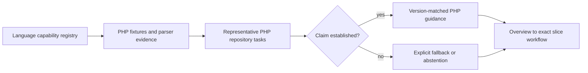

## Reverse-caller query and decision boundary

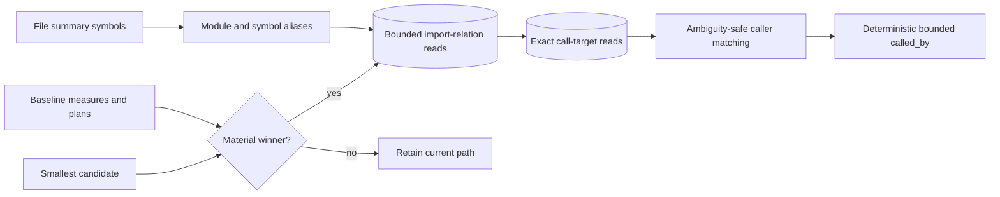

## Graph-construction worker and publication ownership

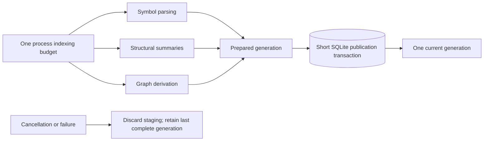

## Filtered custom-harness timeout ownership

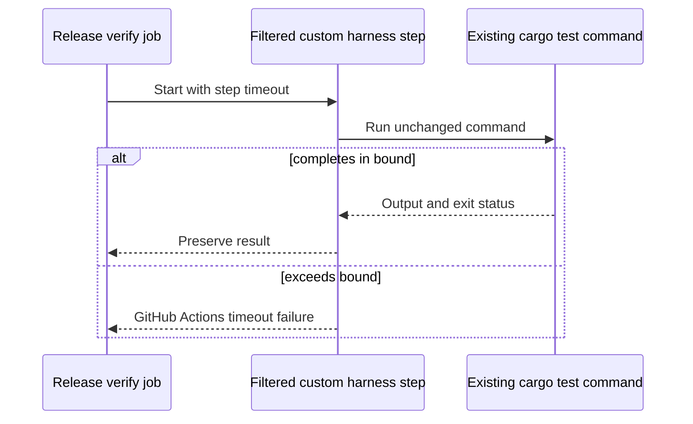

## Entrypoint-profile reachability

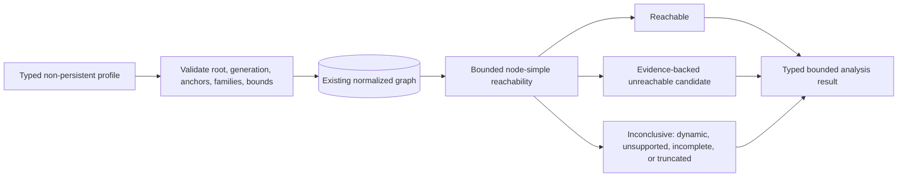

## npm runtime selection and integrity

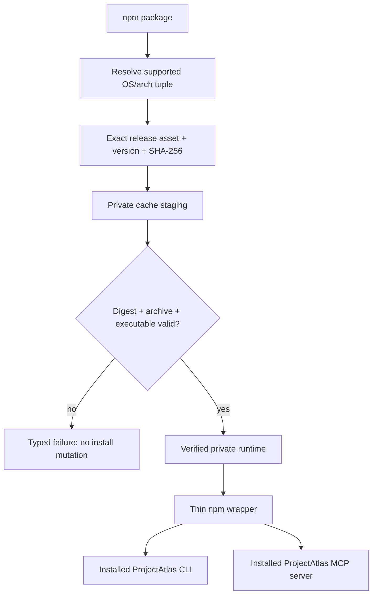

## Real host configuration consumption

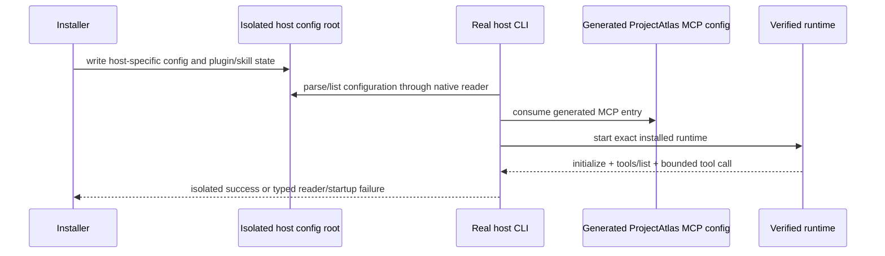

## Released-main database baseline decision

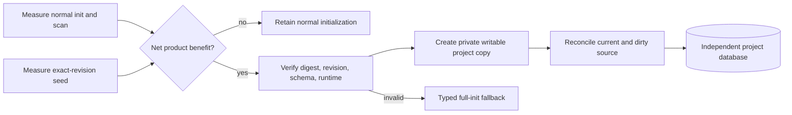

## Deterministic architecture-community analysis

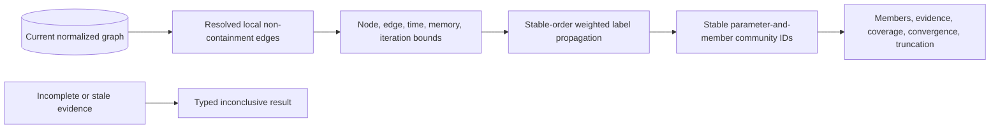

## Bounded PDF and DOCX extraction

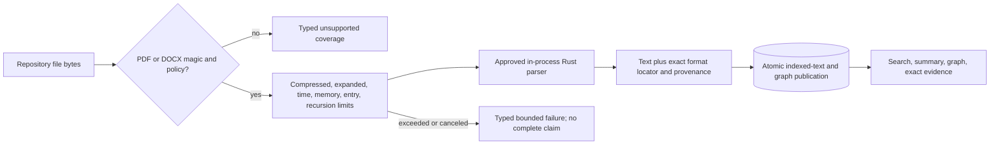

## Invalid graph identity admission

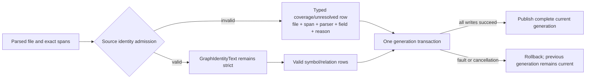

## Built-in PHP parser and graph publication

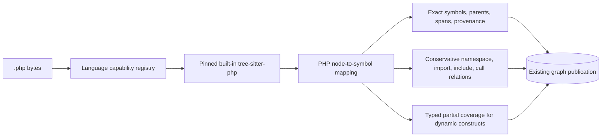

## Bounded document-reason publication

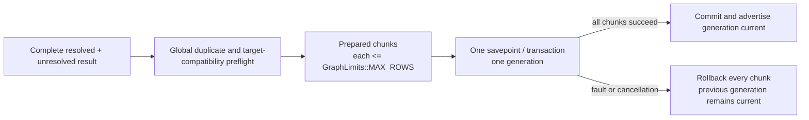

## Canonical project-root identity

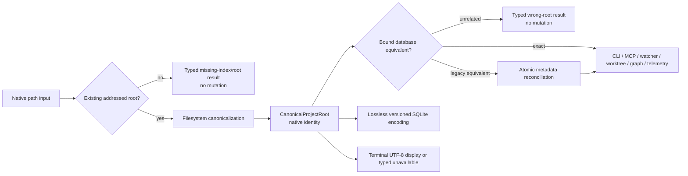

## Rust 1.98.0 toolchain upgrade and verification

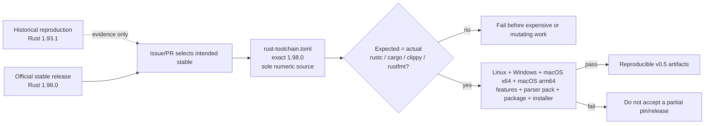

## macOS optional-parser capability truth

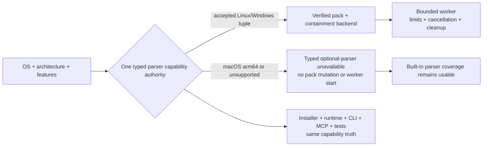

## Native non-UTF-8 worktree identity

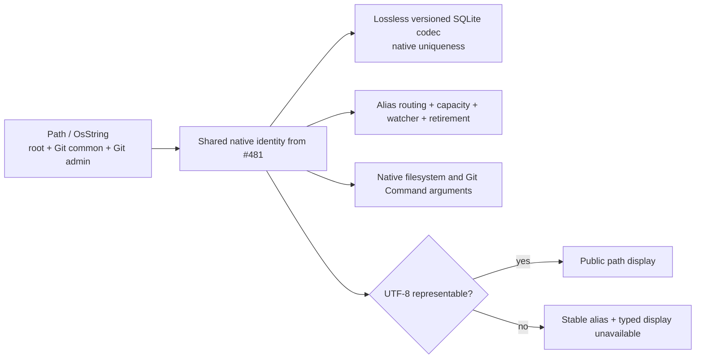

## Clean macOS Apple Silicon installed lifecycle

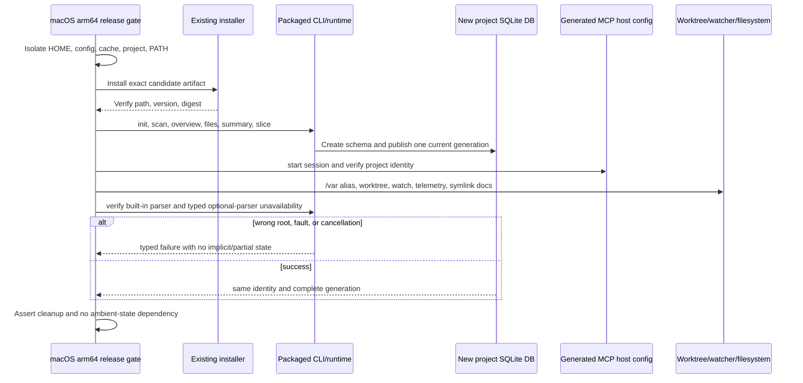

## macOS all-features reachability

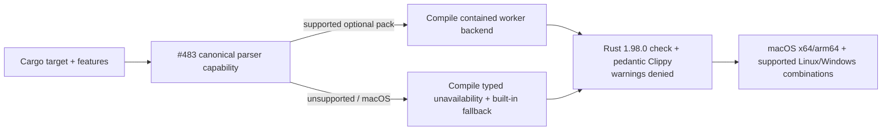

## CLI E2E contract ownership split

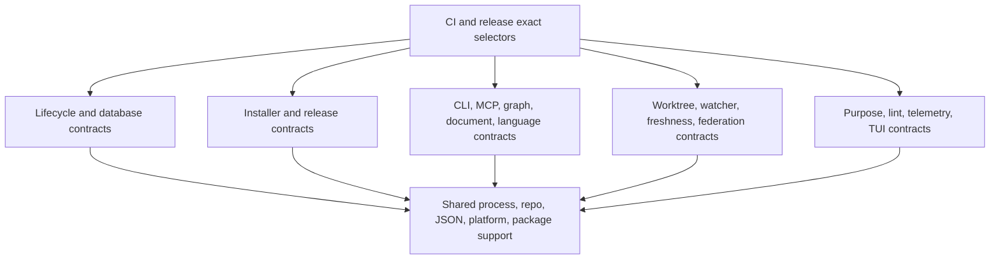

## Production module ownership decision

```mermaid
flowchart LR
    callers[CLI, MCP, tests, services] --> map[Call, state, data, error, transaction map]
    map --> decision{Independent durable owner proven?}
    decision -->|no| retain[Retain current module with evidence]
    decision -->|yes| move[Move cohesive responsibility]
    move --> facade[Preserve owning public re-export]
    facade --> tests[Compatibility, SQLite, fault, concurrency, E2E proof]
    db[(One schema and transaction authority)] --> move
```

## Benchmark artifact retention boundary

```mermaid
flowchart LR
    run[Benchmark run] --> classify{Compact durable evidence?}
    classify -->|yes| source[Sanitized summary or bounded result in source]
    classify -->|large raw trace| local[Ignored local output]
    classify -->|release evidence| release[Release or external artifact]
    gate[Deterministic tracked-file policy] --> source
    gate --> reject[Reject accidental oversized raw source artifact]
```

## Repeatable real-task agent evaluation

```mermaid
flowchart LR
    prereg[Versioned preregistration] --> baseline[Baseline arm]
    prereg --> atlas[ProjectAtlas arm]
    baseline --> retain[Retain success, failure, timeout, uncertainty]
    atlas --> retain
    retain --> sanitize[Redact private paths/content and bound artifacts]
    sanitize --> metrics[Success, time, wrong-file reads, context, tool bytes]
    metrics --> report[Compact observed comparison; modeled claims remain separate]
```

## atlas shim lifecycle and command compatibility

```mermaid
flowchart TB
  installer[Installer] --> collision{Existing atlas command?}
  collision -->|unmanaged| reject[Typed collision; no overwrite]
  collision -->|managed| shim[Atomic managed shim install]
  shim --> discover[PATH discovery]
  discover --> aliases[atlas top-level command aliases]
  aliases --> canonical[Canonical projectatlas command handlers]
  aliases --> resolve[atlas health resolve]
  aliases --> legacy[atlas health-check remains compatible]
  shim --> uninstall[Managed uninstall/repair]
  uninstall --> clean[Remove only managed artifact]
```

## Planned-issue specification and delivery flow

Issue forms supply behavior-level acceptance and applicable bug or improvement context. Sol turns that intake into one coherent body/OpenSpec/diagram packet and owns semantic acceptance plus every GitHub state transition. The tracked body manifest exposes every complete sanitized body byte and digest to exact-head independent Sol and hosted Codex review; ignored `.tmp` copies are not authority. After acceptance, strict schema/set/hash validation precedes a controlled manifest-only thirty-body bootstrap and normalized live readback while the planning PR remains open and the authoritative graph remains at the live twenty-five-child state. The temporary body-to-`main` architecture-link gap exists only to make normal unfiltered IssueOps/CI executable and authorizes no readiness. After the planning artifacts merge, Luna lands the objective repository integration; Sol then bootstraps hosted relationships from the separate graph manifest and promotes the accepted graph atomically through a narrow PR that removes both manifests before any product handoff.

```mermaid
flowchart TB
    Intake["Issue-form intake: acceptance plus applicable reproduction or agent workflow"] --> SolSpec["Sol specification: body, OpenSpec, diagram meaning, and release role"]
    SolSpec --> CandidateReview{"Candidate eight-question semantic review passes?"}
    CandidateReview -- No --> CandidateBlocked(["No publication: Sol repairs the candidate packet"])
    CandidateReview -- Yes --> PlanningPR["Open planning PR: specs, diagrams, tracked body and graph manifests, task mappings; active graph stays live at 25 children"]
    PlanningPR --> ExactHeadReview{"Independent Sol and new hosted Codex reviews accept the exact head?"}
    ExactHeadReview -- No --> ReviewBlocked(["No mutation: correct and rereview the exact PR head"])
    ExactHeadReview -- Yes --> BodyManifest{"Body manifest schema, exact issue set, bytes, hashes, and convenience copies agree?"}
    BodyManifest -- No --> ManifestBlocked(["No publication: repair and rereview the tracked source"])
    BodyManifest -- Yes --> BodyPublication["Primary Sol publishes only reconstructed body bytes and reads back exact 30 normalized bodies/hashes"]
    BodyPublication --> LinkGap["Temporary body-to-main architecture-link gap: no readiness"]
    LinkGap --> PlanningCI{"Normal unfiltered IssueOps and CI green?"}
    PlanningCI -- No --> PlanningBlocked(["No merge or readiness: repair the packet and repeat exact-head review"])
    PlanningCI -- Yes --> PlanningMerge["Primary Sol merges and reads back exact planning main"]
    PlanningMerge --> ObjectiveImplementation["Luna implements the objective repository checker, forms, and guidance contract"]
    ObjectiveImplementation --> ObjectiveReadback{"Accepted review and exact implementation-main readback?"}
    ObjectiveReadback -- No --> ImplementationBlocked(["No graph bootstrap: Luna repairs the repository integration"])
    ObjectiveReadback -- Yes --> NativeState["Primary Sol applies and reads back the hosted milestone and 29-child native graph"]
    NativeState --> HostedReadback{"Complete hosted state matches the accepted graph manifest?"}
    HostedReadback -- No --> HostedBlocked(["No promotion or readiness: Sol repairs partial hosted state"])
    HostedReadback -- Yes --> Promotion["Separate narrow PR promotes graph/campaign and atomically removes both candidate manifests"]
    Promotion --> PublishedReadback{"Exact merged main, live IssueOps, and hosted graph agree?"}
    PublishedReadback -- No --> PromotionBlocked(["No readiness: Sol repairs and rereads promotion state"])
    PublishedReadback -- Yes --> SemanticReadback{"Fresh eight-question Sol reconciliation passes?"}
    SemanticReadback -- No --> SemanticBlocked(["No handoff: Sol repairs packet meaning"])
    SemanticReadback -- Yes --> FinalReview["Finish #500 implementation-versus-diagram review"]
    FinalReview --> Complete500["Complete #500, then independently synchronize shared task 1.4"]
    Complete500 --> Readiness{"Each issue's exact published packet is ready?"}
    Readiness -- No --> IssueBlocked(["No product handoff: repair that issue's packet"])
    Readiness -- Yes --> ProductHandoff["Luna product implementation handoff"]
```

## Structural IssueOps and semantic Sol ownership

IssueOps owns deterministic structure and synchronization; Sol owns comprehension. Neither lane substitutes for the other, and no LLM or prose score runs in CI. A packet reaches readiness only after both lanes pass against the same published body, OpenSpec, diagrams, and release graph.

```mermaid
flowchart TB
    Packet[Published planned-issue packet]
    Packet --> Structural{"IssueOps structure valid?"}
    Structural -- No --> StructuralBlocked([Readiness and handoff remain blocked])
    StructuralBlocked --> StructuralRepair["Sol repairs packet structure; Luna corrects the objective gate only if its result is wrong"]
    StructuralRepair --> Packet
    Structural -- Yes --> Semantic{"Sol eight-question meaning review passes?"}
    Semantic -- No --> SemanticBlocked([Readiness and handoff remain blocked])
    SemanticBlocked --> SemanticRepair["Sol-owned repair: actor, behavior, capability, release role, acceptance, failures, diagram meaning, or task fit"]
    SemanticRepair --> Packet
    Semantic -- Yes --> Ready([Sol may authorize the next transition])
```

## Lean affected-contract planning and stable-context aggregation

Pull-request optimization selects existing proof; it never deletes proof. One closed contract and one standard-library planner serve human and Dependabot pull requests. Only ordinary additions and modifications may union known impacts. Every rename or deletion, plus unknown, shared, or planner-owning input, selects full proof even when every observed path is classified. Every shared or release boundary starts in full-proof mode, and stable required contexts accept only current plan-bound evidence.

```mermaid
flowchart TB
    Event[Workflow event] --> EventClass{Pull-request boundary?}
    EventClass -- No: main, schedule, candidate, release --> Full[Select complete proof set]
    EventClass -- Yes: human or Dependabot --> ChangeKind{Any rename or deletion?}
    ChangeKind -- Yes, even if classified --> Full
    ChangeKind -- No: ordinary additions or modifications --> Inputs[Diff + closed impact contract + one cargo metadata result]
    Inputs --> Trusted{Plan complete, current, and fully classified?}
    Trusted -- No: unknown, shared, planner-owned, stale, malformed --> Full
    Trusted -- Yes --> Affected[Union known impacts into smallest contract-complete set]
    Full --> Jobs[Run existing build, test, quality, and platform contracts]
    Affected --> Jobs
    Jobs --> Result{Current result for each stable context}
    Result -- Affected pass --> Bind[Validate base, head, event, contract, workflow, toolchain, platform, and plan digest]
    Result -- Trusted plan-bound N/A --> Bind
    Result -- Missing, skipped, canceled, failed, or malformed --> Fail([Required context fails])
    Bind -- Exact match --> Pass([Stable context succeeds])
    Bind -- Missing, stale, or mismatched --> Fail
```

## One Dependabot campaign from weekly intake through release

GitHub-hosted Dependabot remains the weekly pull-request producer. The trusted default-branch workflow owns one v0.5.0 campaign inventory. CI selection stays with the shared affected-contract planner; the campaign only reconciles identity, review, and disposition. Historical pre-contract checks remain history, not later-gate proof.

```mermaid
flowchart TB
    subgraph PostContract[Post-contract pull request]
        Config[Default .github/dependabot.yml] --> Hosted[Hosted weekly Dependabot producer]
        Hosted --> PullRequest[Create or update Dependabot PR]
        PullRequest --> Intake[Reconcile exact PR, head, milestone, and Relates to campaign]
        Intake --> Refresh[Refresh or rebase onto accepted current main]
        Refresh --> SharedCI[Run the same affected planner and protected quality bar]
        SharedCI --> CurrentProof{Exact current proof succeeds?}
        CurrentProof -- No --> FailureBasis{Failure evidence?}
        FailureBasis -- Proven stale baseline and retry budget remains --> Drift[Record baseline drift, not package regression]
        Drift --> Refresh
        FailureBasis -- Genuine, unknown, or retry exhausted --> Technical[Blocking technical disposition or corrective delivery]
        Technical --> FutureBlock([Admission and checkpoint blocked])
        CurrentProof -- Yes --> Review[Read back review, threads, branch sync, and every protected context]
        Review --> Sol[Explicit exact-head Sol authorization dispatch]
        Sol --> PRRecord[Record final disposition]
    end
    PRRecord --> Inventory[(One machine-owned campaign body region)]

    subgraph PreContract[Pre-contract merged record]
        Historical[Read exact historical merge and head] --> Retrospective{Main inclusion, safe metadata, fresh Sol review, and current full proof pass?}
        Retrospective -- No --> Corrective[Require revert, fix, or superseding delivery]
        Corrective --> RetroBlock([Retrospective acceptance blocked])
        Retrospective -- Yes --> RetroRecord[Record retrospective_precontract provenance, historical gap, and final disposition]
    end
    RetroRecord --> Inventory
```

## Dependency audit and two-stage release checkpoints

The same trusted default-branch workflow runs the audit once before RC and again after the accepted RC but before stable. Both executions translate the current Dependabot configuration without loss, keep the issues-write token outside every updater/proxy boundary, and allow campaign reconciliation only after bounded sanitized output and certain container cleanup. A failed, canceled, or uncertain hosted run receives no issues-write token and performs no campaign mutation; its hosted conclusion plus a missing or stale matching final campaign audit record blocks until a fresh successful audit/reconciliation. A would-be update without a hosted PR becomes a separate pre-PR finding with audit/update identity only. An unlinked finding may be deferred, declined, or superseded but never accepted; accepted requires exact linkage to a finally accepted real PR. The single campaign body region advances from `collecting` to exact `candidate_ready` and later `stable_ready`; it is not a second graph or database.

```mermaid
flowchart TB
    Config[Default .github/dependabot.yml] --> Audit["Pre-RC or pre-stable audit: lossless, token-isolated, bounded, and cleaned up"]
    Dispatch[Trusted gh workflow run] --> Audit
    Audit -- failed or uncertain --> HostedFailure["Hosted run fails: no issue-write token or campaign mutation"]
    HostedFailure --> Block([Applicable checkpoint blocked until a fresh successful audit and reconciliation])
    Audit -- clean --> AuditFinal[Successful audit with no unresolved new finding]
    Audit -- findings --> Finding["Separate pre-PR finding: audit and update identity only; no PR fields"]
    Finding --> Resolution{"Finding resolution"}
    Resolution -- deferred, declined, or superseded --> AuditFinal
    Resolution -- matching hosted PR appears --> Readback["Authenticated readback creates the complete real PR record and link"]
    Readback --> PRFinal{"Linked PR finally dispositioned; accepted only when PR is finally accepted?"}
    PRFinal -- No --> Block
    PRFinal -- Yes --> AuditFinal
    Resolution -- pending or provisional --> Block
    AuditFinal --> Gate{"Successful hosted run, current final audit record, and every PR/finding final?"}
    PRRecords[All applicable hosted PR records finally dispositioned] --> Gate
    Gate -- No --> Block
    Gate -- Yes --> Snapshot["Exact checkpoint snapshot: revision, PR/finding union, config, audit, and tool identities"]
    Snapshot --> Stage{"Which exact checkpoint is final?"}
    Stage -- pre-RC --> CandidateReady[candidate_ready bound to exact RC revision and inventory]
    CandidateReady --> RC1([Publish and accept RC1 while issues 499 and 492 stay open])
    RC1 --> StableWindow["Continue weekly intake; retain candidate history and later records"]
    StableWindow --> Audit
    Stage -- pre-stable --> StableReady[stable_ready exact full-window readback]
    StableReady --> Close499[Close campaign issue 499]
    Close499 --> Release([Stable issue 492 acceptance may begin])
```

## CI and dependency campaign sequencing

#500 first restores the shared acceptance structure and packet-readiness mechanism without becoming a native blocker of #497, #482, or other product issues. After #497's own packet passes that contract and the required #500 mechanism/order is accepted, #497 lands as the first implementation operational priority. #498 genuinely depends on #497; #482 remains dependency-free. #499 waits for both accepted results, then owns the ordered high-impact update campaign while all other disjoint release lanes continue independently.

```mermaid
flowchart TB
    subgraph Readiness[Shared readiness - no native #500 product edge]
        Contract500[#500 acceptance mechanism and issue-packet migration]
        Packet497[#497 body, OpenSpec, diagram, and acceptance reconciled]
        Gate497{Shared mechanism and #497 packet accepted?}
        Contract500 -. readiness prerequisite, not blocked_by .-> Gate497
        Packet497 --> Gate497
    end
    subgraph Priority[Operational priority only - no #497 to #482 blocker]
        CI497[#497 lean affected CI lands first]
    end
    subgraph Foundations[Genuine prerequisite lanes]
        Auto498[#498 campaign automation]
        Rust482[#482 exact Rust 1.98.0]
    end
    Gate497 -- Yes --> CI497
    Gate497 -- No --> Stop([Handoff blocked])
    CI497 -- Genuine blocker for #498 --> Auto498
    Auto498 --> Ready{#498 and #482 accepted on main?}
    Rust482 --> Ready
    Ready -- No --> Stop
    Ready -- Yes --> Campaign499[#499 sole v0.5.0 campaign]
    Campaign499 --> PR453[#453 object: Rust and parser]
    PR453 --> PR454[#454 rusqlite: Rust, database, SQLite]
    PR454 --> PR455[#455 rmcp: Rust and MCP]
    PR455 --> CandidateState{Pre-RC audit and candidate inventory final?}
    CandidateState -- No --> Stop
    CandidateState -- Yes --> RC1[RC1 while #499 and #492 remain open]
    RC1 --> StableState{Post-RC audit and full-window inventory final?}
    StableState -- No --> Stop
    StableState -- Yes --> Close499[Close #499]
    Close499 --> Release492[Stable #492 acceptance closes last]
    Parallel[Existing independent release lanes] --> Release492
```

## v0.5.0 candidate, readback, remediation, and stable promotion

```mermaid
stateDiagram-v2
  [*] --> PublishedIssueReadback: read exact main issue bodies, acceptance, OpenSpec, and architecture targets
  PublishedIssueReadback --> PublicationRepair: body, task, document, heading, or Mermaid is missing or stale
  PublicationRepair --> PublishedIssueReadback: planning PR publishes corrected evidence
  PublishedIssueReadback --> SemanticRepair: eight-question Sol reconciliation fails
  SemanticRepair --> PublishedIssueReadback: specification owner repairs the packet
  PublishedIssueReadback --> ExactRevision: twenty-nine-child graph exact, implementation children closed, semantic audit passes, campaign candidate-ready
  ExactRevision --> SurfaceInventory: freeze complete CLI and MCP inventory
  SurfaceInventory --> InstalledProof: safely execute every supported route
  InstalledProof --> CandidateBuild: package exact main revision
  CandidateBuild --> UpdateProof: update exercised v0.4.5 installation and database
  UpdateProof --> RCMilestoneGate: trusted prerelease classification, only graph-derived issues 492 and 499 open, exact candidate-ready binding
  RCMilestoneGate --> RC1: prerelease gate passes while campaign and release issues stay open
  RCMilestoneGate --> Remediation: extra open issue, role drift, or candidate evidence mismatch
  UpdateProof --> Remediation: update or migration blocker
  RC1 --> HostedReadback: independently verify tag, assets, runtime, and Latest
  HostedReadback --> Remediation: confirmed blocker
  Remediation --> PublishedIssueReadback: return defect to owning child issue and restart proof
  HostedReadback --> StableCampaign: accepted candidate then continue intake and run pre-stable audit
  StableCampaign --> StableSemanticReadback: campaign stable-ready, campaign issue closed, every child closed
  StableSemanticReadback --> StableArchitectureReview: complete and check task 26.7 final implementation-versus-diagram review
  StableArchitectureReview --> StableFinalizationGate: only issue 492 open and only task 26.6 unchecked, exact stable input and prepublication proof
  StableArchitectureReview --> Remediation: implementation and diagram disagree
  StableFinalizationGate --> StableBuild: package exact stable input
  StableFinalizationGate --> Remediation: extra issue or task, role drift, or stale proof
  StableBuild --> StableInstalledProof: repeat installed public-surface and update proof
  StableInstalledProof --> StablePublication: explicit authorization publishes exact stable assets
  StableInstalledProof --> Remediation: installed or update blocker
  StablePublication --> StableReadback: independently verify hosted identity
  StableReadback --> Remediation: confirmed blocker or hosted product mismatch
  StableReadback --> FinalSynchronization: v0.5.0 is Latest and downstream pins agree
  FinalSynchronization --> Close492: check task 26.6 and close release root last
  Close492 --> CloseMilestone: close milestone after every issue
  CloseMilestone --> PostPublicationGate: reread exact hosted release, Latest, pins, issues, tasks, reviews, OpenSpec, and milestone
  PostPublicationGate --> FinalState: all mapped issues closed, all mapped tasks checked, synchronized final state verified
  PostPublicationGate --> FinalizationRepair: missing, stale, partial, raced, or mismatched synchronization
  FinalizationRepair --> PostPublicationGate: restore exact synchronized state and reread
  FinalState --> [*]
```
