# v0.5.0 release architecture

Each mapped v0.5.0 issue owns one focused view below. The release graph in `openspec/issue-map.json` owns hierarchy and implementation order; #492 owns acceptance only and closes after every child issue.

## PHP language-guidance evidence flow

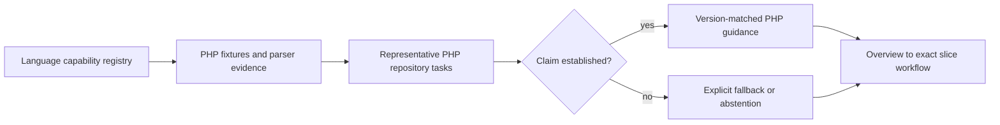

## Reverse-caller query and decision boundary

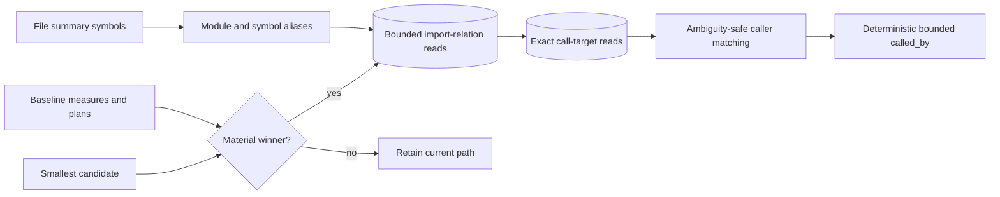

## Graph-construction worker and publication ownership

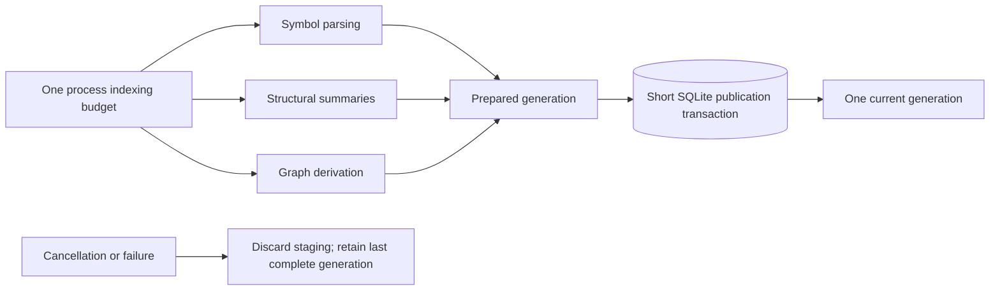

## Filtered custom-harness timeout ownership

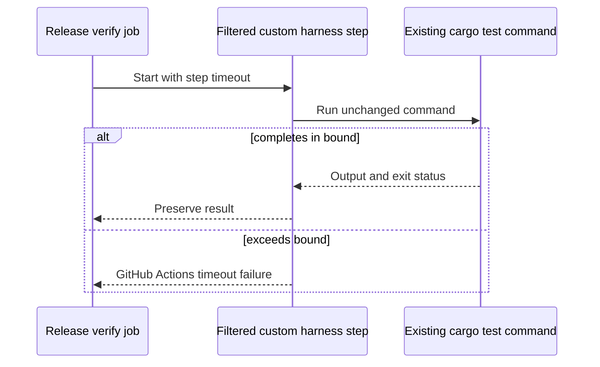

## Entrypoint-profile reachability

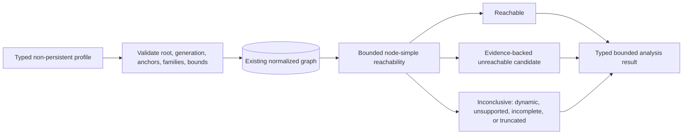

## npm runtime selection and integrity

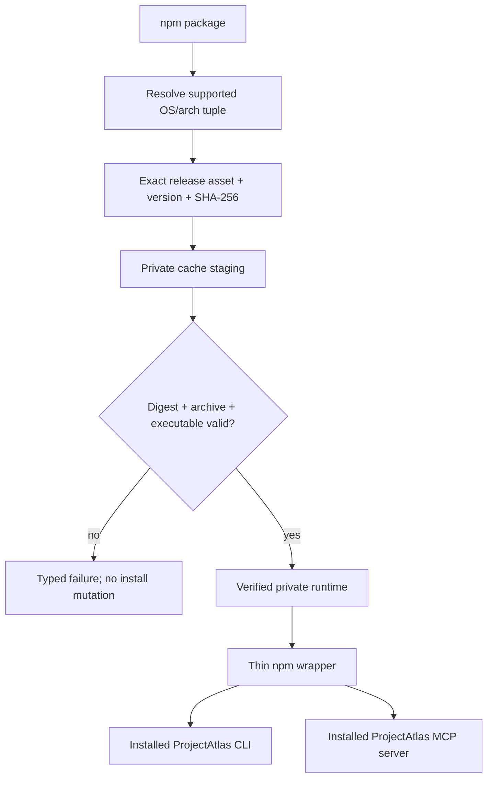

## Real host configuration consumption

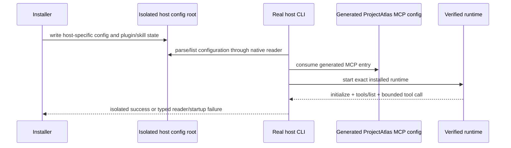

## Released-main database baseline decision

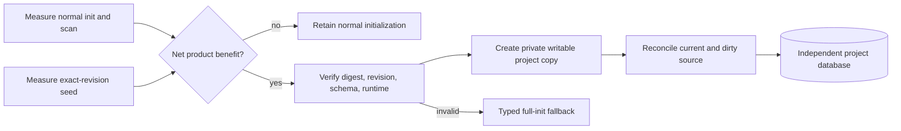

## Deterministic architecture-community analysis

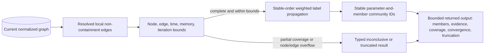

## Bounded PDF and DOCX extraction

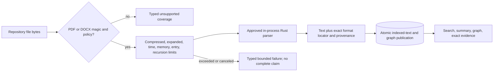

## Invalid graph identity admission

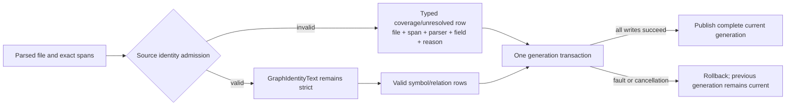

## Built-in PHP parser and graph publication

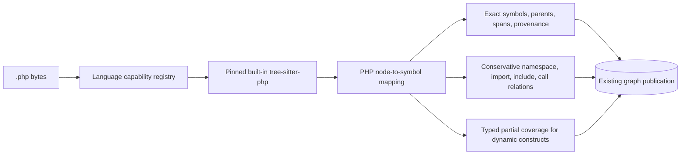

## Bounded document-reason publication

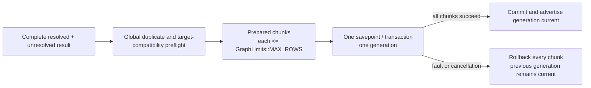

## Canonical project-root identity

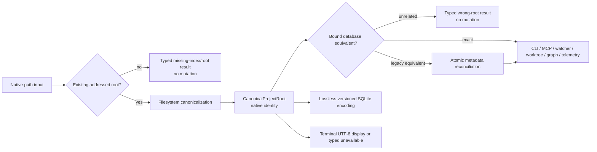

## Rust 1.98.0 toolchain upgrade and verification

Rust 1.93.1 is retained only as historical reproduction evidence. Each intended
stable upgrade is evaluated in its own issue and pull request; the repository
pins a numeric version only after the complete local and hosted gates pass.
Floating `stable` and workflow-local numeric pins are not release inputs.

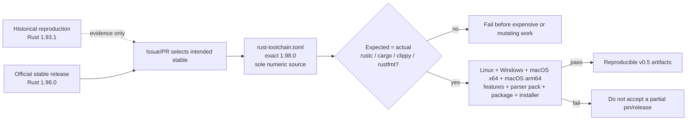

## macOS optional-parser capability truth

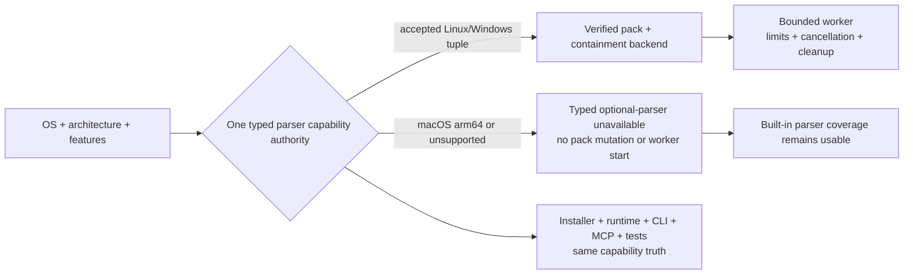

## Native non-UTF-8 worktree identity

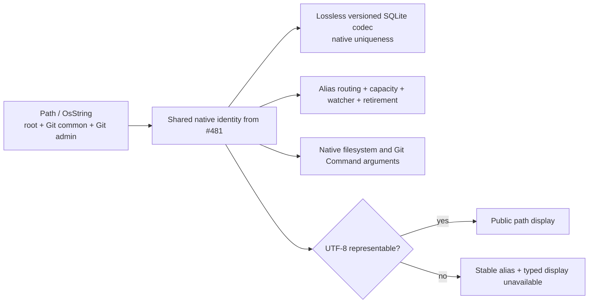

## Clean macOS Apple Silicon installed lifecycle

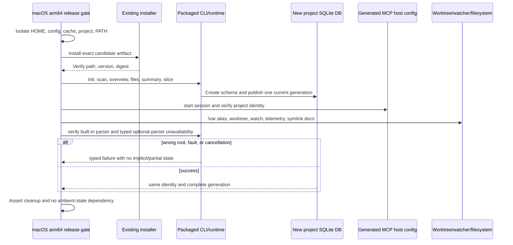

## macOS all-features reachability

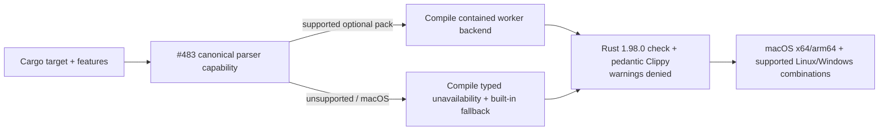

## CLI E2E contract ownership split

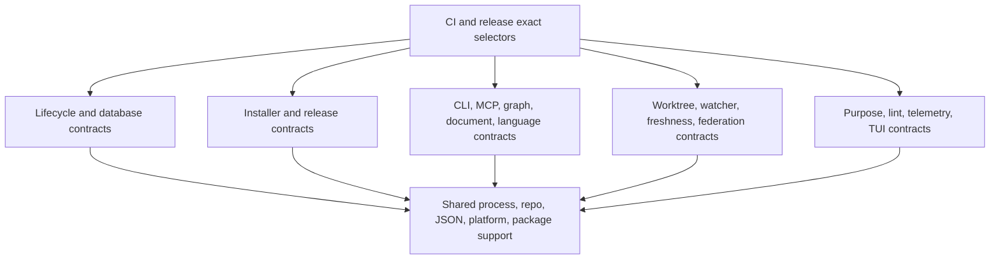

## Production module ownership decision

```mermaid
flowchart LR
    callers[CLI, MCP, tests, services] --> map[Call, state, data, error, transaction map]
    map --> decision{Independent durable owner proven?}
    decision -->|no| retain[Retain current module with evidence]
    decision -->|yes| move[Move cohesive responsibility]
    move --> facade[Preserve owning public re-export]
    facade --> tests[Compatibility, SQLite, fault, concurrency, E2E proof]
    db[(One schema and transaction authority)] --> move
```

## Benchmark artifact retention boundary

```mermaid
flowchart LR
    run[Benchmark run] --> classify{Compact durable evidence?}
    classify -->|yes| source[Sanitized summary or bounded result in source]
    classify -->|large raw trace| local[Ignored local output]
    classify -->|release evidence| release[Release or external artifact]
    gate[Deterministic tracked-file policy] --> source
    gate --> reject[Reject accidental oversized raw source artifact]
```

## Repeatable real-task agent evaluation

```mermaid
flowchart LR
    prereg[Versioned preregistration] --> baseline[Baseline arm]
    prereg --> atlas[ProjectAtlas arm]
    baseline --> retain[Retain success, failure, timeout, uncertainty]
    atlas --> retain
    retain --> sanitize[Redact private paths/content and bound artifacts]
    sanitize --> metrics[Success, time, wrong-file reads, context, tool bytes]
    metrics --> report[Compact observed comparison; modeled claims remain separate]
```

## atlas shim lifecycle and command compatibility

```mermaid
flowchart TB
  installer[Installer] --> collision{Existing atlas command?}
  collision -->|unmanaged| reject[Typed collision; no overwrite]
  collision -->|managed| shim[Atomic managed shim install]
  shim --> discover[PATH discovery]
  discover --> aliases[atlas top-level command aliases]
  aliases --> canonical[Canonical projectatlas command handlers]
  aliases --> resolve[atlas health resolve]
  aliases --> legacy[atlas health-check remains compatible]
  shim --> uninstall[Managed uninstall/repair]
  uninstall --> clean[Remove only managed artifact]
```

## v0.5.0 candidate, readback, remediation, and stable promotion

```mermaid
stateDiagram-v2
  [*] --> PublishedIssueReadback: read exact main OpenSpec and architecture targets
  PublishedIssueReadback --> PublicationRepair: mapped task, document, heading, or Mermaid is missing or stale
  PublicationRepair --> PublishedIssueReadback: planning PR publishes corrected evidence
  PublishedIssueReadback --> ExactRevision: published milestone gate and every required review pass
  ExactRevision --> SurfaceInventory: freeze complete CLI and MCP inventory
  SurfaceInventory --> InstalledProof: safely execute every supported route
  InstalledProof --> CandidateBuild: package exact main revision
  CandidateBuild --> UpdateProof: update exercised v0.4.5 installation and database
  UpdateProof --> RC1: state, migration, failure, retry, and rollback hard gate passes
  UpdateProof --> Remediation: update or migration blocker
  RC1 --> HostedReadback: independently verify tag, assets, runtime, and Latest
  HostedReadback --> Remediation: confirmed blocker
  Remediation --> PublishedIssueReadback: return defect to owning child issue and restart proof
  HostedReadback --> StableBuild: accepted candidate and no blocker
  StableBuild --> StableReadback: repeat installs and hosted identity
  StableReadback --> FinalState: v0.5.0 is Latest with hierarchy, issues, milestone, and workflows verified
  FinalState --> [*]
```
