# v0.5.0 release architecture

Each mapped v0.5.0 issue owns one focused view below. The release graph in `openspec/issue-map.json` owns hierarchy and implementation order; #492 owns acceptance only and closes after every child issue.

## Issue task authority and owner slices

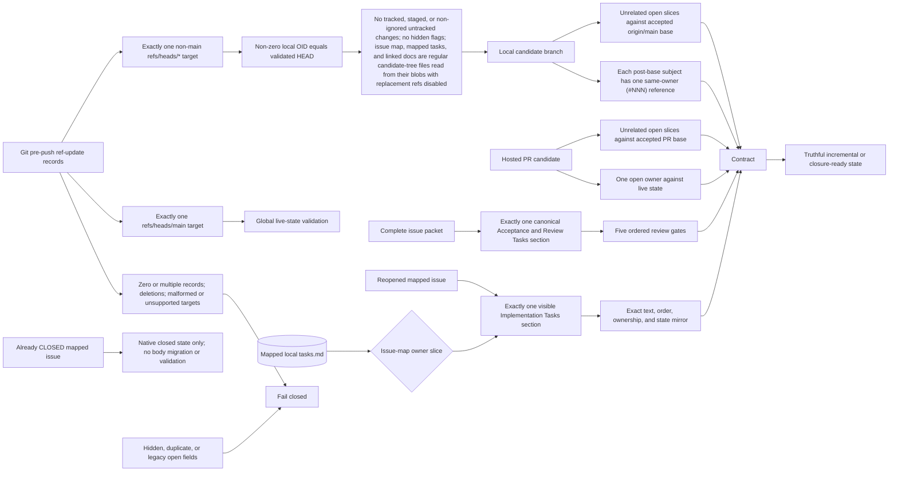

## Acceptance-state transition

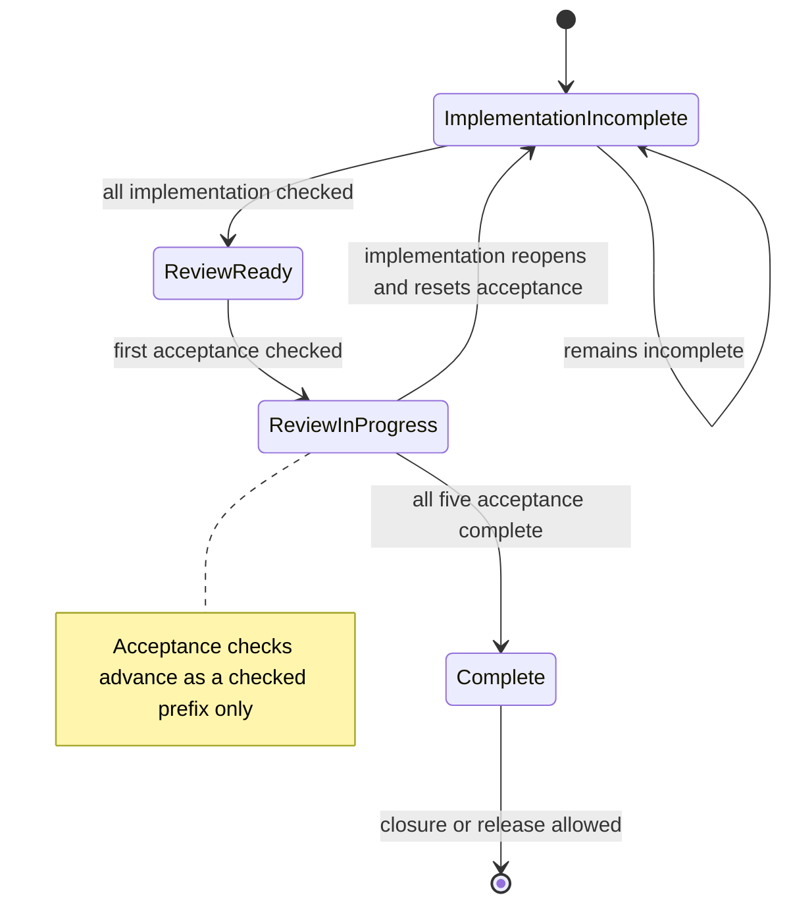

## PHP language-guidance evidence flow

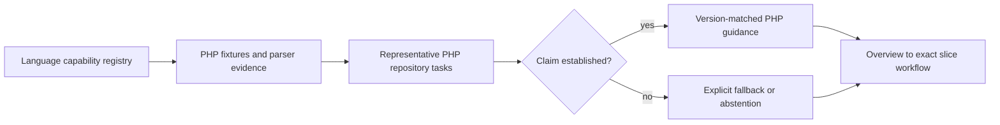

## Reverse-caller query and decision boundary

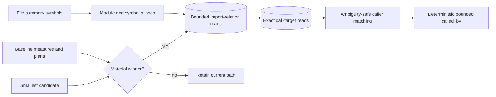

## Graph-construction worker and publication ownership

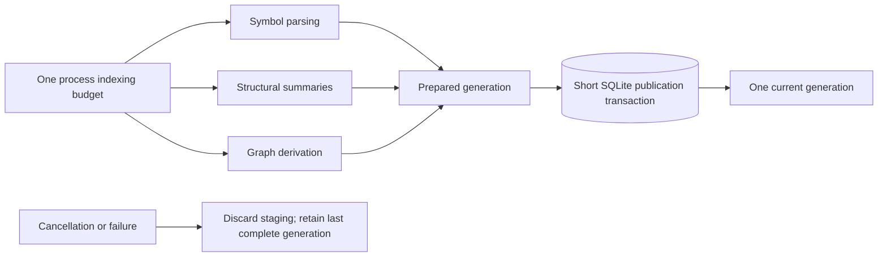

## Filtered custom-harness timeout ownership

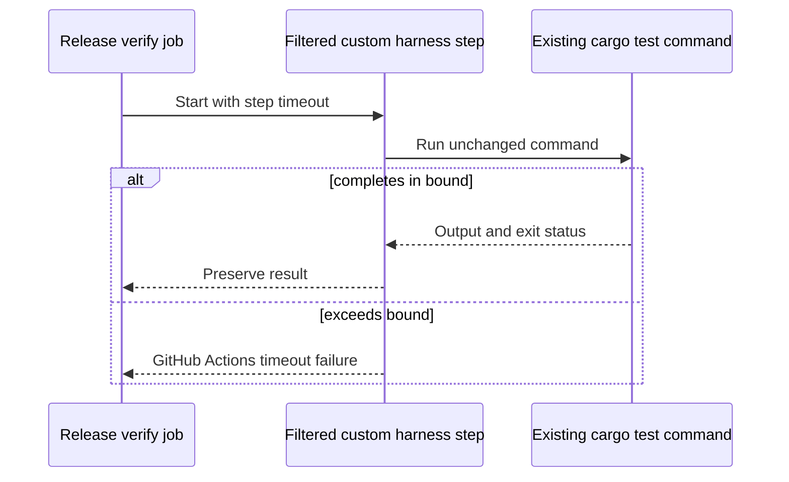

## Entrypoint-profile reachability

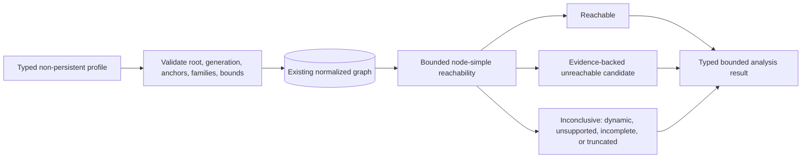

## npm runtime selection and integrity

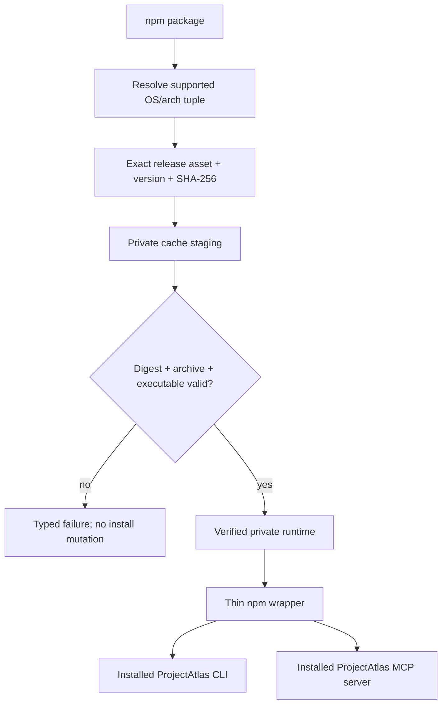

## Real host configuration consumption

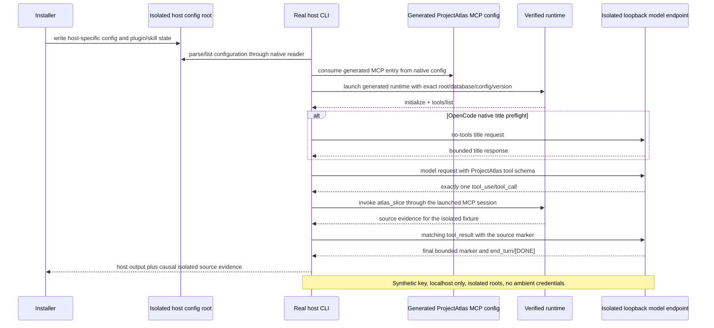

## Released-main database baseline decision

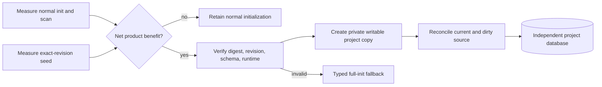

## Deterministic architecture-community analysis

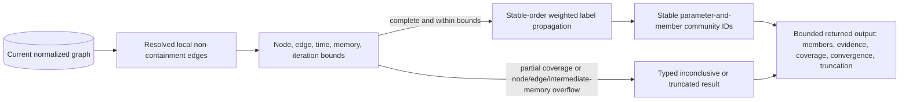

## Bounded PDF and DOCX extraction

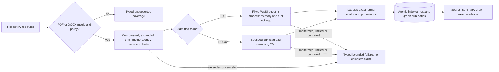

The document boundary pins a fixed `pdf-extract` `0.12.0+projectatlas` guest
with `lopdf` `0.44.0`, the `wasmi`/`wasmi_core` `2.0.0` host, `quick-xml`
`0.42.0`, and `zip` `0.6.6` (ZIP defaults disabled, only `deflate` enabled).
The PDF guest is embedded build-owned code; callers cannot select modules.
Linux x86-64 with the repository-pinned Rust toolchain and locked WASI dependency
tree is its canonical builder. `packaging/pdf-parser/build.py --install-target
--validate` rebuilds and requires exact equality with the checked-in bytes in CI;
`--write` is an explicit artifact update on that builder. Other hosts reject byte
production and use `--validate --source-only` for guest format, Clippy, native
tests, and locked dependency checks. All native platform jobs test the same
embedded canonical guest through extraction, CLI/MCP navigation, and measurements.
The build resolves dependency sources before canonical source-path remapping and
uses one release code-generation unit. Cross-host compiler output equality is
not an artifact claim.
Each parse has 64 MiB linear memory, a 1 MiB
interpreter value stack, 256 call depth, 500 million total instruction fuel,
and a ten-second ceiling that respects an earlier caller deadline. Fuel
suspensions check cancellation; real allocation denial remains a typed limit.
The host supplies bounded entropy and an empty environment, with no filesystem,
network, clock, or process capabilities. Page-tree validation and bounded
stream decoding precede exact-page formatting, including Form text and scoped
fonts. Image pixels remain opaque. Local dependency patches and retained
attribution are documented in `packaging/pdf-parser/vendor/pdf-extract/PROJECTATLAS.md`.
PDF admission requires a `%PDF-` header and extracts only page text; DOCX
admission requires a ZIP header, admits only stored or DEFLATE entries, rejects
unsafe, duplicate, encrypted, or otherwise unsupported package input, and passes
only `word/document.xml` to the parser. Nested WordprocessingML text boxes retain
and resume their outer paragraph/run context, emitting interrupted run fragments
in document order with their original decoded byte offsets. Complex-field code
and deleted-text carriers are validated without execution or publication;
cached field results and instruction-text leaves outside field-code regions
remain literal document text. Field nesting has its own 64-level bound and is
isolated across text-box contexts. Markup Compatibility alternatives select only
the first choice whose required namespaces are understood WordprocessingML, or
the fallback. Unselected branches cannot alter text, locators, or field context;
they retain XML depth, well-formedness, and declaration checks. Explicit language overrides take precedence
over a PDF/DOCX extension. Explicit nonbreaking and soft hyphens retain their
Unicode characters and count toward decoded byte offsets. Each result carries a page/text-span or
part/paragraph/run/text-span locator plus its actual emitted-text line range
for symbol slicing, parser provenance, and a complete
coverage marker. Normal text, symbol, and summary admission uses the document
parser's 8 MiB raw-input ceiling; ordinary source retains its configured ceiling.
The boundary caps input/compressed package bytes at 8 MiB,
expanded package bytes at 32 MiB, the native source/parser staging envelope at 96 MiB,
retained output at 4 MiB, and package entries and evidence facts at 256 and
4,096 respectively; embedded-document recursion is limited to zero (the outer
document depth is one). It never executes macros,
scripts, external references, OCR, or embedded documents. Valid text is reused
by the existing `file_texts` FTS projection and locator-bearing blocks by the
existing graph publication transaction; no document-specific SQLite schema is
needed. Any malformed, mismatched, encrypted, over-limit, canceled, or
source-changed operation fails before publication, preserving the last complete
generation. The staging envelope excludes shared interpreter translation and allocator
overhead; process RSS is measured separately in platform proof. `.github/scripts/measure-bounded-documents.py`
scans three fresh isolated repositories, each with 64 sixteen-page PDFs and 64
sixty-four-paragraph DOCX files, using the optimized native CLI. It checks the
exact indexed file count and records CPU time, peak RSS, wall time, database and
output bytes, and native I/O counters. Windows reports process read/write
operations and transferred bytes; Linux/macOS report `wait4` filesystem block
operations, without claiming byte-equivalence across platforms. CI retains each
platform's report with the measured binary SHA-256. Per-run acceptance ceilings
are 120 seconds wall time, 90 seconds CPU, 768 MiB peak RSS, 64 MiB database,
1 MiB captured output, and two million native I/O operations. These are fixed-case
regression ceilings; hostile per-document limits remain enforced by the parser.

## Invalid graph identity admission

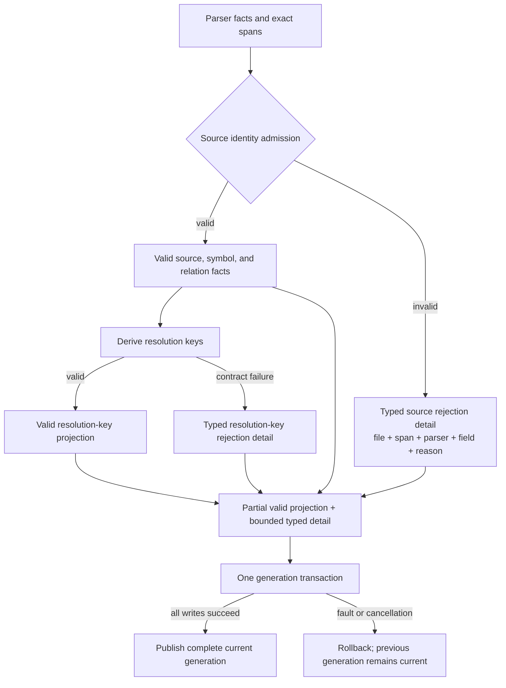

The coarse `graph_coverage.reason` remains a stable compatibility category;
bounded identity detail is generation-owned in the existing publication
transaction and is read through structured coverage rows. Rejected identity
text is never persisted, and a fault or cancellation leaves both the detail
rows and valid graph rows at the previous complete generation.

## Built-in PHP parser and graph publication

PHP call matching uses case-insensitive names and proven namespace/type ownership, including known global callers and explicit `namespace\` references. Qualified names expand against the known caller namespace when namespace imports cannot alias them. A namespace-use symbol introduces alias uncertainty for an ordinary unrooted call when it occurs on an earlier line within the same named namespace declaration block, or no later in parser relation order on a same line whose import symbols and relations pair losslessly. A simple same-line import after the caller does not suppress that earlier call. Grouped or multi-clause same-line imports with unmatched symbol/relation counts remain conservative. An import in an earlier reopened block does not suppress a later block's proven local call. Tied line-only boundaries and omitted namespace declarations remain conservative. Include/require and type-owned trait-use facts do not introduce alias uncertainty, including when unrelated dynamic code makes coverage partial. Include relations retain bounded source syntax so the shared import kind cannot be mistaken for a namespace alias. Missing namespace-import symbols and unknown or legacy import contexts remain conservative. `self::`, fully qualified, and explicit namespace-relative calls retain their independent scope checks. Dynamic dispatch and unproven scopes remain unresolved. Namespace identities beyond the parser's identity bound, or malformed semicolon namespaces, omit dependent facts and report partial coverage instead of publishing global declarations. A declaration rejected by identity or symbol-count limits admits no descendant symbols or relations; admitted siblings remain available and coverage is partial.

A proven outer-scope `__halt_compiler();` directive ends PHP traversal; the remaining bytes are embedded data and publish no declarations or calls.

Anonymous function and arrow-function bodies have no supported stable owner, so their subtrees are omitted with partial coverage instead of attributing calls to an enclosing named function. Grouped imports bound the prefix and combined target before allocation; omitted targets mark coverage partial while admitted imports remain available. If no complete target fits, a bounded grammar-owned alias or terminal binding remains an Import symbol, preserving alias uncertainty without fabricating a target relation. Short-tag code whose first identifier starts with `xml` remains PHP; only the XML declaration prefix is excluded as a prolog.

Call-source ownership and target scope share one lookup that prefers a unique line-containing PHP callable over unrelated same-name types or imports, then falls back to a namespace owner. Unknown or ambiguous callers retain file ownership, including namespace/callable collisions on a callable boundary line where line-only facts cannot prove the owner. Semicolon namespace declarations still own their later top-level calls. Reopened blocks with the same namespace name share one logical namespace owner for top-level calls. Trait-owned `self::` targets remain unresolved because the consuming class can override the trait member and trait composition is not modeled.

Non-PHP source provenance records the parser that produced the graph, including fallback. PHP retains Tree-sitter source provenance when bounded or unsupported behavior makes its grammar-produced facts partial fallback evidence. If an erroneous PHP parse yields no facts and the generic extractor rescues declarations, both source and fact provenance record fallback.

Scoped calls match methods and ordinary calls match functions; a namespace and class sharing a name cannot substitute one callable kind for the other. Named PHP function and type declarations belong to their active namespace even inside a function or method. Their declaration identity does not imply that conditional runtime execution has already made them available.

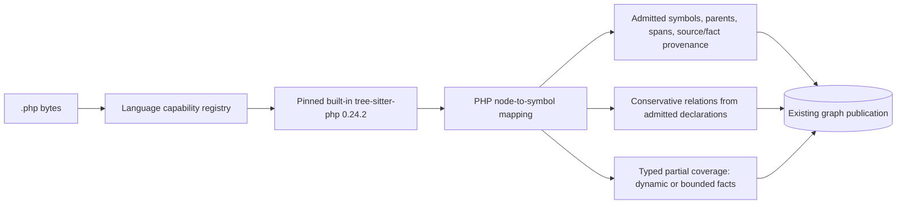

## Bounded document-reason publication

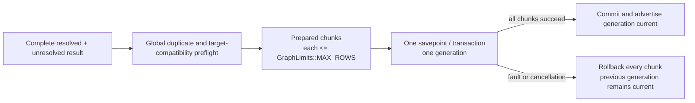

## Canonical project-root identity

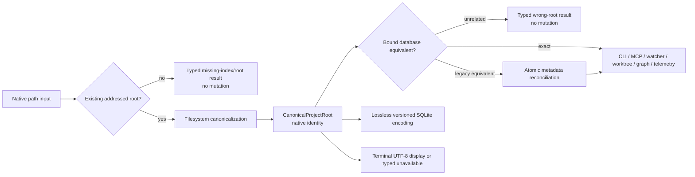

## Rust 1.98.0 toolchain upgrade and verification

Rust 1.93.1 is retained only as historical reproduction evidence. Each intended
stable upgrade is evaluated in its own issue and pull request; the repository
pins a numeric version only after the complete local and hosted gates pass.
Floating `stable` and workflow-local numeric pins are not release inputs.

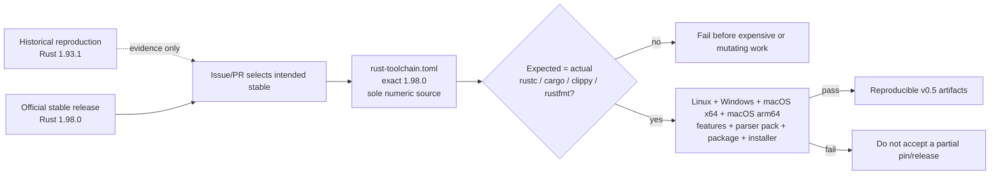

## macOS optional-parser capability truth

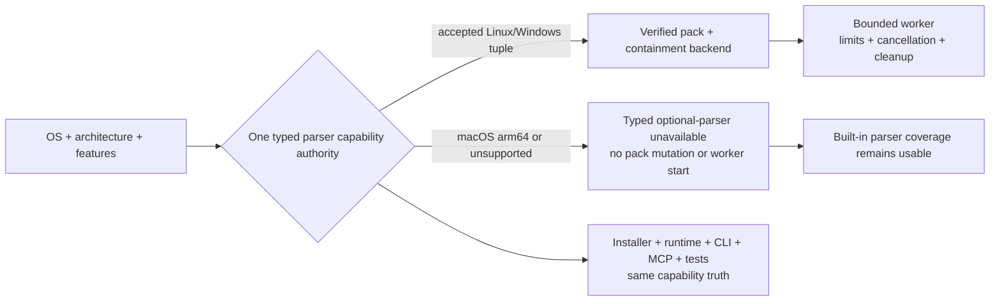

## Native non-UTF-8 worktree identity

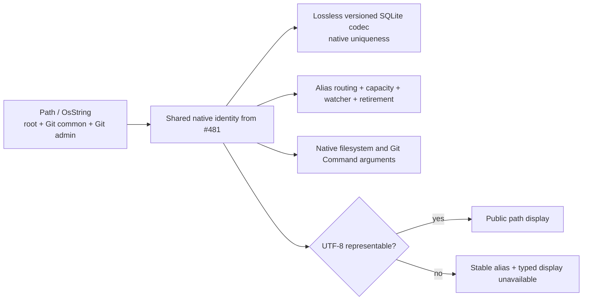

## Clean macOS Apple Silicon installed lifecycle

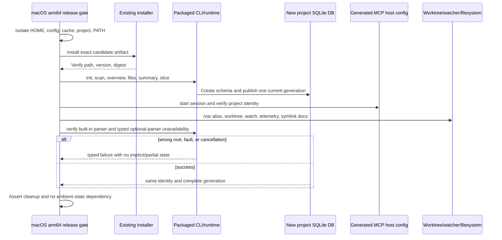

## macOS all-features reachability

```mermaid
flowchart LR
  Cargo["Cargo target + features"] --> Capability["#483 canonical parser capability"]
  Capability -->|supported optional pack| Backend["Compile contained worker backend"]
  Capability -->|unsupported / macOS| Fallback["Compile typed unavailability + built-in fallback"]
  Backend --> Check["Rust 1.98.0 check + pedantic Clippy<br/>warnings denied"]
  Fallback --> Check
  Check --> Matrix["macOS x64/arm64 + supported Linux/Windows combinations"]
```

## CLI E2E contract ownership split

```mermaid
flowchart TB
    support[Shared test support owner: crates/projectatlas-cli/tests/support/mod.rs]
    lifecycle[Lifecycle and database contracts] --> support
    delivery[Installer and release contracts] --> support
    navigation[CLI, MCP, graph, document, language contracts] --> support
    worktrees[Worktree, watcher, freshness, federation contracts] --> support
    maintenance[Purpose, lint, telemetry, TUI contracts] --> support
    ci[CI and release exact selectors] --> lifecycle
    ci --> delivery
    ci --> navigation
    ci --> worktrees
    ci --> maintenance
```

## Codex MCP owner fixture readiness

```mermaid
flowchart TB
    suite[Parallel Windows E2E] --> owner[Spawn compiled Codex owner]
    owner --> child[Start obsolete MCP child]
    child --> publish[Atomically publish PID, start time, and path]
    owner --> poll{Publication and identity readiness within one named 30 s deadline}
    publish --> poll
    poll -->|exit or deadline| fail[Typed failure and owned cleanup]
    poll -->|not ready| pause[Wait 25 ms]
    pause --> poll
    poll -->|published before same deadline| validate{Exact identity valid before same deadline?}
    validate -->|no| fail
    validate -->|yes| installer[Run existing installer handoff assertions]
    installer --> cleanup[Attempt exact child stop]
    fail --> cleanup
    cleanup -->|stop helper stalls or fails| fallback[One bounded exact-identity cleanup fallback]
    fallback -->|child stopped or already gone| reap[Kill and reap owned parent]
    fallback -->|fallback stalls or fails| final[One bounded helper-free native exact-identity stop]
    final -->|child stopped or already gone| reap
    final -->|cleanup cannot prove ownership or stop child| reap
    reap -->|all cleanup complete| done[Owned cleanup complete]
    reap -->|any cleanup failure| diagnostic[Fail closed with cleanup diagnostic]
    cleanup -->|child stopped| reap
```

## Production module ownership decision

```mermaid
flowchart LR
    callers[CLI, MCP, tests, services] --> map[Call, state, data, error, transaction map]
    map --> decision{Independent durable owner proven?}
    decision -->|no| retain[Retain current module with evidence]
    decision -->|yes| move[Move cohesive responsibility]
    move --> facade[Preserve owning public re-export]
    facade --> tests[Compatibility, SQLite, fault, concurrency, E2E proof]
    db[(One schema and transaction authority)] --> move
```

### Durable ownership map

This map follows the current callers, state, and publication boundaries. It is a responsibility decision, not a line-count partition, and it preserves the seven-crate workspace. Dependency direction remains CLI adapter -> runtime/service -> database/core; database internals stay private while the database root retains the compatibility re-exports used by callers.

| Owner | Callers, state, and data | SQLite, concurrency, cancellation, and errors | Tests and hot path | Decision and rejected splits |
| --- | --- | --- | --- | --- |
| `crates/projectatlas-cli/src/mcp.rs` | `main.rs::run` starts `run_mcp_server`; RMCP invokes `ProjectAtlasMcpServer` through its tool router. The module owns MCP parameter/response schemas, route dispatch, selected-project state, usage lifecycle, source observations, and server lifecycle. | It opens the root-bound `AtlasStore` and delegates SQL/publication to the database crate. `Arc<RwLock<_>>` protects selected project/task state, `Arc<Mutex<_>>` protects bounded telemetry, and the background envelope bounds aggregate work. The request cancellation bridge propagates cancellation and joins its monitor on drop. Runtime, service, and database errors are converted at the RMCP boundary without changing their typed meaning. | `mcp.rs::tests` and CLI/MCP route smoke exercise the adapter. The hot path is request decode/validation, bounded runtime/service/database read, and response serialization; task status/cancel uses the same session state. | Retain the protocol adapter and all route state here. The only accepted move is private `mcp/task_registry.rs`: its bounded session-local records have one lifecycle, no database or wire ownership, and no independent external caller. Splitting DTOs, routes, telemetry, root selection, or cancellation would sever shared request state and add a facade without a durable owner. |
| `crates/projectatlas-cli/src/runtime.rs` | `main.rs` and `mcp.rs` call the shared runtime. It owns `ScanRuntimePlan`, init/scan/watch orchestration, freshness/read status, symbol-build options/reports, settings/lint/telemetry orchestration, and the stage transitions shared by CLI and MCP. | It does not own SQL or commit publication: it passes `IndexWorkControl` through bounded filesystem/parser/service stages and asks `AtlasStore` to begin/complete caller-owned transactions. `CliError` preserves filesystem, database, service, cancellation, and resource failures. | Runtime tests plus submodule tests cover the shared path. Scan/watch freshness, staging, and symbol projection are the hot paths. | Retain the orchestration module and its existing private submodules. `graph_projection.rs` remains coupled to runtime stages and graph publication; `module_resolution.rs` remains a bounded compiler-config helper consumed by that projection; feature-gated `optional_parser_runtime.rs` remains coupled to parser work types and resource admission; `source_observation.rs` remains the runtime freshness registry and its `pub(crate)` re-export. Splitting by phase, report, or feature would duplicate cancellation, bounds, and publication state. |
| `crates/projectatlas-db/src/lib.rs` | CLI runtime/MCP, service, and snapshot callers use the `AtlasStore` façade. It owns the SQLite connection, read-snapshot state, database path/location, validated native project binding, direct-library telemetry instances, and compatibility re-exports. | `schema.rs` owns schema/migrations and `lib.rs` owns the store/guard lifetimes: immediate publication and purpose transactions, read snapshots, binding validation, commit/rollback, and ancillary telemetry connections. SQLite read/write serialization and short lock scopes remain here; `DbError` propagates storage, binding, corruption, and rollback failures. | `projectatlas-db` unit/integration tests cover these guards and public methods; every indexed read/publication is a hot path. | Retain `AtlasStore`, `IndexPublicationGuard`, `PurposeMutationTransaction`, and the public re-export façade. No submodule split is accepted: `content_classification.rs` (classification rows), `derived_snapshot.rs` (portable snapshots), `diagnostics.rs` (bounded reports), `hydration.rs` (backup hydration), `project_identity.rs` (root binding), `repository_graph.rs` (graph SQL), `schema.rs` (schema authority), `sqlite_profile.rs` (connection profile), `telemetry.rs` (usage persistence), and `worktree_registry.rs` (registry persistence) each remain behind the existing façade because their APIs borrow its connection/guards or share its binding and transaction invariants. |
| `crates/projectatlas-db/src/repository_graph.rs` | `AtlasStore` methods are called by runtime, service, snapshot, and navigation paths. The module owns normalized graph entities, relations, occurrences, coverage, resolution-key rows, graph staging, bounded hydration/read pages, and graph-specific row reconstruction. Its public graph types remain re-exported by `projectatlas-db/src/lib.rs`. | It owns graph SQL, prepared statements, graph read budgets, and staging helpers, while `AtlasStore` owns the live connection and outer commit/rollback guard. `IndexWorkControl` is checked during bounded reads and staging; failures return typed `DbError`/graph-contract errors and never advertise partial rows. | Repository-graph tests and database/service integration tests cover publication/navigation; graph staging, relation hydration, and bounded navigation are hot paths. | Retain one graph owner. Moving navigation, staging, row decoding, or query families would split shared keys/limits/schema and `AtlasStore` lifetimes, duplicate SQL authority, and obscure transaction/cancellation/error behavior. The existing `repository_graph.rs` boundary is the smallest durable owner. |

No schema, index, query, transaction, migration, or database-authority change is part of this amendment. The existing `schema.rs` and `AtlasStore` boundaries remain authoritative; the map documents why the private task registry is the only accepted move and why all other proposed splits are no-change decisions.

## Benchmark artifact retention boundary

```mermaid
flowchart LR
    run[Benchmark run] --> classify{Compact durable evidence?}
    classify -->|yes| source[Sanitized summary or bounded result in source]
    classify -->|large raw trace| local[Ignored local output]
    classify -->|release evidence| release[Release or external artifact]
    gate[Deterministic tracked-file policy] --> source
    gate --> reject[Reject accidental oversized raw source artifact]
```

## Repeatable real-task agent evaluation

```mermaid
flowchart LR
    prereg[Versioned preregistration] --> baseline[Baseline arm]
    prereg --> atlas[ProjectAtlas arm]
    baseline --> retain[Retain success, failure, timeout, uncertainty]
    atlas --> retain
    retain --> sanitize[Redact private paths/content and bound artifacts]
    sanitize --> metrics[Success, time, wrong-file reads, context, tool bytes]
    metrics --> report[Compact observed comparison; modeled claims remain separate]
```

## atlas shim lifecycle and command compatibility

Forwarder ownership comes from the exact generated body, provenance, and private capability state, so retirement remains possible when its target is missing or cannot execute. New publication verifies the destination runtime separately. Lifecycle locking is still mandatory: macOS can use another discoverable verified ProjectAtlas runtime as its native lock helper; if none is available, uninstall preserves the owned artifacts and asks the user to restore a runtime and retry.

A failed final runtime check reports unsuccessful installation while retaining the complete authenticated forwarder pair for repair or uninstall. Windows compares runtime identity independently of letter case, then preserves the authenticated record's spelling for exact ownership-content checks.

```mermaid
flowchart TB
  installer[Installer] --> identity[Canonical verified runtime identity]
  identity --> locks[Discover destination plus effective candidate; acquire at most two canonical locks ascending under one deadline; reclassify while held; release reverse]
  locks --> collision{Existing atlas command?}
  collision -->|unmanaged| reject[Typed collision; no overwrite]
  collision -->|owned current| stage[Stage shim and provenance]
  collision -->|owned prior target| stage
  collision -->|absent| stage
  stage --> state[Publish private capability state]
  state --> provenance{Publish provenance no-clobber succeeds?}
  provenance -->|no| state_cleanup[Quarantine and verify newly owned state]
  state_cleanup -->|retired| reject_publication[Fail; preserve foreign provenance and unrelated bytes]
  state_cleanup -->|retirement fails| retained[Retain exact state; report cleanup failure]
  retained --> refuse[Later install refuses unretired orphan state]
  refuse --> recover[Proven-owned retirement enables retry]
  provenance -->|yes| forwarder{Publish shim no-clobber succeeds?}
  forwarder -->|no| pair_cleanup[Retire only newly owned provenance and state]
  pair_cleanup -->|retired| reject_publication
  pair_cleanup -->|state retirement fails| retained
  forwarder -->|yes| shim[Publish verified managed shim]
  shim --> migrate[Quarantine and verify prior owned pair before identity-safe retirement]
  migrate --> discover[PATH discovery; preserve concurrent foreign replacements]
  discover --> aliases[Complete argv forwarded unchanged]
  aliases --> canonical[Canonical handlers including health report]
  aliases --> resolve[atlas health resolve]
  aliases --> legacy[atlas health-check remains compatible]
  shim --> uninstall[Managed uninstall/repair]
  uninstall --> clean[Remove only managed pair and private state]
```

## v0.5.0 candidate, readback, remediation, and stable promotion

```mermaid
stateDiagram-v2
  [*] --> PublishedIssueReadback: read exact main OpenSpec and architecture targets
  PublishedIssueReadback --> PublicationRepair: mapped task, document, heading, or Mermaid is missing or stale
  PublicationRepair --> PublishedIssueReadback: planning PR publishes corrected evidence
  PublishedIssueReadback --> ExactRevision: published milestone gate and every required review pass
  ExactRevision --> SurfaceInventory: freeze complete CLI and MCP inventory
  SurfaceInventory --> InstalledProof: safely execute every supported route
  InstalledProof --> CandidateBuild: package exact main revision
  CandidateBuild --> UpdateProof: update exercised v0.4.5 installation and database
  UpdateProof --> RC1: state, migration, failure, retry, and rollback hard gate passes
  UpdateProof --> Remediation: update or migration blocker
  RC1 --> HostedReadback: independently verify tag, assets, runtime, and Latest
  HostedReadback --> Remediation: confirmed blocker
  Remediation --> PublishedIssueReadback: return defect to owning child issue and restart proof
  HostedReadback --> StableBuild: accepted candidate and no blocker
  StableBuild --> StableReadback: repeat installs and hosted identity
  StableReadback --> FinalState: v0.5.0 is Latest with hierarchy, issues, milestone, and workflows verified
  FinalState --> [*]
```
