# v0.5.0 release architecture

Each mapped v0.5.0 issue owns one focused view below. The release graph in `openspec/issue-map.json` owns hierarchy and implementation order; #492 owns acceptance only and closes after every child issue.

## Issue task authority and owner slices

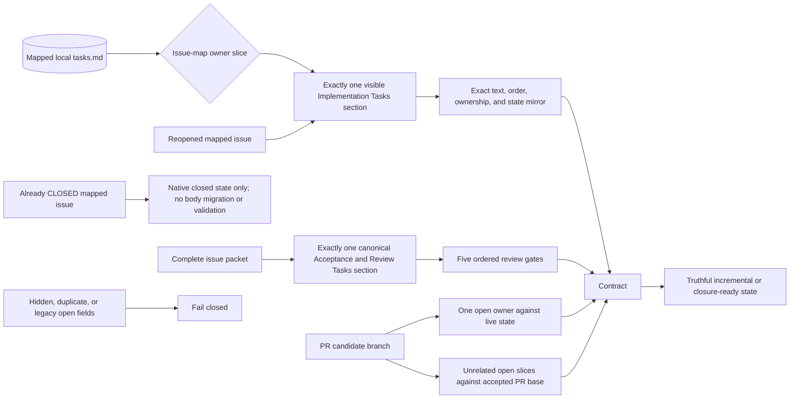

## Acceptance-state transition

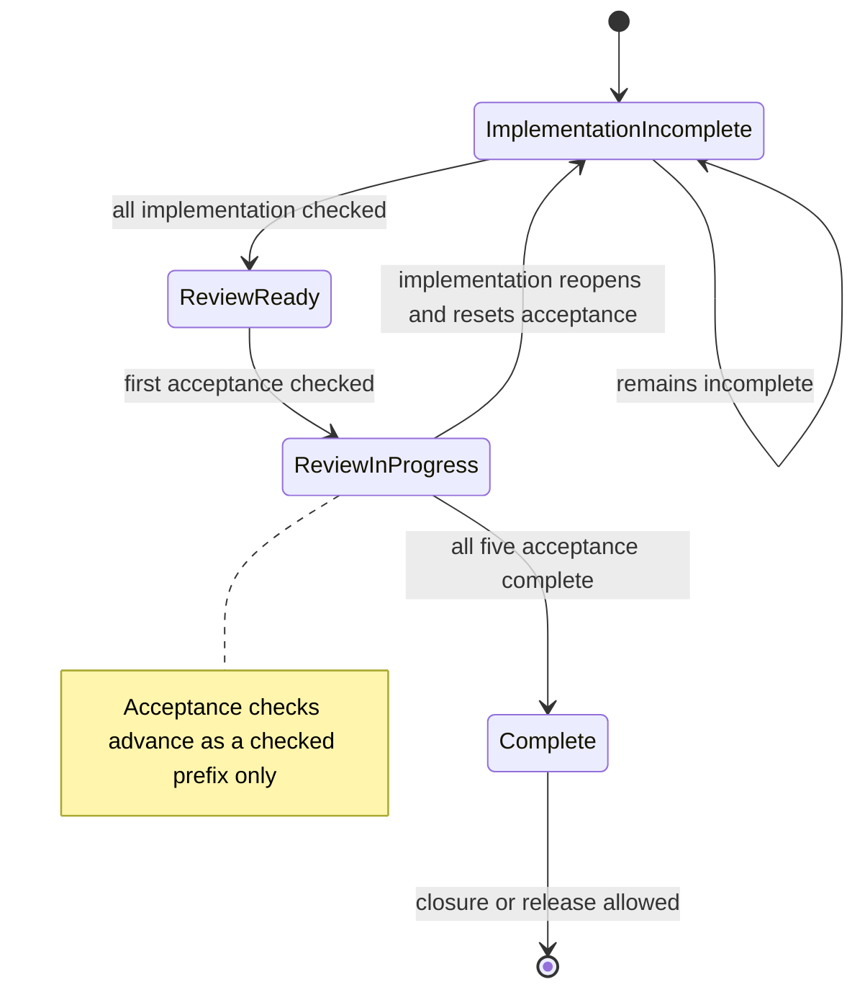

## PHP language-guidance evidence flow

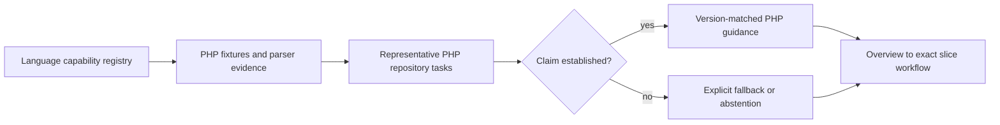

## Reverse-caller query and decision boundary

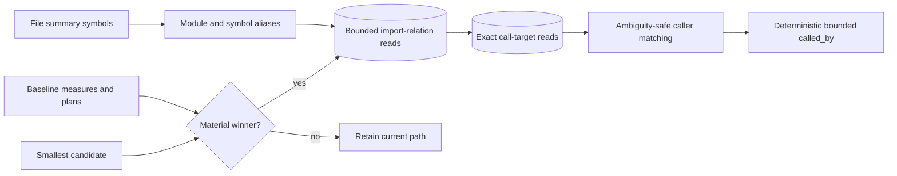

## Graph-construction worker and publication ownership

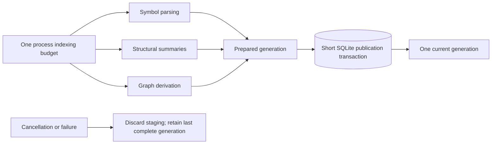

## Filtered custom-harness timeout ownership

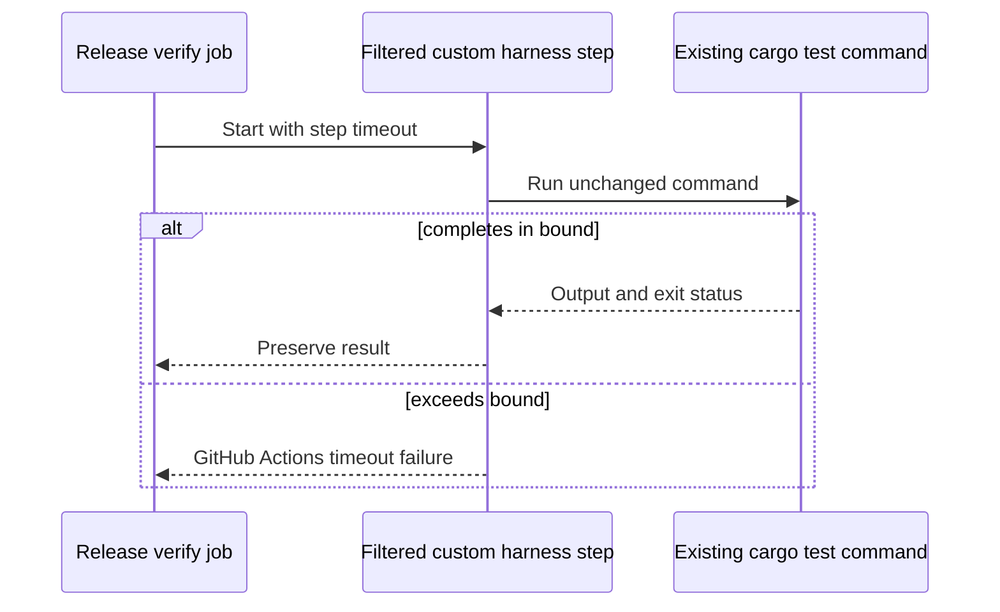

## Entrypoint-profile reachability

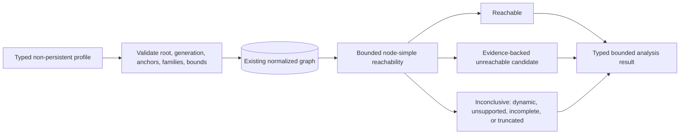

## npm runtime selection and integrity

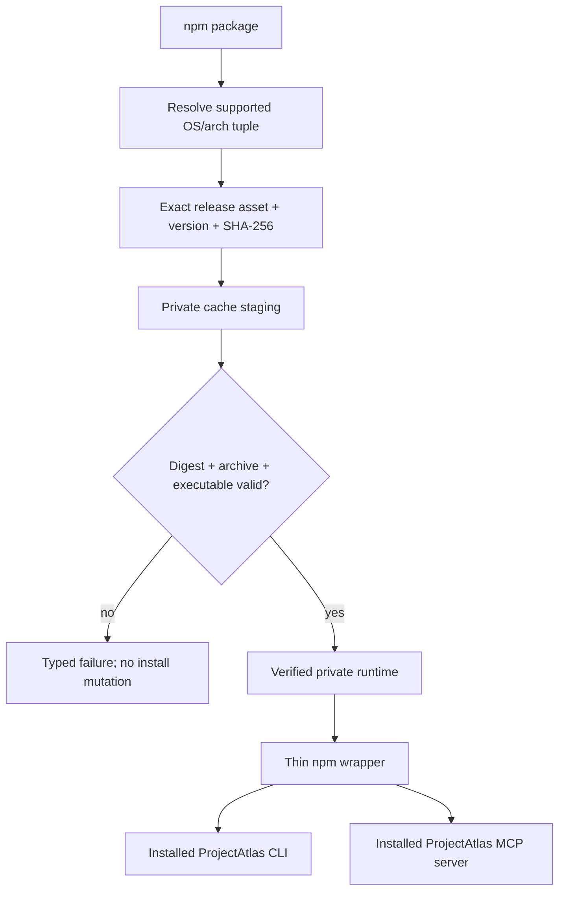

## Real host configuration consumption

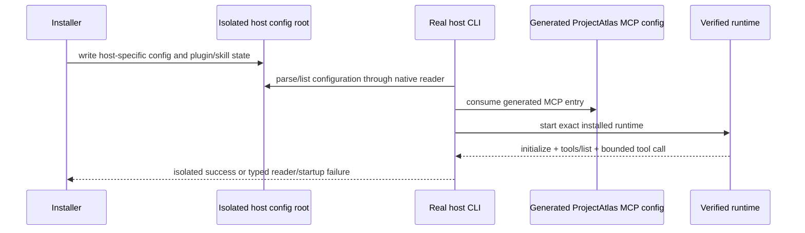

## Released-main database baseline decision

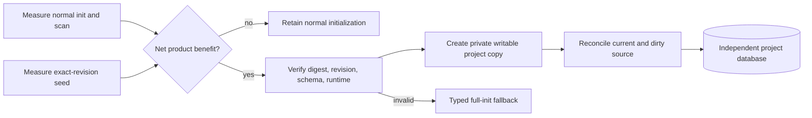

## Deterministic architecture-community analysis

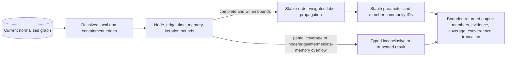

## Bounded PDF and DOCX extraction

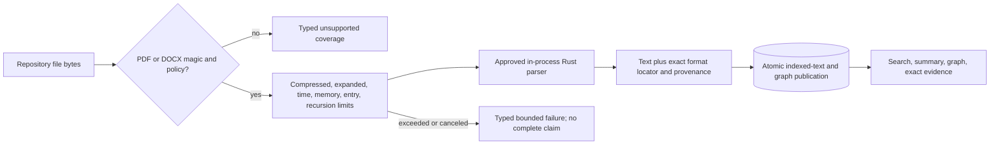

## Invalid graph identity admission

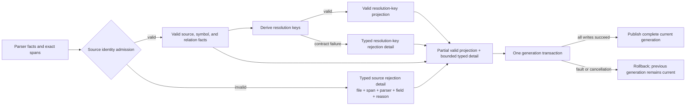

The coarse `graph_coverage.reason` remains a stable compatibility category;
bounded identity detail is generation-owned in the existing publication
transaction and is read through structured coverage rows. Rejected identity
text is never persisted, and a fault or cancellation leaves both the detail
rows and valid graph rows at the previous complete generation.

## Built-in PHP parser and graph publication

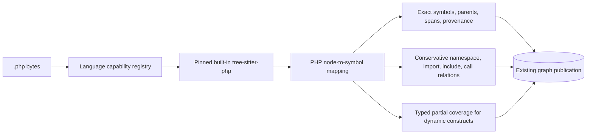

## Bounded document-reason publication

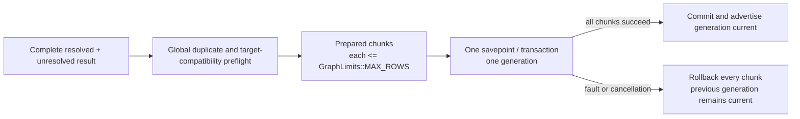

## Canonical project-root identity

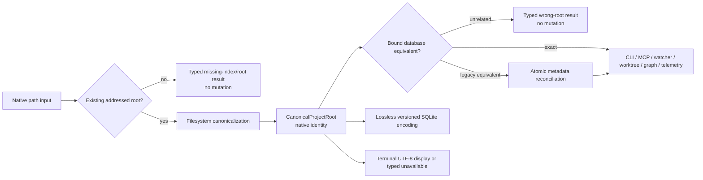

## Rust 1.98.0 toolchain upgrade and verification

Rust 1.93.1 is retained only as historical reproduction evidence. Each intended
stable upgrade is evaluated in its own issue and pull request; the repository
pins a numeric version only after the complete local and hosted gates pass.
Floating `stable` and workflow-local numeric pins are not release inputs.

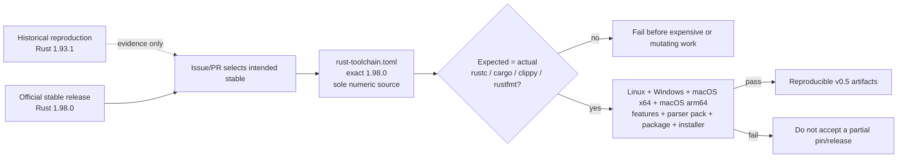

## macOS optional-parser capability truth

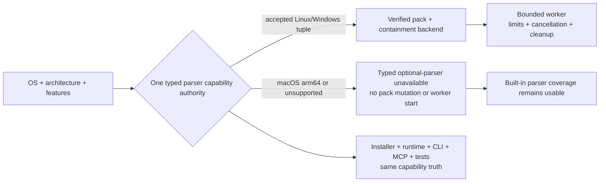

## Native non-UTF-8 worktree identity

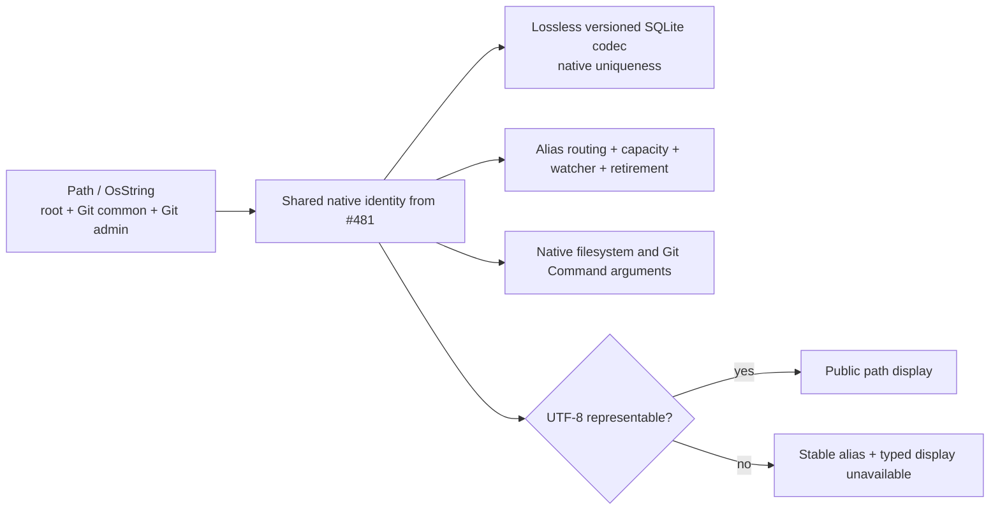

## Clean macOS Apple Silicon installed lifecycle

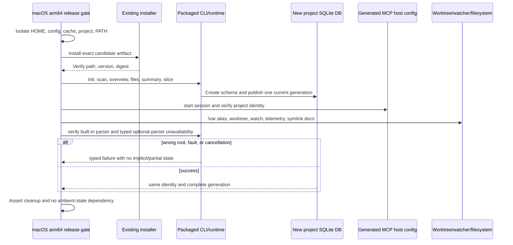

## macOS all-features reachability

```mermaid
flowchart LR
  Cargo["Cargo target + features"] --> Capability["#483 canonical parser capability"]
  Capability -->|supported optional pack| Backend["Compile contained worker backend"]
  Capability -->|unsupported / macOS| Fallback["Compile typed unavailability + built-in fallback"]
  Backend --> Check["Rust 1.98.0 check + pedantic Clippy<br/>warnings denied"]
  Fallback --> Check
  Check --> Matrix["macOS x64/arm64 + supported Linux/Windows combinations"]
```

## CLI E2E contract ownership split

```mermaid
flowchart TB
    support[Shared process, repo, JSON, platform, package support]
    lifecycle[Lifecycle and database contracts] --> support
    delivery[Installer and release contracts] --> support
    navigation[CLI, MCP, graph, document, language contracts] --> support
    worktrees[Worktree, watcher, freshness, federation contracts] --> support
    maintenance[Purpose, lint, telemetry, TUI contracts] --> support
    ci[CI and release exact selectors] --> lifecycle
    ci --> delivery
    ci --> navigation
    ci --> worktrees
    ci --> maintenance
```

## Codex MCP owner fixture readiness

```mermaid
flowchart TB
    suite[Parallel Windows E2E] --> owner[Spawn compiled Codex owner]
    owner --> child[Start obsolete MCP child]
    child --> publish[Atomically publish PID, start time, and path]
    owner --> poll{Publication and identity readiness within one named 30 s deadline}
    publish --> poll
    poll -->|exit or deadline| fail[Typed failure and owned cleanup]
    poll -->|not ready| pause[Wait 25 ms]
    pause --> poll
    poll -->|published before same deadline| validate{Exact identity valid before same deadline?}
    validate -->|no| fail
    validate -->|yes| installer[Run existing installer handoff assertions]
    installer --> cleanup[Owned parent and child cleanup]
```

## Production module ownership decision

```mermaid
flowchart LR
    callers[CLI, MCP, tests, services] --> map[Call, state, data, error, transaction map]
    map --> decision{Independent durable owner proven?}
    decision -->|no| retain[Retain current module with evidence]
    decision -->|yes| move[Move cohesive responsibility]
    move --> facade[Preserve owning public re-export]
    facade --> tests[Compatibility, SQLite, fault, concurrency, E2E proof]
    db[(One schema and transaction authority)] --> move
```

### Durable ownership map

This map follows the current callers, state, and publication boundaries. It is a responsibility decision, not a line-count partition, and it preserves the seven-crate workspace. Dependency direction remains CLI adapter -> runtime/service -> database/core; database internals stay private while the database root retains the compatibility re-exports used by callers.

| Owner | Callers, state, and data | SQLite, concurrency, cancellation, and errors | Tests and hot path | Decision and rejected splits |
| --- | --- | --- | --- | --- |
| `crates/projectatlas-cli/src/mcp.rs` | `main.rs::run` starts `run_mcp_server`; RMCP invokes `ProjectAtlasMcpServer` through its tool router. The module owns MCP parameter/response schemas, route dispatch, selected-project state, usage lifecycle, source observations, and server lifecycle. | It opens the root-bound `AtlasStore` and delegates SQL/publication to the database crate. `Arc<RwLock<_>>` protects selected project/task state, `Arc<Mutex<_>>` protects bounded telemetry, and the background envelope bounds aggregate work. The request cancellation bridge propagates cancellation and joins its monitor on drop. Runtime, service, and database errors are converted at the RMCP boundary without changing their typed meaning. | `mcp.rs::tests` and CLI/MCP route smoke exercise the adapter. The hot path is request decode/validation, bounded runtime/service/database read, and response serialization; task status/cancel uses the same session state. | Retain the protocol adapter and all route state here. The only accepted move is private `mcp/task_registry.rs`: its bounded session-local records have one lifecycle, no database or wire ownership, and no independent external caller. Splitting DTOs, routes, telemetry, root selection, or cancellation would sever shared request state and add a facade without a durable owner. |
| `crates/projectatlas-cli/src/runtime.rs` | `main.rs` and `mcp.rs` call the shared runtime. It owns `ScanRuntimePlan`, init/scan/watch orchestration, freshness/read status, symbol-build options/reports, settings/lint/telemetry orchestration, and the stage transitions shared by CLI and MCP. | It does not own SQL or commit publication: it passes `IndexWorkControl` through bounded filesystem/parser/service stages and asks `AtlasStore` to begin/complete caller-owned transactions. `CliError` preserves filesystem, database, service, cancellation, and resource failures. | Runtime tests plus submodule tests cover the shared path. Scan/watch freshness, staging, and symbol projection are the hot paths. | Retain the orchestration module and its existing private submodules. `graph_projection.rs` remains coupled to runtime stages and graph publication; `module_resolution.rs` remains a bounded compiler-config helper consumed by that projection; feature-gated `optional_parser_runtime.rs` remains coupled to parser work types and resource admission; `source_observation.rs` remains the runtime freshness registry and its `pub(crate)` re-export. Splitting by phase, report, or feature would duplicate cancellation, bounds, and publication state. |
| `crates/projectatlas-db/src/lib.rs` | CLI runtime/MCP, service, and snapshot callers use the `AtlasStore` façade. It owns the SQLite connection, read-snapshot state, database path/location, validated native project binding, direct-library telemetry instances, and compatibility re-exports. | `schema.rs` owns schema/migrations and `lib.rs` owns the store/guard lifetimes: immediate publication and purpose transactions, read snapshots, binding validation, commit/rollback, and ancillary telemetry connections. SQLite read/write serialization and short lock scopes remain here; `DbError` propagates storage, binding, corruption, and rollback failures. | `projectatlas-db` unit/integration tests cover these guards and public methods; every indexed read/publication is a hot path. | Retain `AtlasStore`, `IndexPublicationGuard`, `PurposeMutationTransaction`, and the public re-export façade. No submodule split is accepted: `content_classification.rs` (classification rows), `derived_snapshot.rs` (portable snapshots), `diagnostics.rs` (bounded reports), `hydration.rs` (backup hydration), `project_identity.rs` (root binding), `repository_graph.rs` (graph SQL), `schema.rs` (schema authority), `sqlite_profile.rs` (connection profile), `telemetry.rs` (usage persistence), and `worktree_registry.rs` (registry persistence) each remain behind the existing façade because their APIs borrow its connection/guards or share its binding and transaction invariants. |
| `crates/projectatlas-db/src/repository_graph.rs` | `AtlasStore` methods are called by runtime, service, snapshot, and navigation paths. The module owns normalized graph entities, relations, occurrences, coverage, resolution-key rows, graph staging, bounded hydration/read pages, and graph-specific row reconstruction. Its public graph types remain re-exported by `projectatlas-db/src/lib.rs`. | It owns graph SQL, prepared statements, graph read budgets, and staging helpers, while `AtlasStore` owns the live connection and outer commit/rollback guard. `IndexWorkControl` is checked during bounded reads and staging; failures return typed `DbError`/graph-contract errors and never advertise partial rows. | Repository-graph tests and database/service integration tests cover publication/navigation; graph staging, relation hydration, and bounded navigation are hot paths. | Retain one graph owner. Moving navigation, staging, row decoding, or query families would split shared keys/limits/schema and `AtlasStore` lifetimes, duplicate SQL authority, and obscure transaction/cancellation/error behavior. The existing `repository_graph.rs` boundary is the smallest durable owner. |

No schema, index, query, transaction, migration, or database-authority change is part of this amendment. The existing `schema.rs` and `AtlasStore` boundaries remain authoritative; the map documents why the private task registry is the only accepted move and why all other proposed splits are no-change decisions.

## Benchmark artifact retention boundary

```mermaid
flowchart LR
    run[Benchmark run] --> classify{Compact durable evidence?}
    classify -->|yes| source[Sanitized summary or bounded result in source]
    classify -->|large raw trace| local[Ignored local output]
    classify -->|release evidence| release[Release or external artifact]
    gate[Deterministic tracked-file policy] --> source
    gate --> reject[Reject accidental oversized raw source artifact]
```

## Repeatable real-task agent evaluation

```mermaid
flowchart LR
    prereg[Versioned preregistration] --> baseline[Baseline arm]
    prereg --> atlas[ProjectAtlas arm]
    baseline --> retain[Retain success, failure, timeout, uncertainty]
    atlas --> retain
    retain --> sanitize[Redact private paths/content and bound artifacts]
    sanitize --> metrics[Success, time, wrong-file reads, context, tool bytes]
    metrics --> report[Compact observed comparison; modeled claims remain separate]
```

## atlas shim lifecycle and command compatibility

```mermaid
flowchart TB
  installer[Installer] --> collision{Existing atlas command?}
  collision -->|unmanaged| reject[Typed collision; no overwrite]
  collision -->|managed| shim[Atomic managed shim install]
  shim --> discover[PATH discovery]
  discover --> aliases[atlas top-level command aliases]
  aliases --> canonical[Canonical projectatlas command handlers]
  aliases --> resolve[atlas health resolve]
  aliases --> legacy[atlas health-check remains compatible]
  shim --> uninstall[Managed uninstall/repair]
  uninstall --> clean[Remove only managed artifact]
```

## v0.5.0 candidate, readback, remediation, and stable promotion

```mermaid
stateDiagram-v2
  [*] --> PublishedIssueReadback: read exact main OpenSpec and architecture targets
  PublishedIssueReadback --> PublicationRepair: mapped task, document, heading, or Mermaid is missing or stale
  PublicationRepair --> PublishedIssueReadback: planning PR publishes corrected evidence
  PublishedIssueReadback --> ExactRevision: published milestone gate and every required review pass
  ExactRevision --> SurfaceInventory: freeze complete CLI and MCP inventory
  SurfaceInventory --> InstalledProof: safely execute every supported route
  InstalledProof --> CandidateBuild: package exact main revision
  CandidateBuild --> UpdateProof: update exercised v0.4.5 installation and database
  UpdateProof --> RC1: state, migration, failure, retry, and rollback hard gate passes
  UpdateProof --> Remediation: update or migration blocker
  RC1 --> HostedReadback: independently verify tag, assets, runtime, and Latest
  HostedReadback --> Remediation: confirmed blocker
  Remediation --> PublishedIssueReadback: return defect to owning child issue and restart proof
  HostedReadback --> StableBuild: accepted candidate and no blocker
  StableBuild --> StableReadback: repeat installs and hosted identity
  StableReadback --> FinalState: v0.5.0 is Latest with hierarchy, issues, milestone, and workflows verified
  FinalState --> [*]
```
