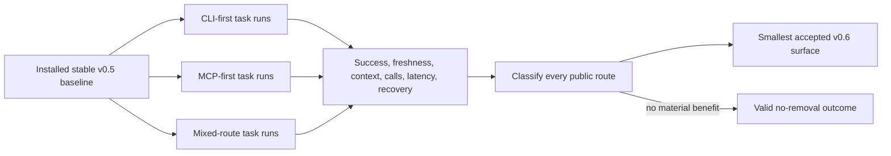
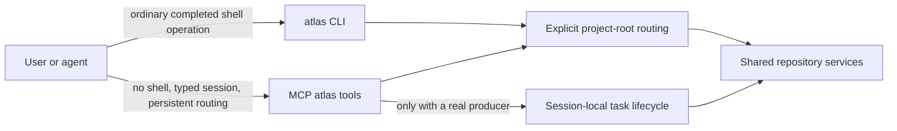
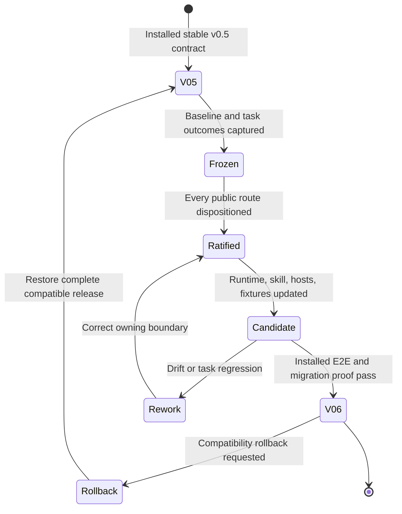
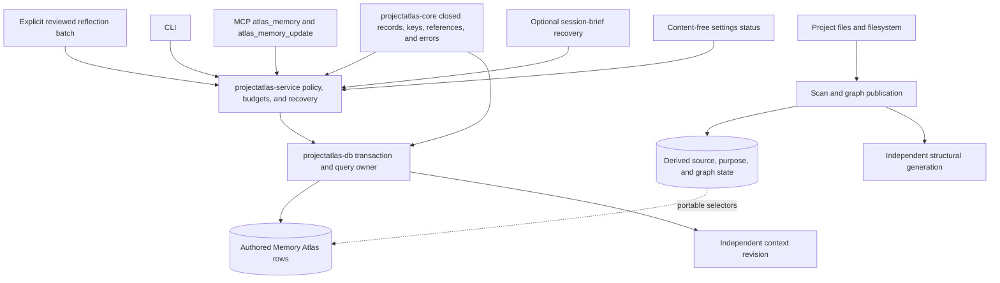
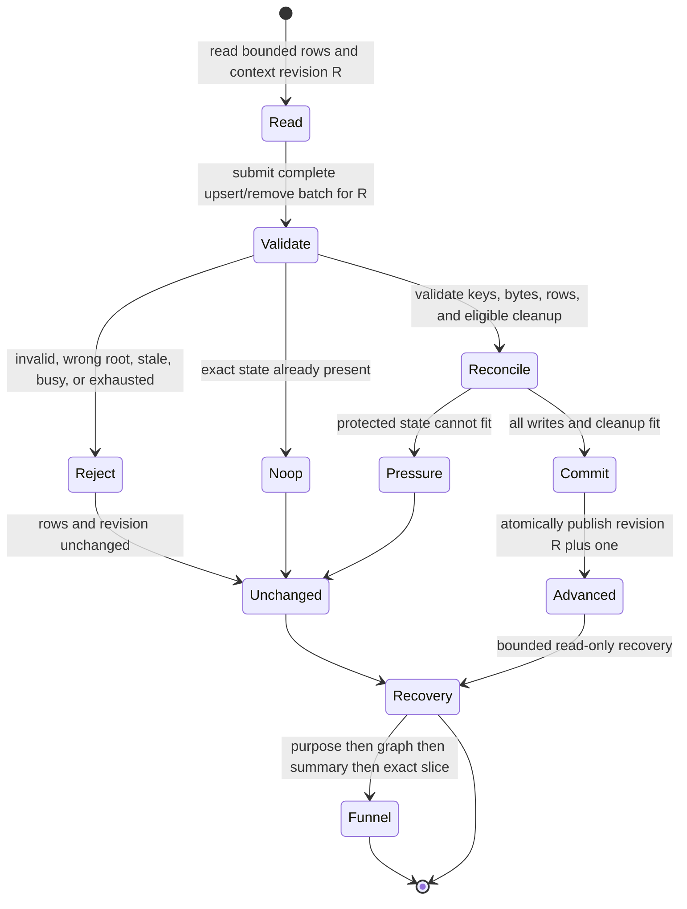
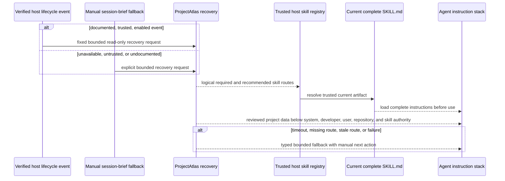
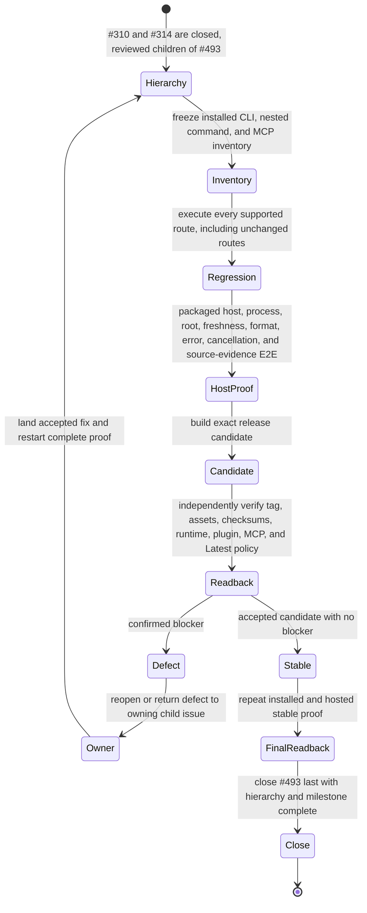

# ProjectAtlas v0.6 Agent Surface Architecture

These views own the intended post-v0.5 CLI/MCP decision and compatibility boundary for #310, the project-authored Memory Atlas boundary for #314, and the feature-free installed-product acceptance boundary for #493. The release graph in `openspec/issue-map.json` makes #310 and #314 direct children of #493, orders #314 after #310, and leaves #493 to close last.

## Evidence-led route decision

The installed stable v0.5 product is frozen before comparison. Results classify every public route; they do not begin from a desired tool count or transport doctrine.

## Accepted CLI and MCP ownership

The concise CLI is the normal one-shot shell route. MCP remains first-class for session capabilities; both converge on explicit root routing and the same services.

## Versioned compatibility migration

Runtime, CLI, MCP inventory, plugin skill, generated hosts, fixtures, and documentation move as one contract. Rollback restores a complete previous pair instead of mixing generations.

## Memory Atlas authored-state ownership

Memory Atlas is project-authored orientation in the existing project database. Structural source state remains derived, and structural and context revisions advance independently.

## Conditional reflection, transaction, and recovery state

Recovery never initializes, scans, refreshes, changes roots, bypasses freshness, or mutates authored state.

## Host trust and skill-resolution boundary

The integration does not read or write host-private registries, caches, credentials, transcripts, personal memories, goals, or hidden state.

## v0.6.0 holistic release acceptance

