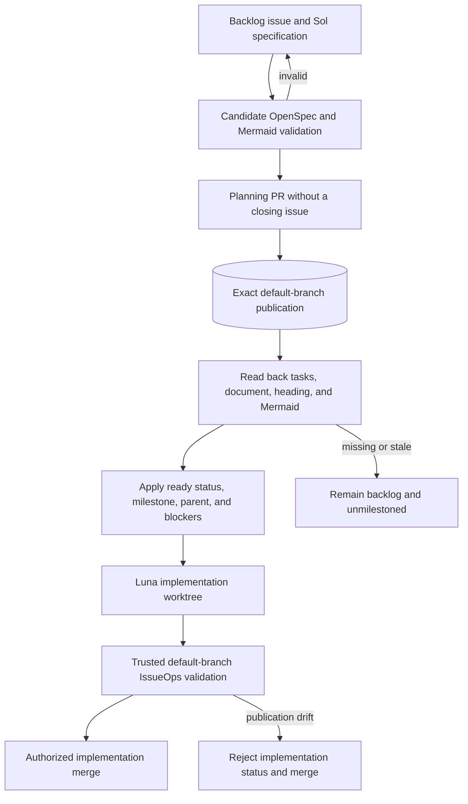

# Purpose: Document ProjectAtlas local workflow troubleshooting and verification commands.

# Workflow and Troubleshooting

ProjectAtlas is designed to run locally with a project-local SQLite atlas and optional TOON exports.

## Recommended workflow

1. `projectatlas init` (first-time setup, initial scan/index, generated MCP configs, and purpose handoff).
2. Refresh with `atlas_watch_once`, `atlas_scan`, `projectatlas watch --once`, or `projectatlas scan` only when the SQLite index may be stale.
3. For task-directed MCP work, call `atlas_session_brief` once with the task and `compact: true`, then follow its returned summary, search, relation, health, or slice request directly.
4. Use `atlas_overview` → `atlas_folders` → `atlas_files`, or their CLI equivalents, only when session brief is unavailable, returns no actionable candidate, or broad repository structure is itself the task.
5. Copy returned selectors into `atlas_slice`; use the manual CLI summary/outline/slice funnel only as a fallback.
6. Run `projectatlas config --print` when effective scan, purpose, or exclusion policy is unclear.
7. Run `projectatlas lint --report-untracked --purpose-level low`.
8. Run `projectatlas map --force` only when a compatibility TOON snapshot is explicitly needed.
9. Open a PR that references the GitHub issue (CI requires `#NNN` in title or body).
10. Install git hooks by copying or linking files from `.githooks/` into `.git/hooks/`.

For long local sessions, run `projectatlas watch` from the project root. It uses event-backed `notify`
watching with debounce/exclude handling and falls back to portable polling when the platform watcher is
unavailable. Ordinary file edits use partial SQLite/symbol refresh; directory/root/ignore-rule events use a
full scan for correctness. For bounded agent refreshes after edits, use `projectatlas watch --once` or MCP
`atlas_watch_once`.

Exact line slices validate the file through the atlas database, then read the current file from disk. Symbol slices
use the stored symbol ranges, then read current disk content, so keep the watcher running during active edits if
symbol-level slices matter.

## One-command local verification

Run the full local check suite with Cargo:

```bash
cargo fmt --all --check
cargo check --workspace --all-targets --all-features --locked
cargo clippy --workspace --all-targets --all-features --locked -- -D warnings
cargo test --workspace --all-features --locked
cargo test --doc --workspace --all-features --locked
RUSTDOCFLAGS="-D warnings" cargo doc --workspace --no-deps --all-features --locked
cargo run --locked -p projectatlas-lints --bin cargo-projectatlas-lints -- strict-strings
cargo deny --locked --all-features check -D warnings
npm ci --ignore-scripts --prefix .github/mermaid-parser
npm audit --omit=dev --audit-level=moderate --prefix .github/mermaid-parser
python3 .github/scripts/issue-checklists.py --self-test
python3 .github/scripts/test-optional-parser-proof-inputs.py
python3 .github/scripts/issue-checklists.py --repo "$(gh repo view --json nameWithOwner --jq .nameWithOwner)" --root . --issue-map openspec/issue-map.json
cargo run --locked -p projectatlas-cli -- --format json scan .
cargo run --locked -p projectatlas-cli -- lint --report-untracked --purpose-level low
```

## Rust dependency management

The root `[workspace.dependencies]` table owns every direct dependency version used by the seven ProjectAtlas workspace crates. Member manifests inherit those entries with `workspace = true`; fixture manifests remain independent because they model repositories ProjectAtlas scans rather than packages ProjectAtlas builds.

Use Cargo and the committed `Cargo.lock` as the complete dependency inventory:

```bash
cargo metadata --locked --offline --format-version 1
cargo tree --workspace --all-features --locked
cargo tree --duplicates --workspace --all-features --locked
cargo deny --locked --all-features check -D warnings
```

The offline metadata command is a deterministic inspection step after the normal locked fetch or build path. It is not a network bootstrap command, and its output is not committed as a second dependency ledger.

For a bounded manual update or Dependabot review:

1. Trace ownership with `cargo tree -i <crate> --workspace --all-features --locked`.
2. Change the version once in root `[workspace.dependencies]`, or run `cargo update -p <crate> --precise <version>` when only the lockfile resolution changes.
3. Review `git diff -- Cargo.toml Cargo.lock` and every affected member manifest.
4. Check the repository Rust toolchain and the dependency's MSRV, default and added features, license, advisories, registry or Git source, duplicate paths, upstream changelog, and breaking changes.
5. Run the focused repository-policy E2E test, the dependency inventory and deny commands above, and the ordinary locked workspace gates.

Weekly Cargo and GitHub Actions Dependabot updates target `main`; only Cargo minor and patch updates are grouped, majors remain separate, and no repository automation merges them. Dependency pull requests follow the same review and locked workspace gates as other changes. Obsolete automated pull requests against the retired `dev` release line are explicitly closed or superseded rather than merged into a release milestone as cleanup.

## Lean implementation and IssueOps

ProjectAtlas uses the implementation loop that produced v0.3.26:

1. Implement a meaningful compiling behavior slice.
2. Add or update the smallest focused unit, integration, E2E, smoke, or validation test appropriate to the risk. One coherent test may cover several related tasks.
3. Run the ordinary locked Rust/workspace gates.
4. Commit and integrate significant working slices into `main` through reviewed pull requests.
5. Use normal CI and review, then synchronize the local OpenSpec checklist with its mapped GitHub issue.

Task completion does not require unique test identifiers, task-level verification plans or ledgers, commit receipts, rendered evidence comments, hosted links per checkbox, or post-merge issue sealing. When useful, keep one compact shared behavior-coverage row in the issue with clickable owning test definitions and the passed test command. One test may cover several tasks, and several tests may jointly cover one coherent task. GitHub Actions already records normal hosted outcomes.

Open mapped issues keep the concise v0.3.26 #305 planning shape: `Why`, `What Changes`, `Capabilities`, `Architecture Diagrams`, `Release Scope`, `Non-Goals`, `Pre-Mortem`, and one authoritative OpenSpec task section. `Architecture Diagrams` either contains a durable HTTPS link to a versioned `docs/*.md#user-content-heading` view on `main` in this repository or records exactly `N/A: <reason>` as a conscious no-architecture-change decision. The `user-content-` prefix targets GitHub's rendered heading ID directly instead of relying on client-side fragment rewriting. Every linked heading's own section must contain a closed fenced `mermaid` block that passes the repository-locked Mermaid syntax parser; a heading, prose, empty or declaration-only fence, or invalid Mermaid does not satisfy the gate. The final OpenSpec task compares the completed implementation with those diagrams and updates either side until they agree, or reconfirms the reasoned `N/A`. The pre-mortem lists likely failures and visible mitigation checkboxes. Each mitigation ends with its owning task IDs, for example `(OpenSpec tasks: 2.1, 4.3)`, and is checked exactly when all referenced tasks are checked. This reuses the implementation checklist; it does not create mitigation-specific tests, receipts, or evidence artifacts.

### Published issue specification readiness

Candidate validation and published readiness are different authorities. A candidate checkout proves that proposed OpenSpec artifacts, issue mirrors, Markdown headings, and Mermaid blocks are internally valid; it does not prove that an issue's durable `/blob/main/` links are available. A planning pull request without a native closing issue may publish those specification and architecture artifacts. Only after an exact clean checkout of the live default-branch revision passes IssueOps and the published OpenSpec files, document, heading, and Mermaid are read back may Sol apply `status:ready`, a release milestone, and native parent/blocker relationships or hand an implementation packet to Luna. Planned-issue, implementation-reference, merge-authorization, milestone, and release checks fail closed when candidate-only, stale, dirty, missing, or malformed evidence is presented as published proof.

Published-snapshot validation requires the addressed Git top-level root, a well-formed local HEAD, a well-formed live default-branch ref and SHA, equality between those SHAs, and no tracked modifications. Ignored untracked notes do not alter the tracked published snapshot. A mismatched root, malformed identity, Git timeout or process/OS failure, or default-branch movement during merge authorization fails closed; authorization rereads the live default branch before its final decision instead of carrying an earlier snapshot across movement.



When `openspec/issue-map.json` declares a milestone `release_graphs` entry, the checker reconciles its direct `blocked_by` edges and derived release-root child set with GitHub's native issue dependencies and sub-issue/parent hierarchy (API version `2026-03-10`). Every native blocker, child, and parent payload must identify the addressed repository exactly before its issue number is compared; foreign, missing, or malformed identities fail closed. `--planned-issue` validates shape and synchronization while blockers may remain open; `--implementation-issue` is the explicit implementation/merge-readiness check and fails until every direct blocker is closed. Missing or extra native edges, malformed graphs, unknown issues, self-edges, cycles, or an incorrect parent hierarchy fail closed.

Pull-request CI checks out the live `refs/pull/<number>/merge` ref for `pull_request`, `pull_request_review`, and `pull_request_review_comment` events, rather than trusting a stale payload SHA; non-PR events fall back to `github.sha`. The `pull_request` trigger retains `opened`, `synchronize`, and `reopened` and also reruns on `edited` so adding or removing a native closing reference cannot reuse a stale successful gate. It rejects PR-derived and push runs whose target branch is not the repository default branch; `dev` is retired and cannot be used to bypass the merge gates. CI performs the read-only Rust, checklist, review, and packaging gates only. The trusted default-branch `pull_request_target` IssueOps workflow reads the live PR head and complete GitHub-native `closingIssuesReferences`, then publishes `issueops-implementation` as `pending`, `success`, or `failure` on that exact head; it never checks out or executes pull-request code. Foreign, missing, malformed, or conflicting identities fail closed. A pull request with no native closing issue is a planning slice and receives a successful implementation status after the trusted IssueOps checklist gate. Dependabot pull requests retain their dependency-update exemption for implementation references but still receive the status context and the standard CI quality gates; the default-branch delivery guard runs before that exemption so Dependabot cannot use a non-default base to bypass the rule. Review state is reread by the one-shot merge route rather than granted by a PR-source status writer.

Issue state and native relationship changes are reconciled by the trusted default-branch IssueOps checker, but they are not a background authority that can revoke a cached PR status after a head or issue change. Ordinary pull requests retain `issueops-implementation` as early feedback on the exact PR head. A second `issueops-merge-authorized` context is explicitly failure (or absent) for every opened, edited, synchronized, and reopened PR; it is never granted by ordinary PR or issue events. The repository's one-shot `repository_dispatch` `issueops_merge` route is the only code-owned authorization path: it publishes pending on the requested exact head, rereads the live PR, required checks, review threads, release graph, native hierarchy, milestone/task mirrors, and default-branch generation, verifies strict main-branch protection requires exactly `issueops-merge-authorized` from Actions app `15368` and that repository auto-merge is enabled, derives the addressed repository owner from GitHub metadata, requires a personal `User` owner whose identity matches the addressed repository, reads the complete `affiliation=all` collaborator set with a cap+1 bound, and accepts only the sole owner collaborator with admin access. Missing or malformed identity, organization ownership, owner mismatch, extra/non-owner write collaborator, endpoint truncation, or denied/malformed collaborator data fails closed before auto-merge is armed. It then enables squash auto-merge with the expected head, performs a final reread, publishes authorization success, and waits for an exact merged read-back. Any failure disables auto-merge when possible and publishes failure on the current exact head. The repository owner must configure `issueops-merge-authorized` as a protected required check and enable auto-merge; the first hosted merge dispatch must prove the Actions token can read the repository identity and collaborator endpoint, while owner-level branch-protection changes and the external Sol dispatch remain administrative controls outside repository code.

Native dependency and sub-issue changes use the serialized `repository_dispatch` `issueops_relationship` route. Before any GitHub mutation, IssueOps derives the exact missing-or-extra transition from the selected declared release graph and current native state, then requires the requested kind, orientation, issue, related issue, and operation to match that transition exactly. An unknown, ambiguous, unrelated-to-drift, or graph-widening request fails before POST; generic rollback is not a substitute for prevalidation. After an admitted idempotent mutation, IssueOps reads the relation back, reconciles the complete declared release graph, and emits exactly one correlated `applied`, `already-satisfied`, or `failed` terminal JSON outcome.

Issue events repair both directions of blocker drift within the declared graph. Closing an issue with an open direct blocker reopens it. Reopening a blocker derives a bounded reverse direct-blocker map, inspects its closed dependents, and reopens or fails every dependent whose blocker is open; each reopened dependent is processed through the same graph-bounded queue so transitive reverse dependents cannot remain falsely closed. Affected implementation and merge authorization is invalidated or fails on revalidation. The planned-issue job selects the issue's declared graph from the issue map even on a `demilestoned` event, so removal from the required milestone is targeted drift and cannot skip graph validation.

The relationship and merge mutation routes use one supported non-canceling `concurrency` group (`cancel-in-progress: false`), so a running POST/readback/status sequence is never canceled. GitHub permits at most one pending run in that group; a newer dispatch may replace an older pending run before it mutates state, so the request-id client must treat a canceled or missing run as retryable and must require terminal success plus readback. Every GitHub collection read has an explicit item/page cap and fails closed at cap+1; no unbounded `--paginate --slurp` read is a correctness path. Normal `workflow_dispatch` is not an IssueOps relationship or merge authority.

Assign an open issue to a canonical `vMAJOR.MINOR.PATCH-00` release milestone only when it has exactly `status:ready`, an OpenSpec mapping and artifacts published on the exact live default-branch revision, exactly one non-empty copy of every required proposal and design section, explicit dependency and cross-issue impact, no unresolved open questions, checked contract tasks, synchronized issue sections, published architecture evidence, and the final reconciliation task. Candidate-local validation never authorizes this transition. The issue-event IssueOps workflow enforces this implementation-ready boundary, while implementation, merge-authorization, milestone, and release checks repeat the published-default-branch proof. Release-time milestone completion remains the stricter all-issues-closed gate.

Ordinary pull requests require exact local/GitHub checklist synchronization but do not require the whole release milestone to be complete. Full milestone checklist completion is a release-only gate. SHA-pinned Actions, locked Cargo commands, least privilege, parser/package/signature/digest validation, release checksums, and other executable integrity controls remain independent of task bookkeeping.

Commit identity is provenance, not a general test invalidation key. After a commit-only or metadata-only change, rerun cheap OpenSpec, IssueOps, review, topology, and release-policy checks, then reuse passed expensive proof whose behavior-relevant source, dependency, lockfile, toolchain, workflow, packaging, configuration, platform, and immutable artifact identities are unchanged. Unknown changes fail closed and every affected test or construction reruns.

## Issue hygiene

- Every issue should carry a `type:*` label plus a `priority:*` and `status:*` label.
- Use `status:backlog` for unscheduled work.
- Any issue referenced by a PR must be assigned to the target release milestone (CI enforces this).
- Keep public issues/PRs/release notes free of private or internal-only details (release notes are generated from PR text).
- Keep issue completion free of commit/SHA permalink evidence and OpenSpec commit-link blocks; immutable Action pins and release checksums/signatures remain required integrity controls.

## Review expectations

- At least one approval is required before merging.
- Automated reviews (Codex/Copilot) should be checked via `gh pr view <PR> --comments`
  or `gh pr view <PR> --json reviews`.

## Documentation site

- `04-Docs` builds the public landing page with agent-integration, worktree-continuity, and architecture entry points, Rust API docs, plus the generated Language & Ecosystem Support page from the same catalog identity as `docs/language-support.md`, then deploys `target/doc` to GitHub Pages.
- GitHub Pages should be configured for GitHub Actions deployment.

## Branching

- Open change branches and pull requests against the repository default branch (`main`); it is the active integration and release authority.
- Retain `dev` only while durable historical links or an explicit migration require it; CI rejects delivery to it, and dependency/release automation does not target it.
- Update the Cargo workspace version in `Cargo.toml`.
- Pushes to `main` automatically dispatch a release for an exact stable `MAJOR.MINOR.PATCH` or candidate `MAJOR.MINOR.PATCH-rcN` workspace version when the tag is absent and the clean optional-parser handoff is input-compatible with the exact pushed commit. Merge-commit, squash, and rebase histories use that same commit-bound rule. Canonical Cargo development versions `MAJOR.MINOR.PATCH-dev.N` do not dispatch; malformed versions fail closed.
- Publish at least `-rc1` before promoting a release series to its final stable version. The release gate refuses a final version unless the highest published non-draft RC for the same base version is an ancestor of the final head, and refuses a late RC after that stable tag exists. RCs are non-draft GitHub prereleases created with Latest disabled, so GitHub Latest stays on the preceding stable release. The final stable release is a normal release and becomes Latest.
- Keep exact hosted tag/release/Latest verification in the release operation after all mapped milestone implementation issues are closed. Implementation checklists prove generic policy and prepublication packages; they must not require the hosted release whose prepublication milestone gate they block.
- Release notes for every RC and the final stable promotion use the preceding stable tag as their baseline. Later candidates and the final notes therefore remain cumulative across the entire release series without duplicating an RC as the history baseline.
- Release archives are published with a `SHA256SUMS` asset. If the clean-main seed producer supplies the optional exact-tag `projectatlas-main-atlas-seed-<tag>-<snapshot-digest>.tar.zst` and matching `.manifest.json`, release staging validates the pair and checksums both without opening or modifying the seed. Verify downloaded assets with `sha256sum -c SHA256SUMS` or `shasum -a 256 -c SHA256SUMS`.
- If a publish run fails after creating a tag or leaves a GitHub release with missing or stale assets, rerun the release workflow for the same exact version. Repair is accepted only when the existing non-draft release classification and tag head match the derived stable/RC policy; replaceable assets may then be repaired without moving the tag or changing classification, while validated immutable seed assets are never clobbered. If interruption left exactly one seed-pair member, recovery also requires the complete staged pair and exact byte equality, then uploads only the missing companion. The workflow rechecks release metadata, exact head, and requires the previously captured Latest release to remain unchanged during repair.

## CI behavior

- GitHub Actions runs Rust source, dependency, unit, E2E, documentation, and packaging checks. ProjectAtlas scan, purpose, parity, and lint maintenance run locally against the developer or agent's current source state, not against the hosted Actions checkout.
- `projectatlas lint` checks purpose/header health, non-source declarations, and untracked files; it does not require or validate the optional compatibility TOON export.
- `projectatlas lint --purpose-level low` is the default first-pass agent gate: duplicate and repeated temporary-folder findings fail, while missing/suggested purpose curation for folders plus high-impact files remains advisory. Use `projectatlas purpose queue` for the actionable curation list, `--purpose-level medium` when all source files must be agent-reviewed, and `--purpose-level strict` only when every indexed file and folder must be agent-reviewed.
- PRs must reference a GitHub issue and have a milestone.
- Ordinary PRs may reference an issue without closing it; use `Closes #NNN` only when the issue's complete checklist is ready to close.
- Active OpenSpec task lists must be mapped in `openspec/issue-map.json`, and their authoritative GitHub task sections must exactly mirror local text, order, ownership, and checked state.
- CI can be run manually via `workflow_dispatch` when checks do not auto-trigger.

Environment toggles:

- `PROJECTATLAS_ALLOW_UNTRACKED=1` allows local builds while still reporting untracked files.
- `PROJECTATLAS_NO_TELEMETRY=1` runs read/orientation commands without recording usage rows in the local SQLite index.

## Troubleshooting

### Optional compatibility map export

Only older integrations need a static `.projectatlas/projectatlas.toon` snapshot. Generate it explicitly:

```bash
projectatlas map --force
```

Normal ProjectAtlas 3 agent workflows should read from `.projectatlas/projectatlas.db` through the CLI or MCP tools.

### Missing or suggested purposes

Do not add new Purpose headers or `.purpose` files for ProjectAtlas 3. Inspect the folder/file through the atlas funnel and write the correct one-line purpose to SQLite:

```bash
projectatlas purpose queue --limit 20
projectatlas purpose set <path> "<one-line purpose>"
projectatlas purpose review --from-file reviewed-purposes.json --apply
```

The purpose queue is source-focused and folder-first by default, so binary assets, asset-only roots, and low-priority source files do not dominate the next-action list. Pass `--include-low-priority-files` only when intentionally doing broad file-purpose cleanup, and pass `--include-assets` only when intentionally curating non-source files. Generated purpose suggestions remain review-required until an agent approves or corrects them.

Purpose entries live in SQLite and are preserved across normal scans and deep index refreshes. Re-scanning preserves accepted purpose text and approval across content, symbol, summary, and graph changes; automation never invalidates or overwrites it. Deleted/excluded paths become inactive while their path-owned accepted purpose remains dormant, and a rename does not transfer approval automatically. Use the purpose queue to approve missing/generated suggestions, or use the existing purpose APIs for an explicit correction when an agent, reviewer, or user finds an accepted purpose wrong. If a repository needs reproducible strict lint from a fresh checkout, keep a reviewed batch input in the repo and replay it with `projectatlas purpose review --apply`; do not edit the SQLite database by hand.

### Legacy Purpose headers or .purpose files

Legacy Purpose headers and `.purpose` files are migration inputs. Import them with `projectatlas scan`, then remove them only through an explicit migration command:

```bash
projectatlas strip-legacy-purpose --dry-run
projectatlas strip-legacy-purpose --apply
```

### Untracked files

Use `--report-untracked` to list non-source files. Either:

- add to the SQLite purpose/index state or, for compatibility, the non-source file list (`.projectatlas/projectatlas-nonsource-files.toon`)
- add to allowlists/exclusions
- move into an approved asset root

## Schema reference

The TOON schema is documented in `docs/format.md`.
