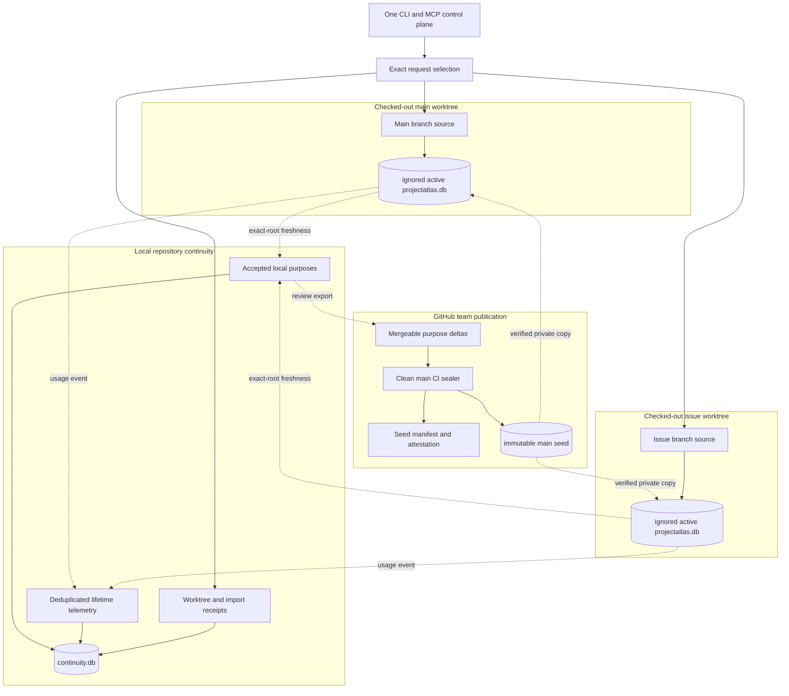
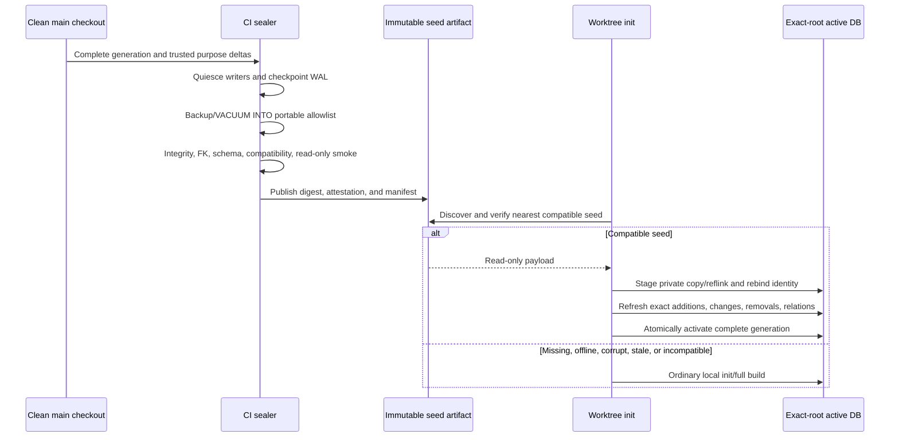
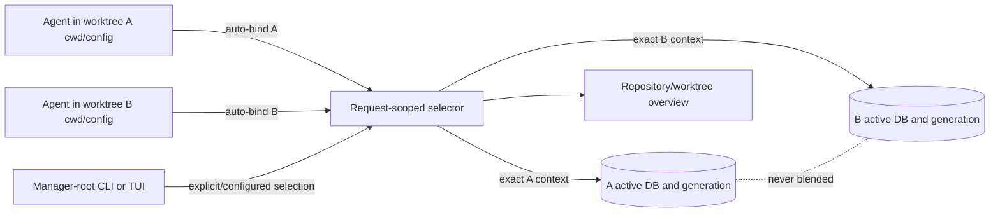
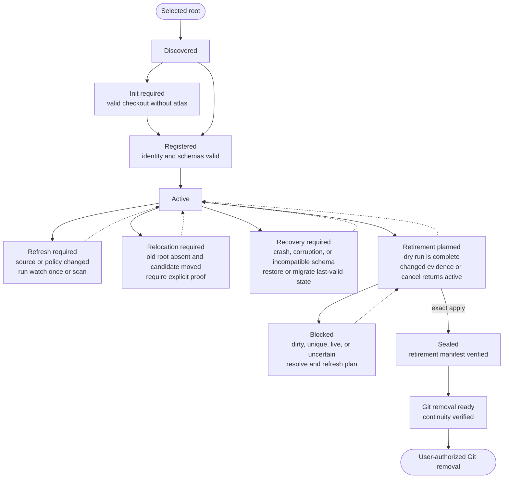
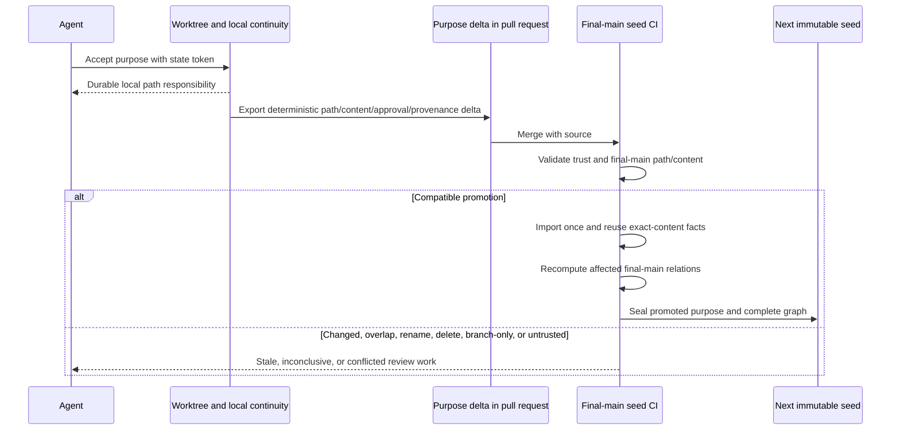
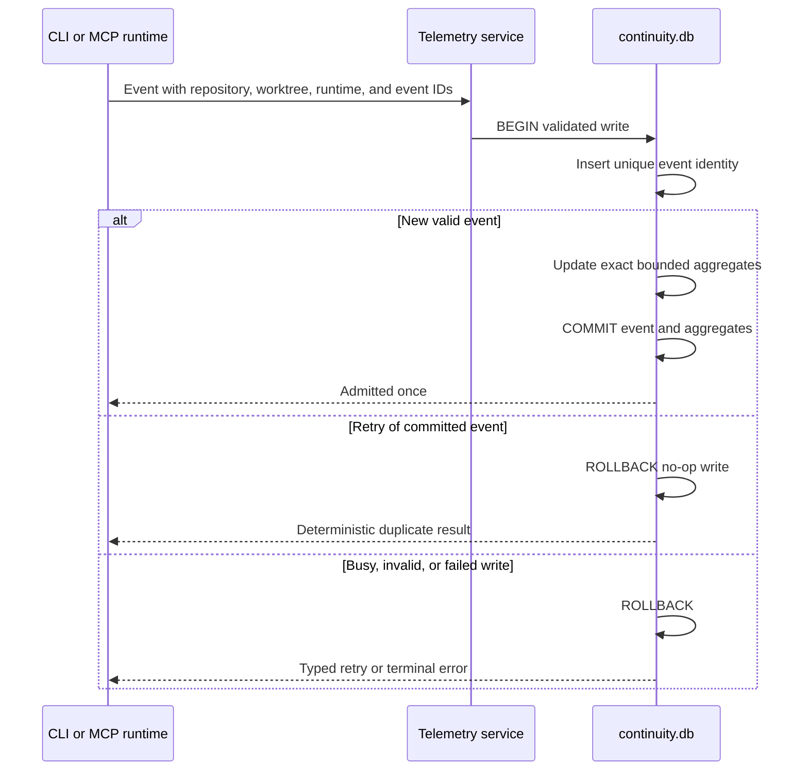
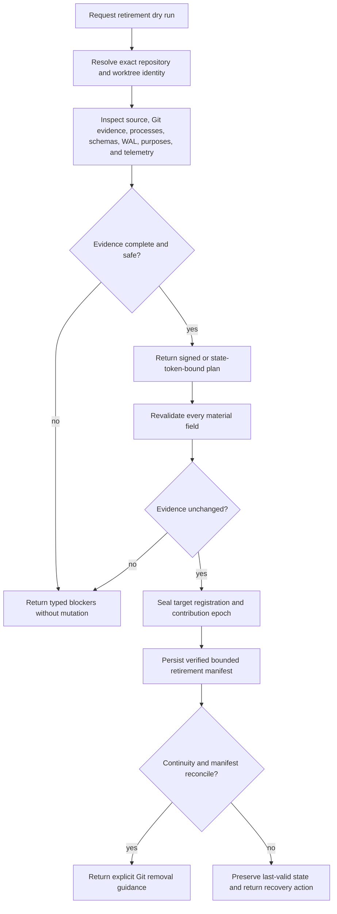

# ProjectAtlas Worktree Lifecycle

This document owns the dedicated planned v0.4.4 architecture for [issue #430](https://github.com/styler-ai/ProjectAtlas/issues/430). It separates immutable team seed publication, writable exact-root atlas state, source-controlled purpose promotion, and local lifetime token telemetry. The design is planning-only until v0.4.3 is released and its OpenSpec tasks are implemented and verified.

## System and Ownership

Each checkout remains an exact mutable source/index boundary. CI publishes one immutable portable main seed; each worktree receives a private writable copy. Local continuity contains no source graph, and team purpose knowledge crosses clones through semantic deltas rather than SQLite merging.

Ownership rules:

- The seed owns no mutable authority. Its exact bytes are a content-addressed, read-only publication of one clean complete main source fingerprint and portable accepted-purpose projection.
- Worktree active databases own files, summaries, symbols, relations, generations, freshness, watcher/tasks, and purpose suggestions for exactly one checkout. They are ignored, disposable, and never merged.
- The local continuity database owns accepted purpose revisions, logical worktree registrations, import receipts, telemetry event identity, exact retained aggregates, and repository-lifetime reporting for one clone/repository instance.
- Source-controlled purpose deltas own durable team promotion evidence. Main CI admits only trusted records compatible with final merged source.
- The continuity database never becomes a source atlas, including when it is stored by a bare/common Git manager.
- Telemetry, sessions, processes, tasks, roots, WAL/SHM state, and other host-local data never enter the seed, manifest, purpose deltas, or Git.
- Git remains authoritative for branches and worktrees; ProjectAtlas reports and protects its own state without silently mutating Git.

## Seed Publication and Hydration

The seed is copied, never shared writable. A missing or rejected seed is only a missed optimization: ProjectAtlas uses the existing local init/full-build path.

Publication excludes its own seed/manifest paths from indexed input and binds a deterministic included-source tree fingerprint or an external exact source-commit artifact, avoiding a digest or commit that must contain itself. Normal Git, Git LFS, and a GitHub release/cache asset remain transport choices governed by measured size/history, retention, attestation, offline, and rollback policy.

## Concurrent Routing and Manager UX

One long-lived MCP server serves all registered worktrees. A root selection establishes one repository control root; selecting an exact checkout remains backward compatible by also selecting that worktree. Discovery uses structural Git common-directory/worktree metadata plus the validated continuity registry, never directory-name conventions. Users and agents can explicitly register additional exact worktree paths for outside-root or otherwise undiscoverable layouts after reciprocal identity validation; arbitrary descendant directories are never guessed to be worktrees. A nested cwd or request path auto-binds its containing worktree; a manager with one unambiguous active worktree may auto-select it, while a manager with several lists them all and requires a choice only for otherwise ambiguous source/graph work. Each request captures one exact root, active database, worktree identity, generation, and selection provenance before doing work.

An explicit per-call selection wins; a prior call or process-global default cannot redirect concurrent work. Manager-root source/graph commands require explicit/configured selection and return the selected exact root/generation. The root token TUI shows the complete bounded repository/worktree overview, but its map always represents one visibly labeled selected worktree. Ordinary single-checkout roots auto-select themselves with unchanged zero-ceremony behavior.

## Worktree Lifecycle

Lifecycle transitions are typed and revalidated. A path is a locator, not the durable repository identity.

When the Git executable is unavailable, structural root and database validation still allow local ProjectAtlas operations. Git-dependent branch, dirty, merge, and removal evidence is marked unavailable, and retirement cannot claim readiness.

## Purpose Continuity

Accepted local purpose text remains durable path responsibility across source/index changes. Team promotion is a separate content-bound event validated against final merged main.

No branch SQLite database, WAL, or graph is a merge input. Stacked pull requests need no special storage: rebase/retarget and sequential merges are handled by the same final-main identity checks. Absent paths keep accepted local purposes dormant; renames never transfer approval automatically.

## Repository Telemetry Publication

The repository ledger admits an event and updates its aggregates in one SQLite transaction. Retry identity makes an uncertain response safe.

Repository reports read indexed aggregate rows rather than all retained events. Per-worktree and per-session totals are dimensions of the same authority, not separately summed databases. Raw-detail eviction never changes exact retained component totals.

## Retirement and Recovery

ProjectAtlas retirement protects ProjectAtlas state and produces Git-authority guidance. Startup, status, and watcher reconciliation automatically hide a provably externally removed worktree from active navigation while preserving its bounded identity, purposes, and lifetime telemetry. A pull-request merge or deleted remote branch is only retirement-readiness evidence; it never deletes a local checkout. Explicit retirement removes a validated existing or already-missing registration from the active list, but does not silently remove a branch or checkout.

The seal covers only the target worktree registration and contribution epoch; sibling continuity remains writable. The manifest contains reconciliation counts, import receipts, authority epochs, hashes, and recovery instructions. Rebuildable source graphs are not archived, and unreconciled unique state blocks retirement.

Migration holds source exclusion across a recoverable saga: read-only preflight and final snapshot; non-authoritative destination prepare; destination verification; database-enforced legacy-writer fence; then conditional registration switch. A pre-fence crash leaves the source authoritative and forces refresh of any prepared import after possible late writes. A post-fence crash completes the already durable prepared switch. The source is never fenced before destination durability, and no state exposes dual writers. Aggregate-only sources are combined only with provably disjoint provenance. Newer, corrupt, wrong-root, overlapping, unfenceable, or ambiguous databases remain preserved and return typed recovery guidance. Recovery after a continuity-authoritative write reconciles forward into a new epoch rather than reopening an older source.

## Architecture Invalidation Conditions

Revisit this split only if measurement or platform evidence proves one of these conditions:

- SQLite cannot meet the measured many-worktree write latency, contention, WAL growth, or durability limits with short prepared transactions and bounded checkpoint policy.
- Git common-directory storage cannot remain project-local, permission-safe, relocatable, and available to all supported worktree topologies.
- Content-identity purpose projection cannot express required rename or generated-source behavior without repeated incorrect stale/current classifications.
- Exact telemetry deduplication cannot migrate supported predecessor aggregates without either losing totals or accepting double counting.
- Extending the existing root/admin MCP surface makes lifecycle state less discoverable or breaks the stable tool contract; only then should a replacement-free top-level tool be considered.

Any redesign must preserve exact-root source isolation, non-destructive schema handling, offline local operation, and recoverable telemetry/purpose history.
