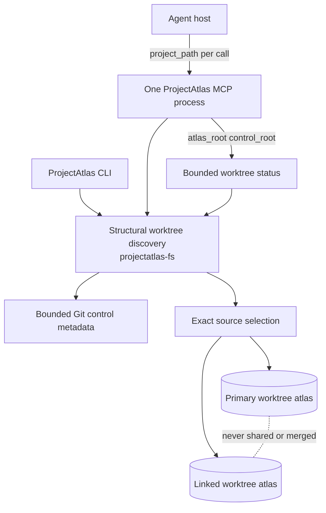
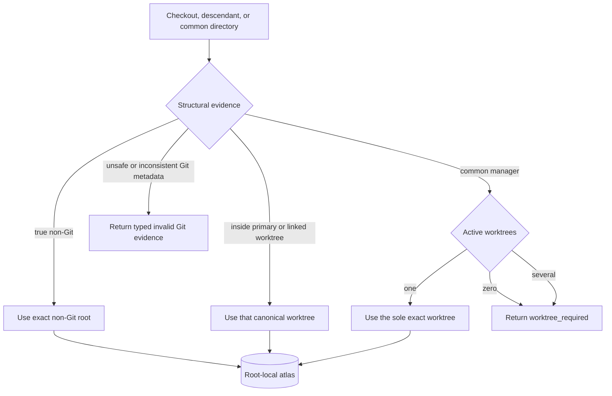
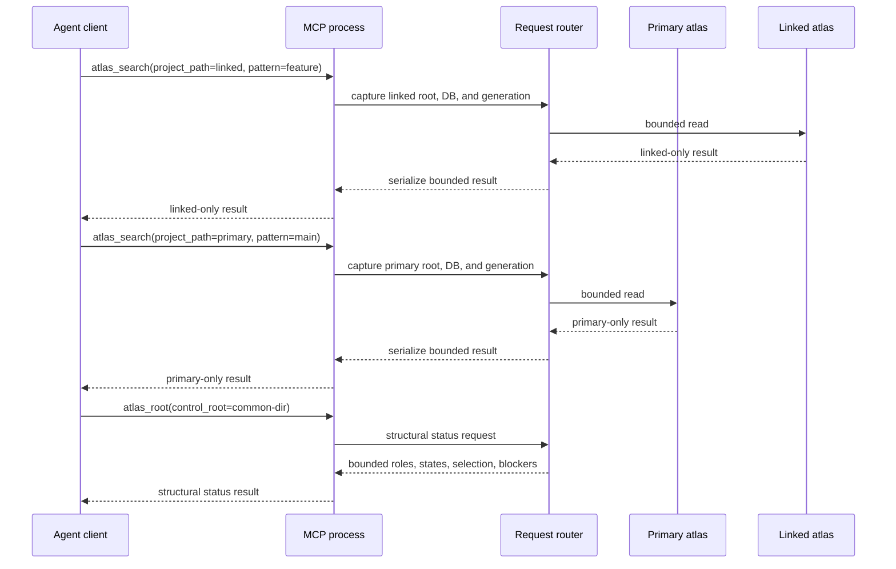

# Worktree-aware agent routing

ProjectAtlas treats every checkout or linked worktree as an exact source boundary. Each root keeps its own ignored writable `.projectatlas/projectatlas.db`; sibling source, graph generations, purposes, tasks, and writes are never combined.

This feature adds structural discovery and agent-readable routing status. It does not add a manager TUI, shared database, release seed, telemetry redesign, purpose-promotion pipeline, or ProjectAtlas-owned Git lifecycle.

## System and ownership



Ownership is deliberately small:

- `projectatlas-fs` reads and validates structural Git worktree evidence without starting Git.
- CLI runtime source selection accepts one exact worktree, selects the sole active manager worktree, or returns `worktree_required`.
- CLI `root status` and MCP `atlas_root(control_root=...)` serialize the same bounded structural report.
- Existing root/database identity checks continue to own all atlas reads and writes.

## Source selection



Discovery inspects only bounded direct control files and registered worktree directories. It rejects symlinks or junctions, wrong path types, oversized or non-UTF-8 pointers, missing targets, registrations outside the common directory, and reciprocal mismatches. Missing registrations remain visible in status but are never source candidates.

The filesystem discovery ceiling is 1,024 registrations. Public CLI/MCP status returns at most 256 deterministic rows and marks truncation. Discovery performs no source traversal, SQLite access, network request, or filesystem mutation.

## Concurrent agent sequence



An explicit per-call `project_path` is authoritative for shared or concurrent hosts. Changing a session default remains useful for a single client, but it is not concurrency authority. A manager with several active worktrees cannot silently inherit a prior selection.

## CLI and MCP use

From a checkout, descendant, or Git common directory:

```text
projectatlas --format json root status <path>
```

Through MCP:

```json
{"control_root":"<checkout-or-common-directory>"}
```

passed to `atlas_root`. `control_root` is mutually exclusive with `project_path` and `verify` because structural inventory is not database verification.

For normal agent navigation, keep using the exact worktree on every shared-host call:

```json
{"project_path":"<exact-worktree>","pattern":"symbol_or_text"}
```

## Lifecycle and recovery

ProjectAtlas never creates, moves, prunes, retires, removes, switches, merges, or deletes a Git worktree or branch. Git remains the lifecycle authority.

- A Git-managed move keeps the worktree's files and local atlas together. If the recorded atlas root changes, use the existing explicit `projectatlas root set <new-root> --transition move` contract.
- A copied atlas at another root fails the existing root/identity check; it is never silently rebound.
- A missing registration is reported as missing and excluded from source selection. Use Git's own worktree commands after preserving any unique local state.
- Invalid structural metadata fails closed. Repair the Git metadata with Git rather than weakening ProjectAtlas validation.
- Non-Git projects and initialized exact roots remain usable when the Git executable is absent because structural discovery starts no process.

The current token TUI is unchanged and remains scoped to the exact selected atlas.
