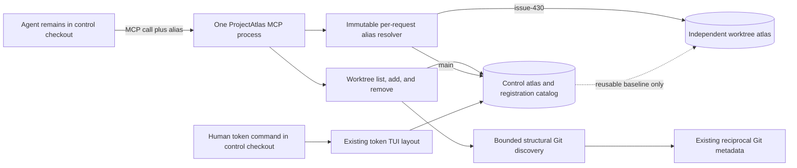
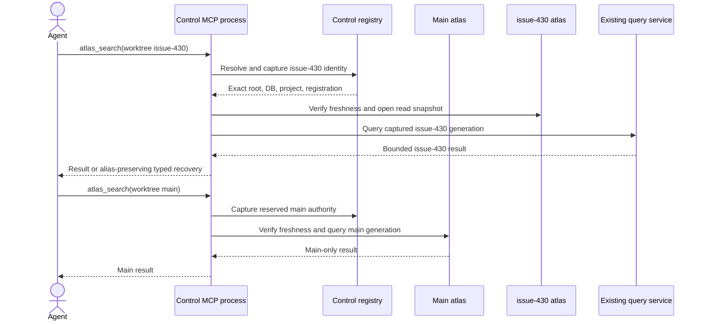
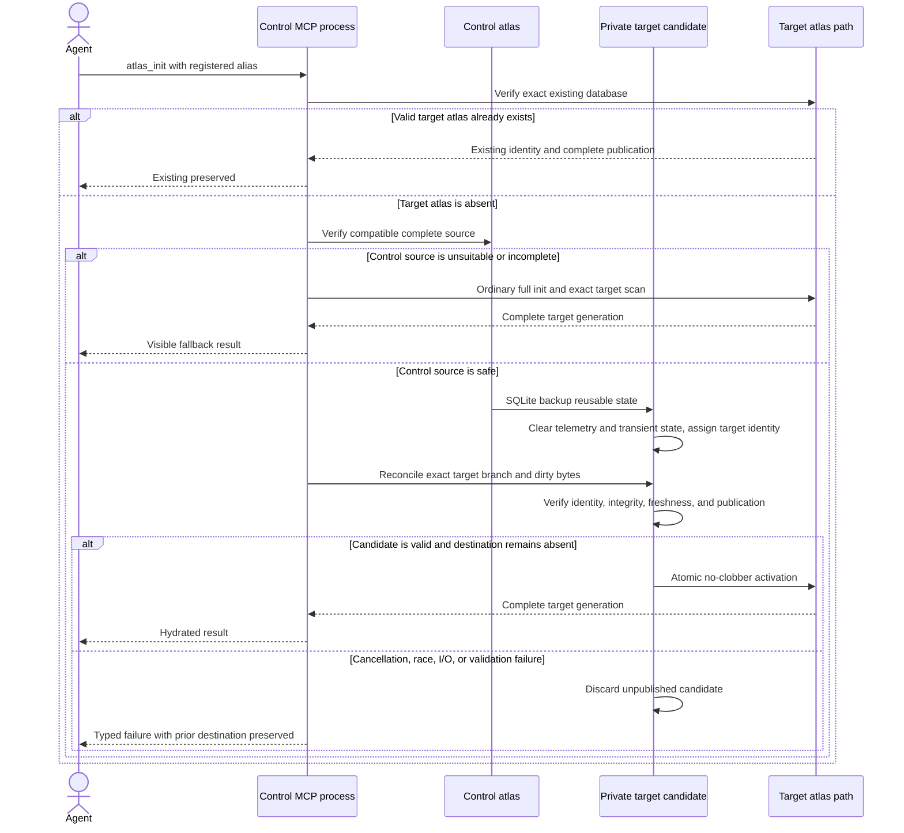
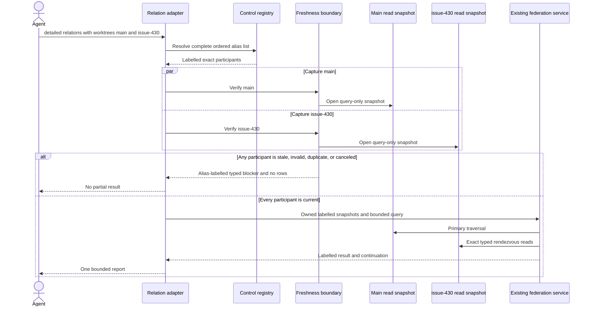
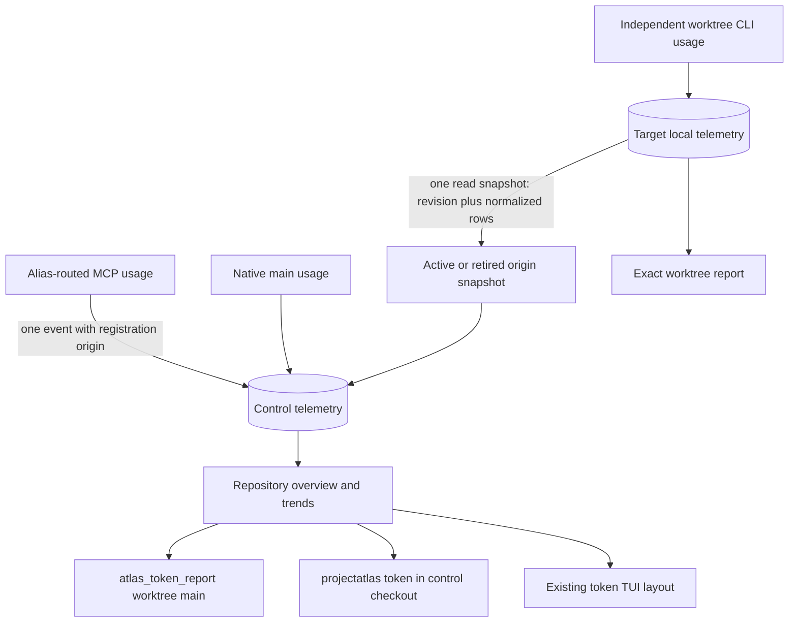
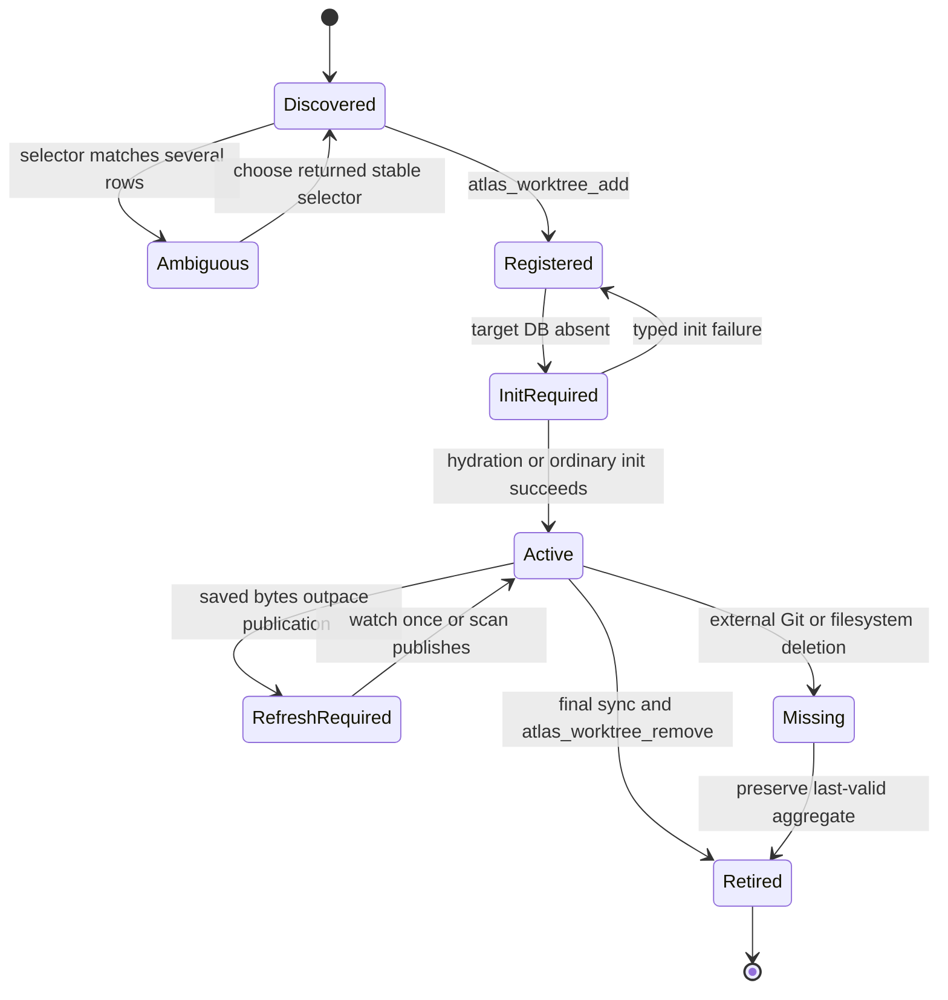

# Worktree atlas continuity

ProjectAtlas v0.4.5-rc1 lets an agent remain in one explicitly selected control checkout while it registers, initializes, refreshes, and queries existing Git worktrees through short MCP aliases. The control checkout and every linked checkout may live anywhere on the filesystem, including under `.worktrees`; no branch or directory name defines control authority.

Every checkout still owns an ignored, independently writable `.projectatlas/projectatlas.db`. ProjectAtlas may hydrate a new target from reusable control-atlas state, but it never shares one writable graph or purpose database across divergent checkouts. It also never creates, switches, moves, prunes, or deletes Git worktrees or branches.

## System and ownership



Ownership remains inside the existing crates:

- `projectatlas-fs` reads bounded structural Git evidence without starting Git.
- `projectatlas-db` owns schema 18 registration, hydration, exact database identity, and normalized telemetry synchronization.
- `projectatlas-cli` owns MCP schemas, alias resolution, targeted init orchestration, and aggregate token presentation.
- `projectatlas-service` owns bounded read-only graph federation.

The explicitly selected MCP root is the control authority and receives the reserved alias `main`. `main` is not inferred from a branch name, primary-worktree role, folder name, or location. Active registrations bind a short alias to the reciprocal Git administrative-directory path, an opaque identity for that directory's current filesystem lifecycle, and, after initialization, an exact ProjectAtlas project identity. Retired registrations remain as telemetry origins but cannot route source operations.

## Register and route from one agent location

Use the MCP tool names and arguments directly; the host owns the JSON-RPC transport envelope.

```text
atlas_worktree_list(include_retired: false)
atlas_worktree_add(worktree: "wt-7c4e...", alias: "issue-430")
atlas_init(worktree: "issue-430")
atlas_session_brief(worktree: "issue-430", query: "registration resolver", compact: true)
atlas_watch_once(worktree: "issue-430")
atlas_file_summary(worktree: "issue-430", file: "src/lib.rs", compact: true)
```

`atlas_worktree_list` joins the complete admitted structural inventory (the primary plus at most 1,024 linked registrations) to the bounded control catalog and returns stable selectors. `atlas_worktree_add` accepts one such selector or one uniquely matching human selector; ambiguity returns bounded candidates instead of guessing. Registration does not create the target atlas. `atlas_init(worktree=...)` is the explicit operation that initializes an absent registered target.

All normal root-scoped MCP tools use one mutually exclusive selection boundary:

- `worktree: "main"` selects the captured control atlas;
- `worktree: "issue-430"` selects that active registration;
- `project_path: "<exact-root>"` remains the legacy compatibility route; and
- supplying both selectors is invalid.

Each admitted request captures its canonical root, database path, project identity, registration identity, control database, and alias before background or query work begins. An initialized alias also rechecks that the current database project identity still matches the registration, so recreating a database at the same valid root cannot inherit the old telemetry origin. Interleaved requests therefore do not depend on current directory or mutable session selection.

If Git moves a checkout, its unchanged administrative directory preserves the alias. If Git deletes and later recreates a worktree while reusing the same administrative path, the lifecycle identity changes: routing fails closed until the stale alias is removed and the new checkout is registered. Unix requires device, inode, and creation time; Windows requires creation time plus retained-handle volume and 128-bit file identity. A filesystem that cannot provide the complete non-reusable evidence fails alias registration and routing; it never falls back to a reusable path, timestamp, or inode. A manager with `core.worktree`, an enabled `config.worktree` override, or unresolved config includes likewise requires exact source selection instead of guessing its parent. Removing the stale ProjectAtlas registration still leaves Git, source, and either checkout's `.projectatlas` state untouched.



## Safe target hydration

A compatible complete control atlas avoids rebuilding every reusable row, while target reconciliation keeps branch and dirty-file truth exact.



The candidate excludes control identity, telemetry events and aggregates, runtime instances, task/progress state, watcher state, transient health resolutions, and other non-transferable private rows. Applicable approved purposes survive as ordinary target-owned records. Cancellation, disk or backup failure, integrity mismatch, source race, reconciliation failure, or activation failure removes only the unpublished candidate; it never overwrites a valid destination.

## Labelled read-only federation

Use federation only for an explicit cross-worktree graph question:

```text
atlas_symbol_relations(
  worktrees: ["main", "issue-430"],
  view: "detailed",
  file: "src/lib.rs",
  compact: true
)
```

The first alias is primary. Two to eight aliases resolve through the same immutable request boundary. Existing participant, row, edge, intermediate, deadline, memory, output, and cancellation ceilings remain authoritative.



Federation never persists participants, changes active selection, repairs a stale database, or merges sibling graph generations. Returned participants, evidence, blockers, coverage, and continuations retain their aliases.

## Repository-wide token continuity

The control atlas is the durable aggregate authority without becoming the writable source-graph authority for its worktrees.



Alias-routed MCP events commit once in control under the stable registration origin and are not mirrored into the target. Independent worktree events remain local; one deferred SQLite read transaction exports revision, referenced dimensions, and bounded lifetime/daily rows from the same snapshot before aggregate reads or unregister synchronize them. A newer snapshot must preserve the accepted componentwise lower bound for every lifetime dimension and every retained day/dimension; only buckets older than the trend-retention cutoff may disappear. Repeated or stale synchronization is a no-op, a concurrent later commit appears in the next revision, validation failure preserves the last-valid snapshot, and raw per-session queries or paths never move to control.

`projectatlas token` and `projectatlas token --view tui` from the control checkout combine native main, routed, and synchronized active/retired origins. The TUI layout and metric definitions do not change. An exact worktree token call stays scoped to that target's local detail and never presents sibling detail as local.

## Removal, failures, and recovery

`atlas_worktree_remove(worktree: "issue-430")` final-syncs an available local aggregate and retires only the ProjectAtlas registration. One short local SQLite writer-exclusion scope covers exact snapshot export plus the control atlas's atomic synchronize-and-retire transaction; a concurrent local usage commit therefore lands before the retained snapshot or only after retirement. It does not delete or alter the Git worktree, branch, source, `.projectatlas` folder, or SQLite database. Retained totals continue to contribute to the control report. A later registration with the same text alias receives a distinct origin identity and cannot merge histories.



Recovery remains explicit:

- `ambiguous` returns bounded stable selectors; choose one and retry.
- `init_required` includes `atlas_init` with the original alias.
- `refresh_required` identifies the exact stale alias; refresh that target only.
- invalid, unsafe, unrelated, or reciprocal-mismatched Git metadata fails closed.
- a bare/common manager with zero or several active worktrees returns `worktree_required`; select an exact checkout as control.
- an incompatible or corrupt database is never reset, downgraded, substituted, or silently rebuilt.
- a missing target retains its last accepted telemetry aggregate but ProjectAtlas cannot fabricate unsynchronized bytes that were externally deleted.

The future distributed/versioned released-main atlas tracked by issue #456 is intentionally separate. v0.4.5-rc1 coordinates only local registrations and local databases visible to one explicitly selected control process.
