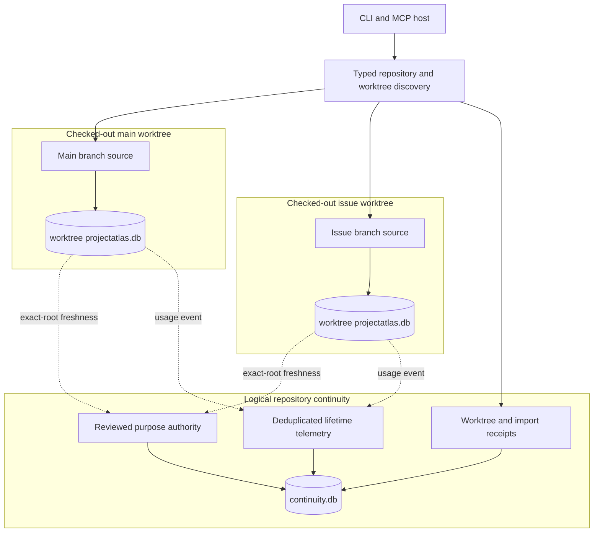
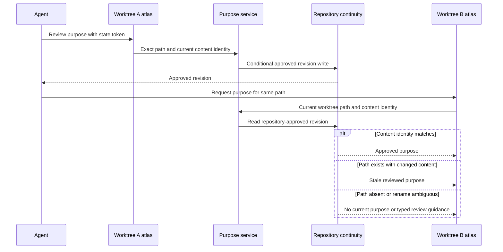
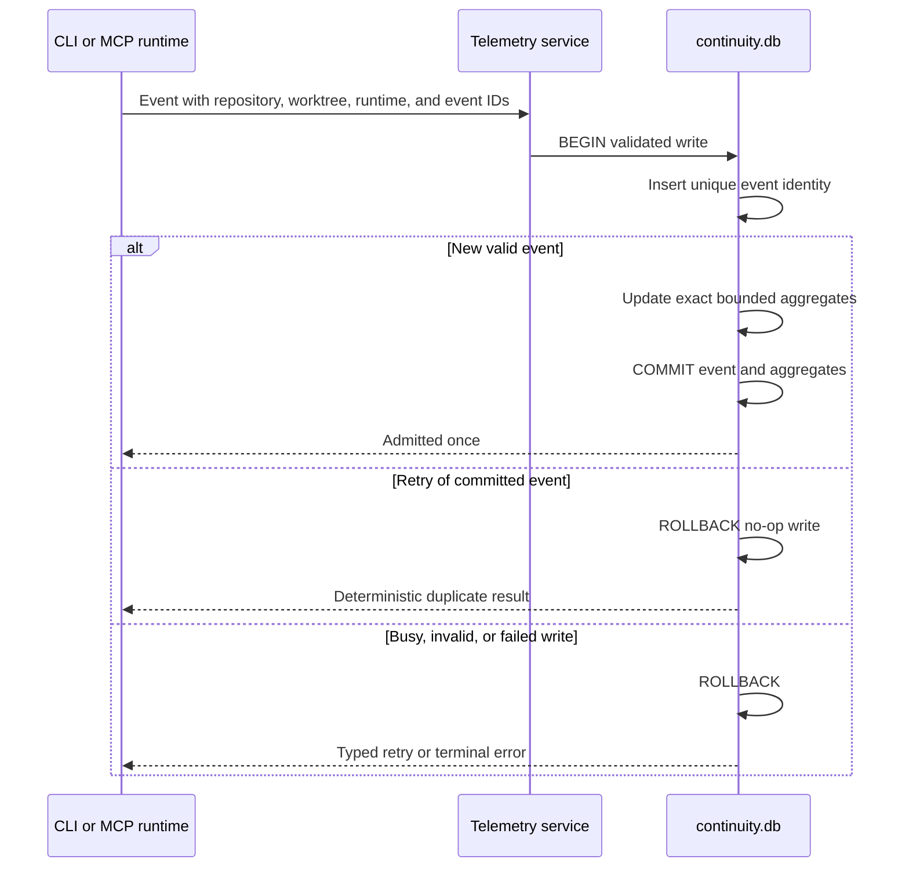
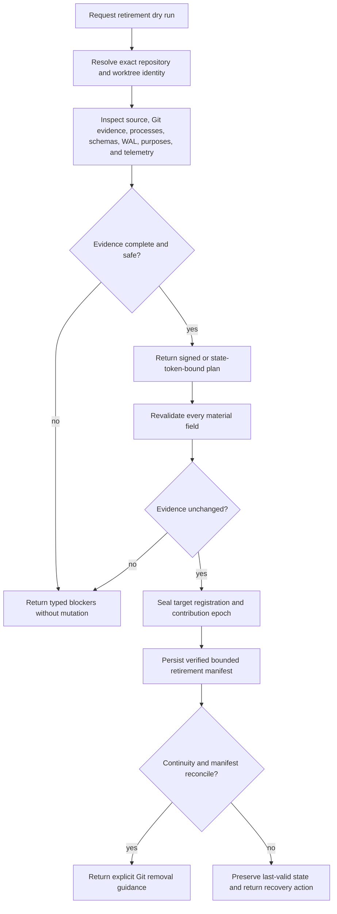

# ProjectAtlas Worktree Lifecycle

This document owns the planned v0.5.0 architecture for [issue #430](https://github.com/styler-ai/ProjectAtlas/issues/430). It separates branch-derived atlas state from repository-owned reviewed purposes and lifetime token telemetry. The design is planning-only until its OpenSpec tasks are implemented and verified.

## System and Ownership

Each checkout remains an exact source/index boundary. One continuity database belongs to the logical repository and contains no source graph.

Ownership rules:

- Worktree databases own files, summaries, symbols, relations, generations, freshness, watcher state, and purpose suggestions for exactly one checkout.
- The continuity database owns approved purpose revisions, logical worktree registrations, import receipts, telemetry event identity, exact retained aggregates, and repository-lifetime reporting.
- The continuity database never becomes a source atlas, including when it is stored by a bare/common Git manager.
- Git remains authoritative for branches and worktrees; ProjectAtlas reports and protects its own state without silently mutating Git.

## Worktree Lifecycle

Lifecycle transitions are typed and revalidated. A path is a locator, not the durable repository identity.

When the Git executable is unavailable, structural root and database validation still allow local ProjectAtlas operations. Git-dependent branch, dirty, merge, and removal evidence is marked unavailable, and retirement cannot claim readiness.

## Purpose Continuity

Reviewed text is shared only after exact repository/path/content validation. Freshness always comes from the addressed worktree.

Folder purposes may be reused when the normalized folder exists. File purposes require the approved content identity. Deleted and branch-only paths remain historical repository knowledge but never appear as current sibling source.

## Repository Telemetry Publication

The repository ledger admits an event and updates its aggregates in one SQLite transaction. Retry identity makes an uncertain response safe.

Repository reports read indexed aggregate rows rather than all retained events. Per-worktree and per-session totals are dimensions of the same authority, not separately summed databases. Raw-detail eviction never changes exact retained component totals.

## Retirement and Recovery

ProjectAtlas retirement protects ProjectAtlas state and produces Git-authority guidance. It does not silently remove a branch or checkout.

The seal covers only the target worktree registration and contribution epoch; sibling continuity remains writable. The manifest contains reconciliation counts, import receipts, authority epochs, hashes, and recovery instructions. Rebuildable source graphs are not archived, and unreconciled unique state blocks retirement.

Migration holds source exclusion across a recoverable saga: read-only preflight and final snapshot; non-authoritative destination prepare; destination verification; database-enforced legacy-writer fence; then conditional registration switch. A pre-fence crash leaves the source authoritative and forces refresh of any prepared import after possible late writes. A post-fence crash completes the already durable prepared switch. The source is never fenced before destination durability, and no state exposes dual writers. Aggregate-only sources are combined only with provably disjoint provenance. Newer, corrupt, wrong-root, overlapping, unfenceable, or ambiguous databases remain preserved and return typed recovery guidance. Recovery after a continuity-authoritative write reconciles forward into a new epoch rather than reopening an older source.

## Architecture Invalidation Conditions

Revisit this split only if measurement or platform evidence proves one of these conditions:

- SQLite cannot meet the measured many-worktree write latency, contention, WAL growth, or durability limits with short prepared transactions and bounded checkpoint policy.
- Git common-directory storage cannot remain project-local, permission-safe, relocatable, and available to all supported worktree topologies.
- Content-identity purpose projection cannot express required rename or generated-source behavior without repeated incorrect stale/current classifications.
- Exact telemetry deduplication cannot migrate supported predecessor aggregates without either losing totals or accepting double counting.
- Extending the existing root/admin MCP surface makes lifecycle state less discoverable or breaks the stable tool contract; only then should a replacement-free top-level tool be considered.

Any redesign must preserve exact-root source isolation, non-destructive schema handling, offline local operation, and recoverable telemetry/purpose history.
